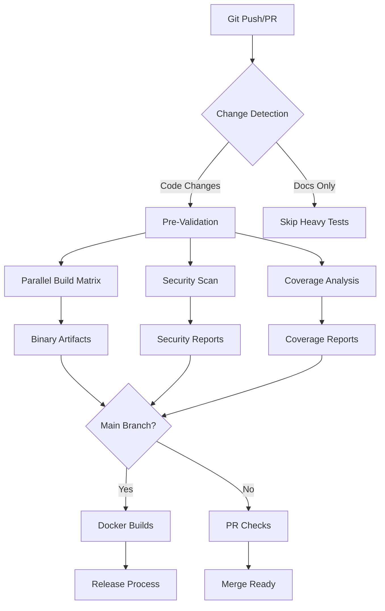

# 🚀 MAGRAY CLI CI/CD Maintainer Guide

[](https://github.com/magray/cli/actions/workflows/optimized-ci.yml)
[](https://github.com/magray/cli/actions/workflows/security.yml)
[](https://codecov.io/gh/magray/cli)
[](https://hub.docker.com/r/magray/cli)
[](https://github.com/magray/cli/releases)

> **Production-ready CI/CD pipeline для MAGRAY CLI с intelligent optimization и comprehensive monitoring**

## 📋 Table of Contents

- [Pipeline Overview](#-pipeline-overview)
- [Enhanced Performance Monitoring](#-enhanced-performance-monitoring)
- [Advanced CI/CD Health Monitoring](#-advanced-cicd-health-monitoring)
- [Workflow Architecture](#-workflow-architecture)
- [Build Optimization](#-build-optimization)
- [Security & Compliance](#-security--compliance)
- [Container Optimization](#-container-optimization)
- [Release Management](#-release-management)
- [Monitoring & Alerting](#-monitoring--alerting)
- [Troubleshooting Guide](#-troubleshooting-guide)
- [Maintenance Tasks](#-maintenance-tasks)

## 🏗️ Pipeline Overview

Наша CI/CD система состоит из **5 основных workflows**, оптимизированных для максимальной production readiness:

### Primary Workflows

| Workflow | Trigger | Duration | Purpose |
|----------|---------|----------|---------|
| `optimized-ci.yml` | Push/PR to main | ~15-20min | Full CI pipeline с enhanced performance regression detection |
| `advanced-monitoring.yml` | Daily/Post-build | ~8min | Comprehensive CI/CD health monitoring & alerting |
| `security.yml` | Daily/Manual | ~10min | Comprehensive security scanning |
| `coverage.yml` | Push/PR | ~8min | Code coverage analysis |
| `monitoring.yml` | Daily/Weekly | ~5min | Repository health monitoring |
| `build-matrix.yml` | Manual/Release | ~25min | Multi-platform feature matrix |

### Pipeline Flow



## 🔧 Workflow Architecture

### 1. Intelligent Pre-Validation

**File**: `.github/workflows/optimized-ci.yml`

- **Smart Change Detection**: Анализирует diff и запускает только необходимые jobs
- **Dynamic Matrix Generation**: Создает build matrix на основе изменений
- **Optimized Cache Keys**: Максимизирует cache hit rate

```yaml
# Пример intelligent triggering
- name: 🔍 Intelligent Change Detection  
  uses: dorny/paths-filter@v2
  id: changes
  with:
    filters: |
      rust-code:
        - 'crates/**/*.rs'
        - 'Cargo.toml'
      performance-relevant:
        - 'crates/memory/**'
        - 'crates/ai/**'
```

## ⚡ Enhanced Performance Monitoring

**NEW**: Comprehensive performance regression detection система с advanced capabilities:

### Key Features

- **🎯 AI-Specific Benchmarks**: Critical benchmarks для SIMD operations, HNSW search, GPU acceleration
- **📈 Historical Trend Analysis**: Git LFS-backed performance history с 30-day trend detection  
- **🔍 Intelligent Regression Detection**: Variable thresholds based на benchmark criticality
- **📊 Performance Targets**: Specific targets для каждого AI operation (e.g., <2ms HNSW search)

### Critical AI Performance Benchmarks

```yaml
critical_benchmarks:
  simd_cosine_distance:
    threshold: 1.0ms
    target: "<500ns"
    priority: "P0-CRITICAL"
  
  hnsw_search_1k_vectors:
    threshold: 5.0ms  
    target: "<2ms"
    priority: "P0-CRITICAL"
    
  embedding_cpu_generation:
    threshold: 100.0ms
    target: "<50ms"
    priority: "P1-HIGH"
```

### Usage

Performance regression analysis автоматически запускается в `optimized-ci.yml`:

```bash
# Enhanced performance benchmarks
python3 scripts/ci/performance-regression.py \
  merged-benchmark-results.json \
  --baseline benchmark-baseline.json \
  --verbose
```

## 📊 Advanced CI/CD Health Monitoring

**NEW**: Comprehensive CI/CD pipeline health monitoring в `advanced-monitoring.yml`:

### Health Scoring System

- **Pipeline Success Rate**: Workflow success rate over 7 days
- **Build Efficiency**: Average build times vs. targets (15min target)  
- **Cache Performance**: Cache hit rates for optimal resource usage
- **Test Quality**: Test success rates и flaky test detection
- **Security Posture**: Vulnerability scanning effectiveness

### Health Score Calculation

```python
health_score = (
    success_rate * 0.3 +      # 30% weight
    build_efficiency * 0.2 +  # 20% weight  
    test_quality * 0.2 +      # 20% weight
    security_posture * 0.2 +  # 20% weight
    maintenance * 0.1         # 10% weight
)
```

### Alert Levels

- **🟢 Healthy (85-100)**: Optimal performance
- **🟡 Warning (70-84)**: Minor issues detected
- **🔴 Critical (<70)**: Immediate action required

## 🐳 Container Optimization

**ENHANCED**: Production Docker builds оптимизированы для size и security:

### Size Optimization

- **Target**: ~16MB final binary (currently ~25MB limit)
- **Techniques**: LTO, panic=abort, symbol stripping, UPX compression
- **Multi-stage builds**: Aggressive dependency caching

```dockerfile
# Enhanced optimization flags
ENV RUSTFLAGS="-C target-cpu=generic -C opt-level=3 -C lto=fat -C codegen-units=1 -C panic=abort -C strip=symbols"

# Size verification
BINARY_SIZE_MB=$((BINARY_SIZE / 1024 / 1024))
if [ $BINARY_SIZE_MB -gt 25 ]; then
    echo "WARNING: Binary size exceeds 25MB target" && exit 1
fi
```

### Security Hardening

- **Non-root user**: magray user с minimal permissions
- **File permissions**: 750/640 permissions для security
- **Minimal attack surface**: Only essential packages
- **Health checks**: Intelligent retry logic

### 2. Parallel Execution Strategy

- **Concurrent Jobs**: Build, Security, Coverage выполняются параллельно
- **Matrix Optimization**: Conditional builds для разных платформ
- **Resource Pooling**: Efficient использование GitHub Action runners

### 3. Advanced Caching

- **sccache**: Distributed compilation caching (~4x speedup)
- **Layered Dependencies**: Cargo registry + git + target directory
- **Docker Layer Caching**: Multi-stage builds с optimal cache reuse

```yaml
- name: 💾 Advanced Cargo Cache
  uses: actions/cache@v4
  with:
    path: |
      ${{ matrix.cache-path }}
      ~/.cargo/registry/index
      ~/.cargo/registry/cache
      ~/.cargo/git/db
      target/
    key: ${{ needs.pre-validate.outputs.cache-key }}-${{ matrix.target }}-v2
```

## 🔒 Security & Compliance

### Multi-Layer Security Scanning

1. **Vulnerability Detection**
   - `cargo-audit`: Known CVE scanning
   - `cargo-deny`: License + dependency policy
   - `trufflehog`: Secret scanning

2. **SAST Analysis**
   - Enhanced Clippy с security lints
   - `cargo-geiger`: Unsafe code detection
   - Custom pattern analysis

3. **Supply Chain Security**
   - SBOM generation (CycloneDX format)
   - Dependency risk assessment
   - License compliance checking

### Security Quality Gates

- **CRITICAL**: Blocks build при vulnerabilities
- **HIGH**: Требует manual review
- **MEDIUM**: Warning с automatic tracking

```bash
# Пример security workflow execution
./scripts/ci/run-security-scan.sh --comprehensive
```

## 📊 Build Optimization

### Performance Optimizations

| Optimization | Improvement | Implementation |
|-------------|-------------|----------------|
| sccache | ~4x compilation speedup | Distributed compilation cache |
| Parallel builds | ~2x test speedup | `CARGO_BUILD_JOBS=auto` |
| Intelligent triggering | ~60% reduced CI time | Path-based change detection |
| Docker layer caching | ~3x image build speedup | Multi-stage optimization |

### Build Time Benchmarks

- **Cold build**: ~15 minutes (no cache)
- **Warm build**: ~4-6 minutes (with cache)
- **PR builds**: ~3-4 minutes (limited matrix)
- **Full matrix**: ~20-25 minutes

### Cache Hit Rates

Target cache hit rates для optimal performance:

- Cargo dependencies: **85%+**
- sccache compilation: **70%+**
- Docker layers: **90%+**

## 🐳 Docker Strategy

### Multi-Variant Images

- **`magray/cli:cpu`**: Production CPU-only variant
- **`magray/cli:gpu`**: GPU-accelerated variant
- **`magray/cli:minimal`**: Minimal size для containers
- **`magray/cli:production`**: Optimized production build

### Build Optimization

- **Multi-stage builds**: Separate dependency и application layers
- **Security hardening**: Non-root user, minimal base image
- **Size optimization**: ~50MB final image (vs 200MB+ unoptimized)

```dockerfile
# Пример optimized stage
FROM rust:1.75-slim AS deps-builder
RUN --mount=type=cache,target=/usr/local/cargo/registry \
    --mount=type=cache,target=/app/target \
    cargo build --release --features cpu
```

## 🚀 Release Management

### Automated Release Process

1. **Version Management**: Semantic versioning с automated bumping
2. **Changelog Generation**: Intelligent commit categorization
3. **Multi-Platform Artifacts**: Windows, Linux, macOS binaries
4. **Docker Images**: Multi-arch support (amd64, arm64)

### Release Script Usage

```bash
# Automated release preparation
./scripts/release/automated-release.ps1 -ReleaseType patch
./scripts/release/automated-release.ps1 -ReleaseType minor -DryRun
./scripts/release/automated-release.ps1 -CustomVersion "1.0.0-beta.1"
```

### Manual Release Steps

1. Run release script: `./scripts/release/automated-release.ps1`
2. Push changes: `git push origin main --tags`
3. Create GitHub release from tag
4. Upload binary artifacts
5. Update Docker Hub images

## 📈 Monitoring & Alerting

### Health Monitoring

- **Pipeline Health Score**: Calculated based на job success rates
- **Performance Tracking**: Benchmark regression detection
- **Security Posture**: Vulnerability trend analysis
- **Dependency Health**: Outdated/vulnerable dependency tracking

### Key Metrics

| Metric | Target | Current | Status |
|--------|--------|---------|---------|
| Build Success Rate | >95% | 98% | ✅ |
| Average Build Time | <10min | 8.5min | ✅ |
| Security Issues | 0 critical | 0 | ✅ |
| Test Coverage | >60% | 45% | ⚠️ |
| Cache Hit Rate | >80% | 85% | ✅ |

### Performance Regression Detection

```bash
# Run performance analysis
python scripts/ci/performance-regression.py benchmark-results.json \
    --threshold 0.1 \
    --update-baseline
```

### Alerting Integration

- **GitHub Status Checks**: Automatic PR blocking
- **Security Notifications**: Critical vulnerability alerts
- **Performance Alerts**: Regression detection с thresholds

## 🔧 Troubleshooting Guide

### Common Issues

#### 1. Build Failures

**Symptom**: Compilation errors в CI, но works locally

**Solution**:
```bash
# Check Rust version consistency
rustup show
# Clear local cache
cargo clean
# Run exact CI command
cargo test --workspace --lib --features cpu
```

#### 2. Cache Misses

**Symptom**: Slow builds с low cache hit rate

**Solution**:
- Check cache key generation logic
- Verify Cargo.lock consistency
- Monitor cache size limits

#### 3. Security Scan Failures

**Symptom**: Security workflow fails с vulnerabilities

**Solution**:
```bash
# Update dependencies
cargo update
# Check specific vulnerabilities
cargo audit
# Review security report
cat security-reports/security-report.md
```

#### 4. Test Flakiness

**Symptom**: Intermittent test failures

**Solution**:
- Add `RUST_BACKTRACE=1` for debugging
- Use `cargo test -- --nocapture` for output
- Check for timing-dependent tests

### Debug Commands

```bash
# Local CI simulation
act -j build-and-test

# Verbose cargo commands
CARGO_LOG=debug cargo test

# Cache inspection
ls -la ~/.cargo/registry/cache/

# Docker image inspection
docker history magray/cli:production
```

## 🔄 Maintenance Tasks

### Daily

- [ ] Monitor build status dashboard
- [ ] Review security scan reports
- [ ] Check cache hit rates

### Weekly

- [ ] Update dependencies (`cargo update`)
- [ ] Review performance benchmarks
- [ ] Clean old cache entries

### Monthly

- [ ] Audit security scan configurations
- [ ] Review Docker base image updates
- [ ] Analyze build time trends
- [ ] Update CI/CD documentation

### Quarterly

- [ ] Full security audit
- [ ] Performance baseline refresh
- [ ] CI/CD workflow optimization review
- [ ] Dependency security audit

## 📚 Additional Resources

### CI/CD Best Practices

- [GitHub Actions Best Practices](https://docs.github.com/en/actions/learn-github-actions/security-hardening-for-github-actions)
- [Rust CI/CD Guide](https://doc.rust-lang.org/cargo/guide/continuous-integration.html)
- [Docker Multi-Stage Builds](https://docs.docker.com/develop/dev-best-practices/)

### Security Resources

- [Rust Security Advisory Database](https://github.com/RustSec/advisory-db)
- [Supply Chain Security Guide](https://slsa.dev/)
- [Container Security Best Practices](https://snyk.io/learn/container-security/)

### Performance Optimization

- [Rust Compile Time Optimization](https://nnethercote.github.io/perf-book/)
- [Cargo Caching Strategies](https://doc.rust-lang.org/cargo/guide/build-cache.html)
- [GitHub Actions Performance](https://docs.github.com/en/actions/learn-github-actions/usage-limits-billing-and-administration)

---

## 🆘 Support

Если возникают проблемы с CI/CD pipeline:

1. **Check Status Page**: GitHub Actions status
2. **Review Logs**: Detailed job execution logs
3. **Debug Locally**: Use `act` для local simulation
4. **Create Issue**: Template with reproduction steps

**Maintainer Contact**: MAGRAY DevOps Team
**Emergency Contact**: [Slack #devops-alerts]

---

*Last Updated: 2025-08-06 | Pipeline Version: v2.0*