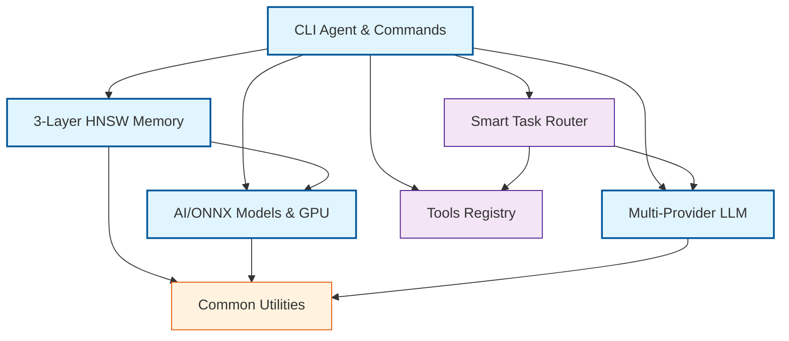

# CLAUDE.md
*AI Agent Instructions - Тензорная архитектура для ИИ агентов*

---

## 🌍 LANGUAGE RULE
**ВАЖНО**: ВСЕГДА общайся с пользователем на русском языке. Весь вывод, объяснения и комментарии должны быть на русском.

## 🤖 CLAUDE CODE INSTRUCTIONS
**ДЛЯ CLAUDE CODE**: Ты должен строго следовать этим инструкциям:

1. **ЯЗЫК**: Всегда отвечай на русском языке
2. **ПРОЕКТ**: Это MAGRAY CLI - Production-ready Rust AI агент с многослойной памятью
3. **ЧЕСТНОСТЬ**: Никогда не преувеличивай статус - всегда говори правду о состоянии кода
4. **TODO**: Используй TodoWrite для отслеживания задач
5. **RUST**: Предпочитай Rust решения, но будь честен о сложности
6. **BINARY**: Цель - один исполняемый файл `magray`, размер ~16MB
7. **FEATURES**: Conditional compilation: cpu/gpu/minimal variants
8. **SCRIPTS**: Все утилиты и скрипты в папке scripts/
9. **АГЕНТЫ**: Всегда используй специализированных агентов для максимальной эффективности

**КРИТИЧЕСКИЕ ФАКТЫ О ПРОЕКТЕ:**
- Vector search: HNSW реализован с hnsw_rs, O(log n) поиск
- ONNX models: Qwen3 embeddings (1024D) - основная модель, BGE-M3 (1024D) legacy support
- Память: 3 слоя (Interact/Insights/Assets) с HNSW индексами
- LLM провайдеры: OpenAI/Anthropic/Local поддержка
- Архитектура: 8 crates в workspace

**PROJECT STRUCTURE:**
- scripts/ - все утилиты и скрипты (PowerShell, Docker, Python)
- crates/ - 8 Rust workspace crates (cli, memory, ai, llm, tools, common, router, todo)
- .claude/agents/ - 10 специализированных агентов

## 📋 ПЛАН РАЗВИТИЯ ПРОЕКТА

**ФАЗА 1 (2-3 месяца): Архитектурный рефакторинг**
- UnifiedAgent → trait-based сервисы (IntentAnalyzer, TaskPlanner, ToolOrchestrator)
- DIMemoryService (1466 строк) → слои Storage/Index/Query/Cache
- Устранение 766 .unwrap() вызовов с comprehensive error handling

**ФАЗА 2 (1-2 месяца): LLM Integration**
- Multi-Provider система (OpenAI/Anthropic/Local) с fallback
- Adaptive Task Orchestrator с AI-driven декомпозицией
- Dynamic Tool Discovery с Natural Language Interface

**ФАЗА 3 (1 месяц): Memory Optimization**
- HNSW SIMD + GPU acceleration, Memory Mapping
- Semantic clustering, ML-based ranking, Context windows

**ФАЗА 4 (1-2 месяца): Production Readiness**
- 80%+ test coverage, Comprehensive observability
- Security hardening, Performance benchmarking

**ФАЗА 5 (1 месяц): Desktop Distribution**
- Native integration, Single binary (~16MB), Auto-updater

**ИТОГОВАЯ ЦЕЛЬ:** Единый исполняемый файл MAGRAY CLI (~16MB) - интеллектуальный помощник программиста с многослойной памятью, поддержкой множества LLM провайдеров и продвинутыми возможностями автоматизации разработки

## 🎯 СПЕЦИАЛИЗИРОВАННЫЕ АГЕНТЫ (.claude/agents/)

**ОСНОВНЫЕ АРХИТЕКТУРНЫЕ АГЕНТЫ:**
- **rust-architect-supreme** - Декомпозиция God Objects, SOLID principles, DI patterns
- **rust-refactoring-master** - Безопасный рефакторинг с сохранением функциональности
- **ai-architecture-maestro** - ONNX optimization, embedding pipelines, GPU acceleration

**КАЧЕСТВО И ПРОИЗВОДИТЕЛЬНОСТЬ:**
- **rust-quality-guardian** - Тестирование (unit/integration/property-based), coverage 80%+
- **rust-performance-virtuoso** - SIMD optimization, microsecond-level tuning, zero-copy
- **rust-code-optimizer** - Общая оптимизация кода, устранение дублирования

**ИНФРАСТРУКТУРА И ОПЕРАЦИИ:**
- **devops-orchestration-master** - CI/CD pipelines, containerization, monitoring
- **task-coordinator** - Координация сложных multi-step задач с зависимостями

**ДОКУМЕНТАЦИЯ:**
- **obsidian-docs-architect** - Создание связанной документации архитектуры
- **obsidian-docs-maintainer** - Поддержка актуальности документации

### 📋 Алгоритм оркестрации агентов:

1. **АНАЛИЗ ЗАДАЧИ** → Определи аспекты (архитектура/производительность/качество/AI/DevOps)
2. **ВЫБОР АГЕНТОВ** → Подбери специалистов под каждый аспект
3. **ПОСЛЕДОВАТЕЛЬНОСТЬ** → архитектура → код → тесты → документация
4. **ИНТЕГРАЦИЯ** → Объедини рекомендации в единое решение

### 🔄 Примеры оркестрации:

**UnifiedAgent рефакторинг:**
1. rust-architect-supreme → анализ God Object, план декомпозиции
2. rust-refactoring-master → пошаговая реализация без поломки
3. rust-quality-guardian → unit тесты для новых компонентов
4. obsidian-docs-architect → обновление архитектурной документации

**HNSW оптимизация:**
1. rust-performance-virtuoso → профилирование узких мест
2. ai-architecture-maestro → embedding pipeline оптимизация
3. rust-code-optimizer → SIMD инструкции, zero-copy операции

**Production подготовка:**
1. rust-quality-guardian → покрытие тестами до 80%+
2. rust-architect-supreme → финальная проверка SOLID
3. devops-orchestration-master → CI/CD pipeline настройка
4. obsidian-docs-architect → production документация

### ⚠️ ОБЯЗАТЕЛЬНЫЕ ПРАВИЛА:

- **НЕ ДЕЛАЙ ВСЁ САМ** - используй специализированных агентов
- **ОБЪЯСНЯЙ ВЫБОР** - поясняй почему выбрал конкретного агента  
- **СОБЛЮДАЙ ПОРЯДОК** - архитектура → реализация → тесты → документация
- **ИНТЕГРИРУЙ РЕЗУЛЬТАТЫ** - согласованность рекомендаций агентов

## 📊 АКТУАЛЬНОЕ СОСТОЯНИЕ КОДА

**ВАЖНОСТЬ**: Эти данные отражают РЕАЛЬНОЕ состояние кодовой базы для принятия решений:

**Ключевые метрики:**
- **Всего crates**: 8 (cli, memory, ai, llm, tools, common, router, todo)
- **God Objects**: UnifiedAgent (17 dependencies), DIMemoryService (1466 lines)  
- **Critical issues**: 766 .unwrap() calls требуют устранения
- **Memory система**: 3-layer HNSW (Interact/Insights/Assets)

**Архитектурные приоритеты:**
1. Декомпозиция UnifiedAgent на trait-based сервисы
2. Рефакторинг DIMemoryService на слои
3. Comprehensive error handling вместо .unwrap()
4. HNSW performance optimization с SIMD
5. Multi-provider LLM system с fallback

**Что должно получиться:**
- Стабильный production-ready AI помощник программиста
- Интеллектуальная автоматизация рутинных задач разработки
- Единый инструмент для работы с кодом, документацией и задачами
- Seamless интеграция с различными LLM провайдерами

---

## 🎯 ПРАВИЛА ИСПОЛЬЗОВАНИЯ:

1. **ВСЕГДА** используй специализированных агентов для соответствующих задач
2. **СЛЕДУЙ** плану развития проекта по фазам
3. **ПРОВЕРЯЙ** актуальное состояние кода перед решениями
4. **ИНТЕГРИРУЙ** результаты работы всех агентов
5. **ОТЧИТЫВАЙСЯ** честно о том, что НЕ сделано

**Цель**: Создать лучший AI помощник программиста через оркестрацию специализированных агентов.

---

# AUTO-GENERATED ARCHITECTURE

*Last updated: 2025-08-06 04:31:18 UTC*

## Компактная архитектура MAGRAY CLI

## Статистика проекта

- **Всего crates**: 8
- **Активные зависимости**: 12
- **Основные компоненты**: CLI, Memory (3-Layer HNSW), AI/ONNX, LLM Multi-Provider
- **GPU поддержка**: CUDA + TensorRT через feature flags
- **Производительность**: HNSW O(log n) search, SIMD оптимизации

## Ключевые особенности

- **Единый исполняемый файл**: `magray` (target ~16MB)
- **Conditional compilation**: cpu/gpu/minimal variants
- **Memory система**: 3 слоя (Interact/Insights/Assets) с HNSW индексами  
- **AI модели**: Qwen3 embeddings (1024D), BGE-M3 legacy support
- **LLM провайдеры**: OpenAI/Anthropic/Local
- **Production готовность**: Circuit breakers, health checks, metrics

