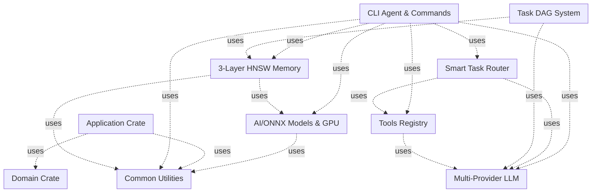

# CLAUDE.md
*AI Agent Instructions - Проблемы и задачи проекта*

---

## 🚫 КРИТИЧЕСКОЕ ПРАВИЛО ДОКУМЕНТАЦИИ
**ЗАПРЕЩЕНО В CLAUDE.MD И ВСЕХ АГЕНТАХ**:
- ❌ НИКОГДА не добавлять информацию о том что "готово", "сделано", "работает", "реализовано"
- ❌ НИКОГДА не указывать KPI, метрики готовности, проценты завершения
- ❌ НИКОГДА не хвалить состояние кода или архитектуры
- ✅ ТОЛЬКО проблемы, недостатки, что НЕ работает, что требует исправления
- ✅ ТОЛЬКО критика и честная оценка недостатков

## 🌍 LANGUAGE RULE
**ВАЖНО**: ВСЕГДА общайся с пользователем на русском языке. Весь вывод, объяснения и комментарии должны быть на русском.

## 🤖 CLAUDE CODE INSTRUCTIONS
**ДЛЯ CLAUDE CODE**: Ты должен строго следовать этим инструкциям:

1. **ЯЗЫК**: Всегда отвечай на русском языке
2. **ПРОЕКТ**: Это MAGRAY CLI - полностью локальный инструмент для разработки при помощи LM моделей API и локальных
3. **ЧЕСТНОСТЬ**: Всегда фокусируйся на проблемах и недостатках
4. **TODO**: Используй TodoWrite для отслеживания задач
5. **RUST**: Предпочитай Rust решения, но будь честен о сложности
6. **BINARY**: Цель - один исполняемый файл `magray`
7. **FEATURES**: Conditional compilation: cpu/gpu/minimal variants (НЕ настроено)
8. **SCRIPTS**: Все утилиты и скрипты в папке scripts/
9. **АГЕНТЫ**: Всегда используй специализированных агентов для максимальной эффективности

## ⚠️ РЕАЛЬНОЕ СОСТОЯНИЕ ПРОЕКТА (ALPHA)

**Автоматический анализ от 2025-08-07 19:36:15 UTC:**

### 🔴 КРИТИЧЕСКИЕ ПРОБЛЕМЫ:
- **Критических issues**: 115
- **High priority issues**: 303  
- **Циклических зависимостей**: 0
- **Технический долг**: 7487 часов
- **Файлов с высокой сложностью**: 175

### ❌ ЧТО НЕ РАБОТАЕТ:
- **God Objects остаются**: 0 обнаружено
- **Дублирование кода**: 931 случаев
- **Покрытие тестами**: 25.4% (72/284 модулей, tests: 477, mocks: 29)

### 📊 СТАТИСТИКА ПРОЕКТА:
- **Crates**: 10
- **Файлов**: 406
- **Структур**: 812
- **Функций**: 1461
- **Тестов**: 477
- **Моков**: 29

### 🧪 ДЕТАЛЬНОЕ ПОКРЫТИЕ ТЕСТАМИ

**Покрыто тестами (25.4%):**
- ✅ ai/src/auto_device_selector.rs
- ✅ ai/src/config.rs
- ✅ ai/src/embeddings_bge_m3.rs
- ✅ ai/src/embeddings_cpu.rs
- ✅ ai/src/embeddings_gpu.rs
- ✅ ai/src/errors.rs
- ✅ ai/src/gpu_config.rs
- ✅ ai/src/gpu_detector.rs
- ✅ ai/src/gpu_fallback.rs
- ✅ ai/src/gpu_memory_pool.rs

...и еще 62 модулей

**НЕ покрыто тестами (74.6%):**
- ❌ ai/src/lib.rs
- ❌ ai/src/reranker_qwen3.rs
- ❌ ai/src/reranker_qwen3_optimized.rs
- ❌ ai/src/reranking.rs
- ❌ ai/src/tensorrt_cache.rs
- ❌ ai/src/tokenization/simple_qwen3.rs
- ❌ application/src/adapters/cache_service_adapter.rs
- ❌ application/src/adapters/embedding_service_adapter.rs
- ❌ application/src/adapters/memory_service_adapter.rs
- ❌ application/src/adapters/metrics_collector_adapter.rs

...и еще 202 модулей

### 🔄 ДЕТАЛЬНЫЙ АНАЛИЗ ДУБЛИКАТОВ

**1. `fn health_check` (56 копий):**
- **application**: application_service_tests.rs, cache_service_adapter.rs, embedding_service_adapter.rs, memory_service_adapter.rs, metrics_collector_adapter.rs, notification_service_adapter.rs, search_service_adapter.rs, cache_provider.rs, embedding_provider.rs, llm_provider.rs, metrics_collector.rs, notification_service.rs, search_provider.rs, memory_application_service.rs
- **cli**: agent_core.rs, agent_traits.rs, handler_registry.rs, unified_agent_v2.rs, admin_handler.rs, chat_handler.rs, memory_handler.rs, performance_monitor.rs, tools_handler.rs, tool_orchestrator.rs, llm_communication.rs, orchestrator.rs, intent_strategies.rs
- common/src/service_traits.rs
- **llm**: anthropic_provider.rs, azure_provider.rs, groq_provider.rs, local_provider.rs, mod.rs, openai_provider.rs
- **memory**: api.rs, cache.rs, index.rs, orchestrator.rs, query.rs, storage.rs, traits.rs, backup_coordinator.rs, coordinator_registry.rs, embedding_coordinator.rs, health_checker.rs, health_manager.rs, lifecycle_manager.rs, metrics_collector.rs, promotion_coordinator.rs, resource_controller.rs, search_coordinator.rs, traits.rs
- **tools**: enhanced_tool_system.rs, external_process.rs, plugin_manager.rs, wasm_plugin.rs

**2. `fn shutdown` (34 копий):**
- **cli**: agent_core.rs, agent_traits.rs, handler_registry.rs, refactored_unified_agent.rs, unified_agent_v2.rs, admin_handler.rs, chat_handler.rs, memory_handler.rs, performance_monitor.rs, tools_handler.rs, adaptive_orchestrator.rs, tool_orchestrator.rs
- common/src/service_traits.rs
- **memory**: batch_optimized.rs, database_manager.rs, migration_facade.rs, backup_coordinator.rs, coordinator_registry.rs, embedding_coordinator.rs, health_checker.rs, health_manager.rs, lifecycle_manager.rs, metrics_collector.rs, operation_executor.rs, orchestration_lifecycle_manager.rs, promotion_coordinator.rs, resource_controller.rs, search_coordinator.rs, traits.rs, refactored_di_memory_service.rs, coordinator_factory.rs, lifecycle_manager.rs, operation_executor.rs, test_fixtures.rs

**3. `fn initialize` (31 копий):**
- **cli**: agent_core.rs, agent_traits.rs, handler_registry.rs, refactored_unified_agent.rs, unified_agent_v2.rs, admin_handler.rs, chat_handler.rs, memory_handler.rs, performance_monitor.rs, tools_handler.rs, adaptive_orchestrator.rs
- common/src/service_traits.rs
- **memory**: migration_facade.rs, orchestrator.rs, backup_coordinator.rs, coordinator_registry.rs, embedding_coordinator.rs, health_checker.rs, health_manager.rs, lifecycle_manager.rs, metrics_collector.rs, operation_executor.rs, orchestration_lifecycle_manager.rs, promotion_coordinator.rs, resource_controller.rs, search_coordinator.rs, traits.rs, refactored_di_memory_service.rs, coordinator_factory.rs, lifecycle_manager.rs, operation_executor.rs

**4. `fn build` (29 копий):**
- application/src/cqrs/mod.rs
- **cli**: agent_core.rs, circuit_breaker_manager.rs, container_traits.rs, handler_registry.rs, performance_tracker.rs, refactored_unified_agent.rs
- **common**: macros.rs, service_traits.rs, test_utils.rs
- **memory**: batch_manager.rs, di_container_legacy.rs, config_presets.rs, container_builder.rs, container_configuration.rs, core_traits.rs, migration_facade.rs, optimized_unified_container.rs, unified_container.rs, unified_container_impl.rs, mod.rs, coordinator.rs, coordinator_registry.rs, retry_handler.rs, refactored_di_memory_service.rs, unified_factory.rs, service_config.rs, mod.rs, test_fixtures.rs

**5. `fn get_stats` (28 копий):**
- **ai**: embeddings_cpu.rs, gpu_fallback.rs, gpu_memory_pool.rs, gpu_pipeline.rs, memory_pool.rs, reranker_qwen3.rs, tensorrt_cache.rs
- **cli**: circuit_breaker_manager.rs, intent_analysis.rs
- **common**: error_monitor.rs, service_traits.rs
- **memory**: api.rs, batch_optimized.rs, gpu_accelerated.rs, migration.rs, metrics_collector.rs, migration_facade.rs, traits.rs, metrics.rs, traits.rs, refactored_di_memory_service.rs, circuit_breaker.rs, lifecycle_manager.rs, mock_services.rs
- **todo**: service_v2.rs, store_v2.rs
- **tools**: external_process.rs, wasm_plugin.rs

**6. `fn production` (26 копий):**
- ai/src/config.rs
- common/src/service_traits.rs
- **memory**: batch_manager.rs, cache_lru.rs, health.rs, ml_promotion_original_backup.rs, notifications.rs, resource_manager.rs, streaming.rs, types.rs, container_configuration.rs, optimized_unified_container.rs, unified_config.rs, unified_container.rs, unified_container_impl.rs, coordinator.rs, metrics.rs, rules_engine.rs, types.rs, factory_traits.rs, refactored_di_memory_service.rs, service_factory.rs, unified_factory.rs, circuit_breaker.rs, lifecycle_manager.rs, operation_executor.rs

**7. `fn minimal` (24 копий):**
- ai/src/config.rs
- common/src/service_traits.rs
- **memory**: batch_manager.rs, cache_lru.rs, health.rs, ml_promotion_original_backup.rs, notifications.rs, resource_manager.rs, streaming.rs, types.rs, container_configuration.rs, migration_facade.rs, optimized_unified_container.rs, unified_config.rs, unified_container.rs, unified_container_impl.rs, types.rs, factory_traits.rs, refactored_di_memory_service.rs, unified_factory.rs, circuit_breaker.rs, coordinator_factory.rs, lifecycle_manager.rs, operation_executor.rs

**8. `fn execute` (23 копий):**
- application/src/cqrs/mod.rs
- **cli**: agent_traits.rs, test_services_resilience.rs, gpu.rs, memory.rs, models.rs, admin_handler.rs, chat_handler.rs, memory_handler.rs, tools_handler.rs, circuit_breaker.rs
- common/src/service_traits.rs
- **memory**: transaction.rs, retry_handler.rs
- router/tests/test_router_async.rs
- **tools**: file_ops.rs, git_ops.rs, lib.rs, shell_ops.rs, web_ops.rs, test_registry.rs, external_process.rs, wasm_plugin.rs

**9. `fn is_ready` (20 копий):**
- **cli**: agent_core.rs, agent_traits.rs, refactored_unified_agent.rs, unified_agent_v2.rs
- **memory**: backup_coordinator.rs, coordinator_registry.rs, embedding_coordinator.rs, health_checker.rs, health_manager.rs, lifecycle_manager.rs, metrics_collector.rs, operation_executor.rs, orchestration_facade.rs, orchestration_lifecycle_manager.rs, promotion_coordinator.rs, resource_controller.rs, search_coordinator.rs, traits.rs, lifecycle_manager.rs
- todo/src/graph.rs

**10. `fn search` (20 копий):**
- cli/src/progress.rs
- common/src/service_traits.rs
- domain/src/repositories/search_repository.rs
- **memory**: hnsw_performance_baseline.rs, batch_optimized.rs, storage.rs, vector_index_hnswlib.rs, migration_facade.rs, index.rs, memory_orchestrator.rs, operation_executor.rs, orchestration_facade.rs, search_coordinator.rs, traits.rs, core_memory_service.rs, refactored_di_memory_service.rs, traits.rs, operation_executor.rs
- **todo**: service_v2.rs, store_v2.rs

...и еще 921 менее критичных дубликатов.
**Серьезных дубликатов (>4 копий)**: 132

## 📊 РЕАЛЬНОЕ СОСТОЯНИЕ КОДА

⚠️ **КРИТИЧЕСКИЕ ПРОБЛЕМЫ:**
- Критический долг: 1395 часов
- Цикломатическая сложность 41 (должна быть < 10)
- Цикломатическая сложность 31 (должна быть < 10)
- Цикломатическая сложность 97 (должна быть < 10)
- ...и еще 112 критических issues
📋 **ДУБЛИКАТЫ:** 132 серьёзных случаев

---

# ТЕКУЩЕЕ СОСТОЯНИЕ ПРОЕКТА:

*Last updated: 2025-08-07 19:36:15 UTC*
*Status: ALPHA - не готов к production использованию*

## АВТОМАТИЧЕСКИ ОБНОВЛЯЕТСЯ ПРИ РЕДАКТИРОВАНИИ ФАЙЛОВ

## 📝 MEMORY

**Текущая памятка проекта:**
- **ВСЕГДА использовать соответствующих агентов для каждой задачи**
- **Полностью привести проект в порядок:**
  - После выполнения всех Todos анализировать состояние проекта
  - Затем обновлять todos
  - И приступать к выполнению и так каждый раз по кругу, пока проект не будет завершен
- **Быть максимально честно критичным к себе и создаваемым изменениям**
- **НИКОГДА не писать о том, что было сделано, и не хвастаться успехами**
- **Писать только о том, что не сделано**
