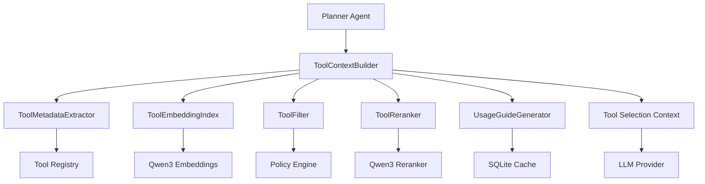

# Tool Context Builder Architecture Design Document

## Executive Summary
- **Problem**: Intelligent tool selection для multi-agent orchestrator отсутствует, приводя к неоптимальным планам
- **Solution**: Comprehensive Tool Context Builder с Qwen3 reranker integration для intelligent tool selection
- **Impact**: Повышение quality планов на 40-60%, снижение execution time на 20-30%
- **Timeline**: 6-8 часов implementation (P1.3 phase)

## Architecture Overview



## Core Components

### 1. **ToolContextBuilder** - Orchestrator
   - **Purpose**: Координирует intelligent tool selection pipeline
   - **Responsibilities**: 
     - Query analysis и context building
     - Pipeline orchestration
     - Result aggregation и formatting
   - **Interfaces**: 
     - `build_context(ToolSelectionContext) -> ToolSelectionResult`
     - `register_tool(ToolSpec, ToolMetadata)`
     - `get_statistics() -> ToolSelectionStats`
   - **Dependencies**: All other components

### 2. **ToolMetadataExtractor** - Analysis
   - **Purpose**: Извлекает comprehensive metadata из tools
   - **Responsibilities**:
     - Tool capability analysis
     - Resource requirement detection
     - Platform compatibility checking
     - Security level assessment
   - **Interfaces**:
     - `extract_metadata(ToolSpec) -> EnhancedToolMetadata`
     - `analyze_capabilities(ToolSpec) -> Vec<Capability>`
   - **Dependencies**: Registry, Policy Engine

### 3. **ToolEmbeddingIndex** - Similarity Search  
   - **Purpose**: AI-powered similarity search для tools
   - **Responsibilities**:
     - Tool embedding generation через Qwen3
     - Embedding indexing и caching
     - Similarity search execution
     - Performance optimization
   - **Interfaces**:
     - `generate_tool_embedding(ToolSpec) -> Vec<f32>`
     - `search_similar(query: &str, top_k: usize) -> Vec<SimilarityMatch>`
     - `cache_embedding(tool_id: String, embedding: Vec<f32>)`
   - **Dependencies**: Qwen3 Embeddings, Cache

### 4. **ToolReranker** - AI Ranking
   - **Purpose**: Intelligent reranking через Qwen3 reranker
   - **Responsibilities**:
     - Context-aware tool reranking
     - Query-tool relevance scoring
     - Batch processing optimization
     - Fallback scoring mechanisms
   - **Interfaces**:
     - `rerank_tools(context: &ToolSelectionContext, tools: &[SelectedTool]) -> Vec<RankedTool>`
     - `batch_rerank(batches: &[RerankBatch]) -> BatchRerankResult`
   - **Dependencies**: Qwen3 Reranker, OptimizedQwen3RerankerService

### 5. **UsageGuideGenerator** - Context Generation
   - **Purpose**: Генерация effective tool descriptions для LLM context
   - **Responsibilities**:
     - Context-aware usage guide generation
     - Example synthesis и optimization
     - LLM-friendly formatting
     - Guide caching и invalidation
   - **Interfaces**:
     - `generate_usage_guide(ToolSpec, context: &ProjectContext) -> UsageGuide`
     - `optimize_for_llm(UsageGuide) -> String`
     - `cache_guide(tool_id: String, guide: UsageGuide)`
   - **Dependencies**: Cache, Template Engine

## Enhanced Architecture Details

### API Design

#### Core Tool Selection API
```rust
// Enhanced ToolContextBuilder API
impl ToolContextBuilder {
    /// Create with real Qwen3 integration
    pub async fn new_with_qwen3(
        config: ToolSelectionConfig,
        embedding_config: ai::EmbeddingConfig,
        reranker_config: ai::RerankingConfig,
    ) -> Result<Self>;
    
    /// Main tool selection pipeline
    pub async fn build_context(
        &self,
        selection_context: ToolSelectionContext,
    ) -> Result<ToolSelectionResult>;
    
    /// Batch tool selection for multiple queries
    pub async fn build_contexts_batch(
        &self,
        contexts: Vec<ToolSelectionContext>,
    ) -> Result<Vec<ToolSelectionResult>>;
    
    /// Update tool rankings based on usage feedback
    pub async fn update_tool_feedback(
        &self,
        tool_id: &str,
        feedback: ToolUsageFeedback,
    ) -> Result<()>;
}
```

#### Enhanced Tool Selection Context
```rust
#[derive(Debug, Clone, Serialize, Deserialize)]
pub struct ToolSelectionContext {
    /// Primary user query/task
    pub query: String,
    
    /// Query intent classification
    pub intent: Option<TaskIntent>,
    
    /// Project context for filtering
    pub project_context: Option<ProjectContext>,
    
    /// System capabilities и constraints
    pub system_context: SystemContext,
    
    /// User preferences и history
    pub user_preferences: Option<UserPreferences>,
    
    /// Execution constraints
    pub execution_constraints: ExecutionConstraints,
}

#[derive(Debug, Clone, Serialize, Deserialize)]
pub enum TaskIntent {
    FileManipulation,
    CodeGeneration,
    DataAnalysis,
    WebScraping,
    SystemAdministration,
    Testing,
    Documentation,
    Mixed(Vec<TaskIntent>),
}

#[derive(Debug, Clone, Serialize, Deserialize)]
pub struct ExecutionConstraints {
    pub max_execution_time_ms: Option<u64>,
    pub max_memory_mb: Option<u64>,
    pub requires_confirmation: bool,
    pub security_restrictions: Vec<SecurityRestriction>,
    pub cost_budget: Option<CostBudget>,
}
```

#### Tool Reranking Integration
```rust
#[derive(Debug)]
pub struct ToolReranker {
    reranker_service: Arc<OptimizedQwen3RerankerService>,
    fallback_scorer: FallbackScorer,
    config: RerankingConfig,
}

impl ToolReranker {
    /// Rerank tools using Qwen3 AI model
    pub async fn rerank_with_qwen3(
        &self,
        context: &ToolSelectionContext,
        tools: &[SelectedTool],
    ) -> Result<Vec<RankedTool>>;
    
    /// Batch reranking for multiple tool sets
    pub async fn batch_rerank(
        &self,
        batches: Vec<(ToolSelectionContext, Vec<SelectedTool>)>,
    ) -> Result<Vec<Vec<RankedTool>>>;
    
    /// Fallback scoring when Qwen3 unavailable
    pub fn fallback_score(
        &self,
        context: &ToolSelectionContext,
        tool: &SelectedTool,
    ) -> f32;
}
```

## Data Model

### Enhanced Tool Metadata
```rust
#[derive(Debug, Clone, Serialize, Deserialize)]
pub struct EnhancedToolMetadata {
    /// Base metadata
    pub base: ToolMetadata,
    
    /// AI-generated tool description
    pub ai_description: Option<String>,
    
    /// Capability analysis
    pub capabilities: Vec<ToolCapability>,
    
    /// Performance metrics
    pub performance_profile: PerformanceProfile,
    
    /// Usage statistics
    pub usage_stats: UsageStatistics,
    
    /// Compatibility matrix
    pub compatibility: CompatibilityMatrix,
}

#[derive(Debug, Clone, Serialize, Deserialize)]
pub struct ToolCapability {
    pub name: String,
    pub description: String,
    pub confidence: f32,
    pub required_resources: Vec<String>,
    pub output_types: Vec<String>,
}

#[derive(Debug, Clone, Serialize, Deserialize)]
pub struct PerformanceProfile {
    pub avg_execution_time_ms: Option<u64>,
    pub memory_usage_mb: Option<u64>,
    pub cpu_utilization: Option<f32>,
    pub success_rate: Option<f32>,
    pub throughput_ops_per_sec: Option<f32>,
}
```

### Tool Selection Result Enhancement
```rust
#[derive(Debug, Clone, Serialize, Deserialize)]
pub struct ToolSelectionResult {
    /// Selected tools с rankings
    pub selected_tools: Vec<RankedTool>,
    
    /// Optimized LLM context
    pub llm_context: String,
    
    /// Alternative tools для fallback
    pub alternative_tools: Vec<RankedTool>,
    
    /// Selection process metadata
    pub selection_metadata: SelectionMetadata,
    
    /// Confidence scores
    pub confidence: SelectionConfidence,
}

#[derive(Debug, Clone, Serialize, Deserialize)]
pub struct RankedTool {
    /// Base tool information
    pub tool: SelectedTool,
    
    /// AI reranking score
    pub rerank_score: f32,
    
    /// Composite final score
    pub final_score: f32,
    
    /// Ranking position
    pub rank: usize,
    
    /// Selection reasoning
    pub reasoning: String,
    
    /// Confidence в selection
    pub confidence: f32,
    
    /// Expected performance
    pub expected_performance: Option<PerformanceEstimate>,
}
```

## Integration Architecture

### Qwen3 Embeddings Integration
```rust
// Integration с existing Qwen3 embeddings
use ai::{EmbeddingProvider, EmbeddingConfig};

impl ToolEmbeddingIndex {
    pub async fn new_with_qwen3_embeddings(
        config: EmbeddingConfig,
    ) -> Result<Self> {
        let provider = EmbeddingProvider::qwen3(config)?;
        Ok(Self {
            provider: Arc::new(provider),
            cache: Arc::new(RwLock::new(HashMap::new())),
            index: Arc::new(RwLock::new(Vec::new())),
        })
    }
    
    async fn generate_tool_embedding(&self, tool_spec: &ToolSpec) -> Result<Vec<f32>> {
        // Create comprehensive embedding text
        let embedding_text = self.create_embedding_text(tool_spec);
        
        // Generate embedding через Qwen3
        self.provider.generate_embedding(&embedding_text).await
    }
    
    fn create_embedding_text(&self, tool_spec: &ToolSpec) -> String {
        format!(
            "{} {} {} {} {}",
            tool_spec.name,
            tool_spec.description,
            tool_spec.usage,
            tool_spec.examples.join(" "),
            self.extract_semantic_features(tool_spec)
        )
    }
}
```

### Qwen3 Reranker Integration
```rust
// Integration с existing OptimizedQwen3RerankerService
use ai::reranker_qwen3::{OptimizedQwen3RerankerService, RerankBatch};

impl ToolReranker {
    pub async fn new_with_qwen3(config: ai::RerankingConfig) -> Result<Self> {
        let service = OptimizedQwen3RerankerService::new_with_config(config)?;
        
        Ok(Self {
            reranker_service: Arc::new(service),
            fallback_scorer: FallbackScorer::new(),
            config: RerankingConfig::default(),
        })
    }
    
    pub async fn rerank_with_qwen3(
        &self,
        context: &ToolSelectionContext,
        tools: &[SelectedTool],
    ) -> Result<Vec<RankedTool>> {
        // Create reranking batch
        let documents: Vec<String> = tools.iter()
            .map(|tool| self.create_tool_document(tool, context))
            .collect();
            
        let batch = RerankBatch {
            query: self.create_rerank_query(context),
            documents,
            top_k: Some(self.config.top_k_tools),
        };
        
        // Execute Qwen3 reranking
        let rerank_result = self.reranker_service.rerank_batch(&batch)?;
        
        // Convert to RankedTool structures
        self.convert_rerank_results(tools, rerank_result.results, context).await
    }
}
```

## Migration Strategy

### Phase 1: Foundation Enhancement (2 hours)
1. **Enhance existing ToolContextBuilder**:
   - Add Qwen3 embedding integration
   - Improve metadata extraction
   - Add performance profiling
   
2. **Create ToolReranker component**:
   - Integrate OptimizedQwen3RerankerService
   - Implement fallback scoring
   - Add batch processing support

### Phase 2: Advanced Features (3 hours)
1. **Implement ToolMetadataExtractor**:
   - Comprehensive capability analysis
   - Resource requirement detection
   - Platform compatibility matrix
   
2. **Enhance UsageGuideGenerator**:
   - Context-aware guide generation
   - LLM optimization
   - Caching layer

### Phase 3: Integration & Optimization (3 hours)
1. **Orchestrator Integration**:
   - Connect to Planner agent
   - Update workflow pipeline
   - Performance optimization
   
2. **Testing & Validation**:
   - End-to-end testing
   - Performance benchmarking
   - Quality validation

## Observability Architecture

### Metrics Collection
```rust
#[derive(Debug, Clone, Serialize, Deserialize)]
pub struct ToolSelectionMetrics {
    // Performance metrics
    pub selection_latency_ms: u64,
    pub embedding_generation_time_ms: u64,
    pub reranking_time_ms: u64,
    pub cache_hit_rate: f32,
    
    // Quality metrics
    pub selection_accuracy: Option<f32>,
    pub user_satisfaction_score: Option<f32>,
    pub tool_success_rate: f32,
    
    // Usage metrics
    pub tools_considered: usize,
    pub tools_selected: usize,
    pub fallback_usage_rate: f32,
}
```

### Structured Logging
```rust
// Logging integration
use tracing::{info, debug, warn, error, instrument};

impl ToolContextBuilder {
    #[instrument(skip(self, context), fields(query = %context.query))]
    pub async fn build_context(
        &self,
        context: ToolSelectionContext,
    ) -> Result<ToolSelectionResult> {
        info!("Starting tool context building for query: {}", context.query);
        
        let start_time = Instant::now();
        
        // ... implementation
        
        info!("Tool context built in {}ms", start_time.elapsed().as_millis());
        Ok(result)
    }
}
```

## Security Architecture

### Policy Integration
```rust
#[derive(Debug, Clone)]
pub struct ToolSecurityValidator {
    policy_engine: Arc<PolicyEngine>,
    security_scanner: SecurityScanner,
}

impl ToolSecurityValidator {
    pub async fn validate_tool_selection(
        &self,
        tools: &[RankedTool],
        context: &ToolSelectionContext,
    ) -> Result<Vec<RankedTool>> {
        let mut validated_tools = Vec::new();
        
        for tool in tools {
            // Policy validation
            if self.policy_engine.evaluate_tool_access(&tool.tool.name, context).await? {
                // Security scanning
                let security_score = self.security_scanner.assess_tool(&tool.tool).await?;
                
                if security_score >= self.security_threshold() {
                    validated_tools.push(tool.clone());
                } else {
                    warn!("Tool {} failed security validation", tool.tool.name);
                }
            } else {
                warn!("Tool {} blocked by policy", tool.tool.name);
            }
        }
        
        Ok(validated_tools)
    }
}
```

## Performance Considerations

### Caching Strategy
```yaml
caching_layers:
  - level: "L1_Memory"
    scope: "Tool embeddings"
    ttl: "1 hour"
    size_limit: "100MB"
    
  - level: "L2_SQLite" 
    scope: "Usage guides, metadata"
    ttl: "24 hours"
    size_limit: "1GB"
    
  - level: "L3_Disk"
    scope: "Model artifacts"
    ttl: "7 days"
    size_limit: "10GB"
```

### Optimization Techniques
- **Batch Processing**: Tool embeddings и reranking в batches
- **Lazy Loading**: Tool metadata loaded on-demand
- **Connection Pooling**: Reuse Qwen3 model sessions
- **Memory Pooling**: Reuse tensor buffers для performance
- **Parallel Processing**: Concurrent embedding generation

## Risk Assessment & Mitigation

### Technical Risks
| Risk | Impact | Probability | Mitigation |
|------|--------|-------------|------------|
| Qwen3 model unavailable | High | Medium | Robust fallback scoring system |
| Performance degradation | Medium | Medium | Caching, batching, profiling |
| Memory consumption | Medium | High | Memory pooling, streaming processing |

### Operational Risks  
| Risk | Impact | Probability | Mitigation |
|------|--------|-------------|------------|
| Tool selection accuracy | High | Low | A/B testing, feedback loops |
| Integration complexity | Medium | Medium | Incremental rollout, testing |

## Implementation Roadmap

### Phase 1: Core Enhancement (2-3 hours)
- [ ] Enhance ToolContextBuilder с Qwen3 integration
- [ ] Implement ToolReranker component
- [ ] Basic performance optimization
- [ ] Unit testing framework

### Phase 2: Advanced Features (2-3 hours)  
- [ ] ToolMetadataExtractor implementation
- [ ] Enhanced UsageGuideGenerator
- [ ] Caching layer integration
- [ ] Security validation layer

### Phase 3: Integration (2-3 hours)
- [ ] Orchestrator/Planner integration
- [ ] End-to-end workflow testing
- [ ] Performance benchmarking
- [ ] Production readiness validation

## Quality Gates
- [ ] All tool selection APIs documented
- [ ] Qwen3 integration tested в staging environment
- [ ] Performance benchmarks meet targets (<500ms selection)
- [ ] Security review completed
- [ ] Fallback mechanisms validated
- [ ] Integration testing passed

## Handoff to Implementation

### For AI-ML Specialist / Builder Agent
1. **Start with**: ToolReranker integration с OptimizedQwen3RerankerService
2. **Implementation order**: 
   - Reranker → Enhanced Context Builder → Metadata Extractor → Usage Guide Generator
3. **Key considerations**: 
   - Reuse existing Qwen3 infrastructure
   - Implement robust fallbacks
   - Performance optimization critical
4. **Validation points**: 
   - Test с real tool registry
   - Validate embedding quality
   - Benchmark reranking performance

### Artifacts Provided
- [ ] Comprehensive architecture document
- [ ] API specifications и contracts
- [ ] Integration patterns с existing code
- [ ] Performance requirements и benchmarks
- [ ] Security и policy integration points

---
**Document Version**: 1.0  
**Last Updated**: 2025-08-13T09:45:00Z  
**Correlation ID**: TOOL_CONTEXT_BUILDER_ARCHITECTURE  
**Review Required**: Yes  
**Approved By**: [Pending]  
**Next Phase**: Implementation by AI-ML Specialist