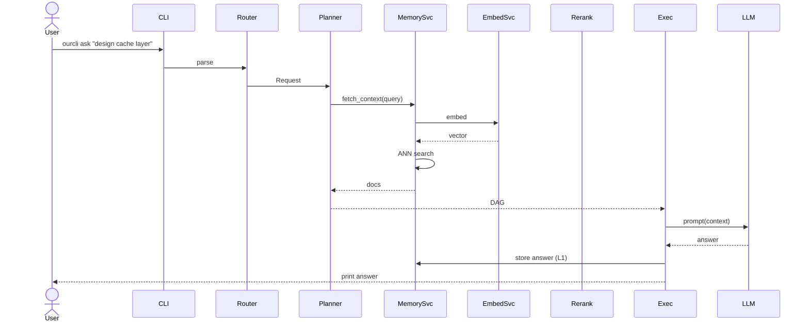

# Zero‑to‑One CLI Agent Architecture (.v1)

**Author:** generated by AI for Magray  
**Status:** Draft — Greenfield design  
**Last Update:** 2025-07-29

---

## 0. Design Goals

* **Local‑first, offline‑friendly** — works entirely on developer laptop.
* **Single binary UX** — `ourcli <cmd>` with extensible sub‑commands.
* **Composable AI** — LLM‑agnostic, tool‑centric reasoning.
* **Explainable memory** — transparent promotion/decay rules.
* **No external services** — only open‑source components (LanceDB, Wasmtime).

---

## 1. System Overview

```mermaid
flowchart LR
    CLI[[CLI]] --> GW{{Command Router}}

    subgraph CORE["Core Runtime"]
        GW --> PLAN[Planner / DAG Builder]
        PLAN --> EXEC[Executor]
        EXEC --> EVT[(EventBus)]
        EXEC --> MEM[MemorySvc]
        EXEC --> TOOLM[ToolRegistry]
        EXEC --> PROMPT[PromptBuilder]
    end

    subgraph AI["AI Services"]
        PROMPT --> VEC[EmbedSvc (BGE‑small)]
        VEC --> MEM
        MEM --> RER[Cross‑Encoder Rerank]
        PROMPT --> RER
        RER --> LLM[LLM Client]
    end

    EXEC -. metrics .-> OBS[(Observability)]
    SCH[Scheduler] --> MEM
    SCH --> TOOLM
    SCH --> OBS
```

*Every arrow is async; EventBus is the only shared channel.*

---

## 2. Memory Layers (LanceDB)

| Table | Purpose | Typical Entities | Retention | Index | Ranking Weight |
|-------|---------|------------------|-----------|-------|----------------|
| **`interact` (L1)** | hot context from current session | chat turns, raw tool outputs | 24 h, ≤ 5 K rows | HNSW | **1.2** × decay |
| **`insights` (L2)** | distilled knowledge | decisions, solved issues, task summaries | 90 d, ≤ 50 K | IVF‑PQ | **1.0** |
| **`assets` (L3)** | cold artefacts | specs, docs, code chunks, blobs | ~∞, ≥ 1 M | IVF‑PQ multi‑segment | **0.8** |

*All three live in the same **LanceDB** directory and share embedding schema.*

```python
schema = {{
    "id": lancedb.UUID(),
    "text": lancedb.Text(),
    "vector": lancedb.Vector(384),
    "layer": lancedb.Enum(["L1","L2","L3"]),
    "kind": lancedb.String(),          # 'tool','decision','blob',...
    "tags": lancedb.List(lancedb.String()),
    "project": lancedb.String(),
    "session": lancedb.String(),
    "ts": lancedb.Timestamp()
}}
```

### Retrieval

```python
hits = (
  db.search("как исправить linkage error")
    .filter(layer=["L1","L2","L3"], project="proj42")
    .limit(200)               # ANN
    .rerank(model="bge-reranker")   # 🚀 built‑in
    .topk(32)
)
```

Score = `sim * layer_weight * exp(-(now-ts)/τ)`; τ≈48 h.

[^lance-hybrid]: LanceDB hybrid search & rerank docs citeturn0search8  
[^lance-ce]: Cross‑Encoder rerank example citeturn0search0  

---

## 3. Component Responsibilities

| Component | Key Tasks |
|-----------|-----------|
| **Command Router** | parse CLI args, create `Request` objects |
| **Planner** | translate goal → DAG, choose tools via semantic match |
| **Executor** | execute DAG nodes, handle retries, timeout, capture outputs |
| **Tool Registry** | WASI sandboxed plugins, introspect `spec()` |
| **PromptBuilder** | gather context, format system/user/tool blocks |
| **EmbedSvc** | Qwen3 0.6B; batch + cache |
| **MemorySvc** | CRUD tables, promotion/decay policies, hybrid query |
| **Rerank** | CrossEncoder‐MS‑Marco or BG3 |
| **LLM Client** | local GGUF or remote OpenAI via env flag |
| **Scheduler** | runs GC, re‑index, score decay |
| **Observability** | JSON logs + OpenTelemetry spans |

---

## 4. Data Flow (User Request)



---

## 5. Directory Layout

```
~/.ourcli/
  lancedb/               # *.lance tables
  cache/embeddings.db
  logs/events.log
  metrics.json
  config.toml
  plugins/               # WASI .wasm tools
```

---

## 6. Example `config.toml`

```toml
[memory]
db_path = "lancedb"
decay_half_life_h = 48
weights = {{ L1 = 1.2, L2 = 1.0, L3 = 0.8 }}

[nlu]
embed_model = "BAAI/bge-small-en-v1.5"
rerank_model = "cross-encoder/ms-marco-MiniLM-L-6-v2"

[policy]
max_tokens = 8192
allow_network = false
```

---

## 7. Scheduler Jobs

| Job | Period | Action |
|-----|--------|--------|
| `promote_decisions` | 6 h | L1→L2 when tag `decision` |
| `decay_scores` | 24 h | multiply `score` by 0.9 |
| `vacuum_orphans` | 24 h | remove vectors w/ missing blobs |
| `snapshot_metrics` | 1 h | append row into `metrics.json` |

---

## 8. MVP → Production Roadmap

1. **Bootstrap CLI** (`init`, `config`)  
2. **MemorySvc with LanceDB** (schemas + CRUD)  
3. **EmbedSvc + cache**  
4. **Hybrid search + rerank**  
5. **Planner & Executor (static rules)**  
6. **Tool sandbox & two sample tools (`shell`, `git`)**  
7. **Scheduler GC/promote**  
8. **OpenTelemetry logging**  
9. **TUI Kanban (ratatui) [optional]**  
10. **Benchmark & polish**

--- 

## 9. Interfaces (Rust‑like)

```rust
pub enum Layer {{ Interact, Insights, Assets }}

pub struct MemoryRecord {{
    id: Uuid,
    text: String,
    layer: Layer,
    kind: String,
    tags: Vec<String>,
    ts: DateTime<Utc>,
}}

#[async_trait]
pub trait Memory {{
    async fn search(&self, query: &str, k: usize) -> Vec<MemoryRecord>;
    async fn insert(&self, rec: &MemoryRecord) -> Result<()>;
}}

#[async_trait]
pub trait Tool {{
    fn spec(&self) -> ToolSpec;
    async fn invoke(&self, input: Value) -> Result<Value>;
}}
```

---

### End‑Result

A lean, local‑only agent with transparent memory governance, sub‑50 ms retrieval, and a plugin story that scales from scripts to WASI modules.

_Ready to start coding? Run `ourcli init` and hack away!_ 😎
