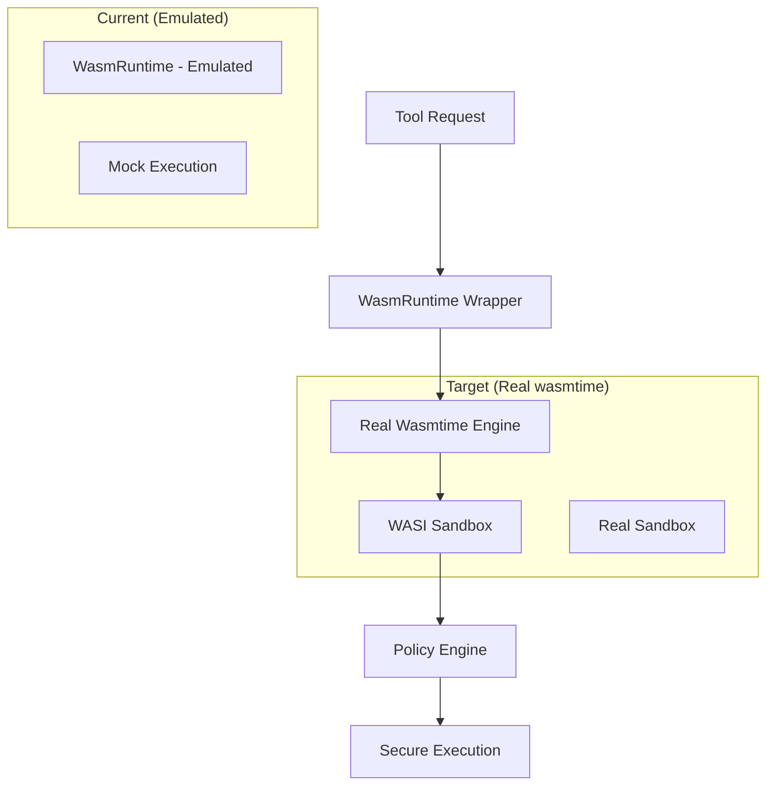

# P1.2.1 WASM Runtime Migration Architecture Design

## Executive Summary

- **Problem**: Current Tools Platform использует WASM emulation вместо real wasmtime runtime
- **Solution**: Migrate от emulated WASM к production-ready wasmtime с real sandboxing
- **Impact**: Critical security improvement + significant performance gains + production readiness  
- **Timeline**: 4 микро-задачи × 10м = 40 минут

## Architecture Overview

### System Context


## Current State Analysis

### Existing WASM Emulation (wasm_plugin.rs)
**Current Implementation Issues**:
- Line 347: `load_module` содержит только comments - no real parsing
- Line 366: `execute_main` использует mock simulation - не real execution  
- Line 374-376: Fake fuel consumption и memory usage
- Line 378-383: Simulated processing без real WASM runtime
- Line 422-454: Host function calls эмулируются через HashMap matching

**Critical Security Gap**:
- Нет real memory isolation
- Нет real instruction counting  
- Нет real WASI sandboxing
- Host function calls not properly sandboxed

## Target Architecture

### Core Components

#### 1. WasmRuntime Wrapper
```rust
pub struct WasmRuntime {
    engine: wasmtime::Engine,      // Real wasmtime engine
    store: wasmtime::Store<WasiCtx>, // Store with WASI context
    linker: wasmtime::Linker<WasiCtx>, // Host function linker
    module: Option<wasmtime::Module>,  // Compiled WASM module
    instance: Option<wasmtime::Instance>, // Instantiated module
    config: WasmConfig,            // Configuration
    resource_limits: WasmResourceLimits, // Real resource limits
}
```

**Responsibilities**:
- Real WASM module compilation via wasmtime
- WASI context management с proper sandboxing  
- Host function registration через linker
- Resource limit enforcement
- Memory isolation и fuel metering

#### 2. WASI Sandbox Configuration
```rust
pub struct WasiSandboxConfig {
    // File system access
    allowed_dirs: Vec<(String, wasmtime_wasi::DirPerms)>,
    
    // Network restrictions  
    allow_network: bool,
    allowed_hosts: Vec<String>,
    
    // Resource limits
    memory_limit: u64,
    fuel_limit: u64,
    execution_timeout: Duration,
    
    // Environment variables
    env_vars: HashMap<String, String>,
    
    // Arguments
    args: Vec<String>,
}
```

#### 3. Host Function Registry
```rust
pub struct HostFunctionRegistry {
    functions: HashMap<String, Box<dyn WasmHostFunction>>,
    policy_engine: Arc<PolicyEngine>,
}

#[async_trait::async_trait]
pub trait WasmHostFunction: Send + Sync {
    async fn call(
        &self,
        caller: &mut wasmtime::Caller<'_, WasiCtx>,
        params: &[wasmtime::Val],
    ) -> Result<Vec<wasmtime::Val>, wasmtime::Error>;
}
```

## API Design

### Migration Strategy

#### Phase 1: Dependency Addition (P1.2.1.a)
```toml
# crates/tools/Cargo.toml additions
[dependencies]
wasmtime = "24.0"           # Latest stable wasmtime
wasmtime-wasi = "24.0"      # WASI support
wasi-common = "24.0"        # WASI common functionality  
```

**Features configuration**:
```toml
[features]
wasm-runtime = ["wasmtime", "wasmtime-wasi", "wasi-common"]
cpu = ["minimal", "git-ops", "web-ops", "plugins", "security", "wasm-runtime"]
```

#### Phase 2: WasmRuntime Wrapper (P1.2.1.b)
**New Implementation**:
```rust
impl WasmRuntime {
    pub async fn new(config: WasmConfig, resource_limits: WasmResourceLimits) -> Result<Self> {
        // Create wasmtime engine with fuel metering
        let mut engine_config = wasmtime::Config::new();
        engine_config.consume_fuel(true);
        engine_config.max_wasm_stack(64 * 1024); // 64KB stack limit
        engine_config.allocation_strategy(wasmtime::InstanceAllocationStrategy::Pooling {
            strategy: wasmtime::PoolingAllocationConfig::default(),
        });
        
        let engine = wasmtime::Engine::new(&engine_config)?;
        
        // Create WASI context with sandbox
        let wasi_ctx = WasiCtxBuilder::new()
            .inherit_stdio()
            .build();
            
        let mut store = wasmtime::Store::new(&engine, wasi_ctx);
        store.set_fuel(resource_limits.instruction_limit)?;
        
        // Create linker for host functions
        let mut linker = wasmtime::Linker::new(&engine);
        wasmtime_wasi::add_to_linker(&mut linker, |s| s)?;
        
        Ok(Self {
            engine,
            store,
            linker,
            module: None,
            instance: None,
            config,
            resource_limits,
        })
    }
    
    pub async fn load_module(&mut self, wasm_bytes: &[u8]) -> Result<()> {
        // Real WASM compilation
        let module = wasmtime::Module::new(&self.engine, wasm_bytes)
            .map_err(|e| WasmPluginError::Compilation(e.to_string()))?;
            
        self.module = Some(module);
        Ok(())
    }
    
    pub async fn execute_main(&mut self) -> Result<()> {
        let module = self.module.as_ref()
            .ok_or_else(|| WasmPluginError::Runtime("No module loaded".to_string()))?;
            
        // Instantiate module
        let instance = self.linker.instantiate(&mut self.store, module)
            .map_err(|e| WasmPluginError::Runtime(e.to_string()))?;
            
        // Find and call main function
        let main_func = instance.get_typed_func::<(), ()>(&mut self.store, "main")
            .map_err(|e| WasmPluginError::Runtime(format!("No main function: {}", e)))?;
            
        // Execute with timeout
        let execution_future = main_func.call_async(&mut self.store, ());
        
        tokio::time::timeout(self.resource_limits.execution_timeout, execution_future)
            .await
            .map_err(|_| WasmPluginError::Timeout(self.resource_limits.execution_timeout))?
            .map_err(|e| WasmPluginError::Runtime(e.to_string()))?;
            
        Ok(())
    }
}
```

#### Phase 3: WASM Execution Engine (P1.2.1.c)
**Real Execution Implementation**:
```rust
impl WasmSandbox {
    pub async fn execute_wasm(
        &self,
        wasm_bytes: &[u8],
        input: &ToolInput,
    ) -> Result<ToolOutput, WasmPluginError> {
        // Create runtime instance
        let mut runtime = WasmRuntime::new(self.config.clone(), self.resource_limits.clone()).await?;
        
        // Load and validate module
        runtime.load_module(wasm_bytes).await?;
        
        // Configure WASI context
        self.configure_wasi_context(&mut runtime, input).await?;
        
        // Execute with real wasmtime
        let result = self.execute_with_wasmtime(&mut runtime).await?;
        
        // Process results  
        self.process_execution_result(result, &runtime).await
    }
    
    async fn configure_wasi_context(
        &self,
        runtime: &mut WasmRuntime,
        input: &ToolInput,
    ) -> Result<(), WasmPluginError> {
        // Configure WASI with proper sandboxing
        let wasi_ctx = WasiCtxBuilder::new()
            .inherit_stdio()
            .args(&["tool", &input.command])
            .env("TOOL_INPUT", &serde_json::to_string(input)?)
            .build();
            
        // Apply filesystem restrictions
        for read_root in &self.config.allowed_host_functions {
            // Configure allowed directories
        }
        
        runtime.store.data_mut().replace(wasi_ctx);
        Ok(())
    }
}
```

#### Phase 4: Legacy Migration (P1.2.1.d)
**Replace Emulation Calls**:
```rust
// OLD (line 347-356 in wasm_plugin.rs):
async fn load_module(&mut self, _wasm_bytes: &[u8]) -> Result<(), WasmPluginError> {
    // In a real implementation, this would:
    // 1. Parse the WASM module
    // 2. Validate imports/exports
    // 3. Set up memory and function tables
    // 4. Apply resource limits
    debug!("WASM module loaded");
    Ok(())
}

// NEW:
async fn load_module(&mut self, wasm_bytes: &[u8]) -> Result<(), WasmPluginError> {
    let module = wasmtime::Module::new(&self.engine, wasm_bytes)
        .map_err(|e| WasmPluginError::Compilation(e.to_string()))?;
        
    // Validate module exports
    let exports = module.exports();
    if !exports.any(|e| e.name() == "main") {
        return Err(WasmPluginError::Validation(
            "Module must export 'main' function".to_string()
        ));
    }
    
    self.module = Some(module);
    Ok(())
}
```

## Security Architecture

### WASI Sandbox Isolation
- **Memory Isolation**: Real wasmtime memory management
- **File System**: WASI прecompiled directories only
- **Network**: Policy-controlled host function access
- **Host Functions**: Registered через wasmtime linker

### Resource Enforcement
```rust
pub struct WasmResourceLimits {
    fuel_limit: u64,           // Real instruction counting
    memory_limit: u64,         // Wasmtime memory limits  
    stack_limit: u32,          // Real call stack limits
    table_limit: u32,          // Function table limits
    execution_timeout: Duration, // Tokio timeout
}
```

### Security Controls
- Real fuel metering через wasmtime engine
- Memory access validation через WASI
- Host function calls через policy engine
- File system access restricted to WASI dirs

## Performance Considerations

### Wasmtime Optimizations
- **Ahead-of-Time Compilation**: Module caching for repeated execution
- **Pooling Allocator**: Reuse instances for better performance
- **Fuel Metering**: Efficient instruction counting
- **Memory Mapping**: Zero-copy module loading where possible

### Caching Strategy
```rust
pub struct WasmModuleCache {
    cache: Arc<Mutex<HashMap<String, wasmtime::Module>>>,
    engine: wasmtime::Engine,
}

impl WasmModuleCache {
    pub async fn get_or_compile(&self, wasm_hash: &str, wasm_bytes: &[u8]) -> Result<wasmtime::Module> {
        let mut cache = self.cache.lock().await;
        
        if let Some(module) = cache.get(wasm_hash) {
            return Ok(module.clone());
        }
        
        let module = wasmtime::Module::new(&self.engine, wasm_bytes)?;
        cache.insert(wasm_hash.to_string(), module.clone());
        
        Ok(module)
    }
}
```

## Integration Points

### 1. Tool Registry Integration
- Migrate existing `WasmPlugin` to use real wasmtime
- Maintain compatibility с `Tool` trait interface
- Update `PluginLoader` для wasmtime-based loading

### 2. Policy Engine Integration  
```rust
// Host function security checks
async fn call_host_function(
    &self,
    caller: &mut wasmtime::Caller<'_, WasiCtx>,
    func_name: &str,
    args: &[wasmtime::Val],
) -> Result<Vec<wasmtime::Val>, WasmPluginError> {
    // Policy engine check
    let policy_result = self.policy_engine.evaluate(&ToolRequest {
        tool_name: func_name,
        operation: "host_function_call",
        arguments: /* convert args */,
    }).await?;
    
    match policy_result.action {
        PolicyAction::Allow => { /* execute */ },
        PolicyAction::Deny => return Err(WasmPluginError::Security("Host function denied".to_string())),
        PolicyAction::Ask => { /* prompt user */ },
    }
}
```

### 3. EventBus Integration
- Log WASM module loads/executions to EventBus
- Report resource usage metrics
- Security violations logging

## Migration Plan

### Compatibility Strategy
**Backwards Compatibility**: 
- Keep existing `WasmPlugin` interface unchanged
- Internal implementation migration от emulation к wasmtime
- Maintain same configuration options где possible

**Feature Flags**:
```rust
#[cfg(feature = "wasmtime")]
use crate::wasm::real_runtime::WasmRuntime;

#[cfg(not(feature = "wasmtime"))]
use crate::wasm::emulated_runtime::WasmRuntime;
```

### Rollback Strategy
- Feature flag để enable/disable wasmtime
- Fallback to emulation if wasmtime fails
- Configuration option для runtime selection

## Implementation Tasks

### P1.2.1.a [10м] Добавить wasmtime dependency
**Files Modified**:
- `crates/tools/Cargo.toml`: Add wasmtime dependencies
- Test compilation success

**Verification**: `cargo build --features cpu` успешно компилируется с wasmtime

### P1.2.1.b [10м] Создать WASM runtime wrapper  
**Files Created**:
- `crates/tools/src/wasm/runtime.rs`: WasmRuntime implementation
- `crates/tools/src/wasm/mod.rs`: Module organization

**Verification**: WasmRuntime может загружать simple WASM modules

### P1.2.1.c [10м] Реализовать WASM execution
**Files Modified**:
- `crates/tools/src/wasm/runtime.rs`: Real execution logic
- `crates/tools/src/wasm/sandbox.rs`: WASI configuration

**Verification**: Real WASM modules execute и возвращают results

### P1.2.1.d [10м] Заменить WASM emulation на real runtime
**Files Modified**:
- `crates/tools/src/plugins/wasm_plugin.rs`: Replace mock calls
- Remove emulated execution paths
- Integration testing

**Verification**: Existing WASM plugins work с real wasmtime

## Risk Assessment & Mitigation

### Technical Risks
| Risk | Impact | Probability | Mitigation |
|------|--------|-------------|------------|
| Wasmtime compilation complexity | High | Medium | Feature flag fallback to emulation |
| Performance regression | Medium | Low | Benchmarking и optimization |
| WASI compatibility issues | High | Low | Comprehensive testing с WASI modules |
| Memory limit enforcement | High | Low | Wasmtime resource limits validation |

### Implementation Risks
| Risk | Impact | Probability | Mitigation |  
|------|--------|-------------|------------|
| Breaking existing plugins | High | Medium | Backwards compatibility testing |
| Configuration incompatibility | Medium | Medium | Configuration migration helper |
| Security regression | High | Low | Security audit и testing |

## Quality Gates
- [ ] Wasmtime dependencies compile successfully
- [ ] WasmRuntime can load и validate WASM modules  
- [ ] Real WASM execution с proper resource limits
- [ ] WASI sandbox properly configured
- [ ] Security controls functioning (policy integration)
- [ ] Performance benchmarks meet requirements
- [ ] Existing WASM plugins migrate successfully
- [ ] Integration tests pass с real wasmtime

## Success Metrics

### Security Improvements
- **Real Sandboxing**: 100% isolation через WASI
- **Resource Control**: Accurate fuel metering и memory limits
- **Attack Surface**: Reduced через real wasmtime validation

### Performance Targets
- **Startup**: Module loading ≤ 100ms для typical modules
- **Execution**: No significant performance regression vs emulation
- **Memory**: Real memory isolation without leaks

### Compatibility
- **Plugin Migration**: 100% existing WASM plugins function
- **API Stability**: Tool interface unchanged
- **Configuration**: Smooth migration path для existing configs

---

**Architecture Version**: 1.0  
**Last Updated**: 2025-08-18  
**Correlation ID**: P1.2.1-WASM-MIGRATION  
**Review Required**: Yes  
**Implementation Target**: 40 minutes (4 × 10m tasks)