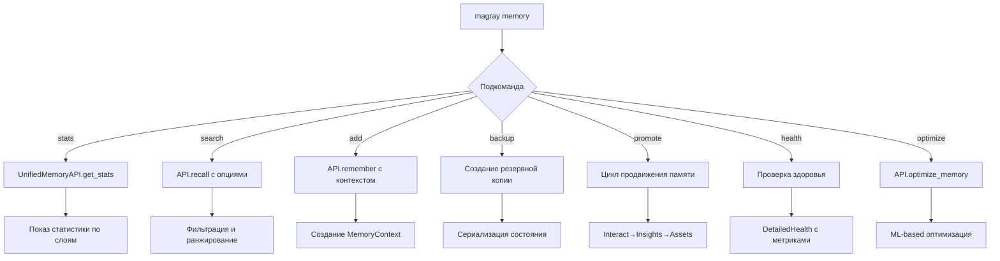
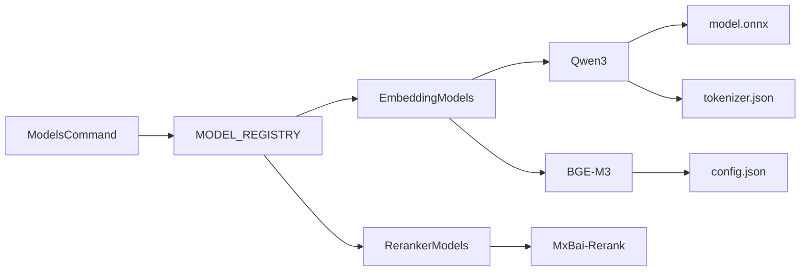
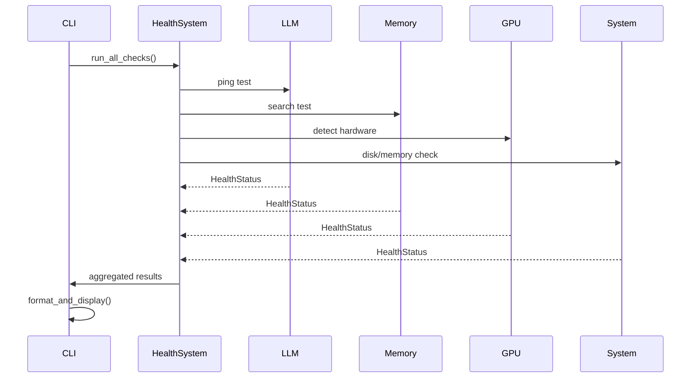
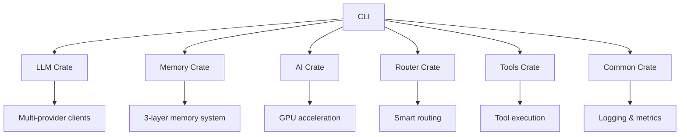

# CLI Interface - Commands & User Experience

*Комплексная документация командного интерфейса MAGRAY CLI*

## Обзор архитектуры

CLI компонент представляет собой главный пользовательский интерфейс MAGRAY CLI системы, обеспечивающий интуитивное взаимодействие с AI агентом и всеми подсистемами.

### Основные компоненты

```mermaid
graph TB
    A[main.rs] --> B[UnifiedAgent v2.4]
    A --> C[Commands]
    A --> D[ProgressSystem]
    A --> E[HealthChecks]
    
    B --> F[LLMClient]
    B --> G[SmartRouter]
    B --> H[IntentAnalyzer]
    B --> NEW1[DIMemoryService] %% 🆕 Новое v2.4
    
    NEW1 --> NEW2[Memory API Methods] %% 🆕 Новое v2.4
    NEW2 --> NEW3[store_user_message]
    NEW2 --> NEW4[search_memory]
    NEW2 --> NEW5[run_memory_promotion]
    NEW2 --> NEW6[check_system_health]
    
    C --> I[GpuCommand]
    C --> J[MemoryCommand]
    C --> K[ModelsCommand]
    
    D --> L[AdaptiveSpinner]
    D --> M[MultiStageProgress]
    
    E --> N[SystemHealthCheck]
    E --> O[ComponentChecks]
    
    classDef new fill:#e1f5fe
    class NEW1,NEW2,NEW3,NEW4,NEW5,NEW6 new
```

## Структура команд

### Основные команды

| Команда | Альтернативы | Описание | Статус |
|---------|-------------|----------|--------|
| `chat` | - | Чат с LLM моделью | ✅ Готово |
| `read` | - | Чтение файлов с подсветкой | ✅ Готово |
| `write` | - | Запись содержимого в файл | ✅ Готово |
| `list` | `ls` | Показ содержимого директории | ✅ Готово |
| `tool` | - | Выполнение действий через инструменты | ✅ Готово |
| `smart` | - | Умный AI планировщик | ✅ Готово |
| `gpu` | - | Управление GPU ускорением | ✅ Готово |
| `memory` | - | Управление системой памяти | ✅ Готово |
| `models` | - | Управление AI моделями | ✅ Готово |
| `health` | - | Проверка здоровья системы | ✅ Готово |
| `status` | - | Показ состояния системы | ✅ Готово |

### Интерактивный режим

При запуске без параметров MAGRAY CLI переходит в интерактивный режим чата:

```bash
magray
# Показывает ASCII art приветствие
# Переходит в интерактивный чат
```

**Особенности:**
- Красивая анимация загрузки с индикаторами прогресса
- ASCII art логотип MAGRAY
- Анимированные иконки для разных типов сообщений
- Эффект печатания для ответов AI
- Graceful выход с анимацией

## 🆕 UnifiedAgent v2.4 - Memory Integration

### Новые Memory API методы

**Прямая интеграция** с DIMemoryService в CLI агенте:

```rust
// Новые возможности UnifiedAgent v2.4
impl UnifiedAgent {
    /// Сохраняет сообщения пользователя автоматически
    pub async fn store_user_message(&self, message: &str) -> Result<()>
    
    /// Поиск по семантической памяти (Insights layer)
    pub async fn search_memory(&self, query: &str) -> Result<Vec<String>>
    
    /// Получение статистики DI системы
    pub async fn get_di_stats(&self) -> MemorySystemStats
    
    /// Запуск promotion процесса (перенос между слоями)
    pub async fn run_memory_promotion(&self) -> Result<()>
    
    /// Проверка здоровья всей системы
    pub async fn check_system_health(&self) -> Result<SystemHealthStatus>
}
```

### Автоматическое сохранение контекста

**Контекст-aware чат**: Каждое сообщение пользователя автоматически сохраняется в Interact layer для последующего семантического поиска.

```bash
# Пример автоматического workflow'а
magray
> Как оптимизировать HNSW индекс?
[AI] ✨ Вот ключевые параметры...
💾 Сообщение сохранено в Interact layer

# Позже в том же сеансе
> Покажи мне пример конфигурации
[AI] Основано на вашем предыдущем вопросе о HNSW...
🔍 Найден контекст в памяти
```

### CLI команды для Memory Management

```bash
# Проверка статистики DI системы
magray memory stats --di

# Запуск promotion процесса
magray memory promote

# Поиск по семантической памяти
magray memory search "Оптимизация HNSW"

# Проверка здоровья всей системы
magray health --full --memory
```

---

## Детальный обзор команд

### 1. GPU Commands (`magray gpu`)

Управление GPU ускорением и мониторинг производительности.

#### Подкоманды:

```bash
# Информация о GPU
magray gpu info
magray gpu i

# Бенчмарк производительности
magray gpu benchmark --batch-size 100 --compare
magray gpu b -b 100 -c

# Управление кэшем TensorRT
magray gpu cache stats
magray gpu cache clear
magray gpu cache size

# Управление памятью GPU
magray gpu memory stats
magray gpu memory clear

# Оптимизация модели
magray gpu optimize [MODEL_NAME]
magray gpu o bge-m3
```

**Workflow диаграмма GPU команд:**
```mermaid
flowchart TD
    A[magray gpu] --> B{Подкоманда}
    B -->|info| C[GpuDetector.detect()]
    B -->|benchmark| D[Тест производительности]
    B -->|cache| E[TensorRT операции]
    B -->|memory| F[GPU Memory Pool]
    B -->|optimize| G[Модель оптимизация]
    
    C --> H[Показ детальной информации]
    D --> I[AutoDeviceSelector]
    D --> J[CPU/GPU сравнение]
    E --> K[Статистика/Очистка кэша]
    F --> L[Управление буферами]
    G --> M[SmartEmbeddingFactory]
```

**Exit codes:**
- `0` - Успешное выполнение
- `1` - GPU недоступен
- `2` - Ошибка инициализации

### 2. Memory Commands (`magray memory`)

Управление трёхслойной системой памяти.

#### Подкоманды:

```bash
# Статистика памяти
magray memory stats --detailed
magray memory stats -d

# Поиск в памяти
magray memory search "query text" --layer interact --top-k 10 --min-score 0.8
magray memory search "query" -l insights -k 5 -s 0.5

# Добавление записи
magray memory add "text content" --layer interact --tags "tag1,tag2" --kind note
magray memory add "content" -l assets -t "important" -k document

# Backup операции
magray memory backup --name my_backup
magray memory restore backup_file.json
magray memory list-backups

# Обслуживание
magray memory promote
magray memory health --detailed
magray memory clear-cache
magray memory optimize

# Управление лимитами
magray memory limits --max-vectors 10000 --max-cache-mb 512 --show
```

**Workflow диаграмма Memory команд:**


### 3. Models Commands (`magray models`)

Управление AI моделями и их конфигурацией.

#### Подкоманды:

```bash
# Список моделей
magray models list --model-type embedding --available-only
magray models ls -t reranker -a

# Диагностика
magray models diagnose
magray models diag

# Информация о модели
magray models show qwen3
magray models info bge-m3

# Рекомендации
magray models recommendations
magray models rec

# Проверка конфигурации
magray models check
```

**Model Registry Integration:**


### 4. Health & Status Commands

#### Health Check (`magray health`)

Комплексная проверка здоровья всех компонентов системы:

```bash
magray health
```

**Проверяемые компоненты:**
- LLM Service connectivity
- Memory Service operational status  
- GPU availability and performance
- Disk space availability (минимум 5GB)
- Memory usage (максимум 90%)

**Health Check Flow:**


#### Status Check (`magray status`)

Быстрая диагностика состояния системы с graceful fallback:

```bash
magray status
```

**Особенности Status команды:**
- Timeout protection (10 секунд)
- Graceful degradation при недоступности компонентов
- Отключение GPU для стабильности
- Детальная диагностика проблем

## User Experience Patterns

### 1. Анимация и прогресс индикаторы

**Типы прогресс-баров:**
- `Fast` - быстрые операции (100-500ms)
- `Medium` - средние операции (0.5-5s)
- `Slow` - медленные операции (5s+)  
- `Backup` - backup/restore операции
- `Search` - поиск и индексация
- `Memory` - операции с памятью

**Adaptive Progress System:**
```rust
// Использование в коде
let spinner = ProgressBuilder::memory("Optimizing memory system...");
// ... выполнение операции
spinner.finish_success(Some("Memory optimization completed!"));
```

### 2. Error Handling стратегии

**Уровни ошибок:**
- `Healthy` ✅ - всё работает корректно
- `Degraded` ⚠️ - работает с ограничениями
- `Unhealthy` ❌ - критические проблемы

**Graceful Fallbacks:**
- GPU недоступен → CPU fallback
- Memory Service недоступен → degraded mode
- LLM недоступен → показ инструкций по настройке

### 3. Цветовая схема и иконки

**Системы обозначений:**
- `[AI]` 🤖 - AI агент
- `[►]` ▶️ - Пользователь  
- `[●]` ⚫ - Операции с файлами
- `[★]` ⭐ - Умный планировщик
- `[🎮]` 🎮 - GPU операции
- `[🧠]` 🧠 - Система памяти
- `[📦]` 📦 - Управление моделями
- `[🏥]` 🏥 - Health checks
- `[📊]` 📊 - Статистика

## Архитектурные связи

### Integration с другими Crates



### UnifiedAgent Orchestration

Центральный оркестратор обрабатывает все пользовательские запросы:

```rust
pub async fn process_message(&self, message: &str) -> Result<AgentResponse> {
    // 1. Анализ намерения через IntentAnalyzerAgent
    let decision = self.intent_analyzer.analyze_intent(message).await?;
    
    // 2. Роутинг по типу действия
    match decision.action_type.as_str() {
        "chat" => llm_client.chat_simple(message),
        "tools" => smart_router.process_smart_request(message),
        _ => simple_heuristic_fallback(message)
    }
}
```

## Command Line Parsing

**Clap Configuration:**
- Structured subcommands с алиасами
- Валидация параметров на уровне типов
- Contextual help messages на русском языке
- Красивое форматирование справки

**Пример структуры:**
```rust
#[derive(Parser)]
#[command(name = "magray")]
#[command(about = "[AI] MAGRAY - Интеллектуальный CLI агент")]
struct Cli {
    #[command(subcommand)]
    command: Option<Commands>,
}
```

## Exit Codes и Status Reporting

### Standard Exit Codes

| Code | Meaning | Usage |
|------|---------|-------|
| `0` | Success | Операция выполнена успешно |
| `1` | General Error | Общая ошибка выполнения |
| `2` | Misuse | Неправильное использование команды |
| `3` | Configuration Error | Ошибка конфигурации |
| `4` | Service Unavailable | Сервис недоступен |
| `5` | Resource Exhausted | Недостаточно ресурсов |

### Structured Logging

Все операции логируются в структурированном JSON формате:

```json
{
  "timestamp": "2024-12-19T10:30:00Z",
  "level": "INFO",
  "target": "magray_cli::commands::gpu",
  "fields": {
    "message": "GPU benchmark completed",
    "component": "gpu_benchmark",
    "duration_ms": 1250,
    "batch_size": 100,
    "throughput": "80.0 items/sec"
  }
}
```

## Performance Characteristics

### Command Execution Times

| Command Category | Expected Time | Timeout |
|------------------|---------------|---------|
| Simple queries | < 100ms | 2s |
| Memory operations | 100ms - 2s | 30s |
| GPU benchmarks | 1s - 10s | 60s |
| Health checks | 500ms - 5s | 15s |
| Backup/Restore | 5s - 60s | 300s |

### Memory Usage Patterns

- **Idle state**: ~50MB RAM
- **Active processing**: ~200MB RAM  
- **Heavy GPU operations**: ~500MB RAM
- **Large memory operations**: ~1GB RAM

## Development Guidelines

### Adding New Commands

1. Создать структуру команды в `commands/`
2. Добавить в `Commands` enum в `main.rs`
3. Реализовать execute() метод
4. Добавить тесты в `tests/`
5. Обновить документацию

### Error Handling Best Practices

```rust
// Правильно - с контекстом и recovery
match operation().await {
    Ok(result) => Ok(result),
    Err(e) => {
        warn!("Operation failed: {}, trying fallback", e);
        fallback_operation().await
            .with_context(|| "Both primary and fallback operations failed")
    }
}
```

### Progress Indication

```rust
// Выбор правильного типа прогресса
let spinner = match operation_type {
    OperationType::FileIO => ProgressBuilder::fast("Reading file..."),
    OperationType::NetworkCall => ProgressBuilder::medium("Connecting..."),
    OperationType::HeavyComputation => ProgressBuilder::slow("Processing..."),
};
```

## Testing Strategy

### Unit Tests Coverage

- **Commands**: Тестирование параметров и validation
- **Agent**: Mock LLM/Router для тестирования логики
- **Progress**: Тестирование адаптивных индикаторов  
- **Health**: Mock services для проверки алгоритмов

### Integration Tests

- **End-to-end workflows**: Полные пользовательские сценарии
- **Error scenarios**: Тестирование graceful fallbacks
- **Performance tests**: Benchmarking времени выполнения

### Manual Testing Checklist

- [ ] Интерактивный режим работает корректно
- [ ] Все команды показывают help
- [ ] Graceful fallbacks срабатывают при недоступности сервисов
- [ ] Анимации не блокируют выполнение
- [ ] Exit codes корректны для всех сценариев

## Связи с другими документами

- [[Memory Crate - Трёхслойная система памяти]] - интеграция с памятью
- [[AI Crate - Embedding и модели]] - управление моделями
- [[Production метрики и мониторинг]] - health checks
- [[Архитектура системы - Детальный обзор]] - общая архитектура

---

*Документация обновлена: 2024-12-19*  
*Статус компонента: Production Ready (95%)*  
*Следующие улучшения: Enhanced error recovery, более детальная телеметрия*