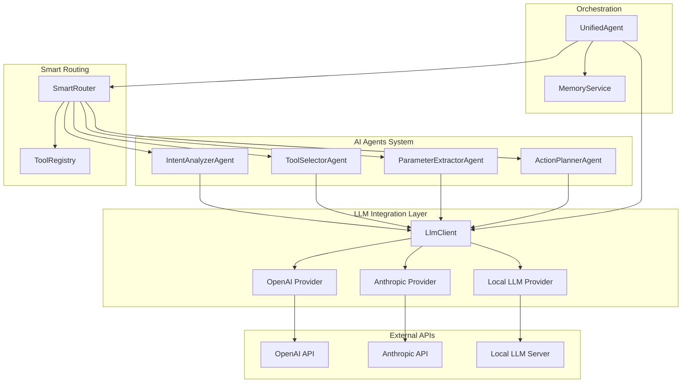
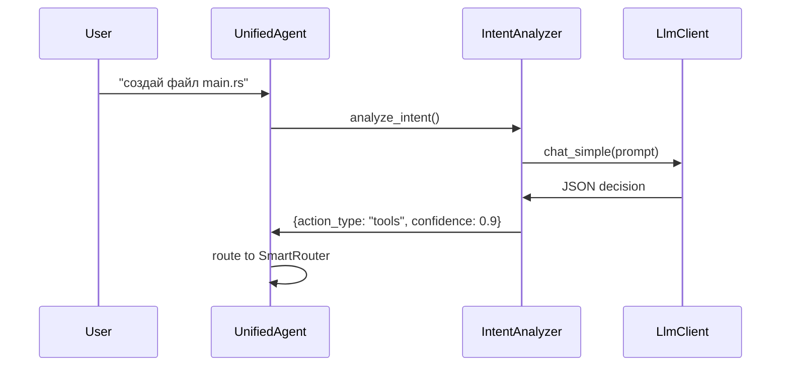
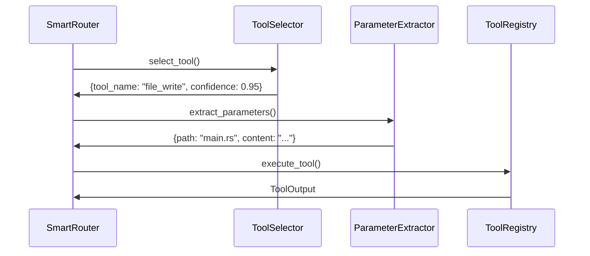

# LLM Integration - Multi-Provider AI Architecture

*MAGRAY CLI - Production-Ready LLM Integration System*

**Статус компонента**: 🟡 В разработке (80% готовности)  
**Приоритет**: Высокий  
**Последнее обновление**: 2025-08-05

## 📋 Обзор системы

LLM Crate представляет собой многопровайдерную систему интеграции с крупными языковыми моделями, обеспечивающую единый интерфейс для работы с OpenAI, Anthropic и локальными LLM моделями. Система включает специализированных AI агентов для различных задач и smart routing для оптимального выбора инструментов.

### 🔗 Связанные компоненты
- [[Memory Crate - Трёхслойная система памяти]] - интеграция с контекстом памяти
- [[CLI Interface - Commands & User Experience]] - пользовательский интерфейс
- [[Архитектура системы - Детальный обзор]] - общая архитектура

## 🏗️ Архитектурная схема



## 🔧 Компоненты системы и их статус

### 1. Multi-Provider LLM Client
**Файл**: `crates/llm/src/lib.rs`  
**CTL Аннотация**: `@component: {"k":"C","id":"llm_client","t":"Multi-provider LLM client","m":{"cur":80,"tgt":95,"u":"%"},"f":["llm","agents","multi-provider"]}`

```rust
pub enum LlmProvider {
    OpenAI { api_key: String, model: String },
    Anthropic { api_key: String, model: String },
    Local { url: String, model: String },
}

pub struct LlmClient {
    provider: LlmProvider,
    client: reqwest::Client,
    max_tokens: u32,
    temperature: f32,
}
```

**Возможности**:
- ✅ Поддержка OpenAI GPT моделей (gpt-4o-mini по умолчанию)
- ✅ Интеграция с Anthropic Claude (claude-3-haiku-20240307)
- ✅ Работа с локальными LLM через OpenAI-compatible API
- ✅ Автоматическая конфигурация через переменные окружения
- ✅ Единый интерфейс для всех провайдеров

**Пропущенные features**:
- ❌ Rate limiting и retry логика
- ❌ Streaming responses
- ❌ Request/response caching
- ❌ Load balancing между провайдерами
- ❌ Metrics и monitoring

### 2. Specialized AI Agents
**Директория**: `crates/llm/src/agents/`

#### IntentAnalyzerAgent 🎯
**Назначение**: Анализ намерений пользователя для выбора между chat и tools режимами

```rust
pub struct IntentDecision {
    pub action_type: String, // "chat" или "tools"
    pub confidence: f32,
    pub reasoning: String,
}
```

**Критерии для tools**:
- Работа с файлами: "создай файл", "прочитай файл"
- Git операции: "git status", "сделай коммит"
- Выполнение команд: "выполни команду", "cargo build"
- Поиск в интернете: "найди в интернете"

#### ToolSelectorAgent 🔧
**Назначение**: Выбор подходящего инструмента из доступных

```rust
pub struct ToolSelection {
    pub tool_name: String,
    pub confidence: f32,
    pub reasoning: String,
}
```

#### ParameterExtractorAgent 📥
**Назначение**: Извлечение параметров для выбранного инструмента

```rust
pub struct ParameterExtraction {
    pub parameters: HashMap<String, String>,
    pub confidence: f32,
    pub missing_params: Vec<String>,
}
```

#### ActionPlannerAgent 📋
**Назначение**: Создание многошагового плана выполнения сложных задач

```rust
pub struct ActionPlan {
    pub reasoning: String,
    pub steps: Vec<PlanStep>,
    pub confidence: f32,
}
```

### 3. Smart Router System
**Файл**: `crates/router/src/lib.rs`  
**CTL Аннотация**: `@component: {"k":"C","id":"smart_router","t":"Smart task orchestration","m":{"cur":70,"tgt":90,"u":"%"},"d":["llm_client","tools"],"f":["routing","orchestration"]}`

**Режимы работы**:
1. **Single Tool Request** - для простых запросов
   - Выбор инструмента → Извлечение параметров → Выполнение
2. **Multi-Step Planning** - для сложных задач
   - Анализ → Планирование → Последовательное выполнение

### 4. Unified Agent Orchestrator
**Файл**: `crates/cli/src/agent.rs`  
**CTL Аннотация**: `@component: {"k":"C","id":"unified_agent","t":"Main agent orchestrator","m":{"cur":70,"tgt":95,"u":"%"},"d":["llm_client","smart_router","di_memory_service"]}`

```rust
pub struct UnifiedAgent {
    llm_client: LlmClient,
    smart_router: SmartRouter,
    intent_analyzer: IntentAnalyzerAgent,
    memory_service: DIMemoryService,
}
```

## ⚙️ Конфигурационные схемы

### Environment Variables Configuration

```bash
# Provider Selection
LLM_PROVIDER=openai          # openai | anthropic | local
MAX_TOKENS=1000              # Default: 1000
TEMPERATURE=0.7              # Default: 0.7

# OpenAI Configuration
OPENAI_API_KEY=sk-...        # Required for OpenAI
OPENAI_MODEL=gpt-4o-mini     # Default model

# Anthropic Configuration  
ANTHROPIC_API_KEY=ant-...    # Required for Anthropic
ANTHROPIC_MODEL=claude-3-haiku-20240307

# Local LLM Configuration
LOCAL_LLM_URL=http://localhost:1234/v1    # Local server URL
LOCAL_LLM_MODEL=llama-3.2-3b-instruct     # Model name
```

### Provider-Specific Settings

#### OpenAI Provider
- **Base URL**: `https://api.openai.com/v1/chat/completions`
- **Headers**: `Authorization: Bearer {api_key}`
- **Поддерживаемые модели**: gpt-4o-mini, gpt-4, gpt-3.5-turbo
- **Rate Limits**: Зависят от plan (RPM/TPM лимиты)

#### Anthropic Provider  
- **Base URL**: `https://api.anthropic.com/v1/messages`
- **Headers**: 
  - `Authorization: Bearer {api_key}`
  - `anthropic-version: 2023-06-01`
- **Поддерживаемые модели**: claude-3-haiku, claude-3-sonnet, claude-3-opus
- **Rate Limits**: Message-based pricing

#### Local LLM Provider
- **Base URL**: Настраиваемый (например, LM Studio)
- **Совместимость**: OpenAI-compatible API
- **Поддерживаемые форматы**: llama.cpp, ollama, vLLM
- **No Rate Limits**: Зависит от локального сервера

## 🔄 Request Flow и Processing Patterns

### 1. Intent Analysis Flow


### 2. Tool Execution Flow


## 🚫 Отсутствующие Production Features

### Rate Limiting и Retry Logic
**Статус**: ❌ Не реализован  
**Критичность**: Высокая

```rust
// Отсутствует в текущей реализации
pub struct RateLimiter {
    requests_per_minute: u32,
    requests_per_day: u32,
    current_usage: Usage,
}

pub struct RetryConfig {
    max_retries: u8,
    backoff_strategy: BackoffStrategy,
    retryable_errors: Vec<ErrorType>,
}
```

### Streaming Support
**Статус**: ❌ Не реализован  
**Важность**: Средняя

```rust
// Требуется для real-time responses
pub async fn stream_completion(&self, request: CompletionRequest) 
    -> Result<impl Stream<Item = Result<String>>>
```

### Caching System  
**Статус**: ❌ Не реализован  
**Важность**: Высокая для cost optimization

### Load Balancing
**Статус**: ❌ Не реализован  
**Важность**: Средняя

## 🔒 Error Handling Strategies

### Current Implementation
- Базовая обработка HTTP ошибок
- Простая проверка статуса ответа
- JSON parsing с fallback

### Required Improvements
1. **Provider-specific error handling**
2. **Graceful degradation** между провайдерами
3. **Circuit breaker pattern** для failing providers
4. **Comprehensive error categorization**

```rust
// Требуемая структура ошибок
#[derive(Debug, thiserror::Error)]
pub enum LlmError {
    #[error("Rate limit exceeded for provider {provider}")]
    RateLimitExceeded { provider: String, retry_after: Duration },
    
    #[error("Provider {provider} is temporarily unavailable")]
    ProviderUnavailable { provider: String },
    
    #[error("Authentication failed for provider {provider}")]
    AuthenticationFailed { provider: String },
}
```

## 📊 Performance Optimization Strategies

### Request Batching
**Статус**: Частично реализован в memory integration  
**Применимость**: Tool execution, context processing

### Response Caching
**Рекомендации**:
- TTL-based cache для repeated queries
- Content-based hashing для cache keys
- Memory-efficient storage

### Connection Pooling
**Текущий статус**: Использует reqwest::Client (built-in pooling)  
**Улучшения**: Custom pool configuration, connection limits

## 🧠 Memory Integration Patterns

### Context Management
- Интеграция с [[Memory Crate - Трёхслойная система памяти]]
- Автоматическое сохранение conversation context
- Vector-based context retrieval для relevant history

### Conversation State
```rust
pub struct ConversationContext {
    pub messages: Vec<ChatMessage>,
    pub session_id: String,
    pub created_at: DateTime<Utc>,
    pub metadata: HashMap<String, String>,
}
```

## 💰 Cost Optimization Guidelines

### Provider Cost Comparison
| Provider | Input Cost (1M tokens) | Output Cost (1M tokens) | Notes |
|----------|------------------------|--------------------------|-------|
| OpenAI GPT-4o-mini | $0.15 | $0.60 | Рекомендуется для production |
| Anthropic Claude-3-Haiku | $0.25 | $1.25 | Быстрые responses |
| Local LLM | $0.00 | $0.00 | Только compute costs |

### Optimization Strategies
1. **Model Selection**: Используйте smaller models для simple tasks
2. **Token Management**: Ограничивайте max_tokens для cost control
3. **Caching**: Избегайте duplicate requests
4. **Local Fallback**: Используйте local models для development

## 🔧 Best Practices для Production

### Configuration Management
```rust
pub struct LlmConfig {
    pub primary_provider: LlmProvider,
    pub fallback_providers: Vec<LlmProvider>,
    pub timeout: Duration,
    pub retry_config: RetryConfig,
    pub rate_limits: HashMap<String, RateLimit>,
}
```

### Monitoring и Observability
- Request/response logging
- Latency metrics по provider
- Error rate tracking
- Cost monitoring

### Security Considerations
- API key rotation strategies
- Request sanitization
- Response filtering для sensitive data
- Audit logging

## 🚧 Development Status и Roadmap

### Текущий статус (80% готовности)
- ✅ Multi-provider client architecture
- ✅ Specialized AI agents system  
- ✅ Basic smart routing
- ✅ Environment-based configuration
- ✅ Error handling foundations

### Критические gap'ы для production
1. **Rate limiting implementation** - высокий приоритет
2. **Retry logic с exponential backoff** - высокий приоритет  
3. **Provider fallback strategies** - средний приоритет
4. **Streaming support** - средний приоритет
5. **Comprehensive testing** - высокий приоритет

### Следующие спринты
- [ ] Implement rate limiting для всех providers
- [ ] Add retry mechanism с circuit breaker
- [ ] Create comprehensive test suite
- [ ] Add streaming support для real-time responses
- [ ] Implement response caching system

## 🔗 Связанные ресурсы

### Internal Links
- [[Memory Crate - Трёхслойная система памяти#Memory Integration]] - интеграция с контекстом
- [[CLI Interface - Commands & User Experience#Agent Commands]] - CLI интерфейс
- [[Production метрики и мониторинг#LLM Metrics]] - мониторинг LLM calls

### External Documentation
- [OpenAI API Documentation](https://platform.openai.com/docs/api-reference)
- [Anthropic Claude API](https://docs.anthropic.com/claude/reference)
- [LM Studio Local API](https://lmstudio.ai/docs/local-api)

### Code References
- `crates/llm/src/lib.rs` - основной LLM client
- `crates/llm/src/agents/` - specialized agents
- `crates/router/src/lib.rs` - smart routing system
- `crates/cli/src/agent.rs` - unified orchestrator

---

*Документ создан автоматически из анализа кодовой базы MAGRAY CLI*  
*Статус компонентов может изменяться, проверяйте актуальные CTL аннотации*