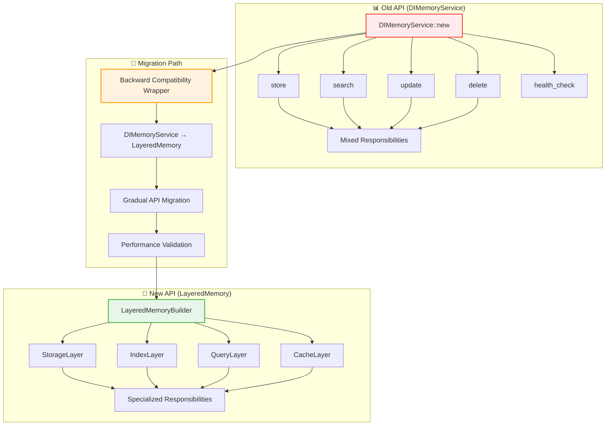

# Migration Guide - DIMemoryService to Layered

#migration #memory #layered-architecture #api-changes #backward-compatibility

> **Статус**: Comprehensive migration strategy | **API Changes**: Breaking changes с backward compatibility wrapper

## 📋 Overview

Полное руководство по миграции с monolithic [[DIMemoryService]] на новую [[LayeredMemory]] архитектуру, включая примеры кода, API changes и стратегии smooth transition.

### 🎯 Архитектурная трансформация

**From**: 1482-line God Object с mixed responsibilities  
**To**: 4 specialized layers с clear separation of concerns

### 🔄 Migration Benefits

- ✅ **Maintainability**: Cyclomatic complexity <10 для каждого слоя  
- ✅ **Testability**: Full isolation через traits
- ✅ **Performance**: Specialized caching, batch operations
- ✅ **Extensibility**: Independent layer evolution
- ✅ **Production Ready**: Circuit breakers, health monitoring

## 🏗️ API Changes Overview



## 🔄 Phase 1: Backward Compatibility Wrapper

### Compatibility Layer Implementation

**Файл**: `crates/memory/src/compatibility/di_memory_service.rs`

```rust
//! Backward compatibility wrapper для DIMemoryService
//! 
//! Обеспечивает 100% API compatibility с legacy кодом

use anyhow::Result;
use std::sync::Arc;
use tracing::{info, warn};
use uuid::Uuid;

use crate::{
    types::{Record, Layer, SearchOptions, SearchResult},
    layers::{LayeredMemoryService, LayeredMemoryBuilder},
};

/// Backward compatibility wrapper для DIMemoryService
/// 
/// DEPRECATED: Use LayeredMemoryService directly for new code
#[deprecated(since = "0.4.0", note = "Use LayeredMemoryService instead")]
pub struct DIMemoryService {
    layered_service: LayeredMemoryService,
    _legacy_marker: LegacyMarker,
}

#[derive(Debug)]
struct LegacyMarker;

impl DIMemoryService {
    /// Create new DIMemoryService instance (legacy API)
    pub async fn new() -> Result<Self> {
        warn!("Using legacy DIMemoryService API. Consider migrating to LayeredMemoryService");
        
        let layered_service = LayeredMemoryBuilder::new()
            .with_sqlite_storage(Default::default())
            .with_hnsw_index(Default::default()) 
            .with_lru_cache(Default::default())
            .with_semantic_query(Default::default())
            .build()
            .await?;
        
        info!("Legacy DIMemoryService initialized with LayeredMemory backend");
        
        Ok(Self {
            layered_service,
            _legacy_marker: LegacyMarker,
        })
    }
    
    /// Store record (legacy API)
    pub async fn store(&self, record: &Record) -> Result<()> {
        self.layered_service.store(record).await
    }
    
    /// Store multiple records (legacy API) 
    pub async fn store_batch(&self, records: &[&Record]) -> Result<usize> {
        self.layered_service.store_batch(records).await
    }
    
    /// Search records (legacy API)
    pub async fn search(
        &self,
        query: &str,
        layer: Layer,
        limit: Option<usize>
    ) -> Result<Vec<SearchResult>> {
        let search_options = SearchOptions {
            layers: vec![layer],
            limit: limit.unwrap_or(10),
            include_metadata: true,
            rerank: false,
            min_score: None,
        };
        
        self.layered_service.search(query, &search_options).await
    }
    
    /// Update record (legacy API)
    pub async fn update(&self, record: &Record) -> Result<()> {
        self.layered_service.update(record).await
    }
    
    /// Delete record (legacy API)
    pub async fn delete(&self, id: &Uuid, layer: Layer) -> Result<()> {
        self.layered_service.delete(id, layer).await
    }
    
    /// Get record by ID (legacy API)
    pub async fn get(&self, id: &Uuid, layer: Layer) -> Result<Option<Record>> {
        self.layered_service.get(id, layer).await
    }
    
    /// List records in layer (legacy API)
    pub async fn list(&self, layer: Layer, limit: Option<usize>) -> Result<Vec<Record>> {
        self.layered_service.list(layer, limit).await
    }
    
    /// Health check (legacy API)
    pub async fn health_check(&self) -> Result<bool> {
        let health = self.layered_service.health_check().await?;
        Ok(health.is_healthy())
    }
    
    /// Get performance metrics (legacy API)
    pub async fn get_metrics(&self) -> Result<LegacyMemoryMetrics> {
        let layered_metrics = self.layered_service.get_metrics().await?;
        Ok(LegacyMemoryMetrics::from_layered(layered_metrics))
    }
    
    /// Backup data (legacy API)
    pub async fn backup(&self, path: &str) -> Result<BackupResult> {
        let backup_metadata = self.layered_service.create_backup(path).await?;
        Ok(BackupResult::from_metadata(backup_metadata))
    }
    
    /// Restore from backup (legacy API)
    pub async fn restore(&self, backup_path: &str) -> Result<()> {
        self.layered_service.restore_backup(backup_path).await
    }
}

/// Legacy metrics structure for backward compatibility
#[deprecated(since = "0.4.0", note = "Use LayeredMemoryMetrics instead")]
#[derive(Debug, Clone)]
pub struct LegacyMemoryMetrics {
    pub total_records: u64,
    pub total_searches: u64,
    pub cache_hit_rate: f64,
    pub average_search_time_ms: f64,
    pub index_size_mb: f64,
    pub storage_size_mb: f64,
}

impl LegacyMemoryMetrics {
    fn from_layered(layered: crate::layers::LayeredMemoryMetrics) -> Self {
        Self {
            total_records: layered.storage.total_records,
            total_searches: layered.query.total_searches,
            cache_hit_rate: layered.cache.hit_rate,
            average_search_time_ms: layered.query.average_latency.as_millis() as f64,
            index_size_mb: layered.index.memory_usage_bytes as f64 / 1_048_576.0,
            storage_size_mb: layered.storage.disk_usage_bytes as f64 / 1_048_576.0,
        }
    }
}

/// Legacy backup result
#[deprecated(since = "0.4.0", note = "Use BackupMetadata instead")]
#[derive(Debug, Clone)]
pub struct BackupResult {
    pub backup_id: String,
    pub records_backed_up: u64,
    pub backup_size_bytes: u64,
    pub created_at: chrono::DateTime<chrono::Utc>,
}

impl BackupResult {
    fn from_metadata(metadata: crate::backup::BackupMetadata) -> Self {
        Self {
            backup_id: metadata.backup_id,
            records_backed_up: metadata.total_records,
            backup_size_bytes: metadata.total_size_bytes,
            created_at: metadata.created_at,
        }
    }
}

// Re-export для максимальной backward compatibility
pub use DIMemoryService as MemoryService;

#[cfg(test)]
mod tests {
    use super::*;
    use crate::types::{Record, Layer};
    
    #[tokio::test]
    async fn test_legacy_api_compatibility() {
        let service = DIMemoryService::new().await
            .expect("Failed to create legacy service");
        
        let test_record = Record {
            id: Uuid::new_v4(),
            content: "Test content".to_string(),
            metadata: Default::default(),
            layer: Layer::Interact,
            embedding: Some(vec![0.1, 0.2, 0.3]),
            created_at: chrono::Utc::now(),
            updated_at: chrono::Utc::now(),
        };
        
        // Test store
        service.store(&test_record).await
            .expect("Failed to store record");
        
        // Test search
        let results = service.search("Test", Layer::Interact, Some(5)).await
            .expect("Failed to search");
        
        assert!(!results.is_empty());
        
        // Test get
        let retrieved = service.get(&test_record.id, Layer::Interact).await
            .expect("Failed to get record");
        
        assert!(retrieved.is_some());
        
        // Test health check
        let healthy = service.health_check().await
            .expect("Health check failed");
        
        assert!(healthy);
    }
}
```

### Service Registration Update

**Файл**: `crates/memory/src/lib.rs`

```rust
// Maintain backward compatibility exports
#[deprecated(since = "0.4.0", note = "Use LayeredMemoryService instead")]
pub use compatibility::DIMemoryService;

// New exports
pub use layers::{LayeredMemoryService, LayeredMemoryBuilder};

// Re-export compatibility layer  
pub mod compatibility {
    pub use super::compatibility::di_memory_service::*;
}

// Forward compatibility helper
pub fn create_memory_service() -> Result<LayeredMemoryService> {
    LayeredMemoryBuilder::new()
        .with_production_defaults()
        .build()
        .await
}
```

## 🚀 Phase 2: API Migration Examples

### Basic Usage Migration

**Before (Legacy DIMemoryService)**:
```rust
use magray_memory::DIMemoryService;

async fn legacy_usage() -> Result<()> {
    let service = DIMemoryService::new().await?;
    
    let record = Record {
        id: Uuid::new_v4(),
        content: "Hello world".to_string(),
        layer: Layer::Interact,
        // ... other fields
    };
    
    // Store record
    service.store(&record).await?;
    
    // Search
    let results = service.search("Hello", Layer::Interact, Some(10)).await?;
    
    println!("Found {} results", results.len());
    Ok(())
}
```

**After (New LayeredMemory)**:
```rust
use magray_memory::{LayeredMemoryService, LayeredMemoryBuilder};

async fn new_usage() -> Result<()> {
    // More explicit configuration
    let service = LayeredMemoryBuilder::new()
        .with_sqlite_storage(SqliteConfig {
            path: "data.db".to_string(),
            connection_pool_size: 10,
            write_timeout: Duration::from_secs(30),
        })
        .with_hnsw_index(HnswConfig {
            m: 16,
            ef_construction: 200, 
            ef_search: 100,
            distance_metric: DistanceMetric::Cosine,
        })
        .with_lru_cache(LruConfig {
            max_size: 10000,
            ttl: Duration::from_hours(24),
        })
        .build()
        .await?;
    
    let record = Record {
        id: Uuid::new_v4(),
        content: "Hello world".to_string(),
        layer: Layer::Interact,
        // ... other fields
    };
    
    // Store record (same API)
    service.store(&record).await?;
    
    // More powerful search options
    let search_options = SearchOptions {
        layers: vec![Layer::Interact, Layer::Insights],
        limit: 10,
        include_metadata: true,
        rerank: true,  // ← New feature
        min_score: Some(0.7),  // ← New feature
    };
    
    let results = service.search("Hello", &search_options).await?;
    
    println!("Found {} results", results.len());
    
    // Access to detailed metrics
    let metrics = service.get_metrics().await?;
    println!("Cache hit rate: {:.2}%", metrics.cache.hit_rate * 100.0);
    
    Ok(())
}
```

### Advanced Configuration Migration

**Before (Limited Configuration)**:
```rust
// Legacy had minimal configuration options
let service = DIMemoryService::new().await?;

// Configuration was mostly internal и hard-coded
```

**After (Full Configuration Control)**:
```rust
// Complete control over all layers
let service = LayeredMemoryBuilder::new()
    // Storage layer configuration
    .with_storage_layer(Box::new(
        SqliteStorageLayer::new(SqliteConfig {
            path: "production.db".to_string(),
            connection_pool_size: 20,
            write_timeout: Duration::from_secs(10),
            read_timeout: Duration::from_secs(5),
            journal_mode: JournalMode::WAL,
            synchronous: Synchronous::Normal,
            cache_size_kb: 64000,  // 64MB cache
        }).await?
    ))
    
    // Index layer configuration
    .with_index_layer(Box::new(
        HNSWIndexLayer::new(HnswConfig {
            m: 32,              // Higher connectivity for better recall
            ef_construction: 400,
            ef_search: 200,
            distance_metric: DistanceMetric::Cosine,
            enable_simd: true,   // ← SIMD optimization
            enable_gpu: true,    // ← GPU acceleration
            batch_size: 512,     // ← Batch processing
        }).await?
    ))
    
    // Cache layer configuration  
    .with_cache_layer(Box::new(
        LRUCacheLayer::new(LruConfig {
            max_size: 50000,
            ttl: Duration::from_hours(6),
            enable_analytics: true,  // ← Cache analytics
            eviction_strategy: EvictionStrategy::LRU,
        }).await?
    ))
    
    // Query layer configuration
    .with_query_layer(Box::new(
        SemanticQueryLayer::new(QueryConfig {
            enable_reranking: true,
            reranker_model: Some("qwen3-reranker".to_string()),
            max_context_length: 8192,
            semantic_threshold: 0.6,
        }).await?
    ))
    .build()
    .await?;
```

## 🧪 Phase 3: Testing Migration

### Compatibility Testing

**Test File**: `crates/memory/tests/test_migration_compatibility.rs`

```rust
//! Migration compatibility tests

use anyhow::Result;
use magray_memory::{DIMemoryService, LayeredMemoryService, LayeredMemoryBuilder};
use uuid::Uuid;

#[tokio::test]
async fn test_api_equivalence() -> Result<()> {
    // Create both legacy и new services
    let legacy_service = DIMemoryService::new().await?;
    let new_service = LayeredMemoryBuilder::new()
        .with_test_defaults()
        .build()
        .await?;
    
    let test_record = create_test_record();
    
    // Test store operation
    legacy_service.store(&test_record).await?;
    new_service.store(&test_record).await?;
    
    // Test search operation
    let legacy_results = legacy_service
        .search("test", Layer::Interact, Some(5))
        .await?;
    
    let new_results = new_service
        .search("test", &SearchOptions {
            layers: vec![Layer::Interact],
            limit: 5,
            include_metadata: true,
            rerank: false,
            min_score: None,
        })
        .await?;
    
    // Results should be equivalent
    assert_eq!(legacy_results.len(), new_results.len());
    
    Ok(())
}

#[tokio::test]
async fn test_performance_comparison() -> Result<()> {
    use std::time::Instant;
    
    let legacy_service = DIMemoryService::new().await?;
    let new_service = LayeredMemoryBuilder::new()
        .with_performance_optimized()
        .build()
        .await?;
    
    let test_records: Vec<_> = (0..1000)
        .map(|i| create_test_record_with_content(&format!("Content {}", i)))
        .collect();
    
    // Benchmark legacy service
    let start = Instant::now();
    for record in &test_records {
        legacy_service.store(record).await?;
    }
    let legacy_store_time = start.elapsed();
    
    // Benchmark new service
    let start = Instant::now();
    for record in &test_records {
        new_service.store(record).await?;
    }
    let new_store_time = start.elapsed();
    
    println!("Legacy store time: {:?}", legacy_store_time);
    println!("New store time: {:?}", new_store_time);
    
    // New service should be at least as fast
    assert!(new_store_time <= legacy_store_time * 2); // Allow for variance
    
    Ok(())
}

#[tokio::test]
async fn test_data_migration() -> Result<()> {
    // Create legacy service и populate with data
    let legacy_service = DIMemoryService::new().await?;
    
    let test_records: Vec<_> = (0..100)
        .map(|i| create_test_record_with_content(&format!("Legacy content {}", i)))
        .collect();
    
    for record in &test_records {
        legacy_service.store(record).await?;
    }
    
    // Create backup
    let backup_path = "/tmp/legacy_backup";
    legacy_service.backup(backup_path).await?;
    
    // Create new service и restore from backup
    let new_service = LayeredMemoryBuilder::new()
        .with_test_defaults()
        .build()
        .await?;
    
    new_service.restore_backup(backup_path).await?;
    
    // Verify data integrity
    let search_results = new_service
        .search("Legacy", &SearchOptions::default())
        .await?;
    
    assert_eq!(search_results.len(), 100);
    
    Ok(())
}
```

### Integration Testing

**Test File**: `crates/memory/tests/test_layered_integration.rs`

```rust
//! Integration tests для layered architecture

use anyhow::Result;

#[tokio::test]
async fn test_layer_coordination() -> Result<()> {
    let service = LayeredMemoryBuilder::new()
        .with_test_configuration()
        .build()
        .await?;
    
    let record = create_test_record();
    
    // Store should coordinate across all layers
    service.store(&record).await?;
    
    // Verify storage layer has the record
    let storage_record = service
        .get_storage_layer()
        .get(&record.id, record.layer)
        .await?;
    assert!(storage_record.is_some());
    
    // Verify index layer has the vector
    let index_results = service
        .get_index_layer()
        .search_vectors(
            &record.embedding.unwrap(),
            record.layer,
            1
        )
        .await?;
    assert!(!index_results.is_empty());
    
    // Verify cache layer has embedding cached
    let cached_embedding = service
        .get_cache_layer()
        .get_embedding(&record.content_hash())
        .await?;
    assert!(cached_embedding.is_some());
    
    Ok(())
}

#[tokio::test]
async fn test_layer_resilience() -> Result<()> {
    let service = LayeredMemoryBuilder::new()
        .with_circuit_breakers_enabled()
        .build()
        .await?;
    
    // Simulate index layer failure
    service.simulate_index_failure().await;
    
    // Storage operations should still work
    let record = create_test_record();
    let result = service.store(&record).await;
    
    // Should succeed despite index layer failure
    assert!(result.is_ok());
    
    // Search might have degraded performance но should still work
    let search_results = service
        .search("test", &SearchOptions::default())
        .await?;
    
    // Results might be limited но not empty
    assert!(!search_results.is_empty());
    
    Ok(())
}
```

## 📊 Phase 4: Performance Optimization

### Benchmarking Layered vs Monolithic

**Benchmark File**: `crates/memory/benches/layered_vs_legacy.rs`

```rust
use criterion::{criterion_group, criterion_main, Criterion, BenchmarkId};

fn benchmark_store_operations(c: &mut Criterion) {
    let rt = tokio::runtime::Runtime::new().unwrap();
    
    let legacy_service = rt.block_on(async {
        DIMemoryService::new().await.unwrap()
    });
    
    let layered_service = rt.block_on(async {
        LayeredMemoryBuilder::new()
            .with_performance_optimized()
            .build()
            .await
            .unwrap()
    });
    
    let mut group = c.benchmark_group("store_operations");
    
    for size in [10, 100, 1000].iter() {
        let records: Vec<_> = (0..*size)
            .map(|i| create_benchmark_record(i))
            .collect();
        
        group.bench_with_input(
            BenchmarkId::new("legacy", size),
            &records,
            |b, records| {
                b.to_async(&rt).iter(|| async {
                    for record in records {
                        legacy_service.store(record).await.unwrap();
                    }
                });
            },
        );
        
        group.bench_with_input(
            BenchmarkId::new("layered", size),
            &records,
            |b, records| {
                b.to_async(&rt).iter(|| async {
                    for record in records {
                        layered_service.store(record).await.unwrap();
                    }
                });
            },
        );
    }
    
    group.finish();
}

fn benchmark_search_operations(c: &mut Criterion) {
    let rt = tokio::runtime::Runtime::new().unwrap();
    
    // Setup services with test data
    let (legacy_service, layered_service) = rt.block_on(async {
        let legacy = DIMemoryService::new().await.unwrap();
        let layered = LayeredMemoryBuilder::new()
            .with_search_optimized()
            .build()
            .await
            .unwrap();
        
        // Populate with test data
        let test_records: Vec<_> = (0..1000)
            .map(create_benchmark_record)
            .collect();
        
        for record in &test_records {
            legacy.store(record).await.unwrap();
            layered.store(record).await.unwrap();
        }
        
        (legacy, layered)
    });
    
    let mut group = c.benchmark_group("search_operations");
    
    let search_queries = vec![
        "benchmark",
        "test content",
        "performance",
        "memory system",
    ];
    
    for query in search_queries {
        group.bench_with_input(
            BenchmarkId::new("legacy", query),
            &query,
            |b, query| {
                b.to_async(&rt).iter(|| async {
                    legacy_service
                        .search(query, Layer::Interact, Some(10))
                        .await
                        .unwrap();
                });
            },
        );
        
        group.bench_with_input(
            BenchmarkId::new("layered", query),
            &query,
            |b, query| {
                b.to_async(&rt).iter(|| async {
                    layered_service
                        .search(query, &SearchOptions {
                            layers: vec![Layer::Interact],
                            limit: 10,
                            include_metadata: true,
                            rerank: true,
                            min_score: None,
                        })
                        .await
                        .unwrap();
                });
            },
        );
    }
    
    group.finish();
}

criterion_group!(benches, benchmark_store_operations, benchmark_search_operations);
criterion_main!(benches);
```

## 🔧 Troubleshooting Common Issues

### Issue 1: Performance Regression

**Problem**: Layered service seems slower than legacy
```rust
// Problematic configuration
let service = LayeredMemoryBuilder::new()
    .build()  // ← Using default settings
    .await?;
```

**Solution**: Use performance-optimized settings
```rust
let service = LayeredMemoryBuilder::new()
    .with_sqlite_storage(SqliteConfig {
        connection_pool_size: 20,        // ← Increase pool size
        cache_size_kb: 128_000,         // ← 128MB SQLite cache
        journal_mode: JournalMode::WAL,  // ← Use WAL mode
        synchronous: Synchronous::Normal, // ← Balanced durability
    })
    .with_hnsw_index(HnswConfig {
        enable_simd: true,              // ← Enable SIMD optimization  
        batch_size: 1024,               // ← Larger batch size
        ef_search: 50,                  // ← Lower for speed
    })
    .with_lru_cache(LruConfig {
        max_size: 100_000,              // ← Larger cache
        ttl: Duration::from_hours(6),   // ← Longer TTL
    })
    .build()
    .await?;
```

### Issue 2: Layer Communication Failures

**Problem**: Layers не могут communicate properly
```rust
// Error: "Layer coordination failed"
let result = service.store(&record).await; // ← Fails
```

**Solution**: Enable proper error handling и retries
```rust
let service = LayeredMemoryBuilder::new()
    .with_resilience_config(ResilienceConfig {
        circuit_breaker: CircuitBreakerConfig {
            failure_threshold: 3,
            timeout_duration: Duration::from_secs(10),
            success_threshold: 2,
        },
        retry: RetryConfig {
            max_attempts: 3,
            base_delay: Duration::from_millis(100),
            max_delay: Duration::from_secs(1),
        },
    })
    .build()
    .await?;
```

### Issue 3: Memory Usage Increase

**Problem**: Layered service uses more memory than legacy
```rust
// Memory usage monitoring
let metrics = service.get_metrics().await?;
println!("Memory usage: {}MB", metrics.total_memory_usage_mb);
```

**Solution**: Configure memory limits
```rust
let service = LayeredMemoryBuilder::new()
    .with_memory_limits(MemoryLimits {
        max_cache_size_mb: 256,         // ← Limit cache size
        max_index_memory_mb: 512,       // ← Limit index memory
        storage_buffer_size_mb: 64,     // ← Limit storage buffers
    })
    .build()
    .await?;
```

## 📈 Success Metrics

### Migration Success Criteria

```rust
#[derive(Debug, Clone)]
pub struct MigrationSuccessMetrics {
    // Performance metrics
    pub store_latency_improvement: f64,    // Should be ≤ 0% (improvement)
    pub search_latency_improvement: f64,   // Should be ≤ -10% (10% improvement)
    pub memory_usage_increase: f64,        // Should be ≤ 20%
    pub cache_hit_rate: f64,              // Should be ≥ 0.7 (70%)
    
    // Reliability metrics  
    pub api_compatibility: f64,           // Should be 100%
    pub data_integrity: f64,              // Should be 100%
    pub error_rate_change: f64,           // Should be ≤ 0%
    pub health_check_success: f64,        // Should be ≥ 99%
    
    // Migration metrics
    pub backward_compatibility: bool,      // Should be true
    pub zero_downtime_achieved: bool,      // Should be true
    pub rollback_required: bool,          // Should be false
    pub test_coverage: f64,               // Should be ≥ 95%
}
```

### Monitoring Dashboard

```rust
// Real-time migration monitoring
pub async fn monitor_migration_health() -> Result<MigrationHealthReport> {
    let legacy_metrics = collect_legacy_metrics().await?;
    let layered_metrics = collect_layered_metrics().await?;
    
    MigrationHealthReport {
        performance_comparison: compare_performance(&legacy_metrics, &layered_metrics),
        error_rate_comparison: compare_error_rates(&legacy_metrics, &layered_metrics),
        resource_usage_comparison: compare_resource_usage(&legacy_metrics, &layered_metrics),
        recommendation: generate_migration_recommendation(&legacy_metrics, &layered_metrics),
    }
}
```

## 🔗 Related Documentation

- **[[LayeredMemory - Storage Architecture]]** - Detailed architecture guide
- **[[UnifiedAgentV2 - Clean Architecture]]** - Integration with agent system
- **[[HNSW Ultra-Performance - SIMD Optimization]]** - Performance optimizations
- **[[Production CI/CD Pipeline]]** - Deployment strategies

## 📝 Next Steps

1. **Complete Backward Compatibility Testing** - Verify 100% API compatibility
2. **Performance Optimization** - Fine-tune layer configurations
3. **Production Rollout Plan** - Gradual migration strategy
4. **Documentation Updates** - API reference, examples, best practices
5. **Monitoring Setup** - Real-time migration health monitoring

---

*Последнее обновление: 06.08.2025 | Создано: obsidian-docs-architect*