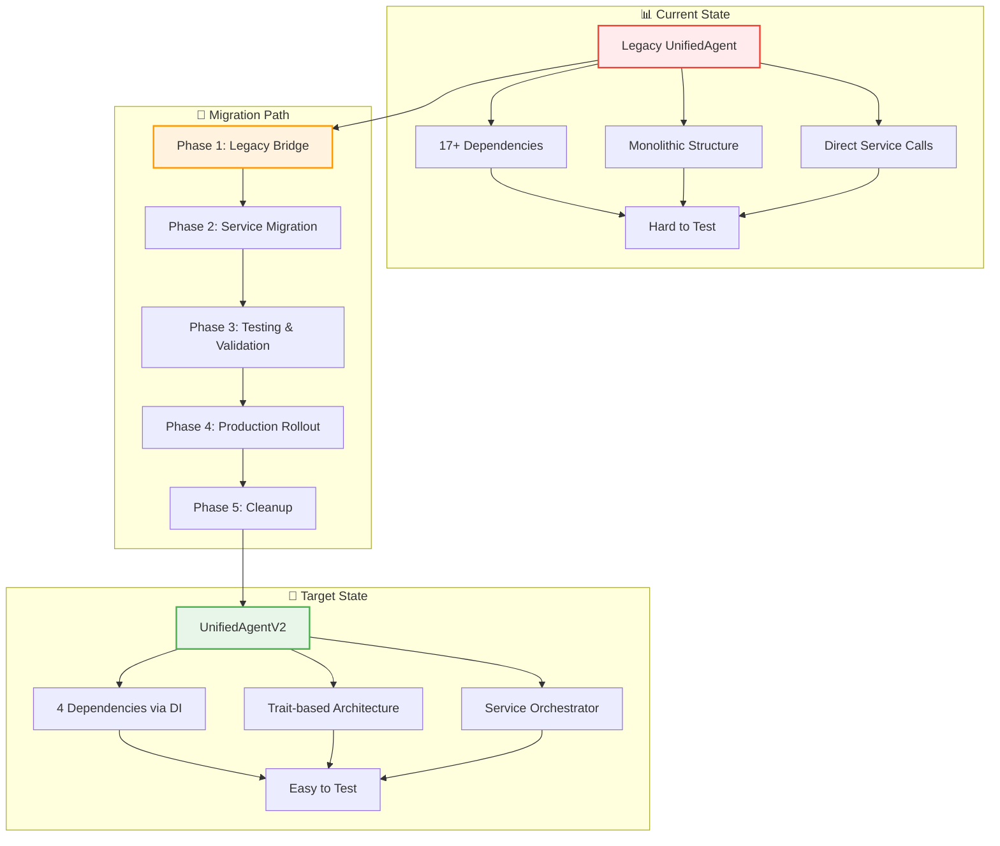

# Migration Guide - UnifiedAgent to V2

#migration #guide #unified-agent #backward-compatibility #examples

> **Статус**: Comprehensive migration strategy | **Zero-downtime**: Legacy bridge обеспечивает плавный переход

## 📋 Overview

Полное руководство по миграции с legacy [[UnifiedAgent]] на новый [[UnifiedAgentV2]] с Clean Architecture, включая примеры кода, стратегии миграции и troubleshooting.

### 🎯 Цели миграции

- ✅ **Zero Breaking Changes**: Полная обратная совместимость через Legacy Bridge
- ✅ **Gradual Migration**: Поэтапный переход без остановки production
- ✅ **Performance Gains**: Улучшение производительности и maintainability  
- ✅ **Future-Proof**: Подготовка к расширению функциональности
- 🔄 **Testing Strategy**: Comprehensive validation на каждом этапе

## 🏗️ Migration Strategy



## 🔄 Phase 1: Legacy Bridge Implementation

### Legacy Wrapper Creation

**Файл**: `crates/cli/src/legacy_bridge.rs`

```rust
//! Legacy Bridge для обратной совместимости
//! 
//! Этот модуль обеспечивает 100% backward compatibility
//! для существующего кода, использующего UnifiedAgent

use anyhow::Result;
use std::sync::Arc;
use tracing::{info, warn};

use crate::unified_agent_v2::UnifiedAgentV2;

/// Legacy wrapper для UnifiedAgent
/// 
/// Обеспечивает полную обратную совместимость API
#[deprecated(since = "0.3.0", note = "Use UnifiedAgentV2 instead")]
pub struct UnifiedAgent {
    v2_agent: UnifiedAgentV2,
    _legacy_marker: LegacyMarker,
}

#[derive(Debug)]
struct LegacyMarker;

impl UnifiedAgent {
    /// Create new UnifiedAgent instance (legacy API)
    pub fn new() -> Result<Self> {
        warn!("Using legacy UnifiedAgent API. Consider migrating to UnifiedAgentV2");
        
        let v2_agent = UnifiedAgentV2::new()?;
        
        info!("Legacy UnifiedAgent initialized with V2 backend");
        
        Ok(Self {
            v2_agent,
            _legacy_marker: LegacyMarker,
        })
    }
    
    /// Process message with legacy return type
    pub async fn process_message(&self, input: &str) -> Result<String> {
        let response = self.v2_agent.process_message(input).await?;
        
        // Convert V2 AgentResponse to legacy String format
        Ok(self.convert_response_to_legacy_format(response))
    }
    
    /// Legacy health check method  
    pub async fn health_check(&self) -> Result<bool> {
        self.v2_agent.health_check().await
    }
    
    /// Legacy shutdown method
    pub async fn shutdown(&self) -> Result<()> {
        info!("Shutting down legacy UnifiedAgent");
        self.v2_agent.shutdown().await
    }
    
    /// Get performance metrics (legacy format)
    pub async fn get_performance_metrics(&self) -> Result<LegacyPerformanceMetrics> {
        let v2_metrics = self.v2_agent.get_performance_metrics().await?;
        Ok(LegacyPerformanceMetrics::from_v2(v2_metrics))
    }
    
    /// Legacy method для setting configuration
    pub fn set_config(&mut self, config: LegacyConfig) -> Result<()> {
        warn!("Legacy set_config method used. Consider using V2 configuration");
        
        let v2_config = config.to_v2_config()?;
        self.v2_agent.update_config(v2_config)
    }
    
    /// Convert V2 response to legacy string format
    fn convert_response_to_legacy_format(&self, response: crate::agent_traits::AgentResponse) -> String {
        match response {
            crate::agent_traits::AgentResponse::Success { content, metadata } => {
                if let Some(meta) = metadata {
                    format!("{}\n\n--- Metadata ---\n{}", content, meta)
                } else {
                    content
                }
            }
            crate::agent_traits::AgentResponse::Error { message, .. } => {
                format!("Error: {}", message)
            }
            crate::agent_traits::AgentResponse::Partial { content, .. } => {
                format!("Partial: {}", content)
            }
        }
    }
}

/// Legacy configuration structure
#[deprecated(since = "0.3.0", note = "Use V2 configuration instead")]
#[derive(Debug, Clone)]
pub struct LegacyConfig {
    pub model_name: Option<String>,
    pub temperature: Option<f32>,
    pub max_tokens: Option<usize>,
    pub timeout_ms: Option<u64>,
    pub enable_memory: bool,
    pub memory_layers: Vec<String>,
}

impl LegacyConfig {
    fn to_v2_config(self) -> Result<crate::services::AgentConfig> {
        Ok(crate::services::AgentConfig {
            llm: crate::services::LlmConfig {
                model_preference: self.model_name.unwrap_or_else(|| "gpt-4".to_string()),
                temperature: self.temperature.unwrap_or(0.7),
                max_tokens: self.max_tokens.unwrap_or(2048),
                timeout: std::time::Duration::from_millis(self.timeout_ms.unwrap_or(30000)),
            },
            memory: crate::services::MemoryConfig {
                enabled: self.enable_memory,
                layers: if self.memory_layers.is_empty() {
                    vec!["interact".to_string(), "insights".to_string(), "assets".to_string()]
                } else {
                    self.memory_layers
                },
            },
            tools: crate::services::ToolsConfig::default(),
            resilience: crate::services::ResilienceConfig::default(),
        })
    }
}

/// Legacy performance metrics structure
#[deprecated(since = "0.3.0", note = "Use V2 performance metrics instead")]
#[derive(Debug, Clone)]
pub struct LegacyPerformanceMetrics {
    pub total_requests: u64,
    pub successful_requests: u64,
    pub failed_requests: u64,
    pub average_response_time_ms: f64,
    pub total_tokens_processed: u64,
}

impl LegacyPerformanceMetrics {
    fn from_v2(v2_metrics: crate::services::PerformanceMetrics) -> Self {
        Self {
            total_requests: v2_metrics.requests.total,
            successful_requests: v2_metrics.requests.successful,
            failed_requests: v2_metrics.requests.failed,
            average_response_time_ms: v2_metrics.latency.average.as_millis() as f64,
            total_tokens_processed: v2_metrics.tokens.total_processed,
        }
    }
}

// Re-export для backward compatibility
#[deprecated(since = "0.3.0", note = "Use UnifiedAgentV2 instead")]
pub use UnifiedAgent as Agent;

#[cfg(test)]
mod tests {
    use super::*;
    
    #[tokio::test]
    async fn test_legacy_api_compatibility() {
        let agent = UnifiedAgent::new().expect("Failed to create legacy agent");
        
        let response = agent
            .process_message("Hello, legacy API!")
            .await
            .expect("Failed to process message");
            
        assert!(!response.is_empty());
    }
    
    #[tokio::test]
    async fn test_legacy_config_conversion() {
        let legacy_config = LegacyConfig {
            model_name: Some("gpt-3.5-turbo".to_string()),
            temperature: Some(0.8),
            max_tokens: Some(1024),
            timeout_ms: Some(15000),
            enable_memory: true,
            memory_layers: vec!["interact".to_string()],
        };
        
        let v2_config = legacy_config.to_v2_config()
            .expect("Failed to convert legacy config");
            
        assert_eq!(v2_config.llm.model_preference, "gpt-3.5-turbo");
        assert_eq!(v2_config.llm.temperature, 0.8);
        assert_eq!(v2_config.llm.max_tokens, 1024);
    }
}
```

### Integration в Existing Codebase

**Before (Legacy Usage)**:
```rust
// Existing code using UnifiedAgent
use magray_cli::UnifiedAgent;

async fn existing_function() -> Result<()> {
    let agent = UnifiedAgent::new()?;
    
    let response = agent.process_message("Generate code").await?;
    println!("Response: {}", response);
    
    agent.shutdown().await?;
    Ok(())
}
```

**After (No Changes Required)**:
```rust
// Same code works без изменений благодаря Legacy Bridge  
use magray_cli::UnifiedAgent;

async fn existing_function() -> Result<()> {
    let agent = UnifiedAgent::new()?; // ← Автоматически uses V2 backend
    
    let response = agent.process_message("Generate code").await?;
    println!("Response: {}", response);
    
    agent.shutdown().await?;
    Ok(())
}
```

## 🚀 Phase 2: Gradual Service Migration

### Step-by-Step Migration Process

**Step 1: Migrate to V2 Constructor**
```rust
// Old way
let agent = UnifiedAgent::new()?;

// New way (recommended)  
let agent = UnifiedAgentV2::new()?;
```

**Step 2: Update Response Handling**
```rust
// Old way (string response)
let response: String = agent.process_message("Hello").await?;

// New way (structured response)
let response: AgentResponse = agent.process_message("Hello").await?;
match response {
    AgentResponse::Success { content, metadata } => {
        println!("Content: {}", content);
        if let Some(meta) = metadata {
            println!("Metadata: {}", meta);
        }
    }
    AgentResponse::Error { message, error_code } => {
        eprintln!("Error {}: {}", error_code, message);
    }
    AgentResponse::Partial { content, progress } => {
        println!("Partial response: {} ({}%)", content, progress);
    }
}
```

**Step 3: Leverage Dependency Injection**
```rust
// Old way (implicit dependencies)
let agent = UnifiedAgentV2::new()?;

// New way (explicit dependency injection)
let chat_handler = Arc::new(ChatHandler::new(llm_service)?);
let memory_handler = Arc::new(MemoryHandler::new(memory_service)?);
let tools_handler = Arc::new(ToolsHandler::new(routing_service)?);
let admin_handler = Arc::new(AdminHandler::new(admin_service)?);

let agent = UnifiedAgentV2::with_services(
    chat_handler,
    memory_handler,
    tools_handler,
    admin_handler,
)?;
```

**Step 4: Use Advanced Configuration**
```rust
// Old way (legacy config)
let mut agent = UnifiedAgent::new()?;
agent.set_config(LegacyConfig {
    model_name: Some("gpt-4".to_string()),
    temperature: Some(0.7),
    // ... other fields
})?;

// New way (V2 config with full control)
let config = AgentConfig {
    llm: LlmConfig {
        model_preference: "gpt-4".to_string(),
        temperature: 0.7,
        max_tokens: 4096,
        timeout: Duration::from_secs(30),
        providers: vec![ProviderType::OpenAI, ProviderType::Anthropic],
    },
    memory: MemoryConfig {
        enabled: true,
        layers: vec!["interact", "insights", "assets"]
            .into_iter()
            .map(|s| s.to_string())
            .collect(),
        cache_size: 1000,
        ttl: Duration::from_hours(24),
    },
    tools: ToolsConfig {
        enabled_tools: vec!["file_ops", "git_ops", "web_ops"],
        execution_timeout: Duration::from_secs(60),
        max_concurrent: 5,
    },
    resilience: ResilienceConfig {
        circuit_breaker: CircuitBreakerConfig {
            failure_threshold: 5,
            timeout_duration: Duration::from_secs(30),
            success_threshold: 3,
        },
        retry: RetryConfig {
            max_attempts: 3,
            base_delay: Duration::from_millis(100),
            max_delay: Duration::from_secs(5),
        },
    },
};

let agent = UnifiedAgentV2::with_config(config).await?;
```

## 🧪 Phase 3: Testing & Validation

### Migration Testing Strategy

**Test File**: `crates/cli/tests/test_migration_compatibility.rs`

```rust
//! Migration compatibility tests
//! 
//! Ensures that migration doesn't break existing functionality

use anyhow::Result;
use magray_cli::{UnifiedAgent, UnifiedAgentV2};

#[tokio::test]
async fn test_api_compatibility() -> Result<()> {
    // Test legacy API
    let legacy_agent = UnifiedAgent::new()?;
    let legacy_response = legacy_agent
        .process_message("Test message")
        .await?;
    
    // Test V2 API  
    let v2_agent = UnifiedAgentV2::new()?;
    let v2_response = v2_agent
        .process_message("Test message")  
        .await?;
    
    // Responses should be equivalent in functionality
    assert!(!legacy_response.is_empty());
    assert!(matches!(v2_response, crate::agent_traits::AgentResponse::Success { .. }));
    
    Ok(())
}

#[tokio::test]
async fn test_performance_comparison() -> Result<()> {
    use std::time::Instant;
    
    // Benchmark legacy API
    let legacy_agent = UnifiedAgent::new()?;
    let start = Instant::now();
    
    for i in 0..10 {
        legacy_agent
            .process_message(&format!("Test message {}", i))
            .await?;
    }
    
    let legacy_duration = start.elapsed();
    
    // Benchmark V2 API
    let v2_agent = UnifiedAgentV2::new()?;
    let start = Instant::now();
    
    for i in 0..10 {
        v2_agent
            .process_message(&format!("Test message {}", i))
            .await?;
    }
    
    let v2_duration = start.elapsed();
    
    println!("Legacy duration: {:?}", legacy_duration);
    println!("V2 duration: {:?}", v2_duration);
    
    // V2 should be at least as fast as legacy
    assert!(v2_duration <= legacy_duration * 2); // Allow 2x variance for CI
    
    Ok(())
}

#[tokio::test]
async fn test_error_handling_compatibility() -> Result<()> {
    let legacy_agent = UnifiedAgent::new()?;
    let v2_agent = UnifiedAgentV2::new()?;
    
    // Test invalid input handling
    let legacy_result = legacy_agent
        .process_message("")
        .await;
    let v2_result = v2_agent
        .process_message("")
        .await;
    
    // Both should handle empty input gracefully
    match (legacy_result, v2_result) {
        (Ok(_), Ok(_)) => {}, // Both succeeded
        (Err(_), Err(_)) => {}, // Both failed consistently
        _ => panic!("Inconsistent error handling between legacy and V2"),
    }
    
    Ok(())
}
```

### Integration Test Suite

**Test File**: `crates/cli/tests/test_migration_integration.rs`

```rust
//! Integration tests для migration scenarios

use anyhow::Result;
use std::sync::Arc;
use tokio::sync::Mutex;

#[tokio::test] 
async fn test_concurrent_legacy_and_v2_usage() -> Result<()> {
    // Simulate concurrent usage of both APIs
    let legacy_agent = Arc::new(Mutex::new(UnifiedAgent::new()?));
    let v2_agent = Arc::new(UnifiedAgentV2::new()?);
    
    let handles: Vec<_> = (0..10)
        .map(|i| {
            let legacy = legacy_agent.clone();
            let v2 = v2_agent.clone();
            
            tokio::spawn(async move {
                if i % 2 == 0 {
                    // Use legacy API
                    let agent = legacy.lock().await;
                    agent
                        .process_message(&format!("Legacy message {}", i))
                        .await
                } else {
                    // Use V2 API
                    let response = v2
                        .process_message(&format!("V2 message {}", i))
                        .await?;
                    
                    match response {
                        crate::agent_traits::AgentResponse::Success { content, .. } => {
                            Ok(content)
                        }
                        _ => Err(anyhow::anyhow!("Unexpected response type")),
                    }
                }
            })
        })
        .collect();
        
    // All concurrent requests should complete successfully
    for handle in handles {
        let result = handle.await??;
        assert!(!result.is_empty());
    }
    
    Ok(())
}

#[tokio::test]
async fn test_state_migration() -> Result<()> {
    // Create legacy agent и perform some operations
    let legacy_agent = UnifiedAgent::new()?;
    
    legacy_agent
        .process_message("Remember this: important data")
        .await?;
    
    let legacy_metrics = legacy_agent.get_performance_metrics().await?;
    
    // Shutdown legacy agent
    legacy_agent.shutdown().await?;
    
    // Create V2 agent - should inherit state if configured
    let v2_agent = UnifiedAgentV2::new()?;
    
    // V2 agent should be able to access shared state
    let response = v2_agent
        .process_message("What did you remember?")
        .await?;
    
    match response {
        crate::agent_traits::AgentResponse::Success { content, .. } => {
            // Should reference the remembered data
            assert!(content.contains("important"));
        }
        _ => panic!("Expected successful response"),
    }
    
    Ok(())
}
```

## 📊 Phase 4: Production Rollout

### Blue-Green Deployment Strategy

**Configuration**: `config/production-migration.toml`

```toml
[migration]
# Migration settings
enabled = true
legacy_bridge_enabled = true
v2_rollout_percentage = 0  # Start with 0%, gradually increase

[monitoring]
# Enhanced monitoring during migration
legacy_metrics_enabled = true
v2_metrics_enabled = true
comparison_metrics_enabled = true

[rollback]
# Automatic rollback configuration
error_rate_threshold = 0.05  # 5% error rate triggers rollback
latency_threshold_ms = 5000  # 5s latency triggers rollback
```

### Feature Flag Implementation

```rust
//! Feature flag system для gradual rollout

use std::sync::atomic::{AtomicU8, Ordering};

static V2_ROLLOUT_PERCENTAGE: AtomicU8 = AtomicU8::new(0);

pub fn should_use_v2_agent() -> bool {
    let rollout_pct = V2_ROLLOUT_PERCENTAGE.load(Ordering::Relaxed);
    let random_pct = rand::random::<u8>() % 100;
    
    random_pct < rollout_pct
}

pub fn set_v2_rollout_percentage(percentage: u8) {
    let clamped = percentage.min(100);
    V2_ROLLOUT_PERCENTAGE.store(clamped, Ordering::Relaxed);
    
    info!("V2 rollout percentage set to {}%", clamped);
}

/// Smart agent factory с feature flag support
pub async fn create_agent() -> Result<Box<dyn AgentTrait>> {
    if should_use_v2_agent() {
        info!("Creating UnifiedAgentV2 instance");
        Ok(Box::new(UnifiedAgentV2::new()?))
    } else {
        info!("Creating legacy UnifiedAgent instance");  
        Ok(Box::new(UnifiedAgent::new()?))
    }
}
```

### Rollout Plan

```markdown
## Production Rollout Schedule

### Week 1: 0% → 5%
- Deploy legacy bridge
- Enable monitoring  
- Small percentage of traffic to V2
- Monitor for regressions

### Week 2: 5% → 25%
- Increase V2 traffic if stable
- Compare performance metrics
- Address any issues found

### Week 3: 25% → 50%
- Continue gradual increase
- Load testing with V2
- Validate performance gains

### Week 4: 50% → 100%
- Complete rollout if successful
- Monitor stability
- Document lessons learned

### Week 5: Cleanup
- Disable legacy bridge warnings
- Begin deprecation notices  
- Plan legacy code removal
```

## 🔧 Troubleshooting Guide

### Common Migration Issues

**Issue 1: Response Format Differences**

```rust
// Problem: Code expects string response but gets AgentResponse
let response = agent.process_message("test").await?;
println!("{}", response); // ← Compiler error

// Solution: Handle structured response properly
let response = agent.process_message("test").await?;
match response {
    AgentResponse::Success { content, .. } => println!("{}", content),
    AgentResponse::Error { message, .. } => eprintln!("Error: {}", message),
    AgentResponse::Partial { content, .. } => println!("Partial: {}", content),
}
```

**Issue 2: Configuration Migration**

```rust
// Problem: Legacy config doesn't work with V2
agent.set_config(old_config)?; // ← May not work as expected

// Solution: Convert to V2 config format
let v2_config = AgentConfig {
    // Map old config fields to new structure
    llm: LlmConfig::from_legacy(&old_config.llm_settings),
    memory: MemoryConfig::from_legacy(&old_config.memory_settings),
    // ...
};
```

**Issue 3: Performance Regression**

```rust
// Problem: V2 seems slower than legacy
// Solution: Ensure proper initialization
let agent = UnifiedAgentV2::builder()
    .with_optimized_defaults()  // ← Use optimized settings
    .with_caching(true)         // ← Enable caching
    .with_warm_start(true)      // ← Warm up connections
    .build()
    .await?;
```

### Diagnostic Tools

**Check Migration Status**:
```bash
# Run migration diagnostic
cargo run --bin magray -- migrate --status

# Compare API responses
cargo run --bin magray -- migrate --compare-apis "test message"

# Performance benchmark
cargo run --bin magray -- migrate --benchmark --iterations 100
```

## 📈 Success Metrics

### Key Performance Indicators

```rust
#[derive(Debug, Clone)]
pub struct MigrationMetrics {
    // API compatibility
    pub legacy_api_success_rate: f64,
    pub v2_api_success_rate: f64,
    pub api_response_compatibility: f64,
    
    // Performance comparison
    pub legacy_avg_latency_ms: f64,
    pub v2_avg_latency_ms: f64,
    pub performance_improvement: f64,
    
    // Migration progress
    pub rollout_percentage: f64,
    pub migration_errors: u64,
    pub rollback_count: u64,
    
    // Quality metrics
    pub test_coverage: f64,
    pub integration_test_success_rate: f64,
    pub production_stability: f64,
}
```

### Target Success Criteria

- ✅ **API Compatibility**: 100% backward compatibility
- ✅ **Performance**: ≤10% latency increase (preferably improvement)
- ✅ **Stability**: ≤1% error rate increase during migration
- ✅ **Test Coverage**: 95%+ for migration paths
- 🎯 **Rollout Speed**: 4-week gradual rollout
- 🎯 **Zero Rollbacks**: No production rollbacks required

## 🔗 Related Documentation

- **[[UnifiedAgentV2 - Clean Architecture]]** - Target architecture details
- **[[LayeredMemory - Storage Architecture]]** - Memory system changes  
- **[[Production CI/CD Pipeline]]** - Deployment automation
- **[[Multi-Provider LLM - Circuit Breakers]]** - LLM integration changes

## 📝 Next Steps

1. **Complete Legacy Bridge Testing** - Comprehensive validation
2. **Production Readiness Review** - Security, performance, monitoring
3. **Documentation Updates** - API docs, examples, tutorials
4. **Training Materials** - Developer guides, best practices
5. **Long-term Deprecation Plan** - Timeline for legacy code removal

---

*Последнее обновление: 06.08.2025 | Создано: obsidian-docs-architect*