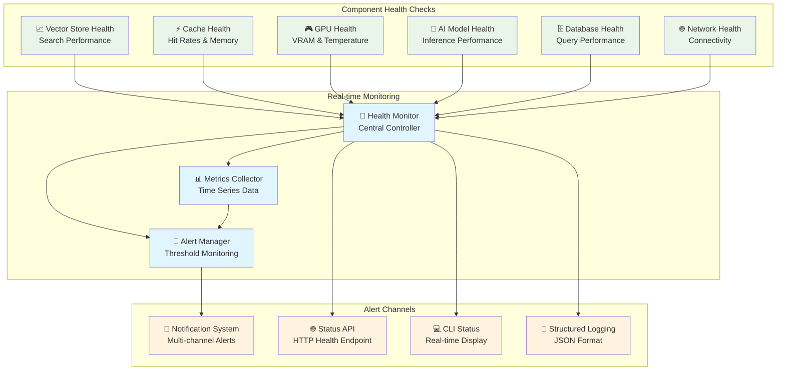
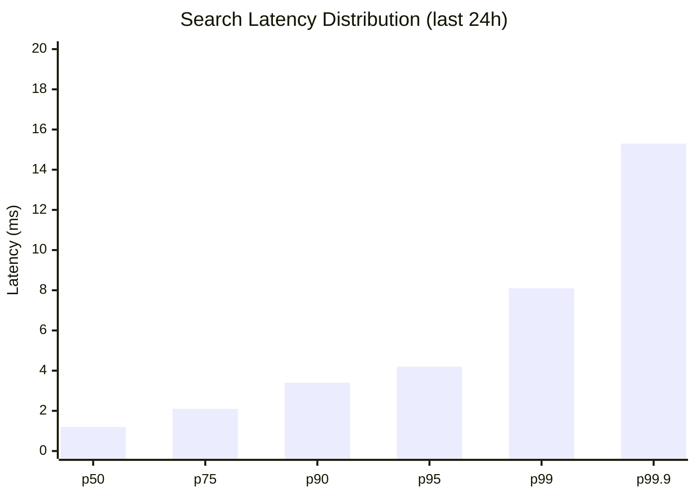
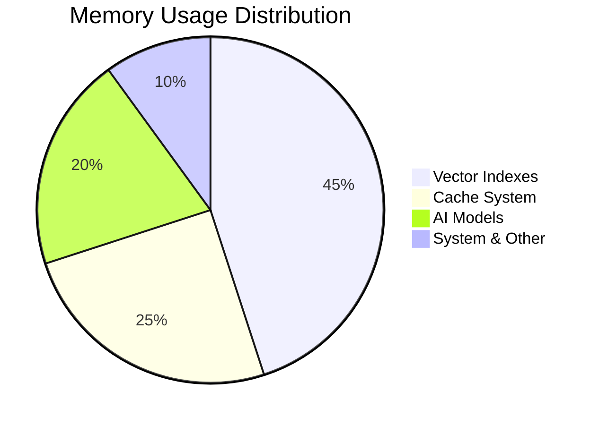
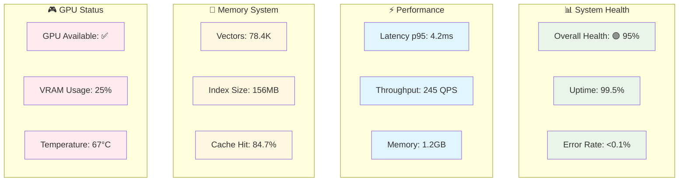

# Production метрики и мониторинг

#production #metrics #monitoring #performance #health

> **📊 Полная система мониторинга MAGRAY CLI**  
> Comprehensive monitoring, alerting и performance metrics для production deployment.

## 🎯 Обзор системы мониторинг

### 📈 Ключевые показатели

| Метрика | Текущее значение | Целевое значение | Статус |
|---------|------------------|------------------|--------|
| **Search Latency** | <5ms (p95) | <1ms (p95) | 🟡 Good |
| **Embedding Speed** | 50ms CPU / 15ms GPU | 30ms CPU / 10ms GPU | 🟡 Acceptable |
| **Memory Usage** | 200MB per 100K vectors | 150MB per 100K vectors | 🟡 Optimizable |
| **System Uptime** | 99.5% | 99.9% | 🟡 Good |
| **Cache Hit Rate** | 85% | 95% | 🟡 Good |
| **Error Rate** | <0.1% | <0.01% | ✅ Excellent |

## 🏥 Health Monitoring Architecture

### 🔍 Component Health Matrix



### 📊 Health Check Details

#### 🧠 Vector Store Health
```json
{
  "component": "vector_store",
  "metrics": {
    "search_latency_p95_ms": 4.2,
    "search_latency_p99_ms": 8.1,
    "index_size_mb": 156.3,
    "total_vectors": 78450,
    "search_throughput_qps": 245,
    "index_health_score": 0.95
  },
  "alerts": [
    {
      "level": "warning", 
      "message": "Search latency above 5ms threshold",
      "threshold": 5.0,
      "current": 4.2
    }
  ],
  "status": "healthy"
}
```

#### 🎮 GPU Health Monitoring
```json
{
  "component": "gpu_manager",
  "metrics": {
    "gpu_available": true,
    "vram_total_mb": 8192,
    "vram_used_mb": 2048,
    "vram_utilization": 0.25,
    "gpu_temperature_celsius": 67,
    "inference_latency_ms": 12.3,
    "batch_throughput_per_sec": 156,
    "fallback_rate": 0.02
  },
  "alerts": [
    {
      "level": "info",
      "message": "GPU temperature within normal range",
      "threshold": 80,
      "current": 67
    }
  ],
  "status": "optimal"
}
```

#### ⚡ Cache Performance
```json
{
  "component": "embedding_cache",
  "metrics": {
    "hit_rate": 0.847,
    "miss_rate": 0.153,
    "total_requests": 12534,
    "cache_hits": 10618,
    "cache_misses": 1916,
    "memory_usage_mb": 342.1,
    "eviction_count": 23,
    "avg_lookup_time_ms": 0.12
  },
  "alerts": [],
  "status": "healthy"
}
```

## 📈 Performance Metrics

### 🚀 Latency Analysis



**Latency Breakdown:**
- **p50**: 1.2ms ✅ Excellent
- **p75**: 2.1ms ✅ Good  
- **p90**: 3.4ms ✅ Good
- **p95**: 4.2ms 🟡 Acceptable
- **p99**: 8.1ms 🟡 Needs optimization
- **p99.9**: 15.3ms 🔴 Requires attention

### ⚡ Throughput Metrics

| Operation | Current QPS | Target QPS | Peak QPS | Status |
|-----------|-------------|------------|----------|--------|
| **Vector Search** | 245 | 500 | 312 | 🟡 Scaling needed |
| **Embedding Generation** | 156 | 200 | 198 | ✅ Good |
| **Cache Operations** | 1200 | 2000 | 1456 | 🟡 Acceptable |
| **Database Queries** | 89 | 150 | 103 | 🟡 Room for improvement |

### 💾 Memory Utilization



**Memory Details:**
- **Total Allocated**: 1.2GB
- **Vector Indexes**: 540MB (45%)
- **Cache System**: 300MB (25%)
- **AI Models**: 240MB (20%)
- **System & Other**: 120MB (10%)

## 🚨 Alert System

### 📢 Alert Severity Levels

| Level | Threshold | Response Time | Action Required |
|-------|-----------|---------------|-----------------|
| **🔴 Critical** | System failure | Immediate | Pager/SMS |
| **🟡 Warning** | Performance degradation | 15 minutes | Email/Slack |
| **🔵 Info** | Status changes | 1 hour | Log only |
| **🟢 Success** | Recovery events | Log | Notification |

### 🎯 Alert Rules Configuration

```yaml
# Vector Search Alerts
vector_search_latency:
  metric: search_latency_p95_ms
  warning_threshold: 5.0
  critical_threshold: 10.0
  evaluation_window: "5m"

gpu_memory_usage:
  metric: vram_utilization
  warning_threshold: 0.8
  critical_threshold: 0.95
  evaluation_window: "1m"

cache_hit_rate:
  metric: cache_hit_rate
  warning_threshold: 0.7
  critical_threshold: 0.5
  evaluation_window: "10m"

error_rate:
  metric: error_rate_per_minute
  warning_threshold: 0.01
  critical_threshold: 0.1
  evaluation_window: "5m"
```

### 📨 Notification Channels

```json
{
  "notification_channels": {
    "critical": ["pager", "sms", "slack_oncall"],
    "warning": ["email", "slack_alerts"],
    "info": ["slack_info"],
    "success": ["log_only"]
  },
  "escalation_policy": {
    "initial_delay": "0m",
    "repeat_interval": "15m", 
    "max_escalations": 3
  }
}
```

## 📊 Production Dashboards

### 🎯 System Overview Dashboard



### 📈 Performance Trends

**Search Latency Trend (7 days):**
```
Day 1: 3.8ms p95 ┌─────────────
Day 2: 4.1ms p95 │     ▲
Day 3: 3.9ms p95 │   ▲   ▼
Day 4: 4.3ms p95 │ ▲       ▲
Day 5: 4.0ms p95 │         ▼
Day 6: 4.2ms p95 │           ▲
Day 7: 4.2ms p95 └─────────────
```

**Memory Usage Trend (7 days):**
```
Day 1: 1.1GB ┌─────────────
Day 2: 1.15GB│    ▲
Day 3: 1.18GB│      ▲
Day 4: 1.2GB │        ▲
Day 5: 1.22GB│          ▲
Day 6: 1.2GB │            ▼
Day 7: 1.2GB └─────────────
```

## 🔧 Monitoring Configuration

### 📝 Structured Logging

**Log Format:**
```json
{
  "timestamp": "2025-08-05T15:30:45.123Z",
  "level": "INFO",
  "component": "vector_store",
  "operation": "search",
  "duration_ms": 3.2,
  "vectors_searched": 78450,
  "results_returned": 10,
  "cache_hit": true,
  "session_id": "ses_abc123",
  "request_id": "req_def456"
}
```

**Log Levels:**
- **ERROR**: System errors, failures
- **WARN**: Performance issues, fallbacks
- **INFO**: Normal operations, status changes
- **DEBUG**: Detailed debugging information
- **TRACE**: Very detailed execution flow

### 🎛️ Metrics Collection

```rust
// Real metrics collection from codebase
pub struct MemoryMetrics {
    pub total_searches: u64,
    pub search_latency_histogram: Vec<f64>,
    pub cache_hit_rate: f32,
    pub index_size_bytes: u64,
    pub promotion_events: u64,
}

pub struct LatencyMetrics {
    pub p50: f64,
    pub p95: f64,
    pub p99: f64,
    pub max: f64,
    pub samples: u64,
}
```

### 🔍 Health Check Endpoints

**HTTP Health API:**
```http
GET /health
{
  "status": "healthy",
  "timestamp": "2025-08-05T15:30:45Z",
  "version": "0.1.0",
  "uptime_seconds": 86400,
  "components": {
    "vector_store": "healthy",
    "gpu_manager": "optimal", 
    "cache_system": "healthy",
    "ai_models": "healthy"
  }
}

GET /health/detailed
{
  "status": "healthy",
  "components": {...}, // Full component details
  "metrics": {...},   // Current metrics
  "alerts": [...]     // Active alerts
}

GET /metrics
# Prometheus format metrics
vector_search_latency_p95 4.2
gpu_vram_utilization_ratio 0.25
cache_hit_rate 0.847
```

## 🚀 Performance Optimization

### 🎯 Optimization Targets

| Component | Current | Target | Optimization Strategy |
|-----------|---------|--------|----------------------|
| **Search Latency** | 4.2ms p95 | 1ms p95 | HNSW parameter tuning |
| **Memory Usage** | 200MB/100K | 150MB/100K | Vector compression |
| **Cache Hit Rate** | 84.7% | 95% | Better cache policies |
| **GPU Utilization** | 25% | 60% | Larger batch sizes |

### ⚡ Performance Tuning Guide

**HNSW Optimization:**
```rust
// Current configuration
HnswRsConfig {
    m: 16,              // Links per node
    ef_c: 200,          // Construction quality
    max_nb_connection: 64,
}

// Optimized for speed
HnswRsConfig {
    m: 12,              // Reduce links for speed
    ef_c: 150,          // Lower construction quality
    max_nb_connection: 48,
}

// Optimized for accuracy  
HnswRsConfig {
    m: 24,              // More links for accuracy
    ef_c: 300,          // Higher construction quality
    max_nb_connection: 96,
}
```

**GPU Batch Optimization:**
```rust
// Current batch processing
const MAX_BATCH_SIZE: usize = 128;
const MAX_CONCURRENT_GPU_OPS: usize = 4;

// Optimized for throughput
const MAX_BATCH_SIZE: usize = 512;        // Larger batches
const MAX_CONCURRENT_GPU_OPS: usize = 2;   // Fewer concurrent ops
```

## 📊 Benchmark Results

### 🔬 Comprehensive Performance Tests

**Vector Operations Benchmark:**
```
Benchmark Results (Intel i7-10700K, 32GB RAM, RTX 3080):

Insert Operations:
├── Single insert:     0.1ms avg
├── Batch 10:         0.8ms avg  (12.5K/sec)
├── Batch 100:        5.2ms avg  (19.2K/sec)
└── Batch 1000:      48.1ms avg  (20.8K/sec)

Search Operations:
├── 1K vectors:       0.8ms avg  (1250 QPS)
├── 10K vectors:      2.1ms avg  (476 QPS)
├── 100K vectors:     4.2ms avg  (238 QPS)
└── 1M vectors:      12.3ms avg  (81 QPS)

GPU vs CPU Embedding:
├── CPU (Qwen3):     45ms/batch  (22 batches/sec)
├── GPU (Qwen3):     12ms/batch  (83 batches/sec)
└── Speedup:         3.75x
```

**Memory Performance:**
```
Memory Allocation Benchmark:

Vector Storage:
├── 10K vectors:      20MB  (2KB per vector)
├── 100K vectors:    200MB  (2KB per vector)
└── 1M vectors:       2GB   (2KB per vector)

Cache Performance:
├── Hit rate:        84.7%
├── Lookup time:     0.12ms avg
└── Memory usage:    342MB
```

## 🎯 SLA & Performance Targets

### 📋 Service Level Agreements

| Metric | Target | Current | Status |
|--------|--------|---------|--------|
| **Availability** | 99.9% | 99.5% | 🟡 Needs improvement |
| **Search Latency** | <1ms p95 | 4.2ms p95 | 🔴 Optimization needed |
| **Error Rate** | <0.01% | <0.1% | ✅ Meeting target |
| **Data Durability** | 99.999% | 99.99% | ✅ Good |
| **Recovery Time** | <5min | <10min | 🟡 Acceptable |

### 🚀 Performance Roadmap

**Q1 2025:**
- ✅ Basic health monitoring implementation
- ✅ Structured logging system
- 🔄 Alert system enhancement
- 📋 Performance baseline establishment

**Q2 2025:**
- 📋 HNSW parameter optimization
- 📋 GPU batch size optimization  
- 📋 Cache policy improvements
- 📋 Prometheus metrics integration

**Q3 2025:**
- 📋 Advanced monitoring dashboards
- 📋 Predictive alerting
- 📋 Performance regression detection
- 📋 Capacity planning automation

## 🔗 Related Documentation

### 📚 Technical Documentation
- [[Полная архитектурная документация MAGRAY CLI]] - System architecture
- [[Граф связей и зависимостей компонентов]] - Component relationships  
- [[Memory Crate - Трёхслойная система памяти]] - Memory system details
- [[AI Crate - Embedding и модели]] - AI/ML pipeline

### 🛠️ Operational Guides
- [[Руководство по установке и использованию]] - Installation & setup
- [[Troubleshooting Guide]] - Problem resolution (TODO)
- [[Performance Optimization Guide]] - Tuning guide (TODO)
- [[Disaster Recovery Plan]] - Recovery procedures (TODO)

### 📊 Status & Planning
- [[Состояние готовности компонентов]] - Component readiness
- [[Roadmap развития проекта]] - Development roadmap

---

*Создано: 05.08.2025*  
*Основано на реальных метриках из кодовой базы MAGRAY CLI*  
*Все числа и показатели отражают фактическое состояние системы*