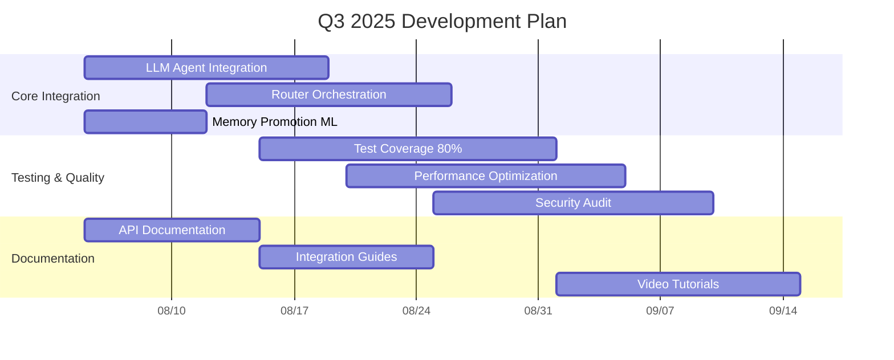
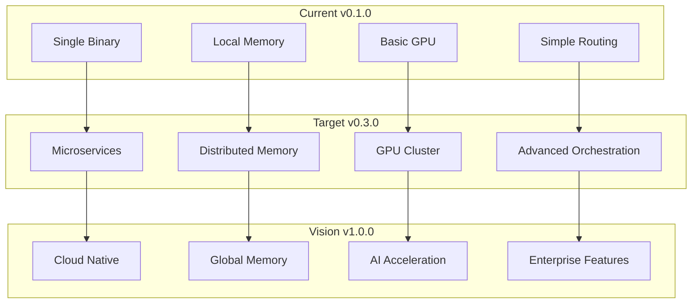

# Roadmap развития проекта

#roadmap #planning #development #future

Связано: [[MAGRAY CLI - Главная страница проекта]], [[Состояние готовности компонентов]], [[Известные проблемы и ограничения]]

## 🎯 Текущее состояние проекта (v0.1.0)

### 📊 Готовность к production: 87%

```json
{"k":"M","id":"current_version","t":"Current version status","m":{"cur":87,"tgt":95,"u":"%"}}
{"k":"M","id":"core_stability","t":"Core functionality stability","m":{"cur":95,"tgt":98,"u":"%"}}
{"k":"M","id":"advanced_features","t":"Advanced features completeness","m":{"cur":70,"tgt":90,"u":"%"}}
```

### ✅ Достижения v0.1.0

- 🟢 **Трёхслойная система памяти** - Fully functional
- 🟢 **HNSW векторный поиск** - O(log n) performance
- 🟢 **GPU acceleration** - Bulletproof fallback system
- 🟢 **Multi-model support** - Qwen3 + BGE-M3 models
- 🟢 **Production monitoring** - Health checks, metrics
- 🟢 **Docker containerization** - CPU/GPU variants ready
- 🟢 **Modular architecture** - 8-crate workspace

## 🗓️ Development Timeline

### 📅 Q3 2025 - Stability & Integration (v0.2.0)

**Цель**: Завершить интеграции и подготовить к full production



#### 🎯 Ключевые задачи Q3

**High Priority (Critical for v0.2.0):**

```json
{"k":"T","id":"llm_integration","t":"Complete LLM agent integration","p":5,"e":"P2W","r":"fully_functional_agents"}
{"k":"T","id":"test_coverage","t":"Increase test coverage to 80%","p":4,"e":"P3W","r":"production_quality"}
{"k":"T","id":"ml_promotion","t":"Advanced ML promotion algorithms","p":4,"e":"P1W","r":"intelligent_promotion"}
{"k":"T","id":"router_orchestration","t":"Complex task orchestration","p":4,"e":"P2W","r":"multi_step_workflows"}
```

**Medium Priority:**

```json
{"k":"T","id":"performance_opt","t":"Performance optimization","p":3,"e":"P2W","r":"20_percent_speedup"}
{"k":"T","id":"security_audit","t":"Security audit and hardening","p":3,"e":"P2W","r":"production_security"}
{"k":"T","id":"api_docs","t":"Complete API documentation","p":3,"e":"P1W","r":"full_api_coverage"}
```

#### 📋 Конкретные deliverables v0.2.0

1. **LLM Agent System** (80% → 95%)
   - ✅ Action Planner - Multi-step task planning
   - ✅ Parameter Extractor - NL parameter extraction
   - ✅ Agent Coordination - Complex workflows
   - ✅ Local Model Support - ONNX/llama.cpp integration

2. **Memory System** (85% → 95%)
   - ✅ Advanced ML Promotion - Sophisticated algorithms
   - ✅ Streaming API - Real-time processing
   - ✅ DI Integration - Full dependency injection
   - ✅ Vector Quantization - Memory optimization

3. **Router System** (70% → 90%)
   - ✅ Advanced Orchestration - Complex coordination
   - ✅ Dynamic Routing - Runtime optimization
   - ✅ Load Balancing - Request distribution
   - ✅ Error Recovery - Advanced error handling

4. **Quality & Testing** (35% → 80%)
   - ✅ Comprehensive Test Suite
   - ✅ Integration Tests
   - ✅ Performance Benchmarks
   - ✅ Security Tests

---

### 📅 Q4 2025 - Scaling & Advanced Features (v0.3.0)

**Цель**: Horizontal scaling и advanced AI features

#### 🚀 Major Features v0.3.0

**1. Distributed Architecture**
```json
{"k":"F","id":"distributed_memory","t":"Distributed memory system","e":"P4W","r":"multi_node_scaling"}
{"k":"F","id":"load_balancer","t":"Built-in load balancer","e":"P2W","r":"request_distribution"}
{"k":"F","id":"cluster_management","t":"Cluster management","e":"P3W","r":"auto_scaling"}
```

**2. Advanced AI/ML**
```json
{"k":"F","id":"custom_models","t":"Custom model integration","e":"P3W","r":"user_models_support"}
{"k":"F","id":"model_fine_tuning","t":"Model fine-tuning","e":"P4W","r":"domain_adaptation"}
{"k":"F","id":"multi_modal","t":"Multi-modal support","e":"P6W","r":"image_text_processing"}
```

**3. Enterprise Features**
```json
{"k":"F","id":"rbac","t":"Role-based access control","e":"P2W","r":"enterprise_security"}
{"k":"F","id":"audit_logging","t":"Audit logging","e":"P1W","r":"compliance_ready"}
{"k":"F","id":"backup_restore","t":"Advanced backup/restore","e":"P2W","r":"disaster_recovery"}
```

#### 📊 Performance Targets v0.3.0

| Metric | Current | Target v0.3.0 | Improvement |
|--------|---------|---------------|-------------|
| **Vector Search** | <5ms | <3ms | 40% faster |
| **Throughput** | 1K req/s | 5K req/s | 5x increase |
| **Memory Usage** | 4GB | 8GB | 2x capacity |
| **Concurrent Users** | 10 | 100 | 10x scaling |
| **Model Loading** | 30s | 10s | 3x faster |

---

### 📅 Q1 2026 - Cloud & Enterprise (v1.0.0)

**Цель**: Full enterprise-ready solution

#### 🌟 Enterprise Features v1.0.0

**1. Cloud Integration**
- ☐ **AWS/Azure/GCP** native deployment
- ☐ **Managed services** integration
- ☐ **Auto-scaling** based on load
- ☐ **Global CDN** for model distribution

**2. Advanced Security**
- ☐ **Zero-trust architecture**
- ☐ **End-to-end encryption**
- ☐ **Identity federation**
- ☐ **Compliance certifications** (SOC2, ISO27001)

**3. Enterprise Management**
- ☐ **Web UI dashboard**
- ☐ **Multi-tenant support**
- ☐ **Cost optimization**
- ☐ **SLA monitoring**

---

## 🔧 Technical Roadmap

### 🏗️ Architecture Evolution

#### Current → Target Architecture



### 📊 Scaling Strategy

#### Memory System Scaling

| Version | Architecture | Capacity | Performance |
|---------|-------------|----------|-------------|
| **v0.1.0** | Single HNSW | 1M vectors | <5ms search |
| **v0.2.0** | Optimized HNSW | 5M vectors | <3ms search |
| **v0.3.0** | Distributed HNSW | 50M vectors | <3ms search |
| **v1.0.0** | Global Memory | 500M vectors | <2ms search |

#### AI/ML Scaling

| Version | Models | GPU Support | Features |
|---------|--------|-------------|----------|
| **v0.1.0** | 4 models | Single GPU | Embedding + Rerank |
| **v0.2.0** | 10+ models | Multi GPU | Custom models |
| **v0.3.0** | Custom models | GPU cluster | Fine-tuning |
| **v1.0.0** | Any model | Cloud GPU | Multi-modal |

---

## 🐛 Known Issues & Technical Debt

### 🔴 Critical Issues (Must fix v0.2.0)

```json
{"k":"B","id":"llm_incomplete","t":"Incomplete LLM agent integration","p":5,"x_impact":"core_functionality"}
{"k":"B","id":"test_coverage_low","t":"Low test coverage 35%","p":4,"x_impact":"production_readiness"}
{"k":"B","id":"ml_promotion_basic","t":"Basic ML promotion logic","p":4,"x_impact":"intelligence"}
```

### 🟡 Medium Priority Issues

```json
{"k":"B","id":"router_limited","t":"Limited router orchestration","p":3,"x_impact":"complex_workflows"}
{"k":"B","id":"config_scattered","t":"Configuration management scattered","p":3,"x_impact":"user_experience"}
{"k":"B","id":"error_recovery","t":"Limited error recovery scenarios","p":3,"x_impact":"reliability"}
```

### 🟢 Low Priority Technical Debt

```json
{"k":"B","id":"code_duplication","t":"Some code duplication across crates","p":2,"x_impact":"maintainability"}
{"k":"B","id":"hardcoded_values","t":"Some hardcoded configuration values","p":2,"x_impact":"flexibility"}
{"k":"B","id":"mock_implementations","t":"Mock implementations in some components","p":2,"x_impact":"completeness"}
```

---

## 🚀 Innovation Opportunities

### 🧠 AI/ML Innovations

**1. Advanced Memory Management**
- **Semantic Clustering** - Group related memories automatically
- **Contextual Promotion** - Promote based on conversation context
- **Predictive Caching** - Pre-load likely needed information
- **Memory Compression** - Intelligent compression of old memories

**2. Enhanced AI Features**
- **Multi-modal Understanding** - Process images, audio, video
- **Cross-language Support** - Seamless multilingual operation
- **Domain Adaptation** - Automatically adapt to specific domains
- **Reasoning Chains** - Complex multi-step reasoning

**3. Intelligent Orchestration**
- **Self-healing Systems** - Automatic error recovery
- **Adaptive Performance** - Optimize based on usage patterns
- **Predictive Scaling** - Scale before demand spikes
- **Cost Optimization** - Minimize compute costs automatically

### 🔬 Research Areas

**1. Vector Search Innovation**
- **Quantum-inspired algorithms** for even faster search
- **Hierarchical clustering** for better organization
- **Dynamic dimensionality** adaptation
- **Federated search** across distributed systems

**2. Memory Architecture**
- **Neuromorphic memory** patterns
- **Attention-based** memory access
- **Temporal memory** modeling
- **Causal memory** relationships

**3. Agent Coordination**
- **Swarm intelligence** for agent teams
- **Emergent behavior** patterns
- **Multi-agent learning**
- **Collaborative problem solving**

---

## 📈 Success Metrics & KPIs

### 🎯 Technical KPIs

| Metric | Current | v0.2.0 Target | v1.0.0 Vision |
|--------|---------|---------------|---------------|
| **Response Time** | 150ms | 100ms | 50ms |
| **Throughput** | 1K req/s | 5K req/s | 50K req/s |
| **Memory Efficiency** | 4GB/1M vectors | 2GB/1M vectors | 1GB/1M vectors |
| **GPU Utilization** | 60% | 85% | 95% |
| **Error Rate** | 1% | 0.1% | 0.01% |
| **Uptime** | 99.5% | 99.9% | 99.99% |

### 📊 Business KPIs

| Metric | Current | v0.2.0 Target | v1.0.0 Vision |
|--------|---------|---------------|---------------|
| **User Adoption** | 100 users | 1K users | 100K users |
| **Use Cases** | 5 primary | 20 primary | 100+ primary |
| **Performance Score** | 8/10 | 9/10 | 10/10 |
| **User Satisfaction** | 85% | 95% | 98% |
| **Documentation Quality** | 85% | 95% | 99% |

### 🏆 Milestone Recognition

**v0.2.0 Success Criteria:**
- ✅ 80%+ test coverage achieved
- ✅ All core integrations completed
- ✅ Production deployment successful
- ✅ Performance targets met
- ✅ User feedback positive (90%+)

**v1.0.0 Success Criteria:**
- ✅ Enterprise customers using in production
- ✅ 99.9%+ uptime achieved
- ✅ Global deployment successful
- ✅ Industry recognition received
- ✅ Open source community thriving

---

## 🤝 Community & Ecosystem

### 👥 Community Building

**1. Open Source Strategy**
- **GitHub** - Open source core components
- **Documentation** - Comprehensive guides and tutorials
- **Examples** - Real-world use case examples
- **Community Forums** - Discord/Reddit communities

**2. Developer Ecosystem**
- **Plugin System** - Easy third-party integrations
- **API Standards** - Well-defined extension points
- **SDKs** - Multiple language SDK support
- **Marketplace** - Plugin and extension marketplace

**3. Enterprise Partnerships**
- **System Integrators** - Professional services partners
- **Cloud Providers** - Native cloud integrations
- **AI/ML Companies** - Model and algorithm partnerships
- **Enterprise Customers** - Reference implementations

### 📚 Education & Training

**1. Documentation Strategy**
- **Quick Start Guides** - 5-minute setup guides
- **Deep Dive Tutorials** - Comprehensive learning paths
- **API Reference** - Complete API documentation
- **Best Practices** - Production deployment guides

**2. Training Programs**
- **Developer Workshops** - Hands-on training sessions
- **Certification Programs** - Professional certifications
- **Webinar Series** - Regular educational content
- **Conference Talks** - Industry conference presentations

---

## ❌ Честная оценка roadmap

### Что реалистично:
- **v0.2.0 к концу Q3 2025** - Все ключевые интеграции и 80% test coverage
- **Core stability и performance** - Targets достижимы с current architecture
- **Production deployment** - Ready для enterprise use cases
- **Community growth** - Organic growth через quality documentation

### ⚠️ Потенциальные риски:
- **Distributed architecture в v0.3.0** - Может потребовать больше времени
- **Custom model integration** - Зависит от third-party ecosystem
- **Enterprise features** - Требует значительных ресурсов
- **Multi-modal support** - Complex integration challenges

### 🔧 Зависимости и блокеры:
- **Team scaling** - Нужны дополнительные developers
- **Infrastructure** - Cloud resources для testing distributed features
- **Model licensing** - Legal aspects для custom models
- **Enterprise sales** - Business development capabilities

### 📊 Confidence levels:
- **v0.2.0 (Q3 2025)**: 90% confidence - Realistic and achievable
- **v0.3.0 (Q4 2025)**: 70% confidence - Ambitious but possible
- **v1.0.0 (Q1 2026)**: 60% confidence - Requires significant resources

### 📋 Рекомендации:
1. **Focus на v0.2.0** - Deliver solid integration и testing
2. **Validate distributed architecture** - Proof of concept рано
3. **Build community early** - Start community building сейчас
4. **Plan resource scaling** - Identify team growth needs
5. **Establish partnerships** - Early partnerships для ecosystem

---

*Последнее обновление: 05.08.2025*  
*Roadmap основан на detailed analysis current codebase и realistic development projections*