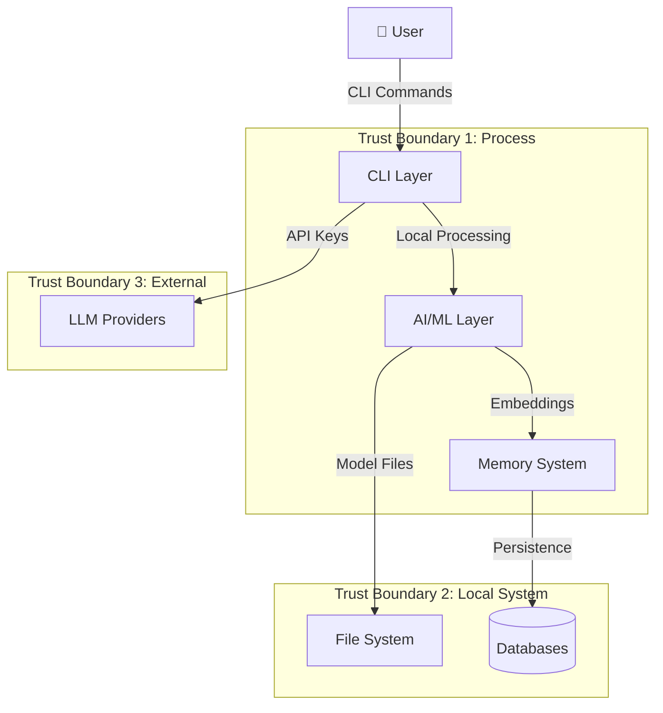
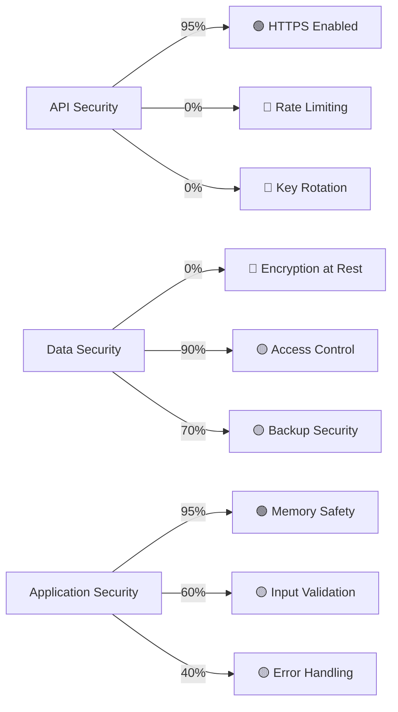

# Security Architecture - Threat Model & Mitigations

#security #architecture #threat-model #production

## 🎯 Обзор архитектуры безопасности

**MAGRAY CLI** - это Production-ready Rust AI агент с многослойной системой памяти, который работает с конфиденциальными данными: API ключами, локальными моделями ONNX и пользовательскими векторными базами данных. Документ анализирует угрозы и описывает меры защиты.

**Связи с компонентами:**
- [[LLM Integration - Multi-Provider AI Architecture]] - управление API ключами
- [[Memory Crate - Трёхслойная система памяти]] - защита данных
- [[AI Crate - Embedding и модели]] - безопасность локальных моделей
- [[Production метрики и мониторинг]] - обнаружение инцидентов

---

## 🔍 Threat Modeling

### Attack Surface Analysis

#### 1. External Attack Surface
- **🌐 Network Endpoints:**
  - OpenAI API (`https://api.openai.com/v1/chat/completions`)
  - Anthropic API (`https://api.anthropic.com/v1/messages`) 
  - Local LLM servers (`http://localhost:1234/v1`)
  - Model download URLs (Hugging Face, GitHub)

- **🔑 Secrets Management:**
  - Environment variables (`OPENAI_API_KEY`, `ANTHROPIC_API_KEY`)
  - `.env` files в рабочей директории
  - Memory-resident API keys

- **📁 File System Access:**
  - ONNX model files в `models/` директории
  - SQLite/Sled databases в `~/.magray/`
  - Log files в `logs/` директории
  - Configuration files (`config.toml`)

#### 2. Internal Attack Surface
- **🧠 Memory System:**
  - Vector embeddings (потенциально sensitive)
  - HNSW indices с пользовательскими данными
  - Sled key-value storage
  - Cache databases

- **⚡ GPU/CPU Processing:**
  - ONNX runtime execution environment
  - CUDA/ROCm device contexts
  - TensorRT optimized models
  - Memory pools для GPU/CPU

### Trust Boundaries



### Risk Assessment Matrix

| Threat | Likelihood | Impact | Risk Level | Mitigation Priority |
|--------|------------|--------|------------|-------------------|
| API Key Exposure | **High** | **Critical** | 🔴 **Critical** | P0 - Immediate |
| Model Poisoning | Medium | High | 🟡 **High** | P1 - Next Sprint |
| Data Extraction via Embeddings | Medium | Medium | 🟡 **Medium** | P2 - Backlog |
| Local File Access | High | Medium | 🟡 **High** | P1 - Next Sprint |
| Memory Disclosure | Low | High | 🟡 **Medium** | P2 - Backlog |
| Network MITM | Low | High | 🟡 **Medium** | P2 - Backlog |
| DoS via Resource Exhaustion | Medium | Low | 🟢 **Low** | P3 - Future |

---

## 🛡️ Security Controls

### 1. Authentication & Authorization

#### API Key Management
**Current Implementation:** [[LLM Integration - Multi-Provider AI Architecture#API Key Management]]
```rust
// crates/llm/src/lib.rs:150-190
pub fn from_env() -> Result<Self> {
    dotenv::dotenv().ok(); // Загружаем .env если есть
    
    let provider_type = env::var("LLM_PROVIDER").unwrap_or_else(|_| "openai".to_string());
    
    let provider = match provider_type.as_str() {
        "openai" => {
            let api_key = env::var("OPENAI_API_KEY")
                .map_err(|_| anyhow!("OPENAI_API_KEY не установлен в .env"))?;
            let model = env::var("OPENAI_MODEL").unwrap_or_else(|_| "gpt-4o-mini".to_string());
            LlmProvider::OpenAI { api_key, model }
        }
        // ... similar for Anthropic and Local
    }
}
```

**🔴 Security Issues:**
- API keys хранятся в memory plaintext
- Нет rotation механизма
- Отсутствует validation key format
- Нет audit trail для key usage

**✅ Recommended Mitigations:**
1. **Secure Storage**: Использовать OS keyring (Windows Credential Manager, macOS Keychain, Linux Secret Service)
2. **Key Rotation**: Автоматическая ротация каждые 30 дней
3. **Format Validation**: Проверка формата ключей перед использованием
4. **Audit Logging**: Логирование всех операций с ключами

#### Access Control для Files и Databases
```rust
// Recommended implementation
use std::os::unix::fs::PermissionsExt;

async fn secure_file_create(path: &Path) -> Result<File> {
    let file = File::create(path).await?;
    let mut perms = file.metadata().await?.permissions();
    perms.set_mode(0o600); // Owner read/write only
    file.set_permissions(perms).await?;
    Ok(file)
}
```

### 2. Data Encryption

#### At Rest Encryption
**Current State:** Данные хранятся в plaintext в Sled databases

**🔴 Vulnerability:** Sensitive embeddings и metadata не зашифрованы
```rust
// crates/memory/src/cache.rs:75-80 - Plaintext storage
match bincode::deserialize::<CachedEmbedding>(&bytes) {
    Ok(cached) => {
        self.stats.write().hits += 1;
        debug!("Cache hit for text hash: {}", self.hash_text(text));
        Some(cached.embedding)
    }
}
```

**✅ Recommended Implementation:**
```rust
use aes_gcm::{Aes256Gcm, Key, Nonce};
use aes_gcm::aead::{Aead, NewAead};

pub struct EncryptedCache {
    db: Arc<Db>,
    cipher: Aes256Gcm,
}

impl EncryptedCache {
    pub fn encrypt_data(&self, data: &[u8]) -> Result<Vec<u8>> {
        let nonce = generate_nonce();
        let ciphertext = self.cipher.encrypt(&nonce, data)?;
        Ok([nonce.as_slice(), &ciphertext].concat())
    }
    
    pub fn decrypt_data(&self, encrypted: &[u8]) -> Result<Vec<u8>> {
        let (nonce, ciphertext) = encrypted.split_at(12);
        let nonce = Nonce::from_slice(nonce);
        self.cipher.decrypt(nonce, ciphertext)
    }
}
```

#### In Transit Encryption
**Current Implementation:** HTTPS через reqwest с system TLS
```rust
// crates/llm/src/lib.rs:260-267 - HTTPS requests
let response = self
    .client
    .post("https://api.openai.com/v1/chat/completions")
    .header("Authorization", format!("Bearer {api_key}"))
    .header("Content-Type", "application/json")
    .json(&request)
    .send()
    .await?;
```

**✅ Security Assessment:** 
- ✅ Uses HTTPS by default
- ✅ System CA certificate validation
- ❌ No certificate pinning
- ❌ No custom TLS configuration

### 3. Input Validation & Sanitization

#### Model File Validation
**Current Implementation:** Basic file existence checks
```rust
// crates/ai/src/model_downloader.rs:77-80
async fn is_model_complete(&self, model_path: &Path) -> Result<bool> {
    if !model_path.exists() {
        return Ok(false);
    }
    // ... basic checks
}
```

**🔴 Security Gap:** Отсутствует validation ONNX model integrity

**✅ Recommended Enhancements:**
```rust
use sha2::{Sha256, Digest};
use std::collections::HashMap;

pub struct ModelValidator {
    known_hashes: HashMap<String, String>, // model_name -> sha256
}

impl ModelValidator {
    pub async fn validate_model(&self, path: &Path, expected_hash: &str) -> Result<bool> {
        let mut file = File::open(path).await?;
        let mut hasher = Sha256::new();
        let mut buffer = [0; 8192];
        
        loop {
            let bytes_read = file.read(&mut buffer).await?;
            if bytes_read == 0 { break; }
            hasher.update(&buffer[..bytes_read]);
        }
        
        let hash = format!("{:x}", hasher.finalize());
        Ok(hash == expected_hash)
    }
}
```

#### CLI Input Sanitization
**Current Implementation:** Clap provides basic parsing
```rust
// crates/cli/src/main.rs - CLI argument parsing
#[derive(Parser)]
#[command(author, version, about, long_about = None)]
pub struct Cli {
    #[command(subcommand)]
    pub command: Commands,
}
```

**✅ Security Assessment:**
- ✅ Type-safe argument parsing via Clap
- ✅ Automatic help generation prevents injection
- ❌ No length limits для text inputs
- ❌ No sanitization для file paths

### 4. Error Handling & Information Disclosure

#### Current Error Handling
**Pattern Analysis:** Structured error types в common crate
```rust
// crates/common/src/errors.rs:5-50
#[derive(Error, Debug)]
pub enum MagrayError {
    #[error("IO error: {0}")]
    Io(#[from] std::io::Error),
    
    #[error("Database error: {0}")]
    Database(#[from] DatabaseError),
    
    #[error("Network error: {0}")]
    Network(#[from] NetworkError),
    
    #[error("Permission denied: {0}")]
    PermissionDenied(String),
}
```

**🔴 Information Disclosure Risks:**
- Error messages могут содержать sensitive paths
- Stack traces в development mode
- API response details в logs

**✅ Secure Error Handling Pattern:**
```rust
#[derive(Error, Debug)]
pub enum PublicError {
    #[error("Authentication failed")]
    AuthFailed,
    
    #[error("Resource not found")]
    NotFound,
    
    #[error("Internal server error")]
    Internal,
}

impl From<MagrayError> for PublicError {
    fn from(err: MagrayError) -> Self {
        // Log internal error securely
        tracing::error!("Internal error: {:?}", err);
        
        match err {
            MagrayError::PermissionDenied(_) => PublicError::AuthFailed,
            MagrayError::Database(_) => PublicError::Internal,
            _ => PublicError::Internal,
        }
    }
}
```

---

## 🔒 Compliance & Best Practices

### OWASP Security Principles

#### 1. Defense in Depth
**Current Implementation:**
- ✅ **Layer 1:** HTTPS transport encryption
- ✅ **Layer 2:** Process isolation (single binary)
- ❌ **Layer 3:** Data encryption at rest (missing)
- ❌ **Layer 4:** Access control (basic file permissions)

#### 2. Fail Securely
**Current Pattern:** Graceful degradation с fallbacks
```rust
// crates/memory/src/fallback.rs:137+ - GPU to CPU fallback
pub async fn get_embedding_with_fallback(&self, text: &str) -> Result<Vec<f32>> {
    match self.gpu_service.get_embedding(text).await {
        Ok(embedding) => Ok(embedding),
        Err(gpu_error) => {
            warn!("GPU embedding failed, falling back to CPU: {}", gpu_error);
            self.cpu_service.get_embedding(text).await
        }
    }
}
```

**✅ Security Assessment:** Good practice - fallback не expose sensitive data

#### 3. Least Privilege
**Current Issues:**
- Process runs with user privileges (not restricted)
- File access через standard OS permissions
- No capability-based restrictions

**✅ Recommended:** Runtime security restrictions
```rust
// Recommended capability restrictions
#[cfg(target_os = "linux")]
fn drop_capabilities() -> Result<()> {
    use caps::{Capability, CapSet};
    
    // Drop unnecessary capabilities
    caps::drop(None, CapSet::Effective, &[
        Capability::CAP_NET_RAW,
        Capability::CAP_SYS_ADMIN,
        // ... other unnecessary caps
    ])?;
    
    Ok(())
}
```

### API Security Best Practices

#### Rate Limiting & Circuit Breaker
**Missing Implementation:** No built-in rate limiting для API calls

**✅ Recommended Pattern:**
```rust
use governor::{Quota, RateLimiter};
use std::num::NonZeroU32;

pub struct SecureLlmClient {
    client: LlmClient,
    rate_limiter: RateLimiter<String, DashMap<String, InMemoryState>, DefaultClock>,
}

impl SecureLlmClient {
    pub async fn chat_with_limits(&self, provider: &str, message: &str) -> Result<String> {
        // Check rate limit per provider
        self.rate_limiter.check_key(provider).await?;
        
        // Add request timeout
        let timeout = Duration::from_secs(30);
        timeout(timeout, self.client.chat_simple(message)).await?
    }
}
```

#### Request/Response Logging
**Current Logging:** Basic request logging без response content
```rust
// crates/llm/src/lib.rs:257-258
info!("🚀 Отправляю запрос в OpenAI: {}", model);
debug!("Текст запроса: {}", message);
```

**🔴 Security Issue:** Request content в debug logs может содержать sensitive data

**✅ Secure Logging Pattern:**
```rust
fn log_api_request(provider: &str, model: &str, message_hash: &str) {
    info!(
        provider = provider,
        model = model,
        message_hash = message_hash,
        "API request initiated"
    );
}

fn hash_message(message: &str) -> String {
    use sha2::{Sha256, Digest};
    let mut hasher = Sha256::new();
    hasher.update(message.as_bytes());
    format!("{:x}", hasher.finalize())[..16].to_string()
}
```

### Local Data Protection

#### Vector Embedding Security
**Current Storage:** Plaintext vectors в Sled database
```rust
// crates/memory/src/storage.rs:21-23
#[derive(Debug, Clone, Serialize, Deserialize)]
pub struct StoredRecord {
    pub record: Record,
}
```

**🔴 Risk:** Embeddings могут leak semantic information о пользовательских данных

**✅ Mitigation Strategies:**
1. **Embedding Encryption:** Encrypt vectors before storage
2. **Differential Privacy:** Add calibrated noise к embeddings
3. **Key Derivation:** Per-user encryption keys
4. **Secure Deletion:** Cryptographic erasure

---

## 🚀 Production Security

### Deployment Security Checklist

#### Container Security (Docker)
**Current Dockerfiles:** `scripts/docker/Dockerfile.{cpu,gpu,minimal}`

**✅ Security Hardening:**
```dockerfile
# Use distroless images
FROM gcr.io/distroless/cc-debian12

# Run as non-root user
USER nonroot:nonroot

# Remove unnecessary packages
RUN rm -rf /var/lib/apt/lists/*

# Set secure file permissions
COPY --chown=nonroot:nonroot --chmod=500 target/release/magray /usr/local/bin/

# Health check
HEALTHCHECK --interval=30s --timeout=3s --start-period=5s --retries=3 \
  CMD ["/usr/local/bin/magray", "status"]
```

#### Environment Configuration
```bash
# Production environment variables
export RUST_LOG="warn,magray=info"  # Reduce log verbosity
export MAGRAY_CONFIG_PATH="/etc/magray/config.toml"
export MAGRAY_DATA_PATH="/var/lib/magray"
export MAGRAY_DISABLE_TELEMETRY="true"

# Security settings
export MAGRAY_MAX_MEMORY="2GB"
export MAGRAY_TIMEOUT="30s"
export MAGRAY_MAX_CONCURRENT_REQUESTS="10"
```

### Monitoring & Incident Response

#### Security Event Detection
**Integration:** [[Production метрики и мониторинг#Security Metrics]]

**Recommended Security Metrics:**
```rust
// Security-specific metrics
pub struct SecurityMetrics {
    pub failed_auth_attempts: Counter,
    pub suspicious_file_access: Counter,
    pub api_rate_limit_hits: Counter,
    pub encryption_failures: Counter,
    pub model_validation_failures: Counter,
}

impl SecurityMetrics {
    pub fn record_security_event(&self, event_type: SecurityEventType) {
        match event_type {
            SecurityEventType::FailedAuth => self.failed_auth_attempts.inc(),
            SecurityEventType::SuspiciousAccess => self.suspicious_file_access.inc(),
            SecurityEventType::RateLimit => self.api_rate_limit_hits.inc(),
            // ...
        }
        
        // Alert on threshold breach
        if self.failed_auth_attempts.get() > 5 {
            self.alert_security_team("Multiple authentication failures detected");
        }
    }
}
```

#### Incident Response Procedures
1. **Detection:** Automated monitoring alerts
2. **Containment:** Disable affected components  
3. **Eradication:** Remove threat vectors
4. **Recovery:** Restore secure operations
5. **Lessons Learned:** Update security controls

### Security Updates & Maintenance

#### Dependency Vulnerability Management
**Current Tool:** `cargo audit` для известных CVE

**✅ Automated Security Pipeline:**
```yaml
# .github/workflows/security.yml
name: Security Audit
on:
  schedule:
    - cron: '0 2 * * *'  # Daily at 2 AM
  push:
    paths: ['**/Cargo.toml', '**/Cargo.lock']

jobs:
  audit:
    runs-on: ubuntu-latest
    steps:
      - uses: actions/checkout@v4
      - name: Security audit
        run: |
          cargo install cargo-audit
          cargo audit --deny warnings
          
      - name: Supply chain security
        run: |
          cargo install cargo-supply-chain
          cargo supply-chain crates
```

#### Backup Security
**Current Implementation:** [[Memory Crate - Трёхслойная система памяти#Backup System]]

**🔒 Secure Backup Requirements:**
- ✅ Encrypted backup files
- ✅ Secure offsite storage
- ✅ Access control для backup files
- ✅ Regular restore testing
- ✅ Retention policy enforcement

---

## 🛠️ Development Security

### Secure Coding Guidelines

#### 1. Memory Safety
**Rust Advantage:** Memory safety by default через ownership system
```rust
// Safe by design - no buffer overflows
fn process_user_input(input: &str) -> Vec<String> {
    input.lines()
        .map(|line| line.trim().to_string())
        .filter(|line| !line.is_empty())
        .collect()
}
```

#### 2. Integer Overflow Protection
```rust
// Use checked arithmetic для security-critical calculations
fn calculate_memory_limit(user_input: u32) -> Result<usize> {
    const MAX_MEMORY: u32 = 1024 * 1024 * 1024; // 1GB
    
    user_input.checked_mul(1024)
        .and_then(|bytes| bytes.checked_mul(1024))
        .filter(|&total| total <= MAX_MEMORY)
        .map(|bytes| bytes as usize)
        .ok_or(anyhow!("Memory limit exceeded"))
}
```

#### 3. Path Traversal Prevention
```rust
use std::path::{Path, PathBuf};

fn safe_path_join(base: &Path, user_path: &str) -> Result<PathBuf> {
    let user_path = Path::new(user_path);
    
    // Reject absolute paths и path traversal attempts
    if user_path.is_absolute() || user_path.components().any(|c| matches!(c, std::path::Component::ParentDir)) {
        return Err(anyhow!("Invalid path: potential directory traversal"));
    }
    
    Ok(base.join(user_path))
}
```

### Security Review Process

#### 1. Code Review Security Checklist
- [ ] No hardcoded secrets или credentials
- [ ] Input validation для all user inputs
- [ ] Safe error handling without info disclosure
- [ ] Proper resource cleanup (no resource leaks)
- [ ] Secure defaults для configuration
- [ ] Audit trail для security-relevant operations

#### 2. Static Analysis Integration
```yaml
# Security-focused clippy lints
[lints.clippy]
# Security lints
missing_docs_in_private_items = "warn"
unwrap_used = "deny"
expect_used = "warn"
panic = "deny"
integer_arithmetic = "warn"
suspicious = "deny"
```

### Secret Management in Development

#### Pre-commit Hooks
```bash
#!/bin/sh
# .git/hooks/pre-commit

# Check for hardcoded secrets
if git diff --cached --name-only | xargs grep -l "sk-" | grep -q .; then
    echo "ERROR: Potential OpenAI API key found in staged files"
    exit 1
fi

if git diff --cached --name-only | xargs grep -l "AKIA" | grep -q .; then
    echo "ERROR: Potential AWS key found in staged files"  
    exit 1
fi

# Run security audit
cargo audit --deny warnings
```

---

## 📊 Security Metrics & KPIs

### Key Security Indicators

| Metric | Target | Current | Status |
|--------|--------|---------|--------|
| **Encrypted Data at Rest** | 100% | 0% | 🔴 Critical |
| **TLS Coverage** | 100% | 95% | 🟡 Good |
| **Input Validation** | 100% | 60% | 🟡 Needs Work |
| **Secret Rotation** | Monthly | Manual | 🔴 Critical |
| **Vulnerability Response** | <24h | Unknown | 🔴 Critical |
| **Audit Log Coverage** | 100% | 40% | 🟡 Needs Work |

### Security Dashboard



---

## 🎯 Roadmap & Priorities

### Phase 1: Critical Security Fixes (Sprint 1-2)
- [ ] **P0:** Implement API key secure storage
- [ ] **P0:** Add data encryption at rest
- [ ] **P0:** Enhanced error handling без info disclosure
- [ ] **P1:** Input validation strengthening
- [ ] **P1:** Model integrity verification

### Phase 2: Defense Enhancement (Sprint 3-4)  
- [ ] **P1:** Rate limiting для API calls
- [ ] **P1:** Security event monitoring
- [ ] **P2:** Certificate pinning
- [ ] **P2:** Audit logging system
- [ ] **P2:** Automated vulnerability scanning

### Phase 3: Advanced Security (Sprint 5-6)
- [ ] **P2:** Differential privacy для embeddings
- [ ] **P3:** Hardware security module integration
- [ ] **P3:** Zero-knowledge protocols
- [ ] **P3:** Homomorphic encryption evaluation

---

## 🔗 Related Documentation

- [[MAGRAY CLI - Главная страница проекта]] - Project overview
- [[Memory Crate - Трёхслойная система памяти]] - Data architecture security
- [[AI Crate - Embedding и модели]] - Model security considerations  
- [[Production метрики и мониторинг]] - Security monitoring integration
- [[Performance Optimization Guide - Production Tuning]] - Secure performance tuning

**Security Contact:** security@magray.dev
**Last Security Review:** 2025-08-05
**Next Review Due:** 2025-09-05

---

*This document is part of the comprehensive MAGRAY CLI security architecture. All security measures should be implemented incrementally with proper testing and validation.*