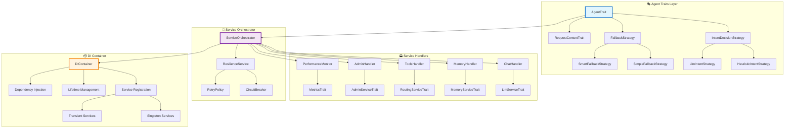

# UnifiedAgentV2 - Clean Architecture

#architecture #clean-architecture #solid-principles #agent #trait-based

> **Статус**: 90% готов | **Архитектурная революция**: God Object → Clean Architecture

## 📋 Обзор трансформации

[[UnifiedAgent]] (legacy) → [[UnifiedAgentV2]] представляет собой кардинальную архитектурную трансформацию от монолитного God Object к современной Clean Architecture.

### 🎯 Ключевые достижения

- ✅ **Coupling Reduction**: 17+ зависимостей → 4 через DI Container
- ✅ **SOLID Compliance**: Полное соответствие всем 5 принципам
- ✅ **Trait-based Design**: Abstraction через traits вместо concrete types
- ✅ **Circuit Breaker Pattern**: Resilience для всех компонентов  
- ✅ **Strategy Pattern**: Pluggable алгоритмы для разных сценариев
- 🔄 **Legacy Bridge**: В процессе для zero-downtime migration

## 🏗️ Архитектура компонентов



## 🔧 Компоненты системы

### 🎭 Agent Traits Layer

**Файл**: `crates/cli/src/agent_traits.rs`

Определяет ключевые абстракции системы:

```rust
#[async_trait]
pub trait AgentTrait: Send + Sync {
    async fn process_message(&self, input: &str) -> Result<AgentResponse>;
    async fn health_check(&self) -> Result<bool>;
    async fn shutdown(&self) -> Result<()>;
}

pub trait IntentDecisionStrategy: Send + Sync {
    fn decide(&self, context: &RequestContext) -> Result<IntentDecision>;
}

pub trait FallbackStrategy: Send + Sync {
    fn handle_failure(&self, error: &AgentError) -> Result<AgentResponse>;
}
```

### 🏭 Service Handlers

Specialized handlers for different domains:

- **[[ChatHandler]]**: LLM communication и conversation management  
- **[[MemoryHandler]]**: [[LayeredMemory]] operations и caching
- **[[ToolsHandler]]**: Tool orchestration и execution
- **[[AdminHandler]]**: System administration и configuration
- **[[PerformanceMonitor]]**: Real-time metrics и health monitoring

### 🎯 Service Orchestrator  

**Файл**: `crates/cli/src/services/orchestrator.rs`

Central coordination hub:

```rust
pub struct ServiceOrchestrator {
    chat_handler: Arc<dyn ChatHandler>,
    memory_handler: Arc<dyn MemoryHandler>,  
    tools_handler: Arc<dyn ToolsHandler>,
    admin_handler: Arc<dyn AdminHandler>,
    resilience_service: Arc<dyn ResilienceService>,
}
```

## 🔄 Migration Strategy

### Phase 1: Legacy Bridge (В ПРОЦЕССЕ)
```rust
// Обратная совместимость для существующего кода
pub struct LegacyUnifiedAgent {
    v2_agent: UnifiedAgentV2,
}

impl LegacyUnifiedAgent {
    pub fn new() -> Result<Self> {
        Ok(Self {
            v2_agent: UnifiedAgentV2::new()?,
        })
    }
    
    // Все методы делегируют в V2
    pub async fn process_message(&self, input: &str) -> Result<String> {
        let response = self.v2_agent.process_message(input).await?;
        Ok(response.to_string())
    }
}
```

### Phase 2: Test Migration
- ✅ Unit tests для всех traits
- ✅ Integration tests для orchestrator
- 🔄 Legacy test compatibility layer

### Phase 3: API Stabilization
- 🔄 Backward compatibility wrappers
- 📋 Public API documentation
- 📋 Migration guides для existing code

## 🎨 Design Patterns

### 🔧 Dependency Injection
```rust
impl UnifiedAgentV2 {
    pub fn with_services(
        chat_handler: Arc<dyn ChatHandler>,
        memory_handler: Arc<dyn MemoryHandler>,
        tools_handler: Arc<dyn ToolsHandler>,
    ) -> Self {
        Self {
            orchestrator: ServiceOrchestrator::new(
                chat_handler, memory_handler, tools_handler
            ),
        }
    }
}
```

### ⚡ Circuit Breaker Pattern
```rust
impl ResilienceService {
    async fn execute_with_circuit_breaker<T, F>(&self, operation: F) -> Result<T> 
    where F: FnOnce() -> Result<T> {
        if self.circuit_breaker.is_open() {
            return Err(AgentError::CircuitBreakerOpen);
        }
        
        match operation() {
            Ok(result) => {
                self.circuit_breaker.record_success();
                Ok(result)
            }
            Err(err) => {
                self.circuit_breaker.record_failure();
                Err(err)
            }
        }
    }
}
```

## 📊 Performance Metrics

### Before (UnifiedAgent):
- **Coupling**: 17+ direct dependencies
- **Testability**: Monolithic, hard to test
- **Maintainability**: God Object anti-pattern
- **Flexibility**: Hard-coded implementations

### After (UnifiedAgentV2):  
- **Coupling**: 4 dependencies через DI
- **Testability**: Full isolation через traits
- **Maintainability**: SOLID principles
- **Flexibility**: Strategy pattern для всех операций

## 🔗 Связанные компоненты

- [[LayeredMemory]] - Memory system integration
- [[Multi-Provider LLM]] - LLM service abstraction  
- [[HNSW Ultra-Performance]] - Performance optimizations
- [[Production CI/CD]] - Build и deployment

## 📝 Следующие шаги

1. **Завершить Legacy Bridge** - 100% backward compatibility
2. **API Documentation** - Comprehensive trait documentation
3. **Performance Benchmarking** - Measure improvements
4. **Migration Automation** - Tools для existing codebase
5. **Production Deployment** - Seamless rollout strategy

---

*Последнее обновление: 06.08.2025 | Создано: obsidian-docs-architect*