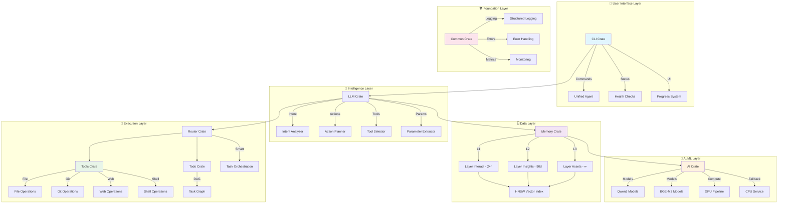
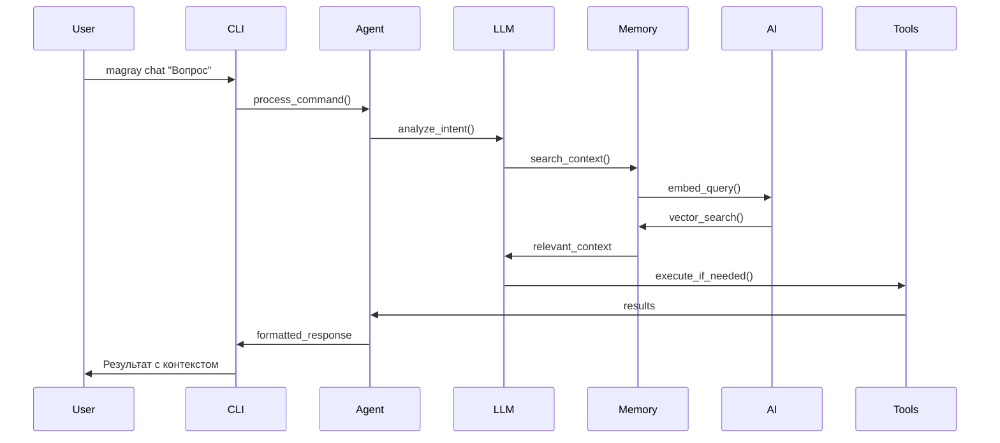
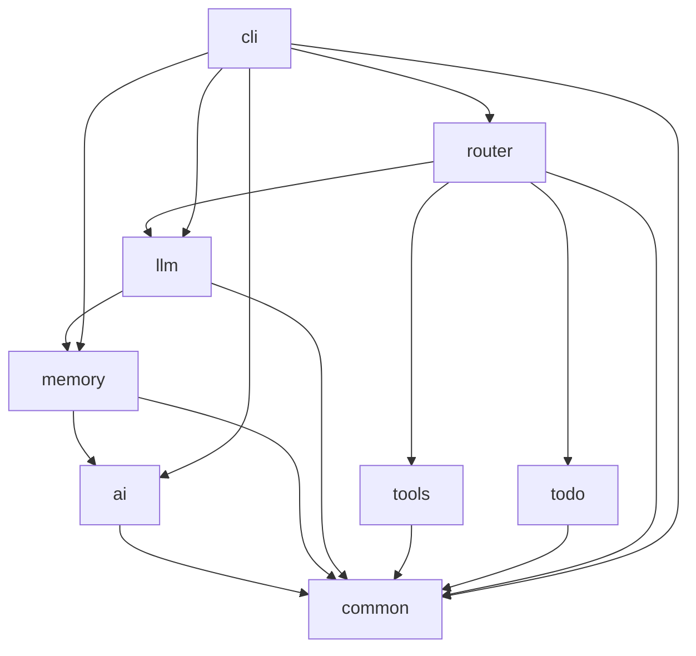
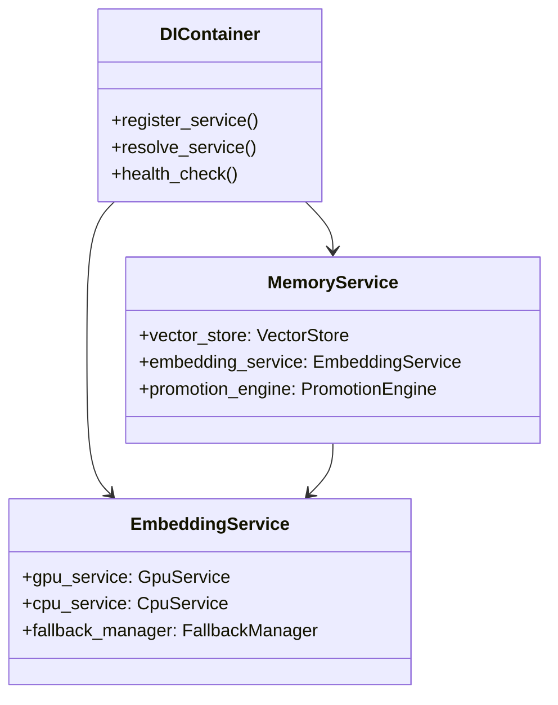

# Архитектура системы - Детальный обзор

#architecture #system #detailed #workspace

Связано: [[MAGRAY CLI - Главная страница проекта]], [[Граф связей компонентов]], [[Потоки данных в системе]]

## 🏗️ Общая архитектура системы

MAGRAY CLI построен как модульный Rust workspace с 8 crates, следующий принципам SOLID и clean architecture. Система спроектирована для production use с акцентом на производительность, надёжность и масштабируемость.

### 🎯 Архитектурные принципы

- **Modular Design**: Каждый crate отвечает за один домен
- **Dependency Injection**: Использование DI для управления зависимостями
- **Graceful Degradation**: Автоматический fallback при сбоях
- **Production Ready**: Health checks, monitoring, structured logging
- **Type Safety**: Использование типов Rust для предотвращения ошибок

## 📊 Workspace структура (8 crates)



## 🔄 Основные потоки данных

### 1. Команда пользователя → Результат



### 2. Векторный поиск в памяти

```mermaid
graph LR
    A[Query Text] --> B[AI Embedding Service]
    B --> C[Vector 1024D]
    C --> D[HNSW Index Search]
    D --> E{Layer Selection}
    E --> F[Layer Interact]
    E --> G[Layer Insights] 
    E --> H[Layer Assets]
    F --> I[O(log n) Search]
    G --> I
    H --> I
    I --> J[Top-K Results]
    J --> K[Semantic Reranking]
    K --> L[Final Results]
```

## 📦 Детальная структура crates

### 🎯 CLI Crate (90% готовности)

**Цель**: Пользовательский интерфейс и entry point

**Ключевые компоненты:**
- `UnifiedAgent` - главный оркестратор
- `Health Checks` - мониторинг состояния системы
- `Progress System` - адаптивные индикаторы прогресса
- `Commands` - модульная система команд

**API Entry Points:**
```rust
magray chat "question"      // Чат с LLM
magray smart "task"         // Умное планирование
magray tool "action"        // Прямое выполнение инструментов
magray status               // Статус системы
magray gpu status           // GPU информация
magray memory stats         // Статистика памяти
```

### 🗄️ Memory Crate (85% готовности)

**Цель**: Трёхслойная система памяти с векторным поиском

**Архитектура слоёв:**

| Слой | TTL | Назначение | Индекс |
|------|-----|------------|---------|
| **Interact** | 24h | Session context, hot data | HNSW |
| **Insights** | 90d | Extracted knowledge | HNSW |
| **Assets** | ∞ | Code, docs, static data | HNSW |

**Ключевые компоненты:**
- `VectorStore` - основное хранилище векторов
- `VectorIndexHnswRs` - HNSW индекс для O(log n) поиска
- `MLPromotionEngine` - ML-based promotion между слоями
- `BatchOperationManager` - пакетная обработка данных
- `StreamingMemoryAPI` - real-time потоковая обработка

**Performance Metrics:**
- Поиск: O(log n) - менее 5мс на запрос
- Индексация: Пакетная обработка до 1000 векторов/сек
- Promotion: Автоматическое перемещение по ML критериям

### 🚀 AI Crate (95% готовности)

**Цель**: AI/ML сервисы для embeddings и reranking

**Поддерживаемые модели:**

| Модель | Тип | Размерность | Приоритет | Особенности |
|--------|-----|-------------|-----------|-------------|
| **Qwen3** | Embedding | 1024D | Primary | Русский язык, быстрая |
| **BGE-M3** | Embedding | 1024D | Legacy | Мультиязычная |
| **Qwen3 Reranker** | Reranker | - | Primary | Семантическое переранжирование |
| **BGE Reranker v2-m3** | Reranker | - | Legacy | Универсальный |

**GPU Infrastructure:**
- `GpuFallbackManager` - надёжный fallback CPU ↔ GPU
- `CircuitBreaker` - защита от каскадных сбоев GPU
- `GpuPipelineManager` - параллельная обработка на GPU
- `MemoryPool` - оптимизация GPU memory usage

**Performance:**
- GPU: 10x ускорение для больших batch
- CPU: Graceful fallback с минимальной задержкой
- Memory: Адаптивное управление GPU памятью

### 🧠 LLM Crate (80% готовности)

**Цель**: Агентная система для работы с языковыми моделями

**Агентная архитектура:**
- `IntentAnalyzer` - анализ намерений пользователя
- `ActionPlanner` - планирование многошаговых задач
- `ToolSelector` - выбор подходящих инструментов
- `ParameterExtractor` - извлечение параметров из NL

**Поддерживаемые провайдеры:**
- OpenAI (GPT-4, GPT-3.5)
- Anthropic (Claude)
- Local models (через ONNX/llama.cpp)

### 🔀 Router Crate (70% готовности)

**Цель**: Интеллектуальная маршрутизация и оркестрация задач

**Компоненты:**
- `SmartRouter` - определение типа задачи и маршрута
- `TaskOrchestrator` - координация выполнения сложных задач
- `IntentClassifier` - классификация намерений

**Routing Logic:**
```
User Input → Intent Analysis → Route Selection → Task Execution
           ↓                 ↓                ↓
         Chat/Question    Tool/Action     Smart/Planning
```

### 🛠️ Tools Crate (90% готовности)

**Цель**: Безопасное выполнение системных операций

**Доступные инструменты:**
- `FileOps` - чтение, запись, навигация по файлам
- `GitOps` - операции с git репозиториями
- `WebOps` - веб-поиск и загрузка контента
- `ShellOps` - безопасное выполнение shell команд

**Безопасность:**
- Песочница для shell команд
- Валидация путей файлов
- Rate limiting для web операций
- Логирование всех операций

### 📋 Todo Crate (75% готовности)

**Цель**: Управление задачами и dependency graph

**Компоненты:**
- `TaskGraph` - DAG структура для задач
- `TaskStore` - SQLite хранилище задач
- `DependencyResolver` - разрешение зависимостей

### 🛠️ Common Crate (100% готовности)

**Цель**: Общие утилиты и инфраструктура

**Компоненты:**
- `StructuredLogging` - JSON логирование для production
- `ErrorHandling` - typed error system
- `Monitoring` - метрики и health checks

## 🔗 Межкомпонентные связи

### Зависимости между crates



### Data Flow Patterns

1. **Request-Response**: Синхронная обработка команд
2. **Event-Driven**: Асинхронные обновления памяти
3. **Stream Processing**: Real-time обработка данных
4. **Batch Processing**: Пакетная обработка больших объёмов

## 🏗️ Dependency Injection Architecture

### DI Container Structure



### Service Lifecycle

1. **Initialization**: Lazy loading компонентов
2. **Configuration**: Environment-based конфигурация
3. **Health Monitoring**: Continuous health checks
4. **Graceful Shutdown**: Coordinated cleanup

## 📊 Production Architecture Patterns

### Circuit Breaker Pattern

```rust
// Пример circuit breaker для GPU
impl CircuitBreaker {
    fn is_service_available(&mut self) -> bool {
        match self.state {
            CircuitState::Closed => true,
            CircuitState::Open => self.check_recovery_time(),
            CircuitState::HalfOpen => true,
        }
    }
}
```

### Observer Pattern для Events

```rust
// Event система для межкомпонентной коммуникации
pub enum SystemEvent {
    MemoryPromoted { from: Layer, to: Layer },
    GpuFallback { reason: String },
    HealthCheck { component: String, status: Health },
}
```

### Strategy Pattern для Providers

```rust
// Стратегия для разных LLM провайдеров
pub trait LlmProvider {
    async fn generate(&self, prompt: &str) -> Result<String>;
    fn model_info(&self) -> ModelInfo;
}
```

## ⚡ Performance Optimizations

### 1. Vector Search Optimization

- **HNSW Algorithm**: O(log n) search complexity
- **Batch Processing**: Vectorized operations
- **Memory Pool**: Reduced allocations
- **Parallel Search**: Multi-threaded queries

### 2. GPU Memory Management

- **Memory Pool**: Pre-allocated GPU buffers
- **Batch Optimization**: Optimal batch sizes
- **Pipeline Processing**: Overlapped CPU/GPU work
- **Fallback Strategy**: Seamless CPU fallback

### 3. Caching Strategy

- **LRU Cache**: Embedding cache with eviction
- **Result Cache**: Query result caching
- **Model Cache**: Loaded model reuse
- **Index Cache**: HNSW index persistence

## 🛡️ Reliability & Resilience

### Error Handling Strategy

1. **Typed Errors**: Structured error types
2. **Error Propagation**: Consistent error handling
3. **Graceful Degradation**: Fallback mechanisms
4. **Recovery Procedures**: Automatic recovery

### Health Monitoring

- **Component Health**: Individual service health
- **System Health**: Overall system status
- **Performance Metrics**: Real-time metrics
- **Alerting**: Production alerts

## 🔮 Future Architecture Evolution

### Planned Enhancements

1. **Distributed Architecture**: Multi-node scaling
2. **Plugin System**: Dynamic component loading
3. **Advanced ML**: More sophisticated promotion algorithms
4. **Cloud Integration**: Cloud provider support

### Scalability Roadmap

- **Horizontal Scaling**: Multiple instance support
- **Database Sharding**: Distributed vector storage
- **Load Balancing**: Request distribution
- **Caching Layer**: Distributed caching

---

## ❌ Честная оценка архитектуры

### Что НЕ реализовано:
- Полная интеграция всех DI компонентов
- Distributed caching system
- Advanced error recovery в некоторых компонентах
- Complete observability infrastructure

### ⚠️ Архитектурные ограничения:
- Монолитная структура (single binary)
- Нет hot-reload компонентов
- Limited horizontal scaling
- Memory-bound для больших datasets

### 🔧 Технический долг:
- Некоторые компоненты используют direct coupling
- Mock implementations в сложных интеграциях
- Simplified error handling в некоторых path
- Configuration management разбросан по crates

### 📊 Архитектурная зрелость: 82%
(Solid foundation с production-ready patterns, но требует доработки некоторых интеграций и advanced features)

---

*Последнее обновление: 05.08.2025*  
*Анализ выполнен на основе детального изучения кодовой базы*