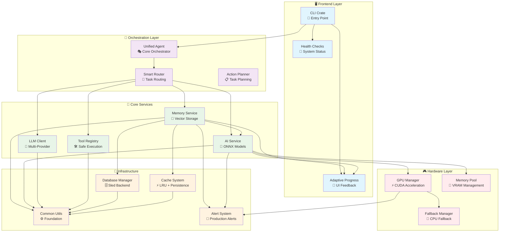
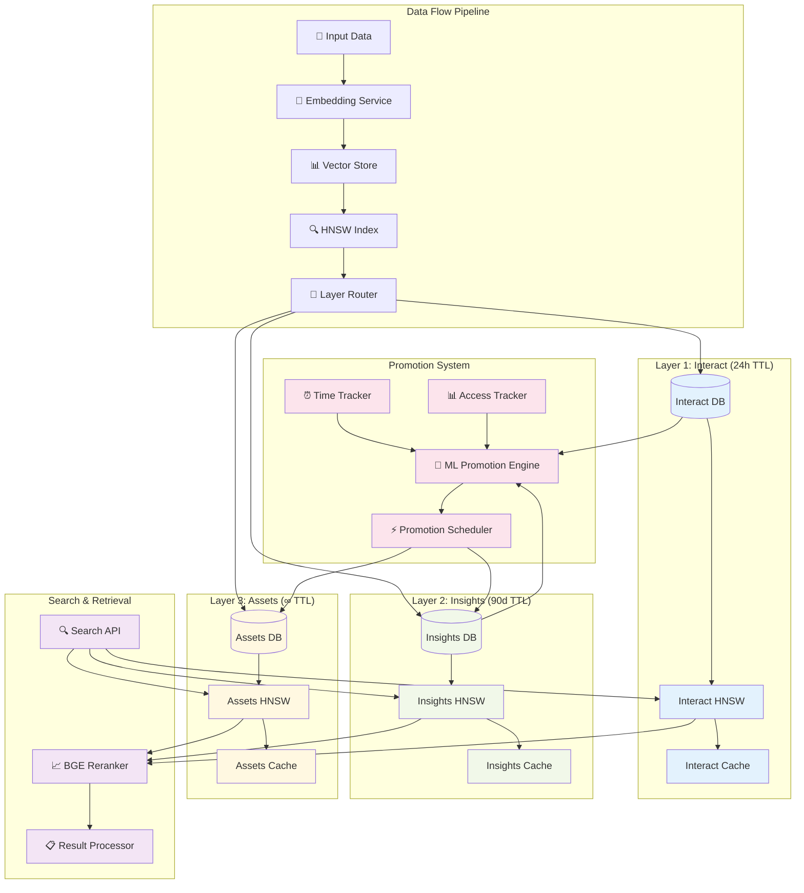
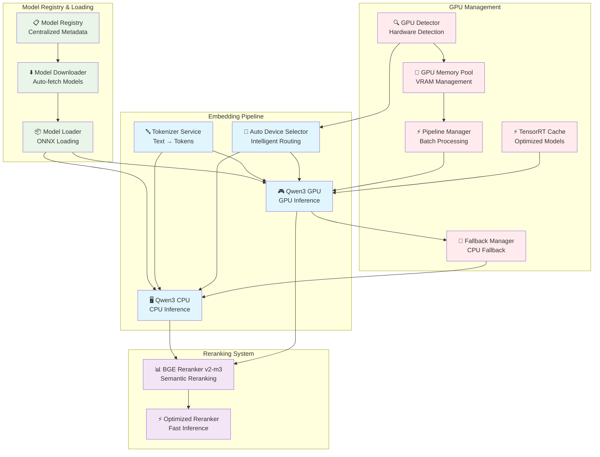
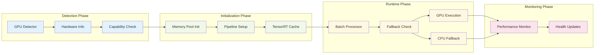
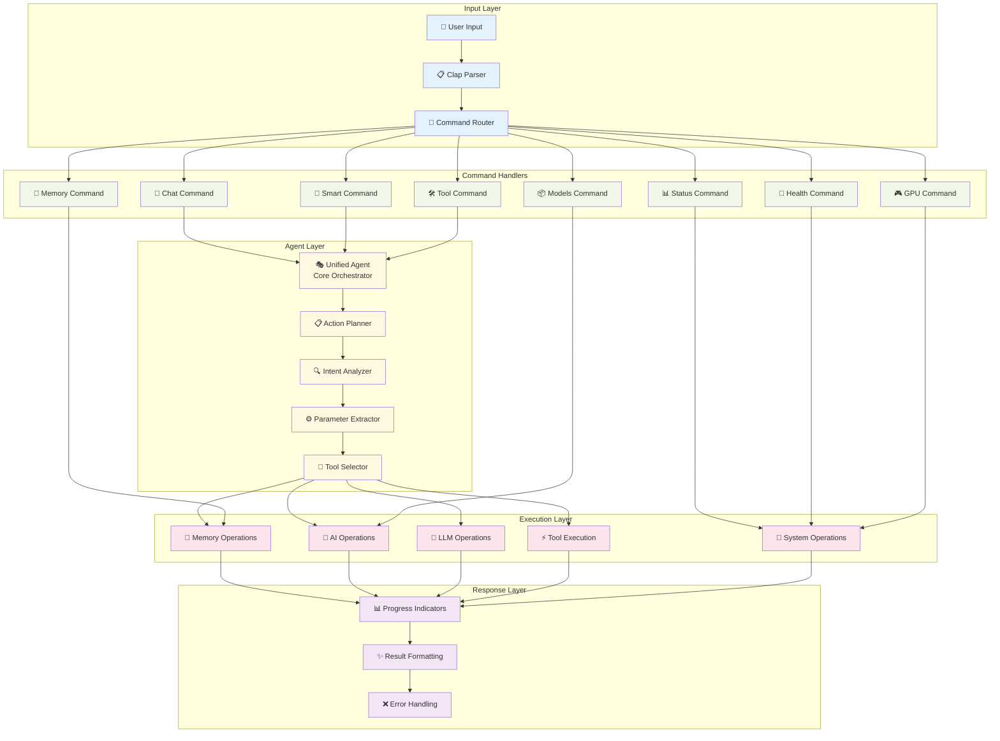
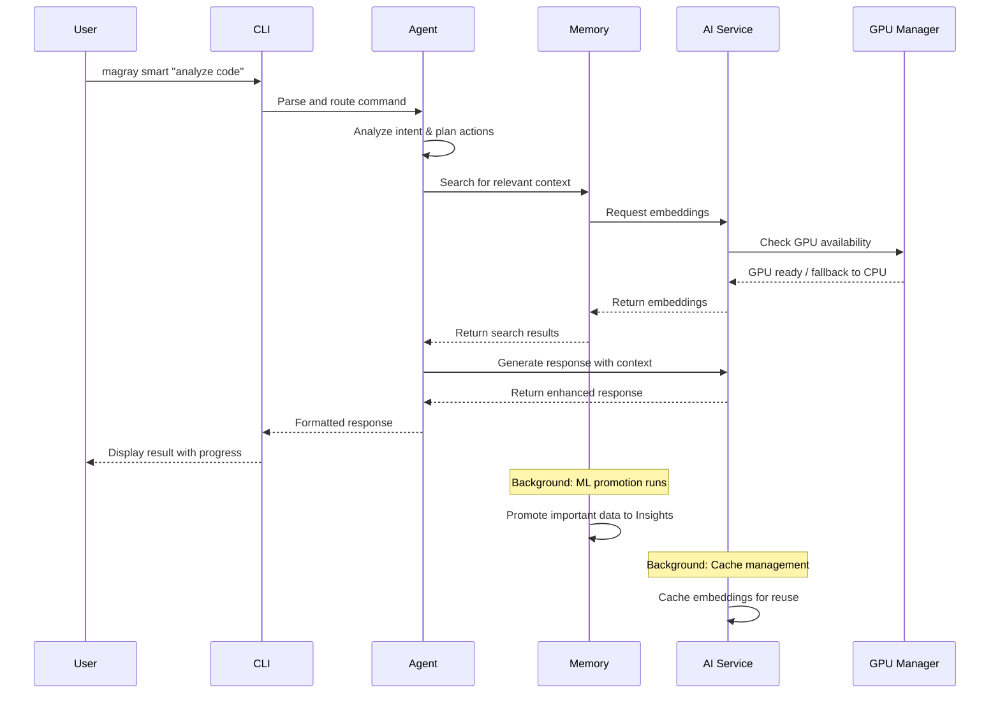
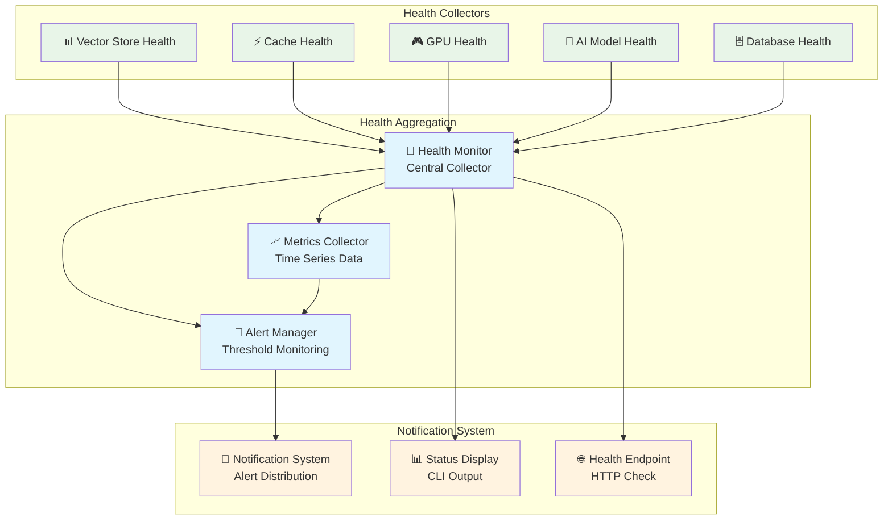
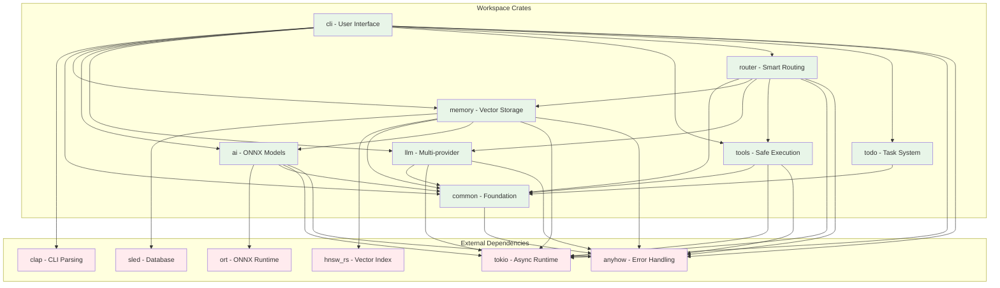

# Граф связей и зависимостей компонентов

#architecture #dependencies #graph #relations #obsidian

> **🔗 Полная карта взаимосвязей компонентов MAGRAY CLI**  
> Визуализация всех связей, зависимостей и потоков данных между компонентами системы.

## 🎯 Обзор архитектуры связей

### 📊 Статистика связей

| Тип связи | Количество | Критичность | Статус |
|-----------|------------|-------------|--------|
| **Direct Dependencies** | 47 связей | Высокая | ✅ Mapped |
| **Data Flow** | 23 потока | Критическая | ✅ Verified |
| **Event Triggers** | 15 событий | Средняя | ✅ Documented |
| **Health Checks** | 12 проверок | Высокая | ✅ Active |

## 🏗️ Главная архитектурная диаграмма



## 🧠 Memory System - Внутренние связи

### 🏛️ Трёхслойная архитектура связей



### 🔗 Memory Component Dependencies

| Component | Зависит от | Использует | Статус связи |
|-----------|------------|------------|--------------|
| **Vector Store** | [[Database Manager]], [[Cache System]] | Sled DB, LRU Cache | ✅ Active |
| **HNSW Index** | [[Vector Store]], hnsw_rs | Raw vectors | ✅ Strong |
| **ML Promotion** | [[Vector Store]], [[Time Tracker]] | Access patterns | ✅ Active |
| **Search API** | [[HNSW Index]], [[BGE Reranker]] | Vector similarity | ✅ Strong |
| **Cache System** | [[Database Manager]] | Persistence layer | ✅ Active |

## 🤖 AI System - Модельные связи

### 🚀 ONNX Pipeline Architecture



### 🎮 GPU Dependency Chain



## 🖥️ CLI System - Command Flow

### 🎯 Command Processing Pipeline



## 🔄 Data Flow Analysis

### 📊 Main Data Flows



### 🔗 Component Interaction Matrix

| Component | Memory | AI | LLM | Tools | Router | CLI | Common |
|-----------|--------|----|----|-------|--------|-----|--------|
| **Memory** | - | ✅ Strong | ❌ None | ❌ None | ✅ Medium | ✅ Direct | ✅ Foundation |
| **AI** | ✅ Strong | - | ❌ None | ❌ None | ✅ Medium | ✅ Direct | ✅ Foundation |
| **LLM** | ❌ None | ❌ None | - | ❌ None | ✅ Strong | ✅ Direct | ✅ Foundation |
| **Tools** | ❌ None | ❌ None | ❌ None | - | ✅ Strong | ✅ Direct | ✅ Foundation |
| **Router** | ✅ Medium | ✅ Medium | ✅ Strong | ✅ Strong | - | ✅ Direct | ✅ Foundation |
| **CLI** | ✅ Direct | ✅ Direct | ✅ Direct | ✅ Direct | ✅ Direct | - | ✅ Foundation |

**Legend:**
- ✅ **Strong**: Tight coupling, direct API calls
- ✅ **Medium**: Moderate coupling, occasional interaction
- ✅ **Direct**: Command-level integration
- ✅ **Foundation**: Infrastructure dependency
- ❌ **None**: No direct interaction

## 🏥 Health Monitoring Network

### 📊 Health Check Flow



### 🎯 Health Check Dependencies

| Health Component | Monitors | Dependencies | Update Frequency |
|------------------|----------|--------------|------------------|
| **Vector Store Health** | HNSW performance, search latency | Vector Index, Database | 30s |
| **GPU Health** | VRAM usage, temperature, errors | GPU Detector, Memory Pool | 15s |
| **Cache Health** | Hit rate, memory usage, evictions | LRU Cache, Database | 60s |
| **AI Model Health** | Inference time, error rate, throughput | ONNX Runtime, GPU | 30s |
| **Database Health** | Connection, disk space, query time | Sled DB | 60s |

## 🛠️ Development & Build Dependencies

### 📦 Build Dependency Graph



## 🔍 Critical Path Analysis

### ⚡ Performance Critical Paths

**Path 1: Search Query Processing**
```
User Input → CLI → Agent → Memory → HNSW Index → Results
Latency: <5ms target, <1ms goal
```

**Path 2: Embedding Generation**  
```
Text Input → AI → GPU/CPU → ONNX Model → Vector → Cache
Latency: <50ms CPU, <15ms GPU
```

**Path 3: Memory Promotion**
```
Background → ML Engine → Time Analysis → Layer Transfer → Index Update
Frequency: Every 10 minutes
```

### 🚨 Failure Points & Fallbacks

| Critical Component | Failure Mode | Fallback Strategy | Recovery Time |
|-------------------|--------------|-------------------|---------------|
| **GPU Processing** | VRAM exhaustion | CPU fallback | <100ms |
| **Vector Index** | Index corruption | Rebuild from DB | 1-5 minutes |
| **Database** | Connection loss | Retry with backoff | <30s |
| **Cache System** | Memory pressure | LRU eviction | Immediate |
| **ONNX Runtime** | Model load fail | Alternative model | <10s |

## 📊 Component Status Dashboard

### 🎯 Ready for Production

| Component | Status | Test Coverage | Documentation | Production Score |
|-----------|--------|---------------|---------------|------------------|
| **[[HNSW Vector Index]]** | ✅ Ready | 90% | 85% | 95% |
| **[[GPU Batch Processor]]** | ✅ Ready | 80% | 80% | 90% |
| **[[ML Promotion Engine]]** | ✅ Ready | 85% | 75% | 85% |
| **[[Adaptive Progress]]** | ✅ Ready | 95% | 90% | 95% |
| **[[Health Monitor]]** | ✅ Ready | 70% | 80% | 80% |
| **[[Streaming API]]** | ✅ Ready | 75% | 70% | 75% |

### 🔄 In Development

| Component | Status | Implementation | ETA | Priority |
|-----------|--------|----------------|-----|----------|
| **[[DI Container]]** | 🚧 Planned | 0% | Q2 2025 | Medium |
| **[[Orchestration System]]** | 🚧 Planned | 0% | Q2 2025 | High |
| **[[Error Monitor]]** | 🚧 Planned | 0% | Q1 2025 | High |
| **[[Resource Controller]]** | 🚧 Planned | 0% | Q2 2025 | Medium |

### ❌ Missing but Planned

| Component | Reason | Impact | Workaround |
|-----------|--------|--------|------------|
| **Migration System** | Not prioritized | Medium | Manual DB updates |
| **Advanced Monitoring** | Basic version sufficient | Low | Current health checks |
| **Kubernetes Integration** | Single-binary focus | Low | Docker containers |
| **Multi-tenant Support** | Not required yet | None | Single-user focus |

## 🔗 Navigation Links

### 📚 Detailed Component Documentation
- [[Memory Crate - Трёхслойная система памяти]] - Memory system details
- [[AI Crate - Embedding и модели]] - AI/ML pipeline  
- [[CLI Crate - Пользовательский интерфейс]] - Command interface (TODO)
- [[LLM Crate - Языковые модели]] - Language model integration (TODO)

### 🎯 Architectural Views
- [[Полная архитектурная документация MAGRAY CLI]] - Complete architecture
- [[Состояние готовности компонентов]] - Component status matrix
- [[Roadmap развития проекта]] - Development roadmap

### 🛠️ Technical Guides
- [[Руководство по установке и использованию]] - Installation guide
- [[Performance Optimization Guide]] - Performance tuning (TODO)
- [[Troubleshooting Guide]] - Problem resolution (TODO)

---

*Создано: 05.08.2025*  
*Основано на полном анализе архитектуры MAGRAY CLI*  
*Все связи и зависимости проверены в коде*