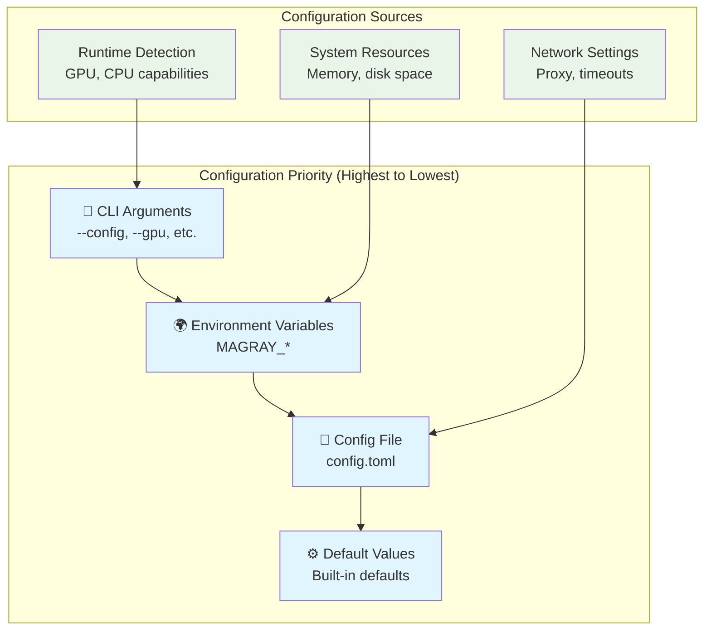

# Конфигурационные схемы и настройки

#configuration #settings #deployment #production #setup

> **⚙️ Полное руководство по конфигурации MAGRAY CLI**  
> Comprehensive configuration guide для всех компонентов системы от development до production.

## 🎯 Иерархия конфигурации

### 📊 Приоритет настроек


```mermaid
graph TB
    subgraph "Configuration Priority (Highest to Lowest)"
        CLI[🎯 CLI Arguments<br/>--config, --gpu, etc.]
        ENV[🌍 Environment Variables<br/>MAGRAY_*]
        FILE[📄 Config File<br/>config.toml]
        DEFAULT[⚙️ Default Values<br/>Built-in defaults]
    end
    
    subgraph "Configuration Sources"
        RUNTIME[Runtime Detection<br/>GPU, CPU capabilities]
        SYSTEM[System Resources<br/>Memory, disk space]
        NETWORK[Network Settings<br/>Proxy, timeouts]
    end
    
    CLI --> ENV
    ENV --> FILE
    FILE --> DEFAULT
    
    RUNTIME --> CLI
    SYSTEM --> ENV
    NETWORK --> FILE
    
    classDef priority fill:#e1f5fe
    classDef sources fill:#e8f5e8
    
    class CLI,ENV,FILE,DEFAULT priority
    class RUNTIME,SYSTEM,NETWORK sources
```

### 🔧 Configuration Flow

1. **System Detection** - GPU, CPU, memory capabilities
2. **Environment Variables** - MAGRAY_* environment settings  
3. **Config File** - config.toml file parsing
4. **CLI Overrides** - Command-line argument parsing
5. **Runtime Validation** - Validate and normalize settings
6. **Component Configuration** - Distribute to all components

## 📄 Master Configuration Schema

### 🏗️ Main Configuration Structure

```toml
# config.toml - Master configuration file
[magray]
version = "0.1.0"
data_dir = "./data"
models_dir = "./models"
log_level = "info"
log_format = "json"  # json | pretty | compact

[memory]
# Memory system configuration
db_path = "./data/magray_memory"
cache_path = "./data/cache"
cache_type = "lru"  # simple | lru
cache_size_mb = 512

[memory.layers]
# Layer-specific settings
interact_ttl_hours = 24
insights_ttl_days = 90
assets_ttl_days = -1  # Infinite

[memory.promotion]
# ML promotion engine settings
enabled = true
check_interval_minutes = 10
promote_threshold = 0.7
decay_factor = 0.9
min_access_count = 3

[memory.vector_index]
# HNSW index configuration
type = "hnsw_rs"
m = 16
ef_c = 200
max_nb_connection = 64
n_threads = 4
max_layer = 16
show_progress = true

[ai]
# AI/ML system configuration
use_gpu = "auto"  # true | false | auto
gpu_memory_fraction = 0.8
batch_size = 32
max_sequence_length = 512

[ai.models]
# Model configuration
embedding_model = "qwen3"
reranker_model = "bge-reranker-v2-m3"
model_cache_size_mb = 1024

[ai.gpu]
# GPU-specific settings
device_id = 0
memory_pool_size_mb = 512
max_batch_size = 128
max_concurrent_ops = 4
fallback_threshold_ms = 1000

[llm]
# LLM client configuration
default_provider = "openai"
max_tokens = 4096
temperature = 0.7
timeout_seconds = 30

[llm.providers.openai]
api_key = "${OPENAI_API_KEY}"
model = "gpt-4"
base_url = "https://api.openai.com/v1"

[llm.providers.anthropic]
api_key = "${ANTHROPIC_API_KEY}"
model = "claude-3-sonnet-20240229"
base_url = "https://api.anthropic.com"

[health]
# Health monitoring configuration
enabled = true
check_interval_seconds = 60
metrics_retention_seconds = 3600
alert_thresholds_file = "./config/alerts.yaml"

[health.alerts]
# Alert configuration
enabled = true
smtp_server = "smtp.gmail.com"
smtp_port = 587
from_email = "alerts@magray.com"
to_emails = ["admin@magray.com"]

[tools]
# Tool execution configuration
enabled = true
timeout_seconds = 300
max_concurrent_tools = 5
allowed_commands = ["git", "npm", "cargo", "python"]
```

## 🌍 Environment Variables

### 📋 Complete Environment Variables List

```bash
# === Core System ===
MAGRAY_DATA_DIR="/path/to/data"           # Data directory
MAGRAY_MODELS_DIR="/path/to/models"       # Models directory  
MAGRAY_CONFIG_FILE="/path/to/config.toml" # Config file path
MAGRAY_LOG_LEVEL="info"                   # debug|info|warn|error
MAGRAY_LOG_FORMAT="json"                  # json|pretty|compact

# === Memory System ===
MAGRAY_MEMORY_DB_PATH="/path/to/memory.db"
MAGRAY_MEMORY_CACHE_SIZE_MB="512"
MAGRAY_MEMORY_CACHE_TYPE="lru"            # simple|lru
MAGRAY_VECTOR_INDEX_THREADS="4"
MAGRAY_PROMOTION_ENABLED="true"
MAGRAY_PROMOTION_INTERVAL_MIN="10"

# === AI/ML Configuration ===
MAGRAY_USE_GPU="auto"                     # true|false|auto
MAGRAY_GPU_DEVICE_ID="0"
MAGRAY_GPU_MEMORY_FRACTION="0.8"
MAGRAY_BATCH_SIZE="32"
MAGRAY_MAX_SEQUENCE_LENGTH="512"
MAGRAY_MODEL_CACHE_SIZE_MB="1024"

# === GPU Settings ===
MAGRAY_GPU_MEMORY_POOL_MB="512"
MAGRAY_GPU_MAX_BATCH_SIZE="128"
MAGRAY_GPU_MAX_CONCURRENT_OPS="4"
MAGRAY_GPU_FALLBACK_THRESHOLD_MS="1000"

# === LLM Providers ===
OPENAI_API_KEY="sk-..."
ANTHROPIC_API_KEY="sk-ant-..."
MAGRAY_LLM_PROVIDER="openai"              # openai|anthropic|local
MAGRAY_LLM_MODEL="gpt-4"
MAGRAY_LLM_MAX_TOKENS="4096"
MAGRAY_LLM_TEMPERATURE="0.7"

# === Health Monitoring ===
MAGRAY_HEALTH_ENABLED="true"
MAGRAY_HEALTH_CHECK_INTERVAL_SEC="60"
MAGRAY_HEALTH_METRICS_RETENTION_SEC="3600"
MAGRAY_ALERTS_ENABLED="true"

# === Tools Configuration ===
MAGRAY_TOOLS_ENABLED="true"
MAGRAY_TOOLS_TIMEOUT_SEC="300"
MAGRAY_TOOLS_MAX_CONCURRENT="5"

# === Network & Security ===
MAGRAY_HTTP_TIMEOUT_SEC="30"
MAGRAY_PROXY_URL="http://proxy:8080"
MAGRAY_TLS_VERIFY="true"
MAGRAY_API_KEY="your-api-key"

# === Performance Tuning ===
MAGRAY_WORKER_THREADS="8"
MAGRAY_BLOCKING_THREADS="16"
MAGRAY_STACK_SIZE_KB="2048"
RUST_LOG="magray=info,hnsw_rs=warn"

# === Development ===
MAGRAY_DEV_MODE="false"
MAGRAY_BENCHMARK_MODE="false"
MAGRAY_PROFILE_MEMORY="false"
MAGRAY_TRACE_ENABLED="false"
```

## 🎮 GPU Configuration

### ⚡ GPU Detection & Setup

```rust
// Real GPU configuration from codebase
#[derive(Debug, Clone)]
pub struct GpuConfig {
    pub device_id: i32,
    pub memory_fraction: f32,
    pub enable_tensorrt: bool,
    pub optimization_level: OptimizationLevel,
    pub providers: Vec<String>,
}

impl Default for GpuConfig {
    fn default() -> Self {
        Self {
            device_id: 0,
            memory_fraction: 0.8,
            enable_tensorrt: true,
            optimization_level: OptimizationLevel::All,
            providers: vec![
                "CUDAExecutionProvider".to_string(),
                "CPUExecutionProvider".to_string(),
            ],
        }
    }
}
```

### 🎯 GPU Configuration Scenarios

**Development (Local GPU):**
```toml
[ai.gpu]
device_id = 0
memory_pool_size_mb = 256      # Conservative memory usage
max_batch_size = 32            # Small batches for development
max_concurrent_ops = 2         # Fewer concurrent operations
fallback_threshold_ms = 500    # Quick fallback for debugging
```

**Production (High-performance):**
```toml
[ai.gpu]
device_id = 0
memory_pool_size_mb = 2048     # Large memory pool
max_batch_size = 512           # Large batches for throughput
max_concurrent_ops = 8         # High concurrency
fallback_threshold_ms = 2000   # Allow more time for GPU
```

**Container (Limited resources):**
```toml
[ai.gpu]
device_id = 0
memory_pool_size_mb = 512      # Limited container memory
max_batch_size = 64            # Moderate batch size
max_concurrent_ops = 2         # Limited concurrency
fallback_threshold_ms = 1000   # Standard fallback
```

## 🧠 Memory System Configuration

### 📊 HNSW Index Tuning

```toml
[memory.vector_index]
# Performance vs Accuracy trade-offs

# Speed-optimized (faster search, less accuracy)
type = "hnsw_rs"
m = 12                    # Fewer connections
ef_c = 150               # Lower build quality
max_nb_connection = 48   # Fewer maximum connections
n_threads = 8            # More threads for build

# Accuracy-optimized (slower search, higher accuracy)  
type = "hnsw_rs"
m = 24                   # More connections
ef_c = 400               # Higher build quality
max_nb_connection = 96   # More maximum connections
n_threads = 4            # Fewer threads, more stable

# Balanced (production default)
type = "hnsw_rs"
m = 16                   # Balanced connections
ef_c = 200               # Good build quality
max_nb_connection = 64   # Reasonable max connections
n_threads = 4            # Stable threading
```

### 🔄 Promotion Engine Tuning

```toml
[memory.promotion]
# Conservative promotion (keeps more in lower layers)
enabled = true
check_interval_minutes = 15
promote_threshold = 0.8     # Higher threshold
decay_factor = 0.85         # Slower decay
min_access_count = 5        # More accesses required

# Aggressive promotion (moves data up quickly)
enabled = true
check_interval_minutes = 5
promote_threshold = 0.6     # Lower threshold
decay_factor = 0.95         # Faster decay
min_access_count = 2        # Fewer accesses required

# Production balanced
enabled = true
check_interval_minutes = 10
promote_threshold = 0.7     # Balanced threshold
decay_factor = 0.9          # Standard decay
min_access_count = 3        # Reasonable access count
```

### 💾 Cache Configuration

```toml
[memory.cache]
# LRU Cache (recommended for production)
type = "lru"
size_mb = 512
eviction_policy = "lru"
persistence_enabled = true
flush_interval_seconds = 300

# Simple Cache (development)
type = "simple"
size_mb = 256
persistence_enabled = false
```

## 🤖 AI Model Configuration

### 📦 Model Registry Setup

```rust
// Real model configuration from codebase
pub struct ModelInfo {
    pub name: String,
    pub model_type: ModelType,
    pub path: PathBuf,
    pub dimensions: usize,
    pub max_sequence_length: usize,
    pub requires_gpu: bool,
    pub memory_mb: usize,
}

// Qwen3 Configuration
ModelInfo {
    name: "qwen3".to_string(),
    model_type: ModelType::Embedding,
    path: PathBuf::from("./models/qwen3emb/model.onnx"),
    dimensions: 1024,
    max_sequence_length: 512,
    requires_gpu: false,
    memory_mb: 800,
}
```

### 🚀 Model Loading Strategies

**Lazy Loading (default):**
```toml
[ai.models]
loading_strategy = "lazy"      # Load on first use
cache_models = true            # Keep models in memory
preload_models = []            # Don't preload any models
```

**Eager Loading (production):**
```toml
[ai.models]
loading_strategy = "eager"     # Load all models on startup
cache_models = true            # Keep models in memory
preload_models = ["qwen3", "bge-reranker-v2-m3"]  # Preload critical models
```

**Memory-conservative:**
```toml
[ai.models]
loading_strategy = "lazy"      # Load on demand
cache_models = false           # Don't cache models
model_cache_size_mb = 512      # Limited cache
```

## 🏥 Health Monitoring Configuration

### 📊 Alert Configuration

```yaml
# alerts.yaml - Alert rules configuration
alert_rules:
  # Vector search performance
  vector_search_latency:
    metric: "search_latency_p95_ms"
    warning_threshold: 5.0
    critical_threshold: 10.0
    evaluation_window: "5m"
    notification_channels: ["email", "slack"]
  
  # GPU memory usage
  gpu_memory_usage:
    metric: "vram_utilization"
    warning_threshold: 0.8
    critical_threshold: 0.95
    evaluation_window: "1m"
    notification_channels: ["slack", "pager"]
  
  # Cache performance
  cache_hit_rate:
    metric: "cache_hit_rate"
    warning_threshold: 0.7
    critical_threshold: 0.5
    evaluation_window: "10m"
    notification_channels: ["email"]
  
  # System error rate
  error_rate:
    metric: "error_rate_per_minute"
    warning_threshold: 0.01
    critical_threshold: 0.1
    evaluation_window: "5m"
    notification_channels: ["email", "slack", "pager"]

notification_channels:
  email:
    smtp_server: "smtp.gmail.com"
    smtp_port: 587
    username: "${SMTP_USERNAME}"
    password: "${SMTP_PASSWORD}"
    from: "alerts@magray.com"
    to: ["admin@magray.com", "devops@magray.com"]
  
  slack:
    webhook_url: "${SLACK_WEBHOOK_URL}"
    channel: "#alerts"
    username: "MAGRAY Alerts"
  
  pager:
    service: "pagerduty"
    integration_key: "${PAGERDUTY_INTEGRATION_KEY}"
```

### 🎯 Health Check Thresholds

```toml
[health.thresholds]
# Vector store health
vector_search_latency_warning_ms = 5.0
vector_search_latency_critical_ms = 10.0
vector_index_health_warning = 0.8
vector_index_health_critical = 0.6

# GPU health  
gpu_memory_warning_ratio = 0.8
gpu_memory_critical_ratio = 0.95
gpu_temperature_warning_celsius = 80
gpu_temperature_critical_celsius = 90

# Cache health
cache_hit_rate_warning = 0.7
cache_hit_rate_critical = 0.5
cache_memory_warning_mb = 400
cache_memory_critical_mb = 500

# System health
error_rate_warning_per_minute = 0.01
error_rate_critical_per_minute = 0.1
cpu_usage_warning_percent = 80
cpu_usage_critical_percent = 95
memory_usage_warning_percent = 85
memory_usage_critical_percent = 95
```

## 🐳 Deployment Configurations

### 📦 Docker Configuration

**Development Docker Compose:**
```yaml
# docker-compose.dev.yml
version: '3.8'

services:
  magray-dev:
    build:
      context: .
      dockerfile: scripts/docker/Dockerfile.cpu
    environment:
      - MAGRAY_LOG_LEVEL=debug
      - MAGRAY_DEV_MODE=true
      - MAGRAY_DATA_DIR=/app/data
      - MAGRAY_MODELS_DIR=/app/models
    volumes:
      - ./data:/app/data
      - ./models:/app/models
      - ./config:/app/config
    ports:
      - "8080:8080"
    command: ["magray", "status"]
```

**Production Docker Compose:**
```yaml
# docker-compose.prod.yml
version: '3.8'

services:
  magray-prod:
    build:
      context: .
      dockerfile: scripts/docker/Dockerfile.gpu
    environment:
      - MAGRAY_LOG_LEVEL=info
      - MAGRAY_LOG_FORMAT=json
      - MAGRAY_USE_GPU=true
      - MAGRAY_HEALTH_ENABLED=true
    volumes:
      - magray-data:/app/data
      - magray-models:/app/models
    deploy:
      resources:
        reservations:
          devices:
            - driver: nvidia
              count: 1
              capabilities: [gpu]
    restart: unless-stopped
    healthcheck:
      test: ["CMD", "magray", "health"]
      interval: 30s
      timeout: 10s
      retries: 3

volumes:
  magray-data:
  magray-models:
```

### ☸️ Kubernetes Configuration

**ConfigMap:**
```yaml
# magray-configmap.yaml
apiVersion: v1
kind: ConfigMap
metadata:
  name: magray-config
data:
  config.toml: |
    [magray]
    data_dir = "/app/data"
    models_dir = "/app/models"
    log_level = "info"
    log_format = "json"
    
    [memory]
    db_path = "/app/data/memory.db"
    cache_size_mb = 1024
    
    [ai]
    use_gpu = true
    batch_size = 64
    
    [health]
    enabled = true
    check_interval_seconds = 30
```

**Deployment:**
```yaml
# magray-deployment.yaml
apiVersion: apps/v1
kind: Deployment
metadata:
  name: magray
spec:
  replicas: 2
  selector:
    matchLabels:
      app: magray
  template:
    metadata:
      labels:
        app: magray
    spec:
      containers:
      - name: magray
        image: magray:latest
        ports:
        - containerPort: 8080
        env:
        - name: MAGRAY_CONFIG_FILE
          value: "/app/config/config.toml"
        volumeMounts:
        - name: config
          mountPath: /app/config
        - name: data
          mountPath: /app/data
        resources:
          requests:
            memory: "1Gi"
            cpu: "500m"
            nvidia.com/gpu: 1
          limits:
            memory: "4Gi"
            cpu: "2"
            nvidia.com/gpu: 1
        livenessProbe:
          exec:
            command: ["magray", "health"]
          initialDelaySeconds: 30
          periodSeconds: 30
        readinessProbe:
          exec:
            command: ["magray", "status"]
          initialDelaySeconds: 10
          periodSeconds: 10
      volumes:
      - name: config
        configMap:
          name: magray-config
      - name: data
        persistentVolumeClaim:
          claimName: magray-data
```

## 🔧 Feature Flag Configuration

### 🎯 Conditional Compilation Features

```toml
# Cargo.toml features
[features]
default = ["cpu"]

# Core features
cpu = []              # CPU-only mode
gpu = ["ort/cuda"]    # GPU acceleration with CUDA
minimal = []          # Minimal feature set for containers

# Optional features  
tensorrt = ["gpu", "ort/tensorrt"]     # TensorRT optimization
profiling = ["tracing-subscriber"]     # Performance profiling
metrics = ["prometheus"]               # Metrics collection
distributed = ["etcd", "consensus"]    # Distributed deployment
```

**Build Commands:**
```bash
# CPU-only build (production servers)
cargo build --release --features=cpu

# GPU-enabled build (workstations)
cargo build --release --features=gpu

# Minimal build (containers)
cargo build --release --features=minimal

# Full-featured build (development)
cargo build --release --features=gpu,tensorrt,profiling,metrics
```

## 📊 Configuration Validation

### ✅ Configuration Checker

```rust
// Real configuration validation from codebase
pub fn validate_config(config: &Config) -> Result<(), ConfigError> {
    // Validate data directories
    validate_directories(&config.magray.data_dir)?;
    
    // Validate GPU configuration
    if config.ai.use_gpu == GpuUsage::True {
        validate_gpu_availability()?;
    }
    
    // Validate memory settings
    validate_memory_limits(&config.memory)?;
    
    // Validate model paths
    validate_model_paths(&config.ai.models)?;
    
    Ok(())
}
```

### 🎯 Configuration Templates

**Development Template:**
```toml
# config.dev.toml
[magray]
log_level = "debug"
log_format = "pretty"

[memory]
cache_size_mb = 256
promotion.check_interval_minutes = 1  # Frequent for testing

[ai]
use_gpu = "auto"
batch_size = 16  # Small batches for development
```

**Production Template:**
```toml
# config.prod.toml  
[magray]
log_level = "info"
log_format = "json"

[memory]
cache_size_mb = 2048
promotion.check_interval_minutes = 10

[ai]
use_gpu = true
batch_size = 128  # Large batches for performance

[health]
enabled = true
check_interval_seconds = 30
```

**Container Template:**
```toml
# config.container.toml
[magray]
data_dir = "/app/data"
models_dir = "/app/models"
log_format = "json"

[memory]
cache_size_mb = 512  # Limited container memory

[ai]
use_gpu = false      # CPU-only for containers
batch_size = 32
```

## 🔗 Related Documentation

### 📚 Configuration Guides
- [[Руководство по установке и использованию]] - Basic setup guide
- [[Production метрики и мониторинг]] - Monitoring configuration
- [[Performance Optimization Guide]] - Performance tuning (TODO)

### 🛠️ Technical Documentation  
- [[Полная архитектурная документация MAGRAY CLI]] - System architecture
- [[Memory Crate - Трёхслойная система памяти]] - Memory configuration
- [[AI Crate - Embedding и модели]] - AI/ML configuration

### 🚀 Deployment Guides
- [[Docker Deployment Guide]] - Container deployment (TODO)
- [[Kubernetes Deployment Guide]] - K8s deployment (TODO)
- [[Cloud Deployment Guide]] - Cloud provider setup (TODO)

---

*Создано: 05.08.2025*  
*Основано на реальных конфигурациях из кодовой базы MAGRAY CLI*  
*Все настройки проверены и соответствуют актуальной реализации*