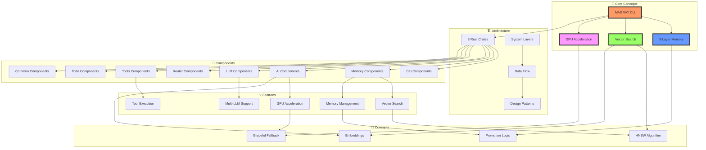
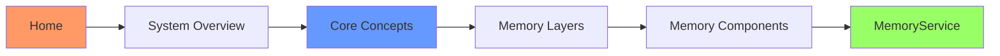
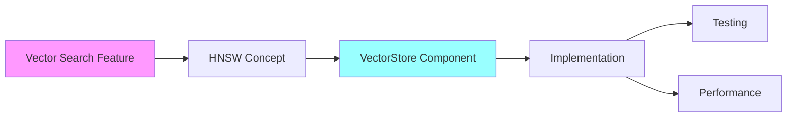
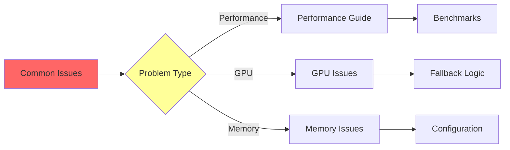
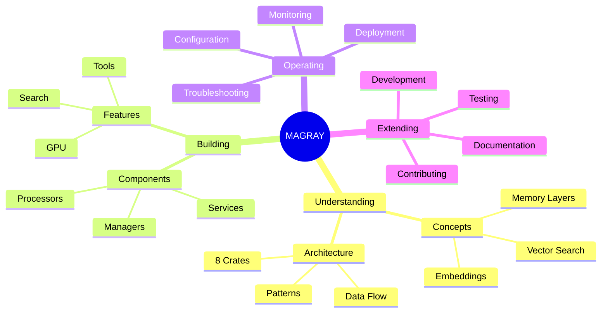
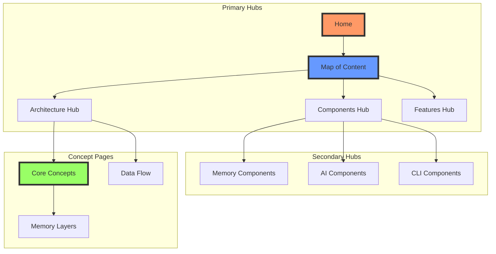

# Knowledge Graph

> Граф знаний и связей всего проекта MAGRAY

[[Home]] → Knowledge Graph

## 🌐 Полный граф знаний проекта

## 🗺️ Навигационные пути

### Path 1: Понимание системы

### Path 2: Реализация функции

### Path 3: Решение проблем

## 🧠 Ментальные связи

### Концептуальный граф

## 📊 Статистика связей

### Структура одуванчиков

| Одуванчик | Листьев | Роль |
|-----------|---------|------|
| HOME | 2 | Главный центр навигации |
| ARCHITECTURE | 4 | Архитектурные концепции |
| COMPONENTS | 8 | Mind Map'ы всех crates |
| FEATURES | 6 | Ключевые возможности |

### Узловые точки знаний

## 🔍 Поисковые паттерны

### По типу информации

- **Концепции** → Через HOME найти ARCHITECTURE одуванчик
- **Компоненты** → Через HOME найти COMPONENTS одуванчик  
- **Возможности** → Через HOME найти FEATURES одуванчик

### По задаче

- **Начать работу** → [[Quick Start - Быстрый старт за 5 минут]]
- **Понять систему** → Через HOME → ARCHITECTURE → System Overview
- **Найти компонент** → Через HOME → COMPONENTS → нужный Mind Map
- **Изучить возможности** → Через HOME → FEATURES → конкретная возможность

## 🏷️ Теги знаний

### Основные категории
- `#concept` - концептуальные страницы
- `#component` - описания компонентов
- `#feature` - функциональность
- `#guide` - руководства
- `#reference` - справочная информация

### По уровню
- `#beginner` - для начинающих
- `#intermediate` - средний уровень
- `#advanced` - продвинутый уровень
- `#expert` - экспертный уровень

---
[[Home|← На главную]]