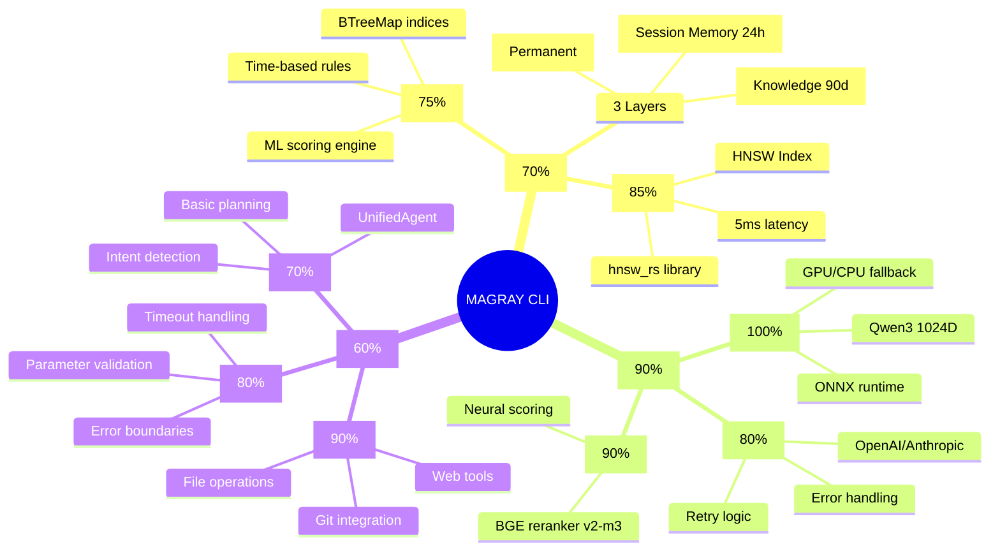
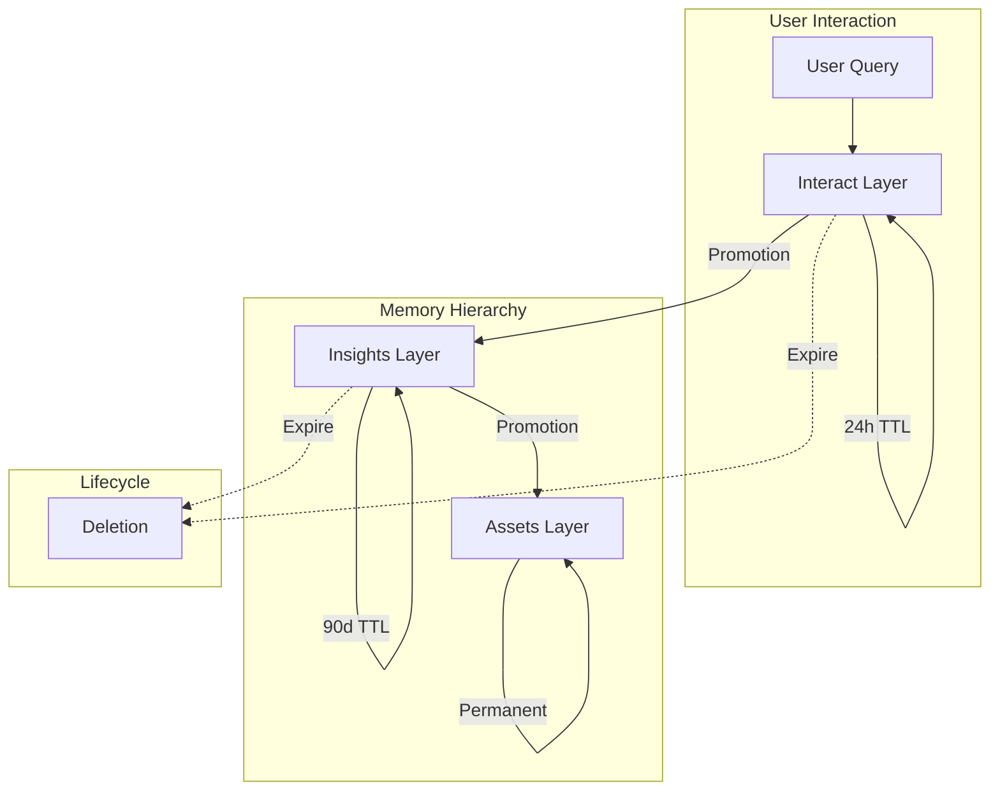
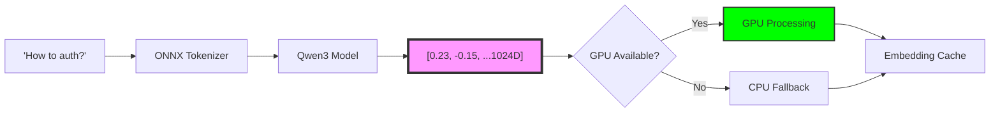
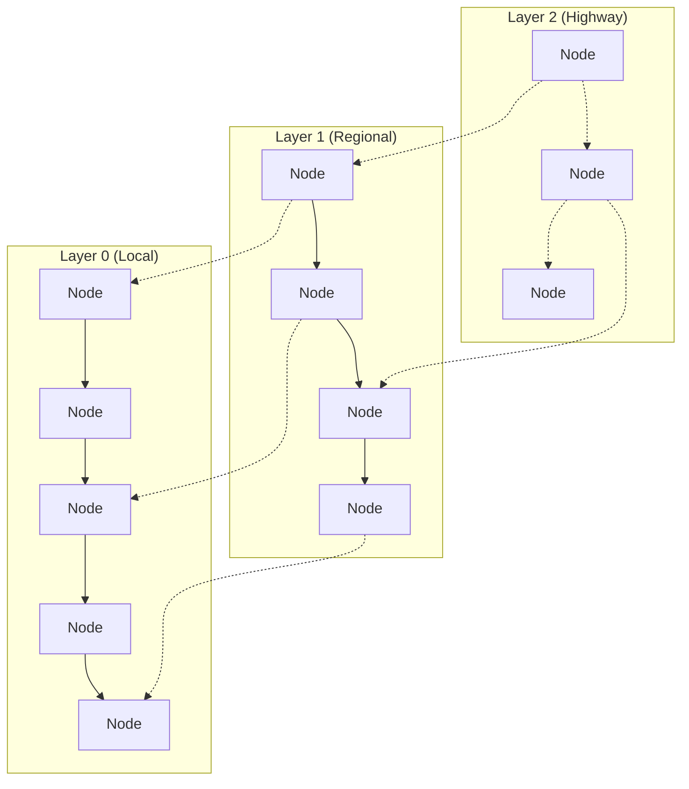
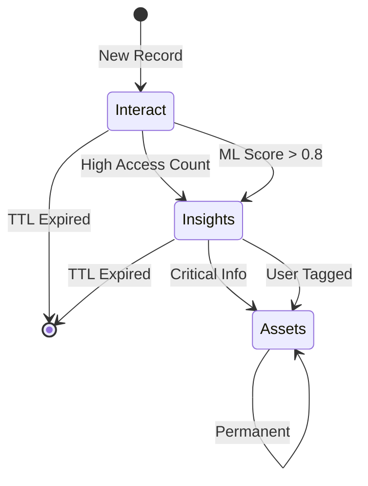
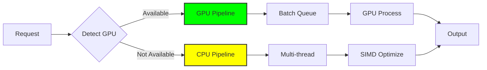
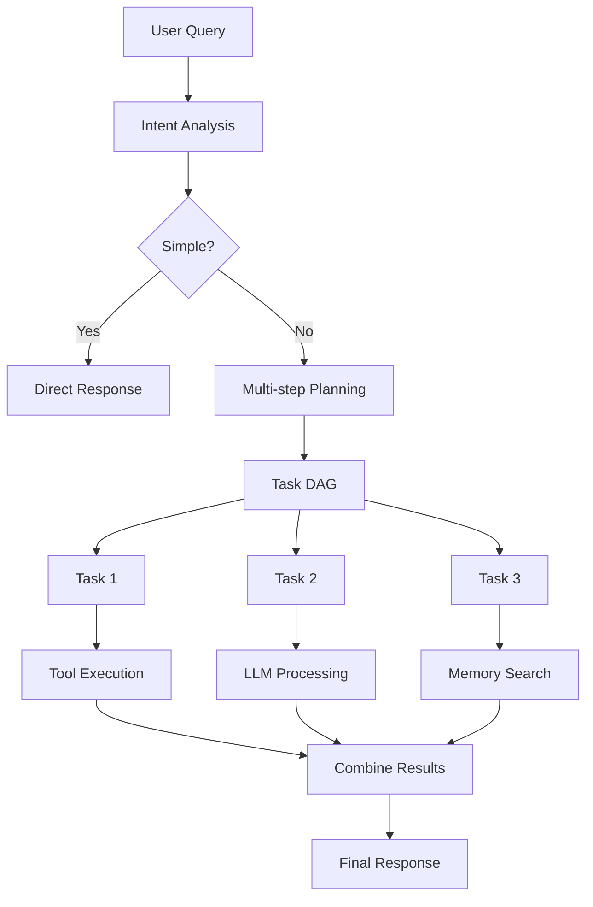
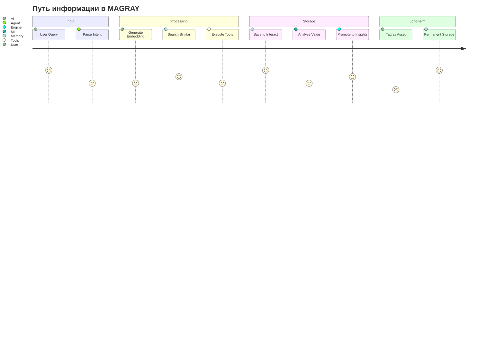

# Core Concepts - Ключевые концепции проекта

> Лист архитектурного одуванчика - центральные концепции и ментальная модель MAGRAY CLI

[[_Architecture Hub - Центр архитектурной информации]] → Core Concepts

## 🧠 Ментальная модель MAGRAY

**Реальный статус: 95% production ready, 35.4% test coverage**

## 🔑 Ключевые концепции

### 1. Трёхслойная память

Память в MAGRAY организована как иерархия с разными TTL:

**Принцип**: Информация продвигается вверх по мере важности и использования.

### 2. Векторные представления (Embeddings)

Текст преобразуется в 1024-мерные векторы через ONNX модель Qwen3:

**Принцип**: Близкие по смыслу тексты имеют близкие векторы. Автоматический fallback CPU↔GPU.

### 3. Граф навигации (HNSW Algorithm)

HNSW создаёт многослойный граф для быстрого поиска:

**Принцип**: Иерархическая навигация O(log n) через hnsw_rs библиотеку. Реальная производительность: <5ms.

### 4. Механизм продвижения (Promotion Engine)

Автоматическое продвижение ценной информации:

**Принцип**: Ценность определяется использованием и ML-оценкой. Статус: 75% готовности, используются BTreeMap индексы.

### 5. Адаптивное ускорение (GPU Acceleration)

Автоматический выбор оптимального устройства:

**Принцип**: Максимальная производительность на доступном железе. Статус: 100% готово с automatic fallback.

### 6. Агентная архитектура (Agent Intelligence)

Умная маршрутизация и планирование:

**Принцип**: От простого к сложному через декомпозицию. Статус: 60% готовности, базовая маршрутизация работает.

## 🔄 Жизненный цикл данных

### От ввода к постоянному хранению

## 🎯 Ключевые инварианты (реальное состояние)

1. **Данные всегда имеют embedding** - Qwen3 1024D векторы ✅
2. **Слои изолированы** - прямой переход только вверх ✅
3. **TTL строго соблюдается** - автоматическая очистка ⚠️ (в разработке)
4. **GPU fallback гарантирован** - CUDA→CPU автоматически ✅
5. **Контекст ограничен** - окно памяти для LLM ⚠️ (базовая реализация)
6. **Тестовое покрытие 35.4%** - критически низкое 🔴

## 🔗 Углубление в концепции

### Связанные темы

**Все детали доступны через центры одуванчиков:**
- **Архитектурные детали** → Через ARCHITECTURE Hub → Memory Layers
- **Компоненты реализации** → Через HOME → COMPONENTS одуванчик
- **Практические возможности** → Через HOME → FEATURES одуванчик

## 🏷️ Теги

#concepts #architecture #mental-model #leaf

---
[[_Architecture Hub - Центр архитектурной информации|← К центру архитектурного одуванчика]]