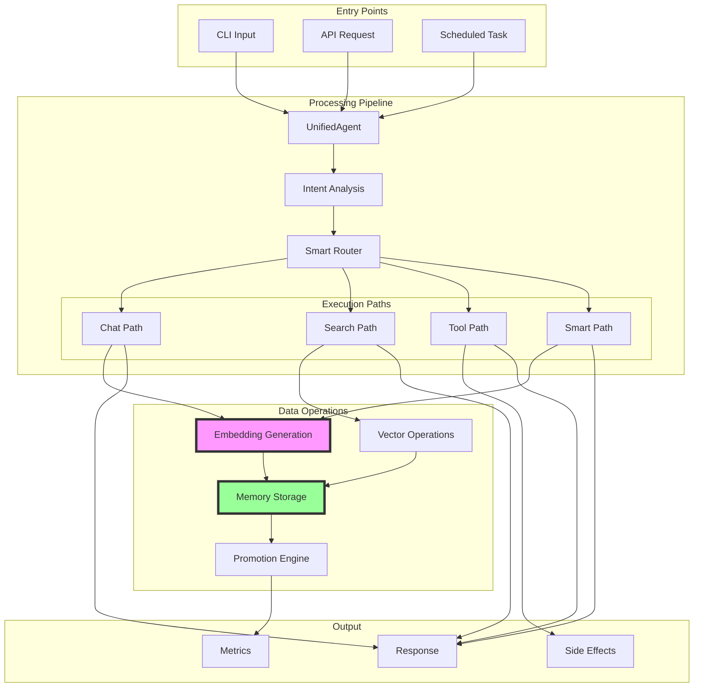
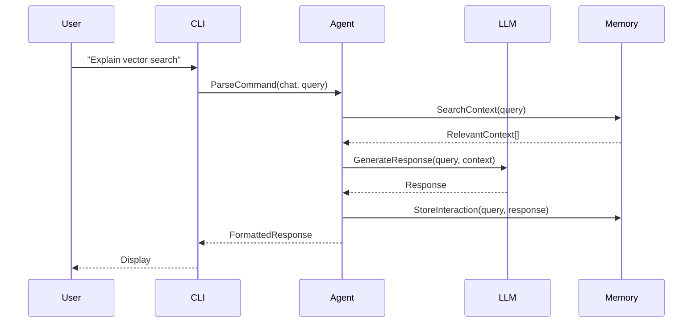
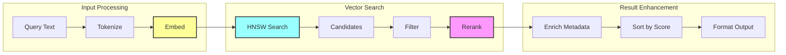
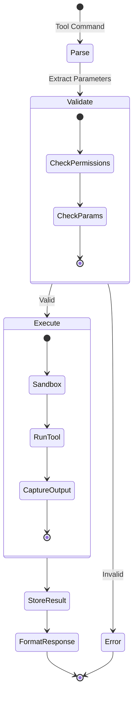
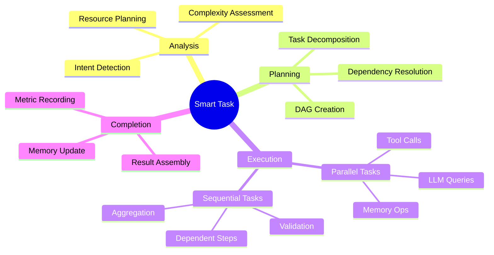
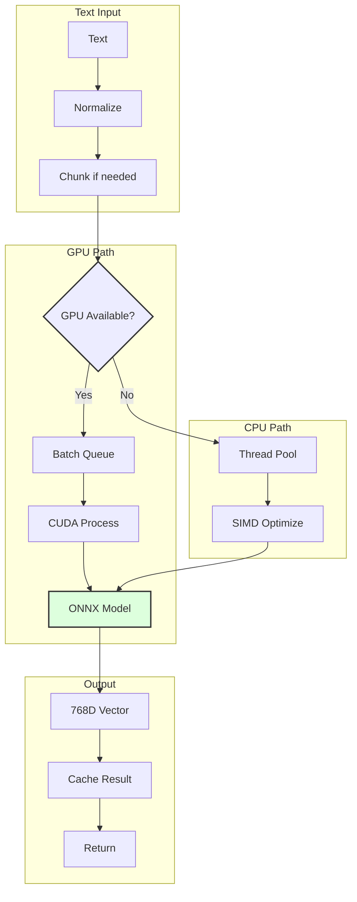
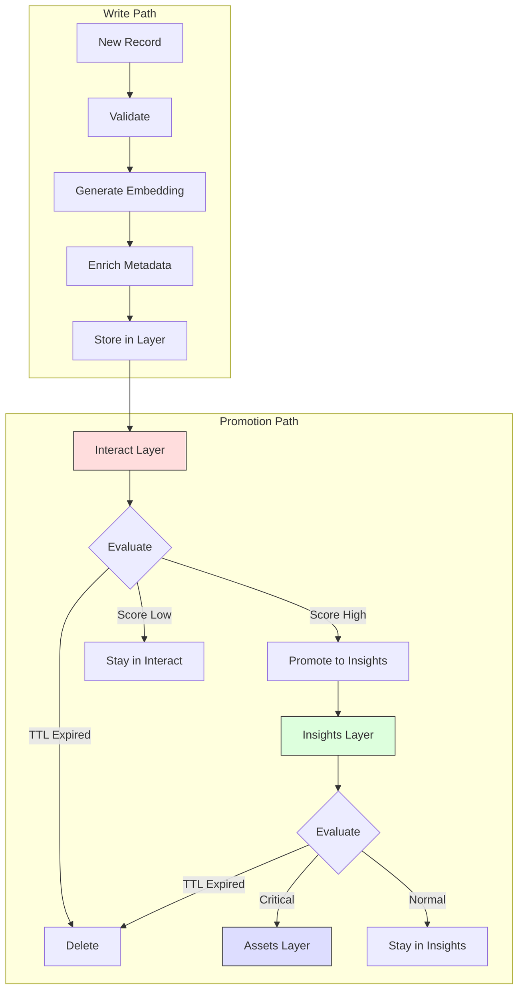
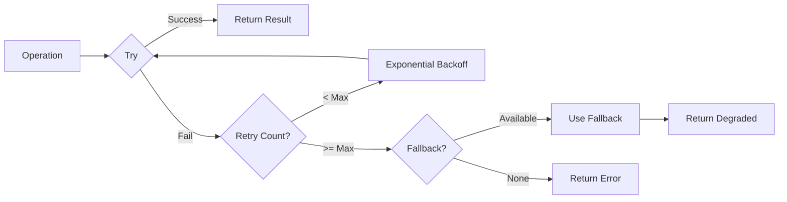
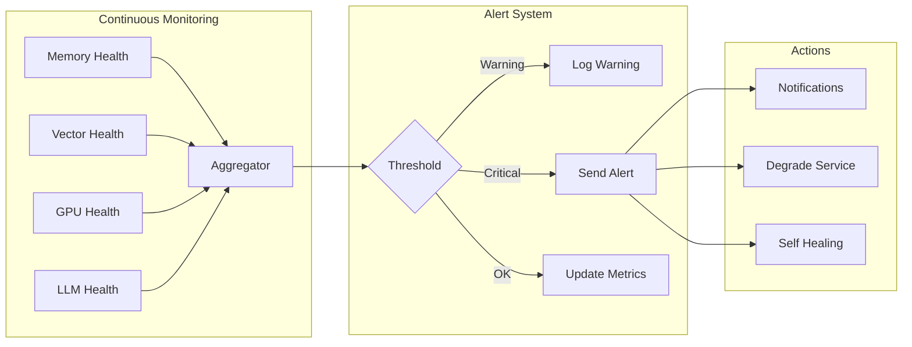

# Data Flow - Потоки данных через систему

> Лист архитектурного одуванчика - поток данных через компоненты MAGRAY

[[_Architecture Hub - Центр архитектурной информации]] → Data Flow

## 🌊 Общий поток данных

## 📝 Детальные потоки

### 1. Chat Flow - Диалоговый режим

### 2. Search Flow - Векторный поиск

### 3. Tool Flow - Выполнение инструментов

### 4. Smart Flow - Многошаговые задачи

## 🔄 Embedding Pipeline

### Генерация векторов

## 📊 Memory Operations Flow

### Запись и продвижение

## 🚦 Control Flow Patterns

### Retry & Fallback

### Health Monitoring

## 🏷️ Теги

#dataflow #architecture #pipeline #flow #leaf

---
[[_Architecture Hub - Центр архитектурной информации|← К центру архитектурного одуванчика]]