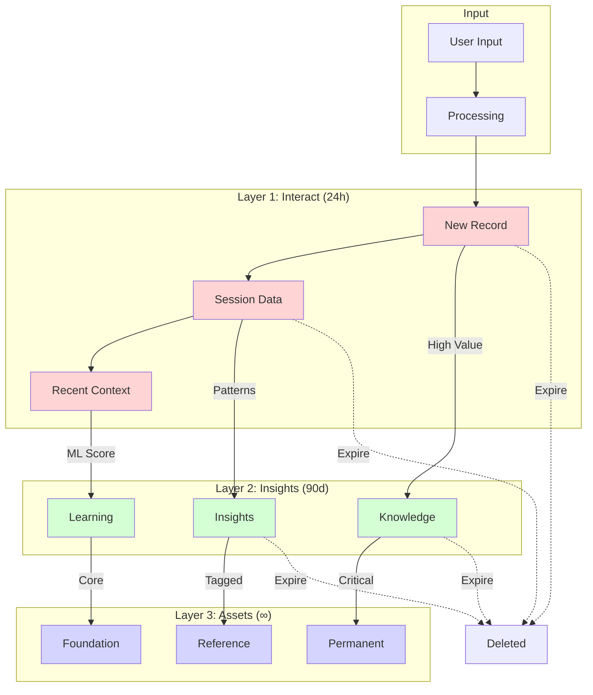
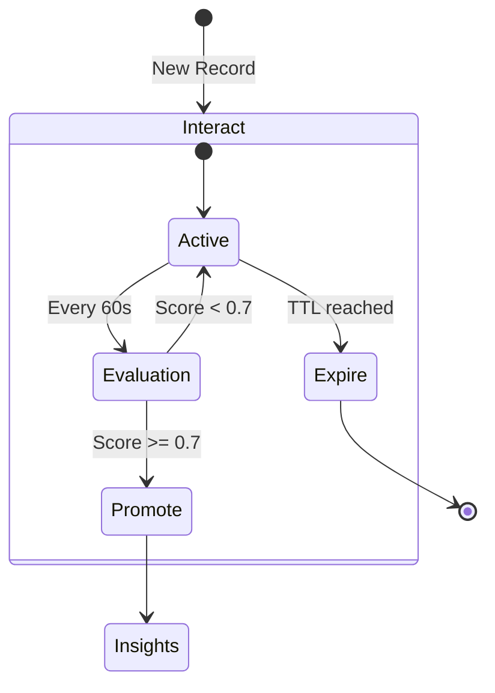
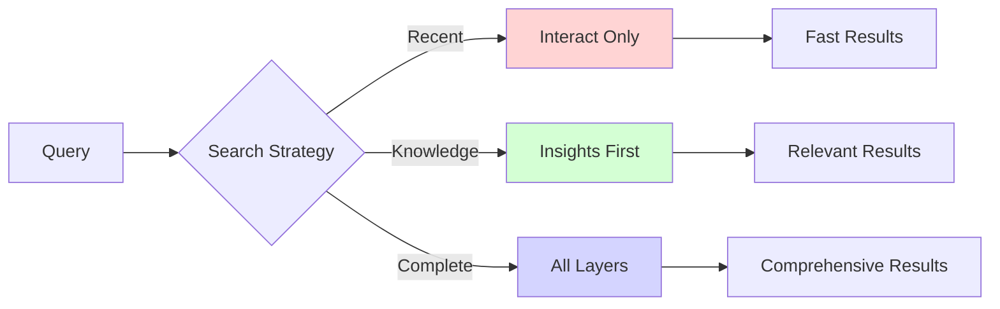

# Memory Layers - Трёхслойная архитектура памяти

> Лист архитектурного одуванчика - трёхслойная архитектура памяти MAGRAY

[[_Architecture Hub - Центр архитектурной информации]] → Memory Layers

## 🧠 Концептуальная модель (реальная реализация)

**Статус системы памяти: 70% готовности, VectorStore 65%, PromotionEngine 75%**

```mermaid
mindmap
  root((Memory System [70%]))
    Interact Layer
      TTL: 24 hours
      Session context
      User queries
      HNSW index [85%]
    
    Insights Layer  
      TTL: 90 days
      Extracted knowledge
      ML promotion [95%]
      BTreeMap time indices
    
    Assets Layer
      TTL: Permanent
      Core knowledge
      Permanent storage
      Manual tagging
```

## 📊 Архитектура слоёв



## 🔄 Жизненный цикл записи

### 1. Рождение в Interact (реальная реализация)

```rust
// Новая запись всегда начинается в Interact
let record = MemoryRecord {
    id: Uuid::new_v4(),
    layer: Layer::Interact,
    content: "User query about authentication".to_string(),
    embedding: Some(embedding_1024d), // Qwen3 1024D vector
    timestamp: Utc::now(),
    ttl: Some(Duration::hours(24)),
    metadata: MemoryMetadata {
        access_count: 1,
        last_accessed: Utc::now(),
        promotion_score: 0.0,
    },
};
```

### 2. Оценка для продвижения



### 3. Критерии продвижения

| Фактор | Вес | Описание |
|--------|-----|----------|
| Access Count | 30% | Частота обращений |
| Recency | 20% | Свежесть использования |
| Semantic Value | 25% | ML оценка важности |
| User Feedback | 15% | Явные отметки |
| Link Density | 10% | Связанность с другими |

## 💾 Физическая организация

### Структура хранения (реальная архитектура)

```mermaid
graph LR
    subgraph "VectorStore [65%]"
        DB[(Sled Database)]
        
        subgraph "Vector Indexes"
            HNSW1[HNSW Interact [85%]]
            HNSW2[HNSW Insights [85%]]
            HNSW3[HNSW Assets [85%]]
        end
        
        subgraph "Time Indexes"
            BT1[BTreeMap Interact]
            BT2[BTreeMap Insights]
            BT3[BTreeMap Assets]
        end
        
        subgraph "Caching Layer"
            CACHE[EmbeddingCache [85%]]
            LRU[LRU Cache [90%]]
        end
    end
    
    DB --> HNSW1
    DB --> HNSW2
    DB --> HNSW3
    
    DB --> BT1
    DB --> BT2
    DB --> BT3
    
    HNSW1 --> CACHE
    HNSW2 --> CACHE
    HNSW3 --> CACHE
    CACHE --> LRU
```

### Ключевые характеристики (реальные метрики)

| Слой | Размер | HNSW Поиск | Готовность | Особенности |
|------|--------|-------------|------------|-------------|
| Interact | <100K | <5ms | 85% | In-memory индекс |
| Insights | <1M | <5ms | 85% | Sled + HNSW |
| Assets | <10M | <5ms | 85% | Disk-based |

**Общая производительность**: O(log n) поиск, hnsw_rs library

## 🎯 Оптимизации по слоям

### Interact Layer
- **In-memory cache** - все записи в RAM
- **Fast expiry** - быстрая очистка по TTL
- **Minimal indexing** - только необходимые индексы

### Insights Layer
- **Balanced approach** - RAM + disk
- **Smart caching** - LRU для горячих данных
- **Compression** - сжатие старых записей

### Assets Layer
- **Disk-first** - основное на диске
- **Memory-mapped** - mmap для больших данных
- **Archival ready** - готовность к архивированию

## 🔍 Поиск по слоям

### Стратегии поиска



### Приоритеты по умолчанию

1. **Chat mode**: Interact → Insights
2. **Search mode**: Insights → Assets → Interact
3. **Smart mode**: All layers равноправно

## 🚀 Best Practices

### Do's ✅
- Используйте правильный слой для данных
- Тегируйте важное для Assets
- Мониторьте promotion metrics
- Настраивайте TTL под use case

### Don'ts ❌
- Не обходите promotion logic
- Не храните всё в Assets
- Не игнорируйте TTL
- Не полагайтесь только на Interact

## 🔗 Связанные концепции

**Связанная информация доступна через центры одуванчиков:**
- **Компоненты реализации** → Через HOME → COMPONENTS → Memory Mind Map
- **Практическое использование** → Через HOME → FEATURES → Memory Management

## 🏷️ Теги

#memory #layers #architecture #concept #leaf

---
[[_Architecture Hub - Центр архитектурной информации|← К центру архитектурного одуванчика]]