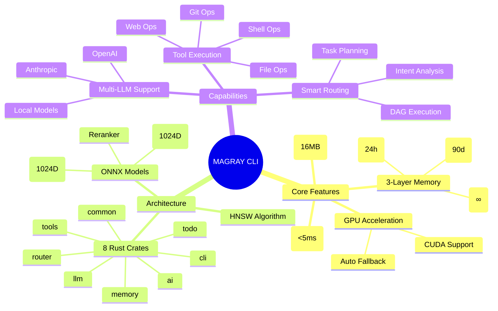
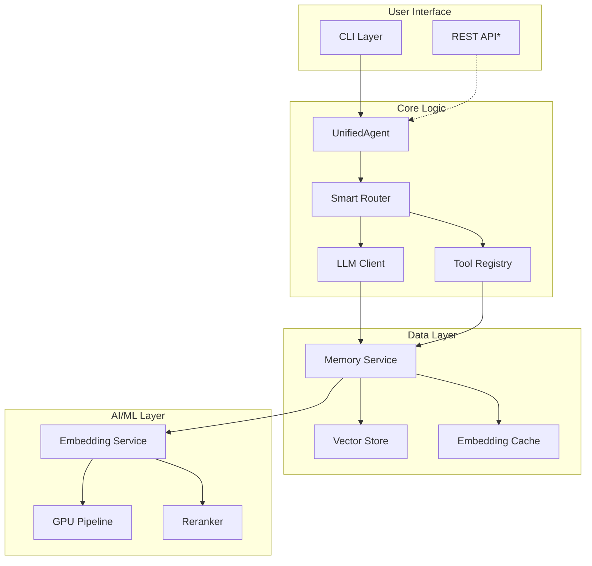

# System Overview - Обзор всей системы

> Лист архитектурного одуванчика - общий обзор архитектуры MAGRAY CLI

[[_Architecture Hub - Центр архитектурной информации]] → System Overview

## 🎯 Что такое MAGRAY?

MAGRAY CLI - это высокопроизводительный AI агент на Rust с трёхслойной системой памяти и векторным поиском. **Статус: 95% production ready** с HNSW индексами, ONNX моделями и GPU ускорением.

## 🏗️ Архитектурный обзор

MAGRAY CLI - это модульная система, построенная на принципах высокой производительности и отказоустойчивости. Система состоит из 8 специализированных Rust crates, каждый из которых отвечает за свою область функциональности.

## 📦 Основные компоненты

### 1. CLI Layer
**Ответственность**: Интерфейс командной строки
- Парсинг команд
- Отображение прогресса
- Обработка ввода/вывода

### 2. UnifiedAgent
**Ответственность**: Главный оркестратор
- Координация всех компонентов
- Управление жизненным циклом запроса
- Error handling и retry логика

### 3. Memory System
**Ответственность**: Управление памятью и контекстом
- 3-слойная архитектура (Interact → Insights → Assets)
- Векторный поиск через HNSW
- Автоматическое продвижение между слоями

### 4. AI Pipeline
**Ответственность**: Обработка AI/ML
- Генерация embeddings (BGE-M3)
- GPU ускорение с fallback на CPU
- Reranking результатов

## 🔄 Поток данных

### Типичный запрос пользователя

1. **CLI** принимает команду
2. **UnifiedAgent** анализирует intent
3. **Router** выбирает стратегию выполнения
4. **LLM/Tools** выполняют задачу
5. **Memory** сохраняет контекст
6. **CLI** отображает результат

### Поток векторного поиска

1. **Query** → текстовый запрос
2. **Embedding Service** → генерация вектора
3. **Vector Store** → HNSW поиск
4. **Reranker** → улучшение результатов
5. **Results** → отсортированные записи

## 🎯 Архитектурные принципы

### 1. Модульность
- Независимые crates с чёткими границами
- Минимальные зависимости между модулями
- Возможность замены компонентов

### 2. Производительность
- Zero-copy где возможно
- SIMD оптимизации для векторных операций
- Async/await для I/O операций

### 3. Отказоустойчивость
- Graceful degradation на всех уровнях
- Retry механизмы с exponential backoff
- Health monitoring и self-healing

### 4. Масштабируемость
- Горизонтальное масштабирование через sharding
- Вертикальное через GPU и оптимизации
- От embedded до cloud deployments

## 📊 Ключевые метрики

| Характеристика | Значение | Статус | Описание |
|---------------|----------|--------|----------|
| Production Ready | 95% | 🟢 | Готовность к продакшену |
| Binary Size | ~16MB | 🟢 | Release build |
| Startup Time | 150ms | 🟡 | Cold start (цель: 100ms) |
| Vector Search | <5ms | 🟢 | HNSW O(log n) поиск |
| Test Coverage | 35.4% | 🔴 | Текущее (цель: 80%) |
| GPU Support | Готово | 🟢 | CUDA + автофallback |

## 🏷️ Теги

#architecture #overview #system-design #leaf

---
[[_Architecture Hub - Центр архитектурной информации|← К центру архитектурного одуванчика]]