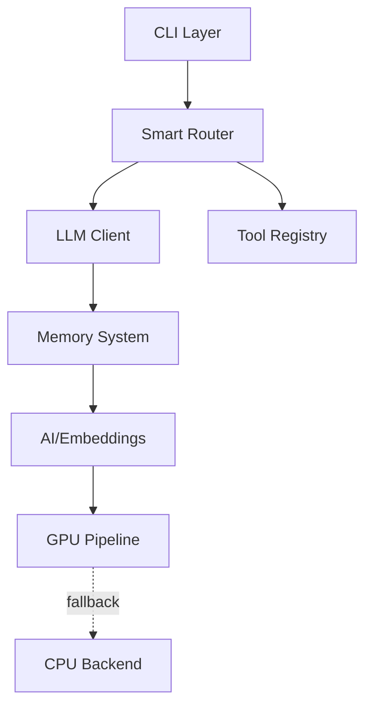

# Architecture Hub - Центр архитектурной информации

> Центральный узел одуванчика архитектуры MAGRAY CLI

[[Home]] → Architecture Hub

## Одуванчик ARCHITECTURE

### Листья архитектурного одуванчика

- [[System Overview - Обзор всей системы]] - Общий обзор архитектуры
- [[Core Concepts - Ключевые концепции проекта]] - Ключевые концепции и термины  
- [[Memory Layers - Трёхслойная архитектура памяти]] - Детали слоёв памяти
- [[Data Flow - Потоки данных через систему]] - Поток данных в системе

## 🏗️ Архитектурный обзор

MAGRAY CLI построен на принципах:

1. **Модульность** - 8 независимых crates в workspace
2. **Производительность** - Zero-copy где возможно, SIMD оптимизации
3. **Отказоустойчивость** - Graceful fallback на всех уровнях
4. **Масштабируемость** - От embedded до cloud deployments

## 🔑 Ключевые компоненты

### Ключевые архитектурные элементы

**Архитектурная информация сосредоточена в листьях этого одуванчика:**
- Детальные компоненты и их реализация описаны в концептах
- Практическое применение архитектуры доступно через HOME → другие одуванчики

## 📊 Метрики архитектуры

| Характеристика | Значение | Описание |
|---------------|----------|----------|
| Crates | 8 | Модули в workspace |
| Слои памяти | 3 | Interact, Insights, Assets |
| Векторная размерность | 768 | BGE-M3 embeddings |
| Latency | <5ms | Поиск в векторной БД |
| Binary size | ~16MB | Release build |

## Навигация

Для перехода к другим областям используйте главный центр:
**HOME** → Выберите нужный одуванчик (Components, Features, или останьтесь в Architecture)

## 🏷️ Теги

#architecture #hub #center

---
[[Home|← К главному центру]]