# AI Mind Map - Визуальная карта AI crate

> Лист компонентного одуванчика - визуальная карта AI crate и его компонентов

[[_Components Hub - Центр всех компонентов системы]] → AI Mind Map

## 🧠 Полная карта AI System

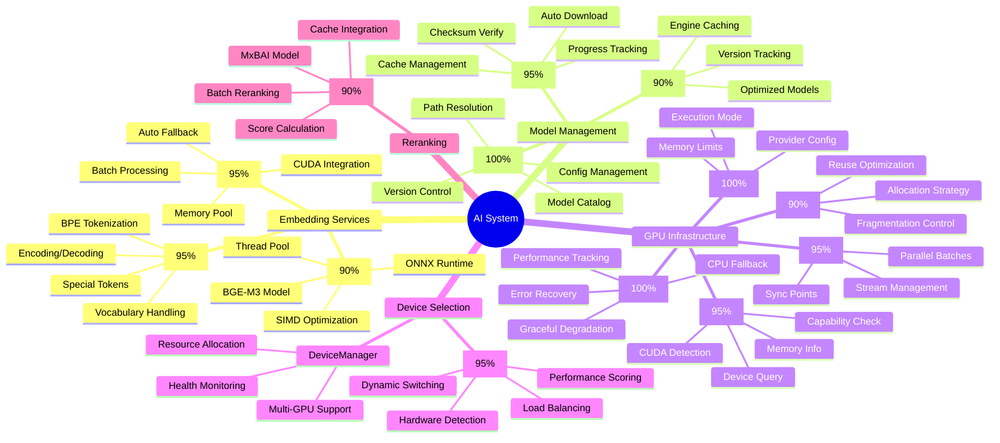

## 🔗 Взаимосвязи компонентов

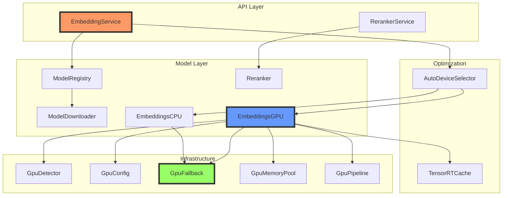

## 📊 Готовность компонентов

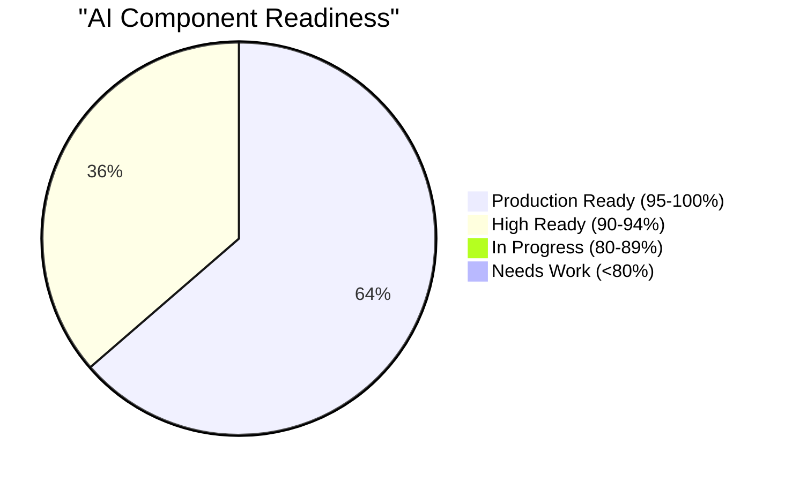

### Детальный статус

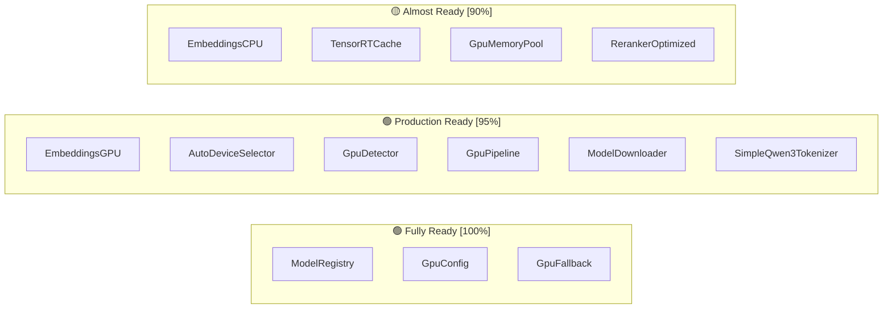

## 🎯 Критические пути обработки

### Path 1: Генерация эмбеддингов (GPU)

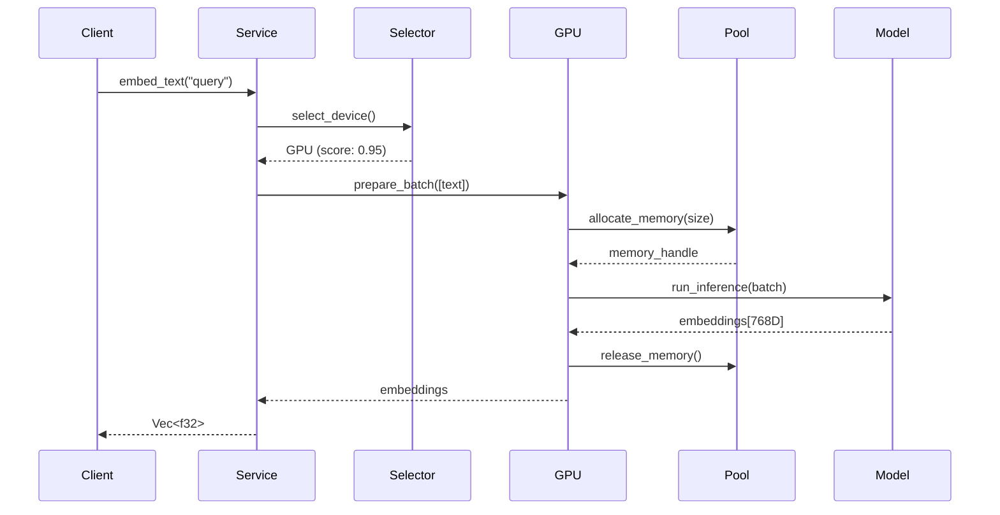

### Path 2: Fallback на CPU

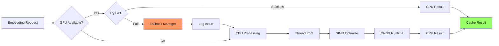

### Path 3: Batch обработка

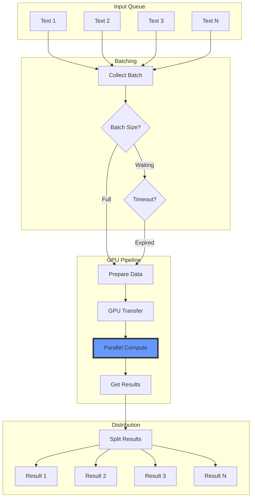

## 🚀 Оптимизации производительности

### GPU оптимизации

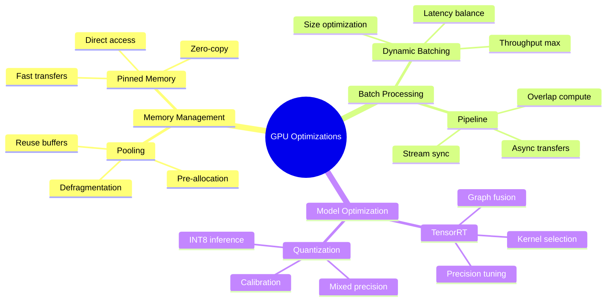

### CPU оптимизации

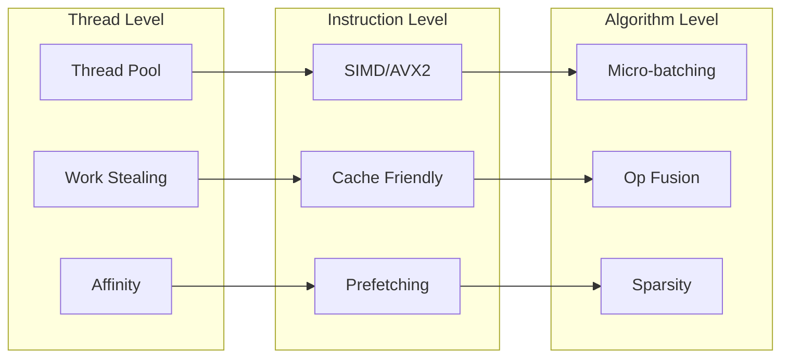

## 📈 Метрики производительности

### Сравнение устройств

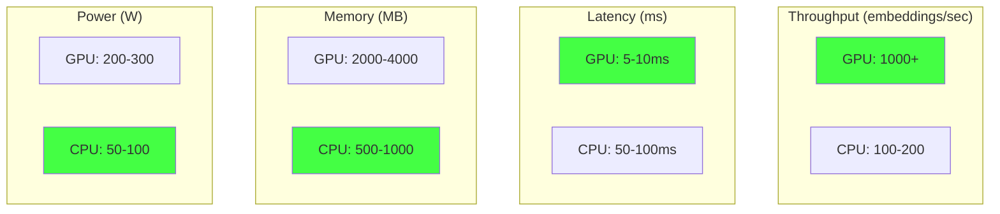

## 🔧 Конфигурация и настройка

### Переменные окружения

```bash
# GPU Configuration
ONNX_GPU_DEVICE_ID=0
ONNX_GPU_MEM_LIMIT=2048
ONNX_EXECUTION_MODE=parallel
ONNX_GRAPH_OPTIMIZATION=all

# Model Paths
MAGRAY_MODEL_DIR=/models
MAGRAY_CACHE_DIR=/cache

# Performance
MAGRAY_BATCH_SIZE=32
MAGRAY_BATCH_TIMEOUT_MS=100
MAGRAY_USE_TENSORRT=true
```

### Архитектурные паттерны

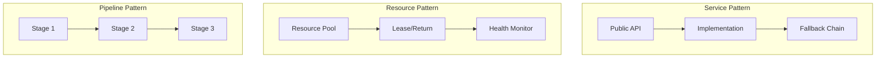

## 🏷️ Теги

#ai #gpu #mindmap #components #leaf

---
[[_Components Hub - Центр всех компонентов системы|← К центру компонентного одуванчика]]