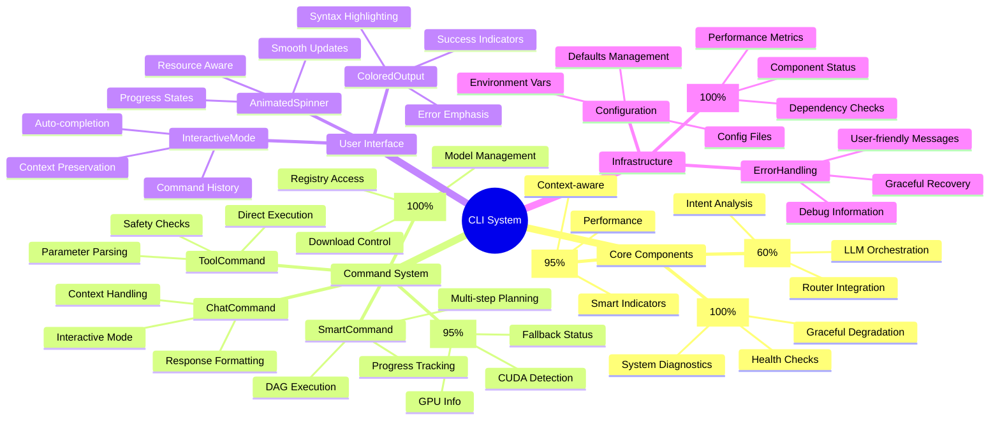
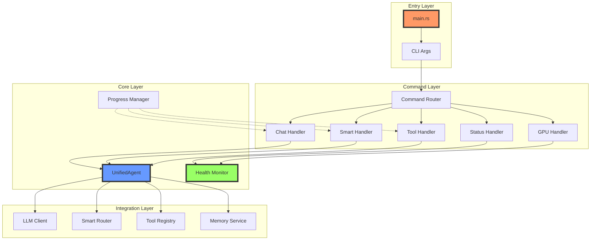
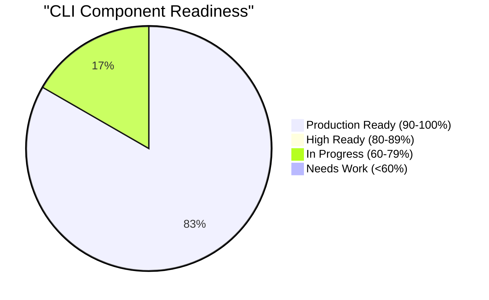
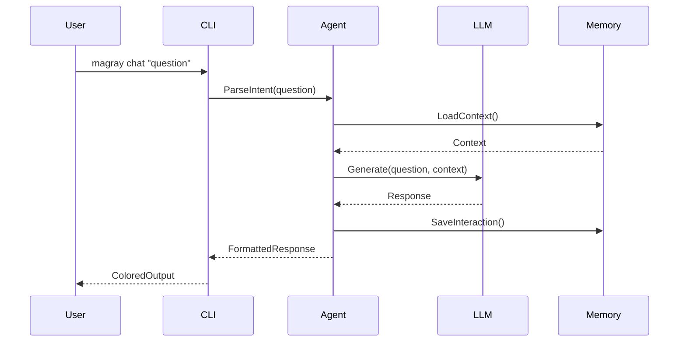
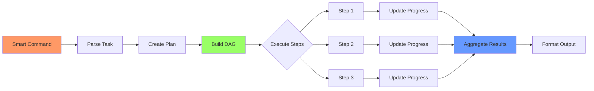
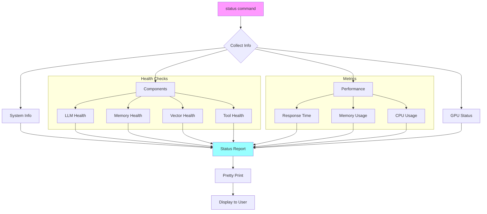
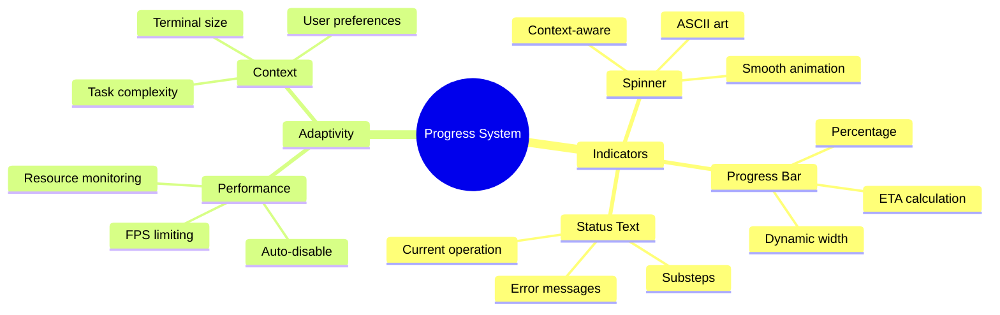
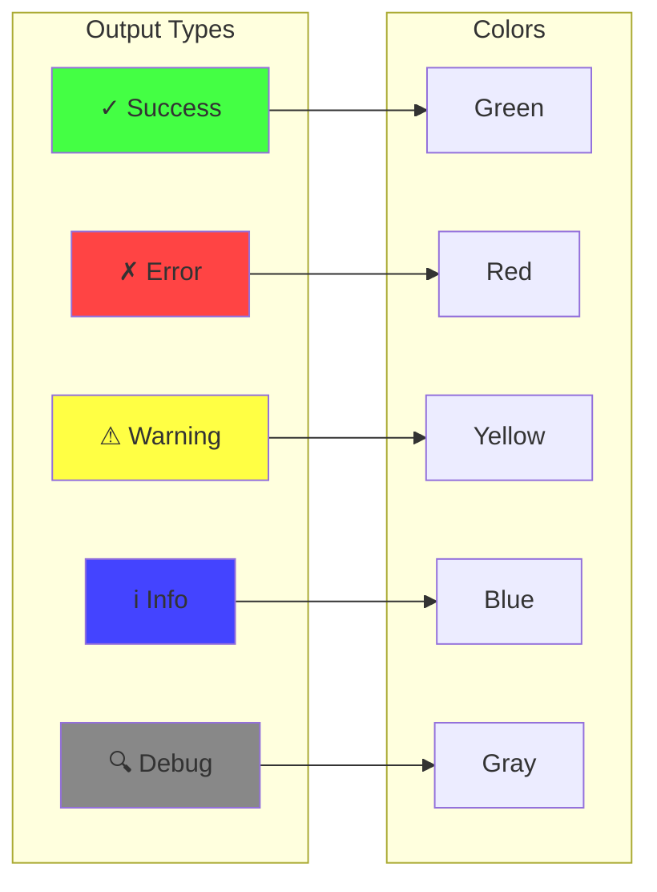
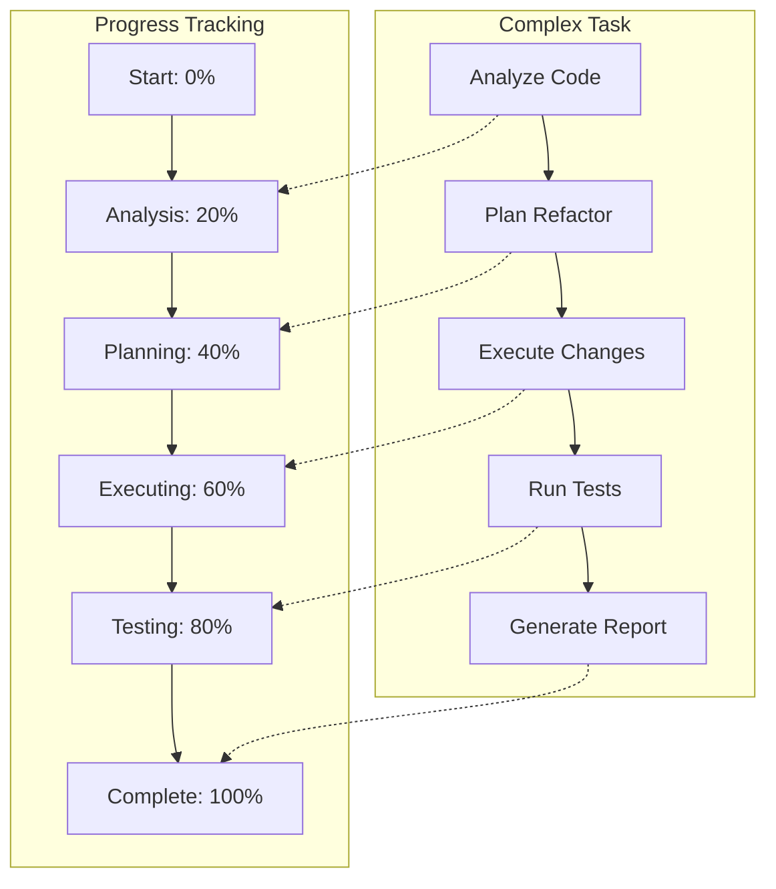
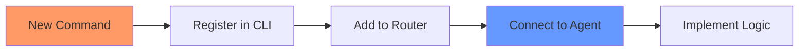

# CLI Mind Map - Визуальная карта CLI crate

> Лист компонентного одуванчика - визуальная карта CLI crate и его компонентов

[[_Components Hub - Центр всех компонентов системы]] → CLI Mind Map

## 🧠 Полная карта CLI System



## 🔗 Взаимосвязи компонентов



## 📊 Готовность компонентов



### Детальный статус

| Компонент | Готовность | Статус |
|-----------|------------|--------|
| StatusCommand | 100% | 🟢 Production |
| ModelsCommand | 100% | 🟢 Production |
| HealthChecks | 100% | 🟢 Production |
| GpuCommand | 95% | 🟢 Production |
| AdaptiveProgress | 95% | 🟢 Production |
| UnifiedAgent | 60% | 🟠 Active Dev |

## 🎯 Критические пути выполнения

### Path 1: Интерактивный чат



### Path 2: Smart команда



### Path 3: Диагностика системы



## 🎨 UI/UX компоненты

### Система прогресса



### Цветовая схема



## 🚀 Паттерны использования

### Основные команды

```bash
# Интерактивный режим
magray

# Одиночный чат
magray chat "explain vector search"

# Умное выполнение
magray smart "refactor auth module and add tests"

# Прямой инструмент
magray tool "git status"

# Системная информация
magray status

# GPU информация
magray gpu info

# Управление моделями
magray models list
```

### Продвинутые сценарии



## 🔧 Точки расширения

### Добавление новых команд

```rust
// Структура для новой команды
pub struct NewCommand {
    agent: UnifiedAgent,
    progress: ProgressManager,
}

impl Execute for NewCommand {
    async fn run(&self, args: Args) -> Result<()> {
        // Implementation
    }
}
```

### Интеграция с агентом



## 🏷️ Теги

#cli #interface #mindmap #components #leaf

---
[[_Components Hub - Центр всех компонентов системы|← К центру компонентного одуванчика]]