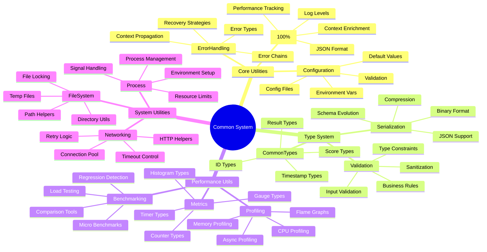
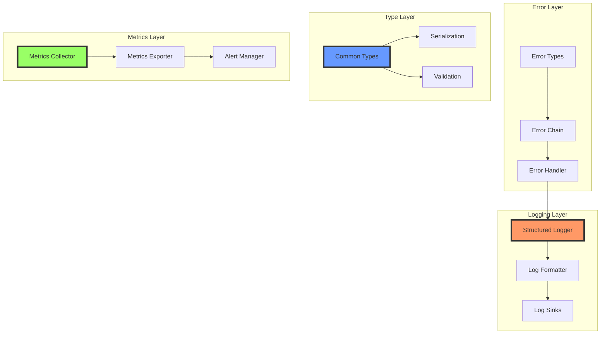
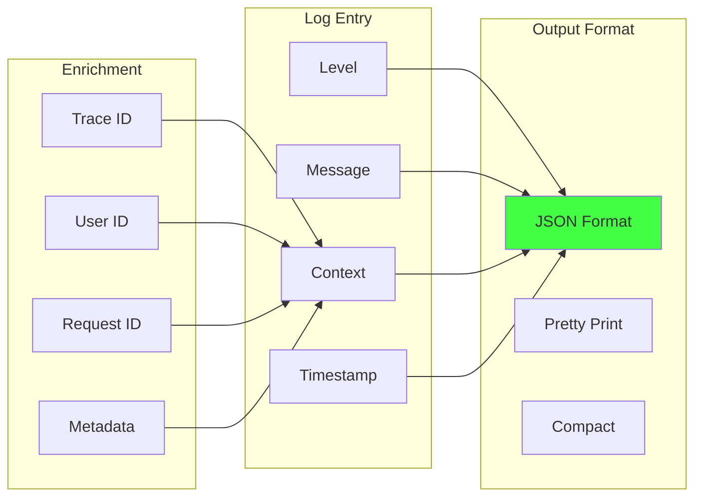
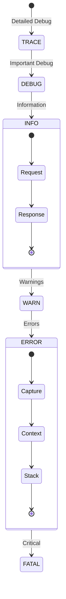
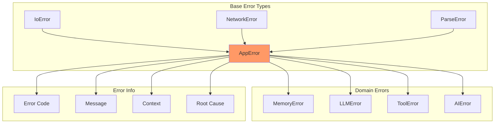
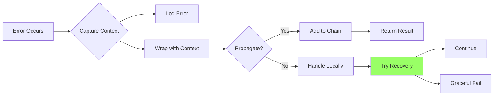
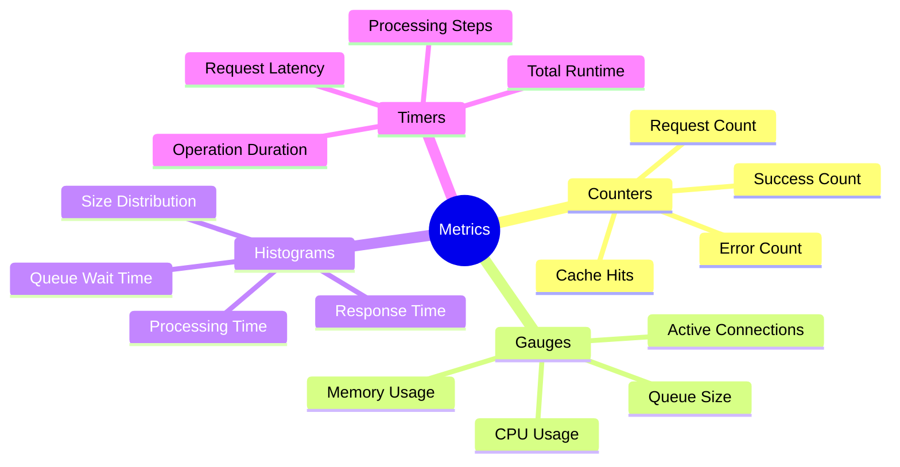
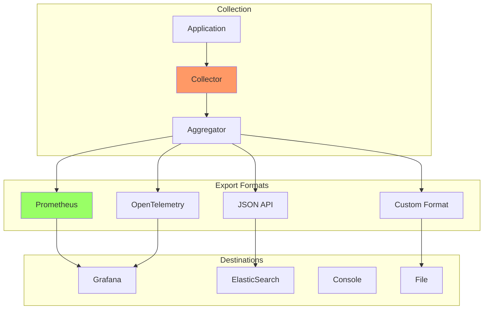
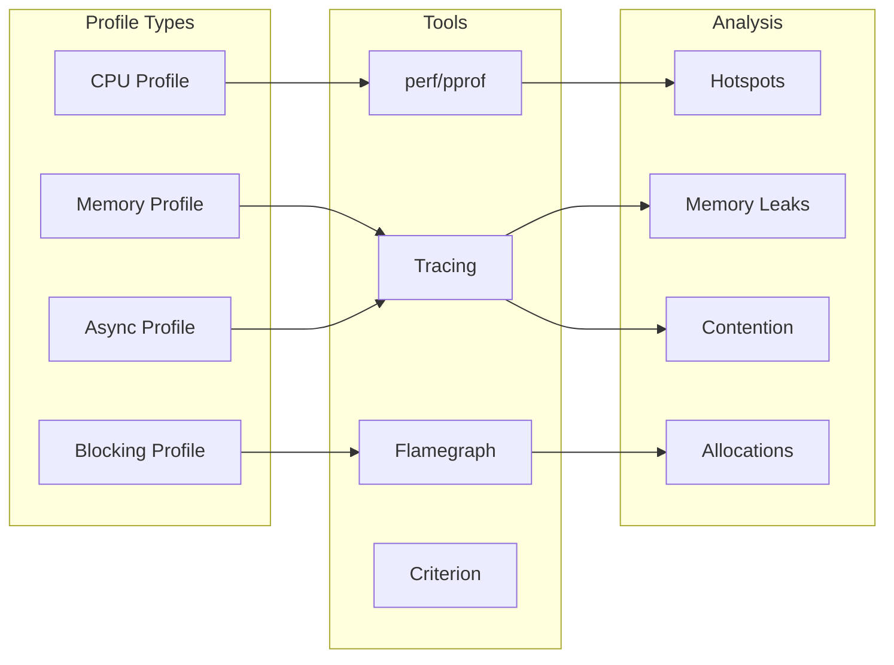

# Common Mind Map - Визуальная карта Common crate

> Лист компонентного одуванчика - визуальная карта Common crate и его компонентов

[[_Components Hub - Центр всех компонентов системы]] → Common Mind Map

## 🧠 Полная карта Common System



## 🔗 Взаимосвязи компонентов



## 📊 Logging система

### Структурированные логи



### Уровни логирования



## 🎯 Система ошибок

### Иерархия ошибок



### Обработка ошибок



## 🚀 Метрики и мониторинг

### Типы метрик



### Экспорт метрик



## 📈 Производительность утилит

### Профилирование



### Benchmark фреймворк

```rust
// Пример benchmark
#[bench]
fn bench_structured_log(b: &mut Bencher) {
    let logger = StructuredLogger::new();
    b.iter(|| {
        logger.info("test message")
            .with_context("request_id", "123")
            .with_metric("latency", 42.5)
            .log();
    });
}

// Результаты
// structured_log: 125 ns/iter (+/- 10)
// json_format:    450 ns/iter (+/- 25)
// file_write:     850 ns/iter (+/- 50)
```

## 🔧 Конфигурация

### Переменные окружения

```bash
# Logging
RUST_LOG=debug
LOG_FORMAT=json
LOG_OUTPUT=stdout

# Metrics
METRICS_ENABLED=true
METRICS_INTERVAL=60s
METRICS_ENDPOINT=:9090

# Performance
PROFILE_ENABLED=false
TRACE_ENABLED=false
BENCHMARK_RUNS=100
```

### Настройки по умолчанию

```yaml
common:
  logging:
    level: info
    format: json
    outputs:
      - stdout
      - file: /var/log/magray.log
    
  metrics:
    enabled: true
    interval: 60s
    exporters:
      - prometheus
      - json_api
    
  errors:
    capture_stack: true
    max_chain_depth: 10
    include_source: debug_only
```

## 🏷️ Теги компонентов

### По функциональности
- `#logging` - система логирования
- `#errors` - обработка ошибок
- `#metrics` - сбор метрик
- `#utilities` - общие утилиты
- `#performance` - инструменты производительности

### По готовности
- `#production-ready` - logging, базовые утилиты
- `#stable` - метрики, профилирование
- `#experimental` - расширенный трейсинг

---
[[_Components Hub - Центр всех компонентов системы|← К центру компонентного одуванчика]]