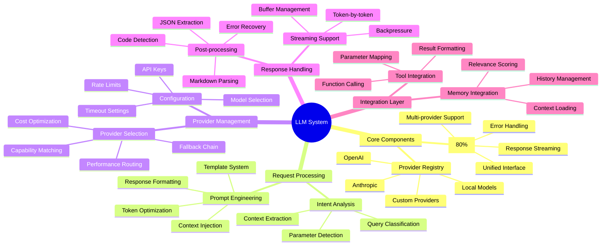
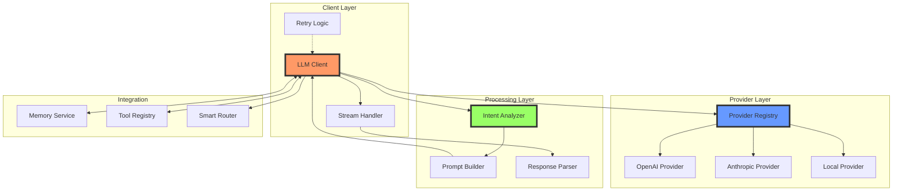
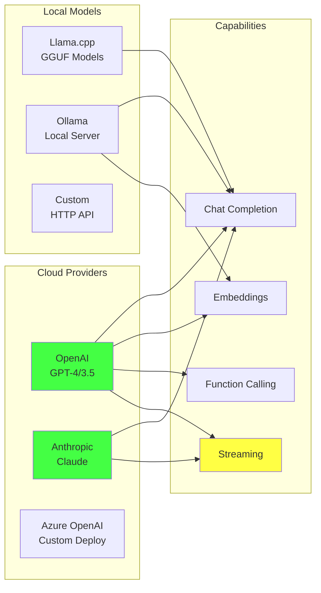
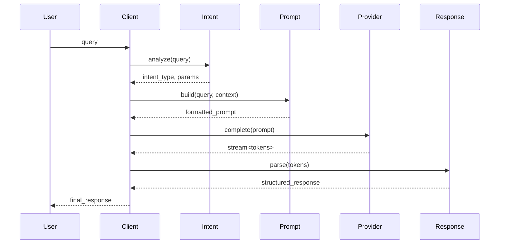
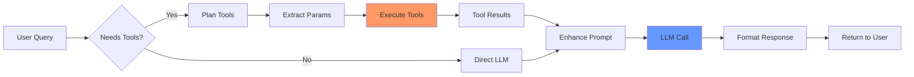
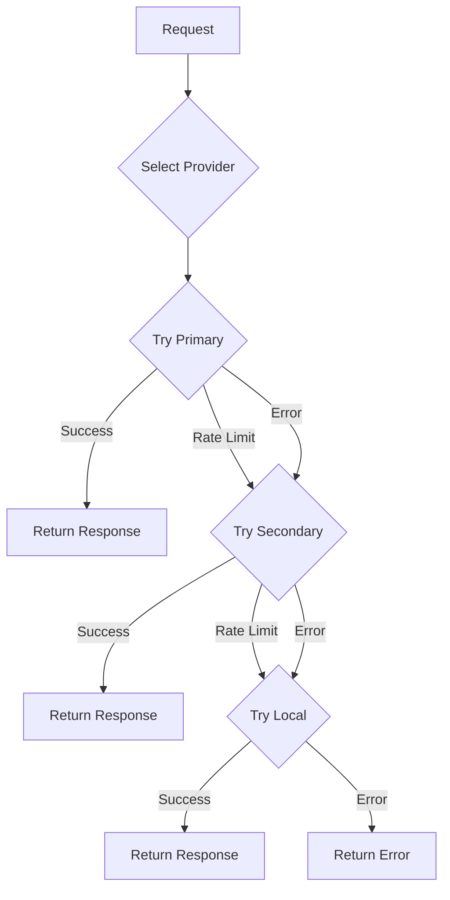
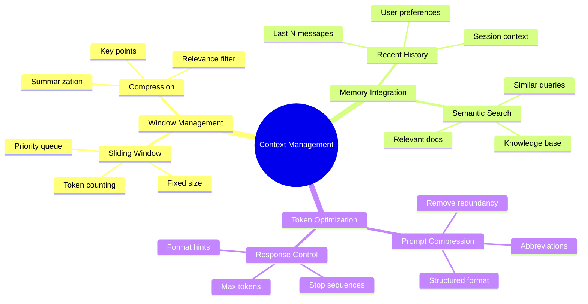
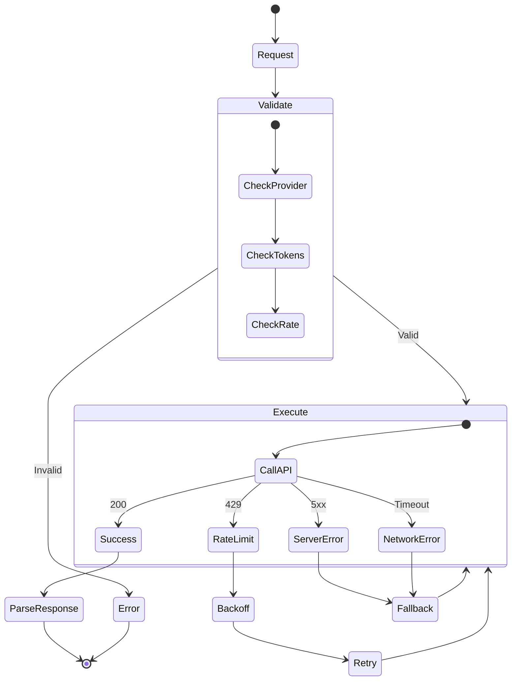
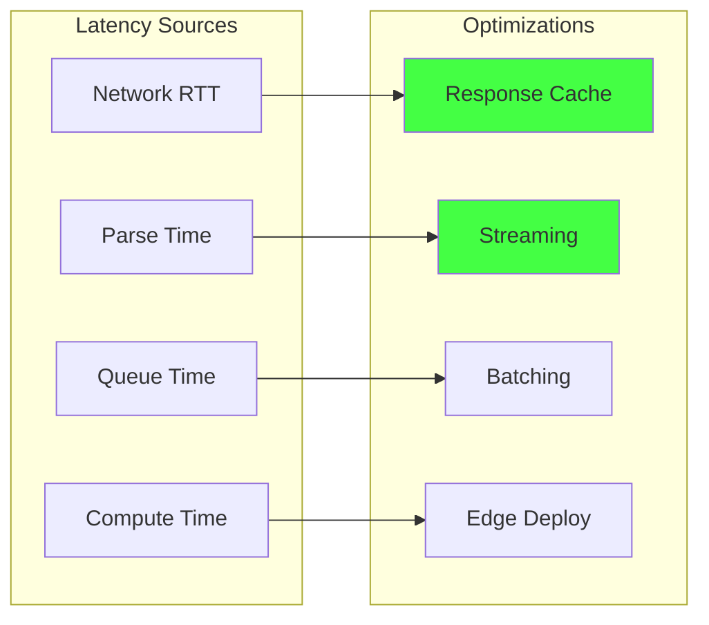
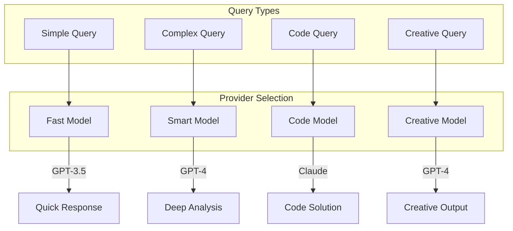

# LLM Mind Map - Визуальная карта LLM crate

> Лист компонентного одуванчика - визуальная карта LLM crate и его компонентов

[[_Components Hub - Центр всех компонентов системы]] → LLM Mind Map

## 🧠 Полная карта LLM System



## 🔗 Взаимосвязи компонентов



## 📊 Поддерживаемые провайдеры



## 🎯 Критические пути выполнения

### Path 1: Обычный запрос



### Path 2: С использованием инструментов



### Path 3: Multi-provider с fallback



## 🚀 Оптимизации и паттерны

### Управление контекстом



### Обработка ошибок



## 📈 Метрики производительности

### Сравнение провайдеров

| Provider | Latency | Tokens/sec | Cost/1K | Reliability |
|----------|---------|------------|---------|-------------|
| GPT-4 | 2-5s | 20-40 | $0.03 | 99.9% |
| GPT-3.5 | 0.5-2s | 50-100 | $0.001 | 99.9% |
| Claude | 1-3s | 30-60 | $0.02 | 99.5% |
| Local | 0.1-1s | 10-50 | $0 | 95% |

### Оптимизация задержки



## 🔧 Конфигурация

### Настройки провайдеров

```toml
[llm.openai]
api_key = "${OPENAI_API_KEY}"
model = "gpt-4o-mini"
max_tokens = 500
temperature = 0.7
timeout_ms = 30000

[llm.anthropic]
api_key = "${ANTHROPIC_API_KEY}"
model = "claude-3-sonnet"
max_tokens = 1000
temperature = 0.5

[llm.local]
endpoint = "http://localhost:11434"
model = "llama2:13b"
max_tokens = 2000
```

### Стратегии маршрутизации



## 🏷️ Теги

#llm #providers #mindmap #components #leaf

---
[[_Components Hub - Центр всех компонентов системы|← К центру компонентного одуванчика]]