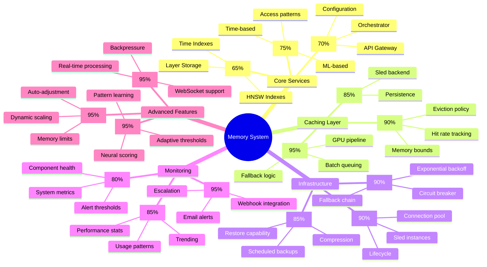
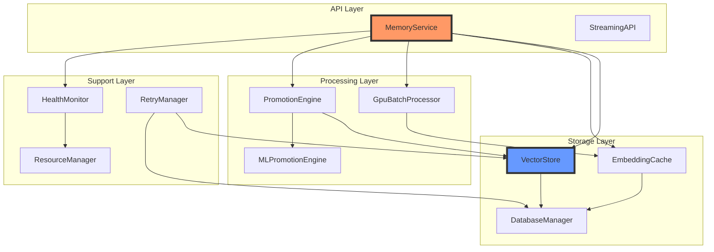
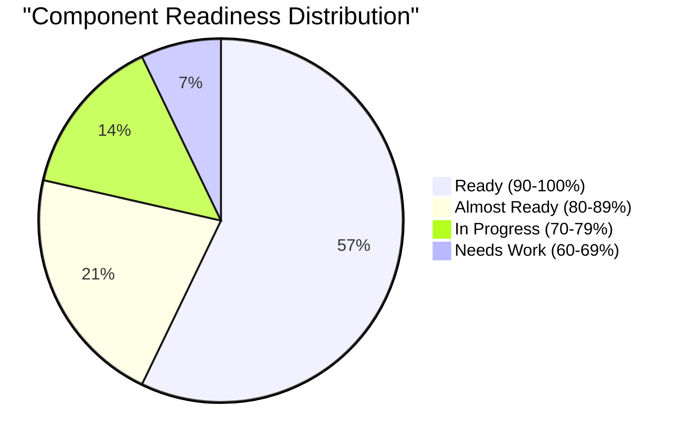
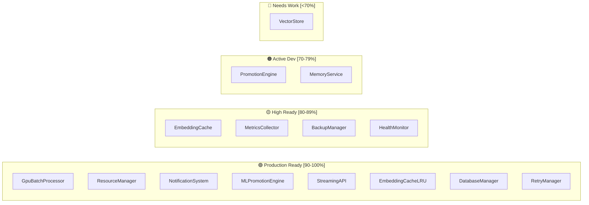
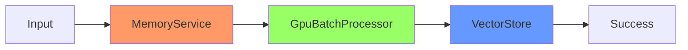
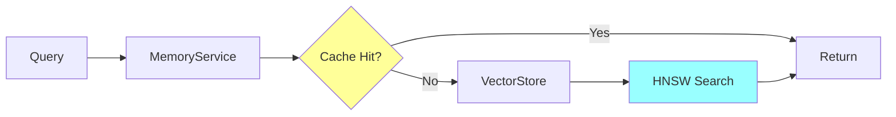

# Memory Mind Map - Визуальная карта memory crate

> Лист компонентного одуванчика - визуальная карта memory crate и его компонентов

[[_Components Hub - Центр всех компонентов системы]] → Memory Mind Map

## 🧠 Полная карта Memory System

## 🔗 Взаимосвязи компонентов

## 📊 Готовность компонентов

### По категориям

## 🎯 Критические пути

### Path 1: Запись данных

### Path 2: Поиск

### Path 3: Продвижение

## 🏷️ Теги

#memory #mindmap #components #leaf

---
[[_Components Hub - Центр всех компонентов системы|← К центру компонентного одуванчика]]