# Router Mind Map - Визуальная карта Router crate

> Лист компонентного одуванчика - визуальная карта Router crate и его компонентов

[[_Components Hub - Центр всех компонентов системы]] → Router Mind Map

## 🧠 Полная карта Router System

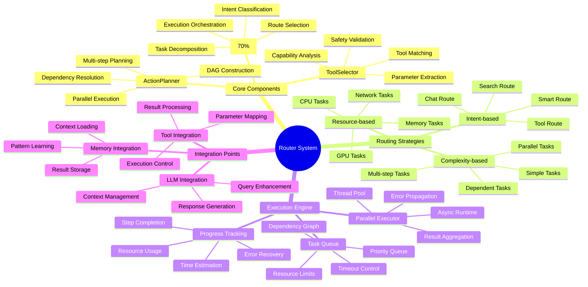

## 🔗 Взаимосвязи компонентов

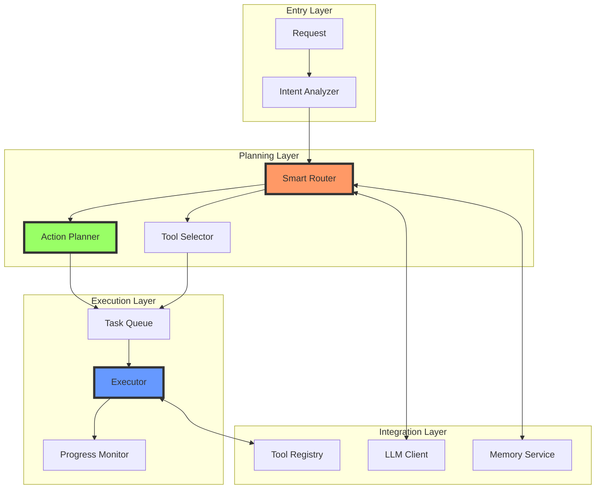

## 📊 Маршруты и стратегии

### Дерево решений маршрутизации

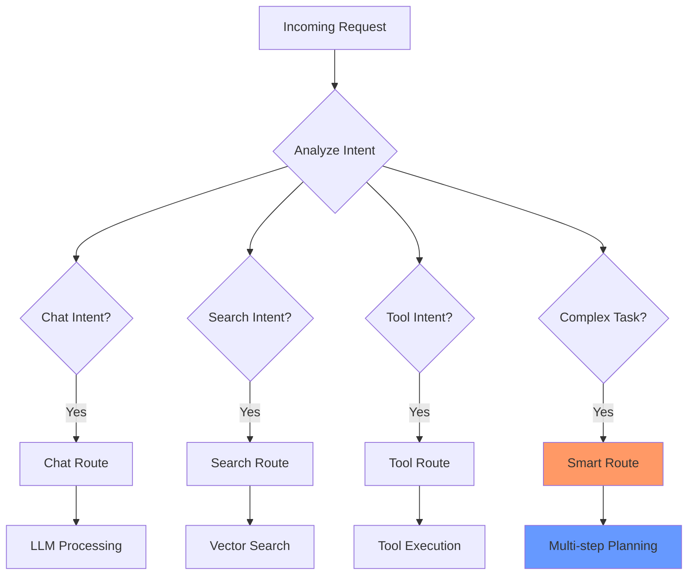

### Классификация задач

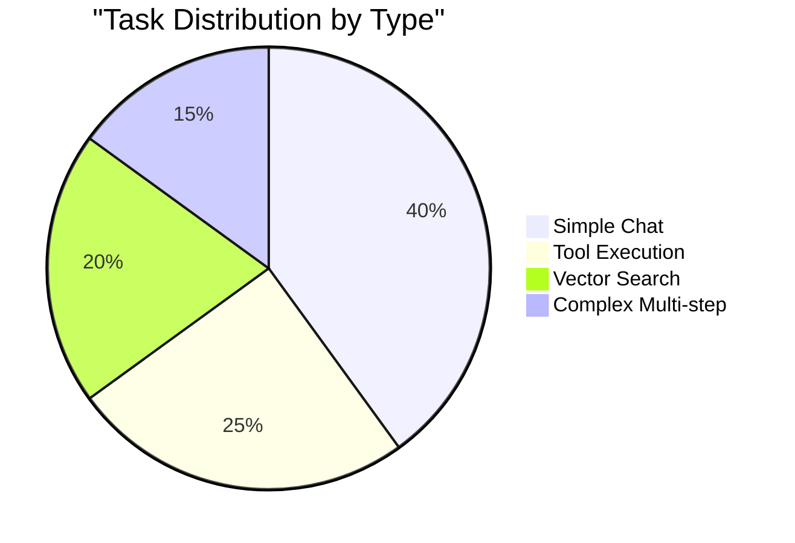

## 🎯 Критические пути выполнения

### Path 1: Simple Task Routing

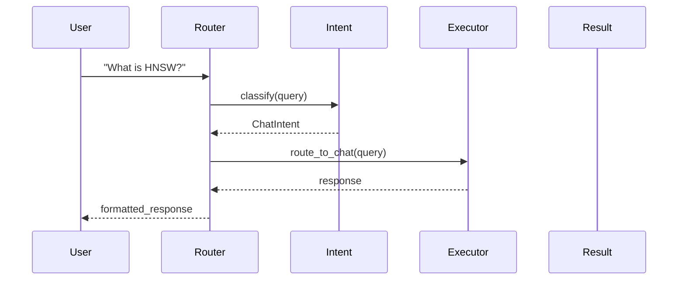

### Path 2: Multi-step Task Execution

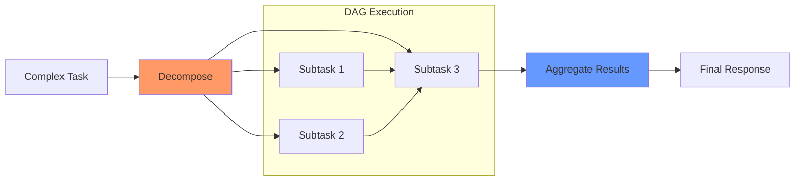

### Path 3: Tool Selection and Execution

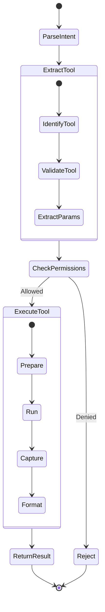

## 🚀 Паттерны планирования

### DAG Construction

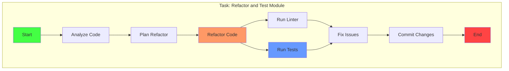

### Parallel vs Sequential

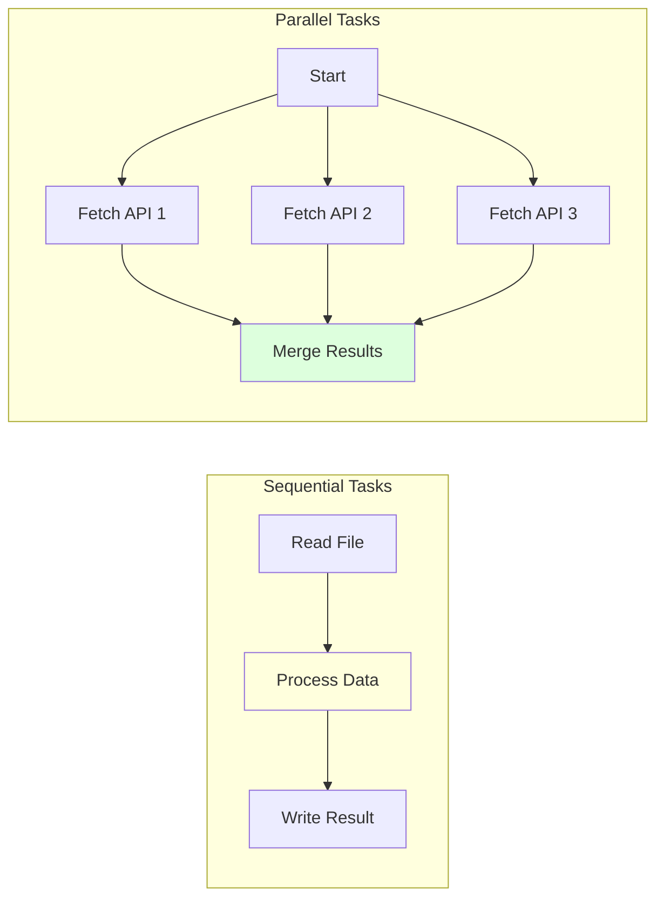

## 📈 Оптимизации маршрутизации

### Кэширование решений

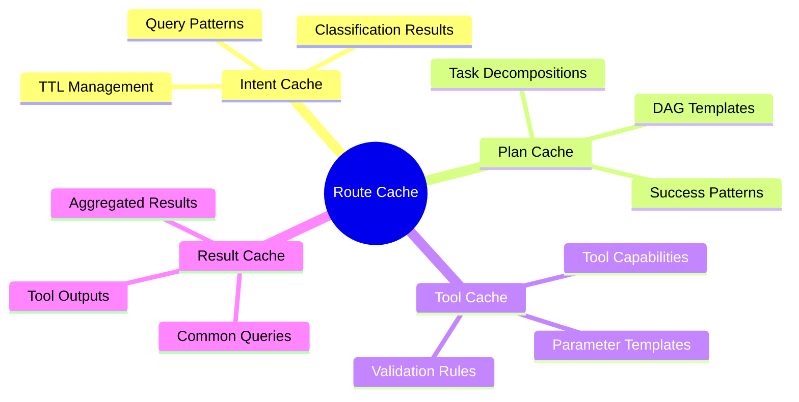

### Адаптивная маршрутизация

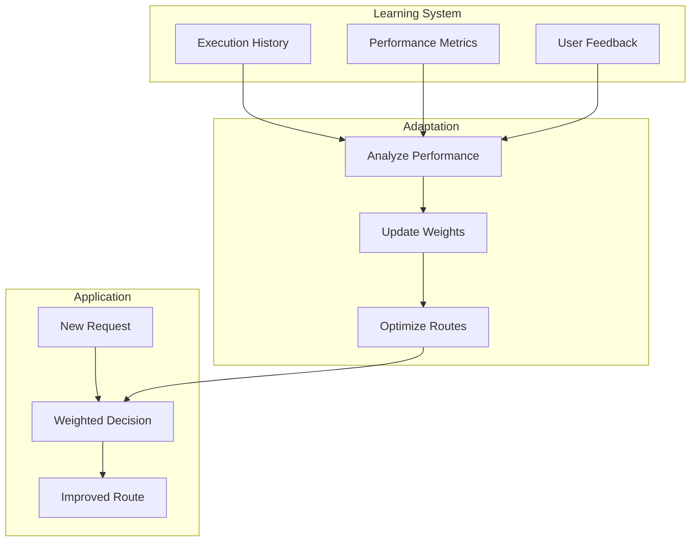

## 🔧 Конфигурация и настройка

### Параметры маршрутизации

```yaml
router:
  intent_classification:
    confidence_threshold: 0.8
    fallback_route: "chat"
    
  planning:
    max_steps: 10
    parallel_limit: 5
    timeout_per_step: 30s
    
  execution:
    retry_attempts: 3
    backoff_multiplier: 2
    max_queue_size: 100
    
  optimization:
    cache_ttl: 3600
    learning_rate: 0.1
    history_window: 1000
```

### Метрики производительности

| Metric | Current | Target | Status |
|--------|---------|--------|---------|
| Intent Accuracy | 92% | 98% | 🟡 |
| Planning Speed | 100ms | 50ms | 🟡 |
| Execution Success | 85% | 95% | 🟠 |
| Cache Hit Rate | 60% | 80% | 🟠 |

## 🏷️ Теги компонентов

### По функциональности
- `#routing` - маршрутизация запросов
- `#planning` - планирование задач
- `#execution` - выполнение задач
- `#orchestration` - оркестрация
- `#optimization` - оптимизации

### По готовности
- `#active-development` - основная логика
- `#needs-optimization` - производительность
- `#planned` - адаптивное обучение

---
[[_Components Hub - Центр всех компонентов системы|← К центру компонентного одуванчика]]