# Todo Mind Map - Визуальная карта Todo crate

> Лист компонентного одуванчика - визуальная карта Todo crate и его компонентов

[[_Components Hub - Центр всех компонентов системы]] → Todo Mind Map

## 🧠 Полная карта Todo System

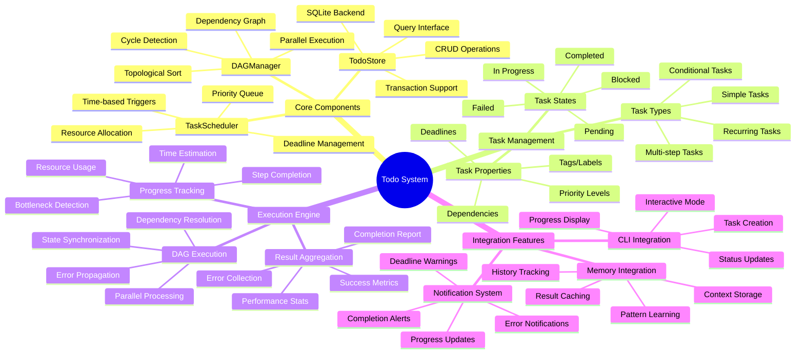

## 🔗 Взаимосвязи компонентов

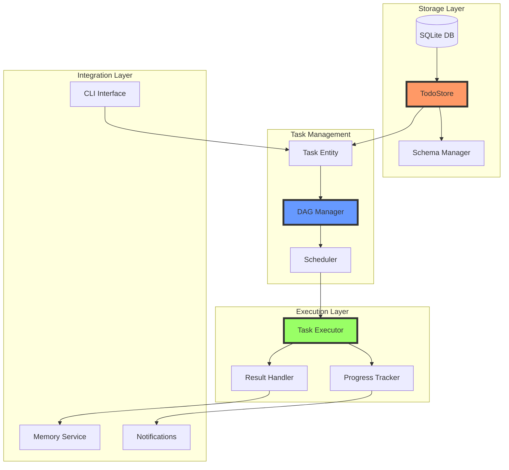

## 📊 Task Lifecycle

### Состояния задачи

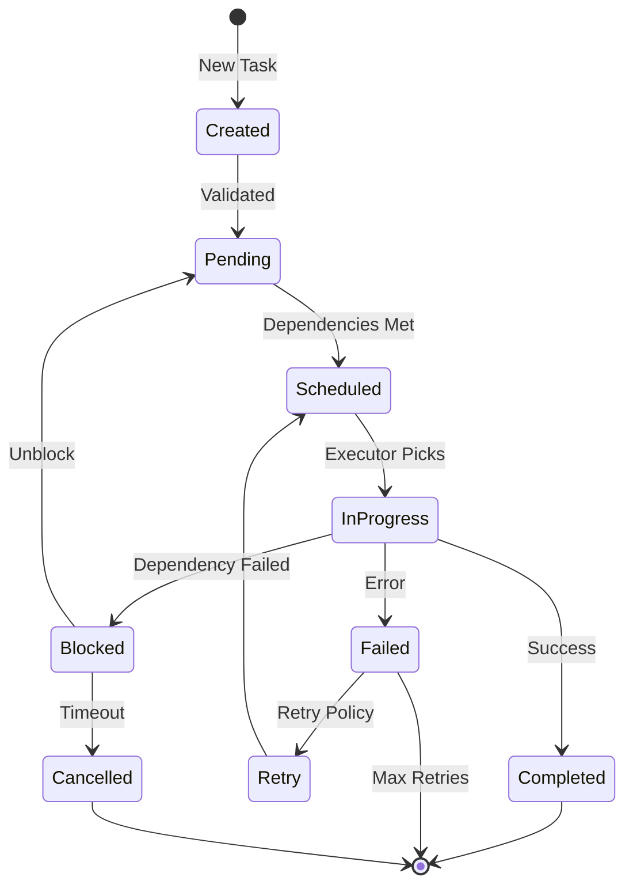

### DAG выполнение

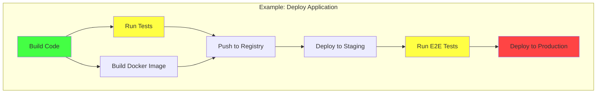

## 🎯 Критические функции

### Path 1: Создание и планирование задачи

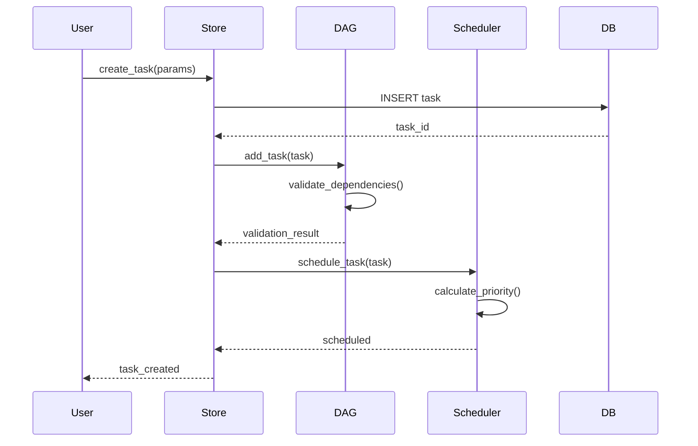

### Path 2: Выполнение DAG

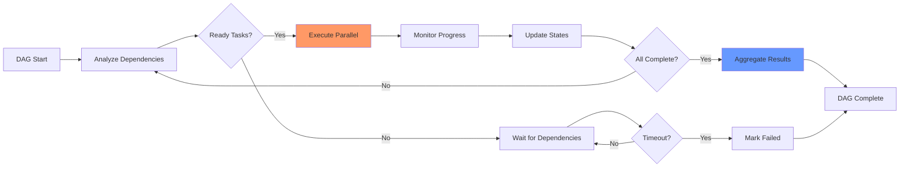

### Path 3: Прогресс трекинг

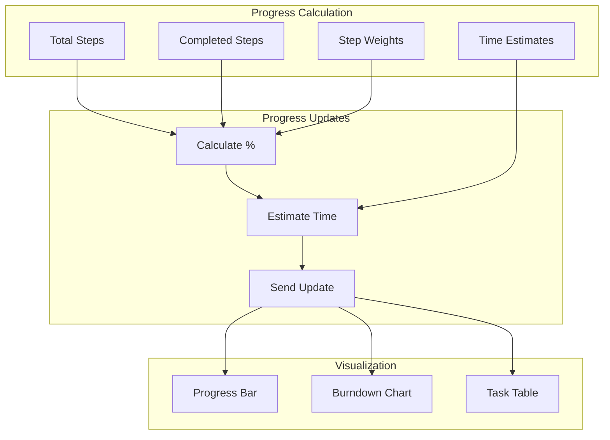

## 🚀 Продвинутые возможности

### Умное планирование

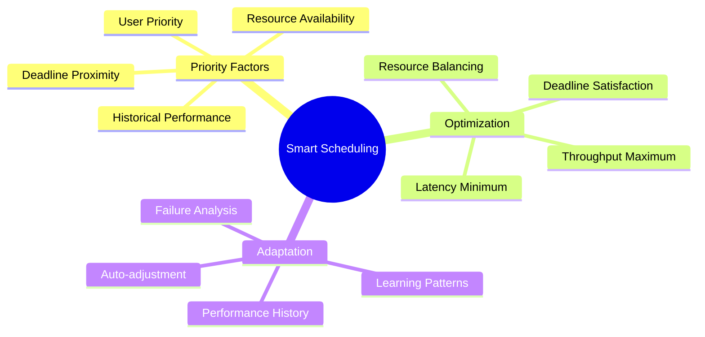

### Обработка ошибок

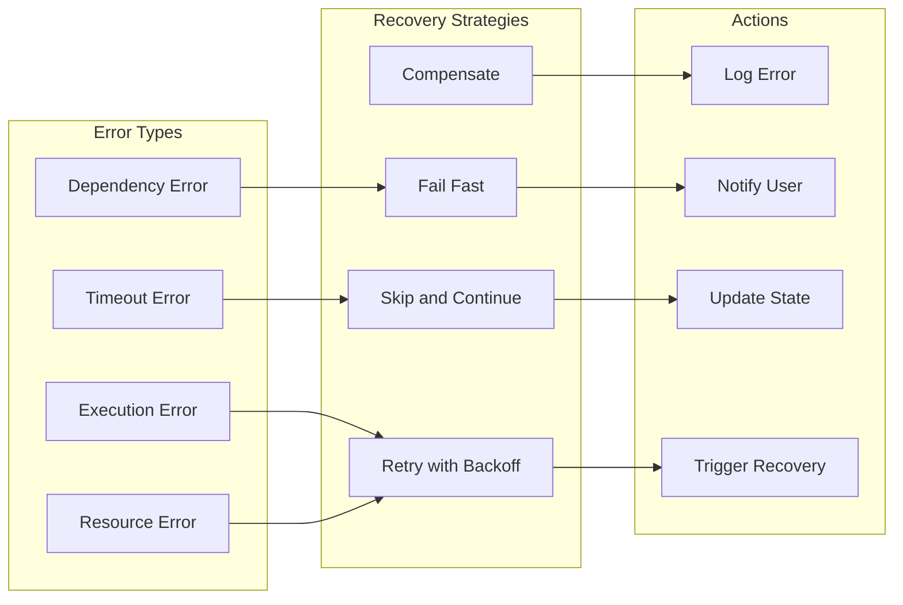

## 📈 Метрики системы

### Производительность

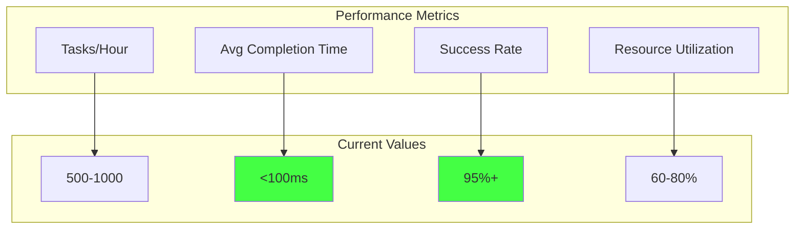

### Использование по типам

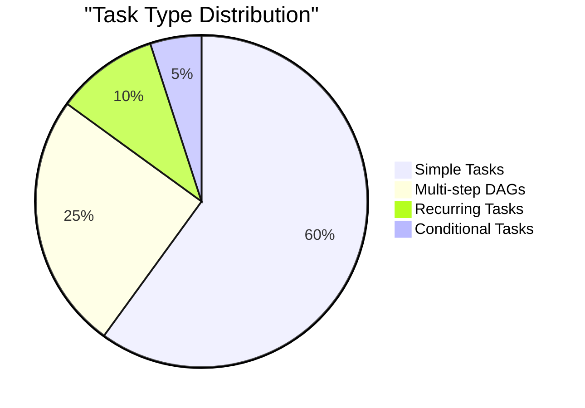

## 🔧 API и интерфейсы

### Основные операции

```rust
// Создание задачи
let task = Task::new()
    .title("Deploy v2.0")
    .priority(Priority::High)
    .deadline(Utc::now() + Duration::hours(24))
    .add_dependency(task_id_1)
    .add_dependency(task_id_2);

// DAG построение
let dag = DAG::new()
    .add_task(build_task)
    .add_task(test_task)
    .add_task(deploy_task)
    .add_edge(build_task.id, test_task.id)
    .add_edge(test_task.id, deploy_task.id);

// Выполнение
let result = executor
    .execute_dag(dag)
    .with_parallelism(4)
    .with_timeout(Duration::minutes(30))
    .await?;
```

### Конфигурация

```yaml
todo:
  database:
    path: "${HOME}/.magray/todos.db"
    pool_size: 5
    
  execution:
    max_parallel: 10
    default_timeout: 300s
    retry_attempts: 3
    
  scheduling:
    tick_interval: 1s
    lookahead_window: 1h
    priority_boost_deadline: 0.2
```

## 🏷️ Теги компонентов

### По функциональности
- `#task-management` - управление задачами
- `#dag-execution` - выполнение DAG
- `#scheduling` - планирование
- `#progress-tracking` - отслеживание прогресса
- `#persistence` - сохранение состояния

### По готовности
- `#production-ready` - базовый функционал
- `#beta` - продвинутое планирование
- `#planned` - ML-оптимизация

---
[[_Components Hub - Центр всех компонентов системы|← К центру компонентного одуванчика]]