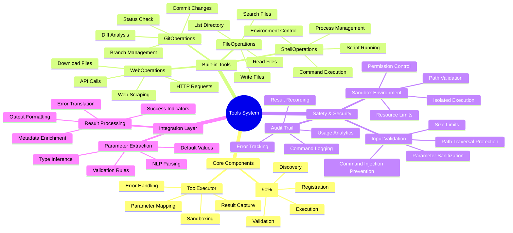
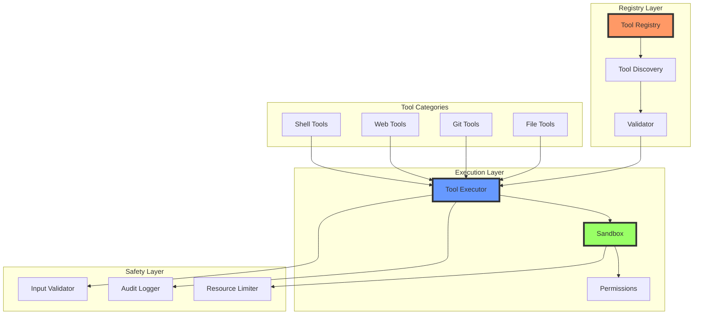
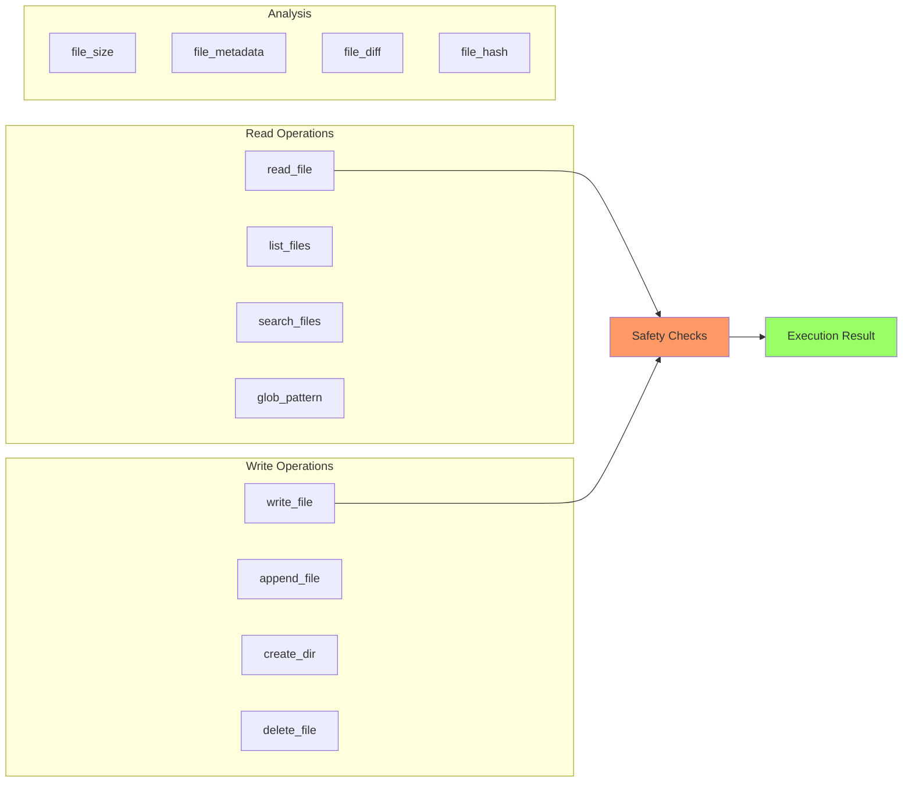
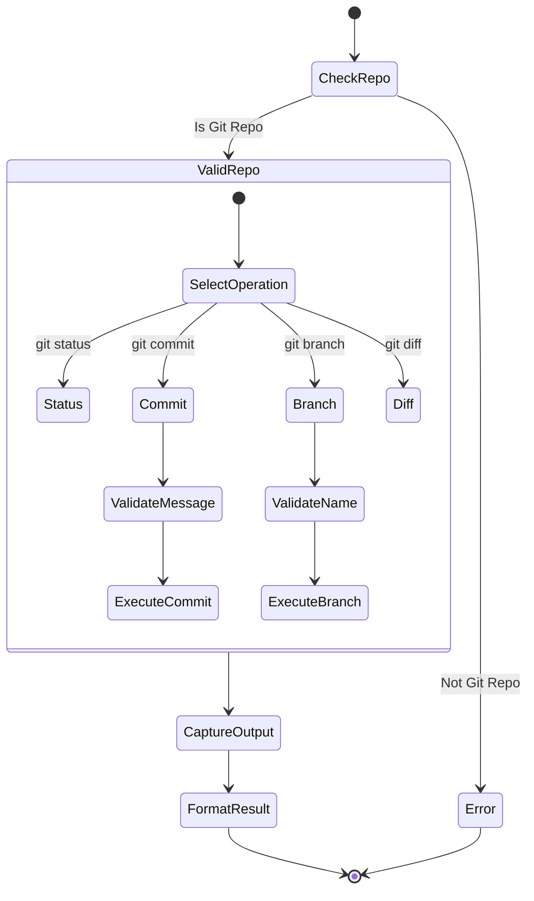
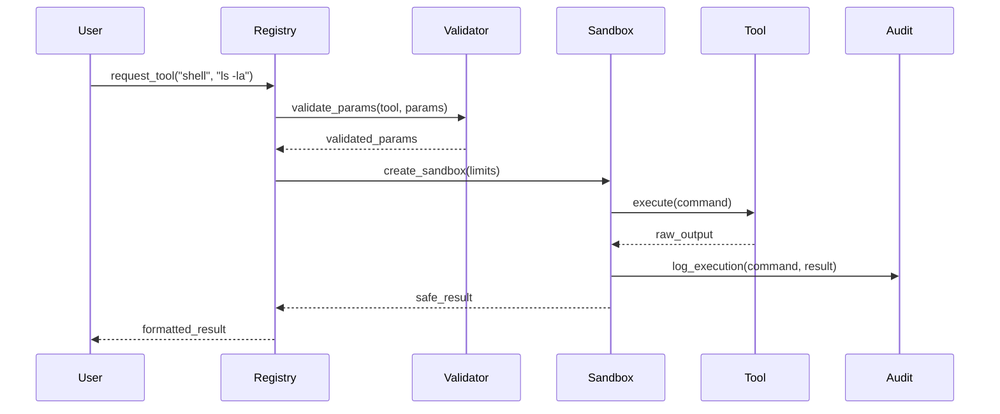
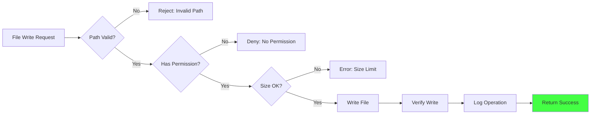
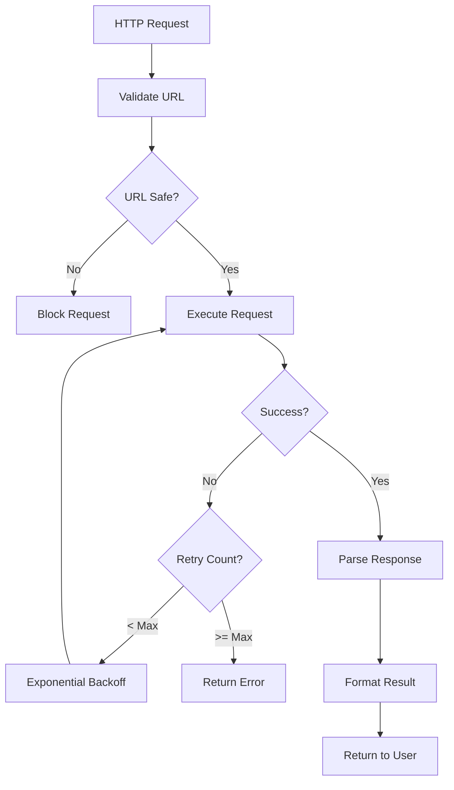
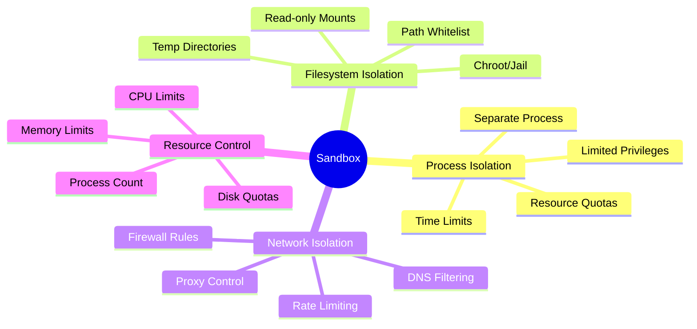
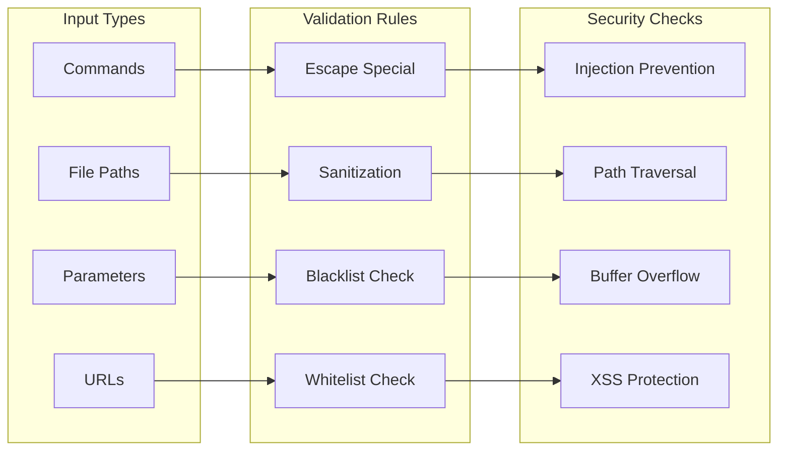
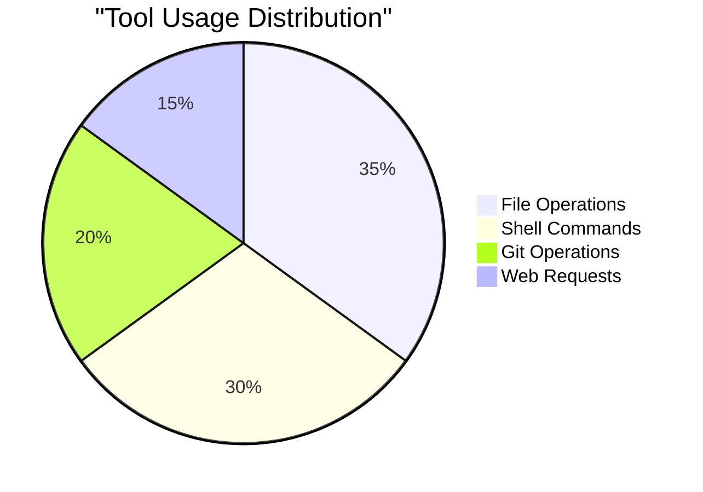

# Tools Mind Map - Визуальная карта Tools crate

> Лист компонентного одуванчика - визуальная карта Tools crate и его компонентов

[[_Components Hub - Центр всех компонентов системы]] → Tools Mind Map

## 🧠 Полная карта Tools System



## 🔗 Взаимосвязи компонентов



## 📊 Инструменты по категориям

### Файловые операции



### Git операции



## 🎯 Критические пути выполнения

### Path 1: Безопасное выполнение команды



### Path 2: Файловая операция с проверками



### Path 3: Web операция с retry



## 🚀 Паттерны безопасности

### Изоляция выполнения



### Валидация входных данных



## 📈 Метрики использования

### Популярность инструментов



### Производительность

| Tool Category | Avg Latency | Success Rate | Resource Usage |
|---------------|-------------|--------------|----------------|
| File Ops | 5-10ms | 99.5% | Low |
| Git Ops | 50-200ms | 95% | Medium |
| Web Ops | 100-5000ms | 90% | Variable |
| Shell Ops | 10-1000ms | 98% | Variable |

## 🔧 Расширение системы

### Добавление нового инструмента

```rust
// Структура нового инструмента
pub struct CustomTool {
    name: String,
    description: String,
    parameters: Vec<Parameter>,
    validator: Box<dyn Validator>,
    executor: Box<dyn Executor>,
}

// Регистрация
registry.register_tool(CustomTool {
    name: "my_tool".to_string(),
    description: "Custom tool description".to_string(),
    parameters: vec![
        Parameter::required("input", Type::String),
        Parameter::optional("format", Type::String),
    ],
    validator: Box::new(MyValidator),
    executor: Box::new(MyExecutor),
});
```

### Конфигурация безопасности

```yaml
tools:
  security:
    sandbox_enabled: true
    max_execution_time: 30s
    max_memory: 512MB
    allowed_paths:
      - "${WORKSPACE}"
      - "/tmp"
    blocked_commands:
      - "rm -rf"
      - "format"
    network:
      allowed_domains:
        - "api.github.com"
        - "*.openai.com"
      blocked_ports:
        - 22
        - 3389
```

## 🏷️ Теги компонентов

### По функциональности
- `#file-ops` - файловые операции
- `#git-ops` - git операции
- `#web-ops` - веб операции
- `#shell-ops` - shell команды
- `#security` - безопасность

### По готовности
- `#production-ready` - базовые инструменты
- `#beta` - расширенные функции
- `#planned` - пользовательские инструменты

---
[[_Components Hub - Центр всех компонентов системы|← К центру компонентного одуванчика]]