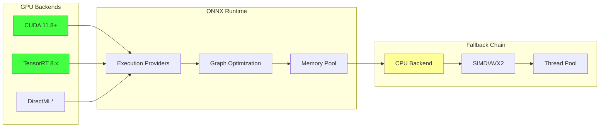
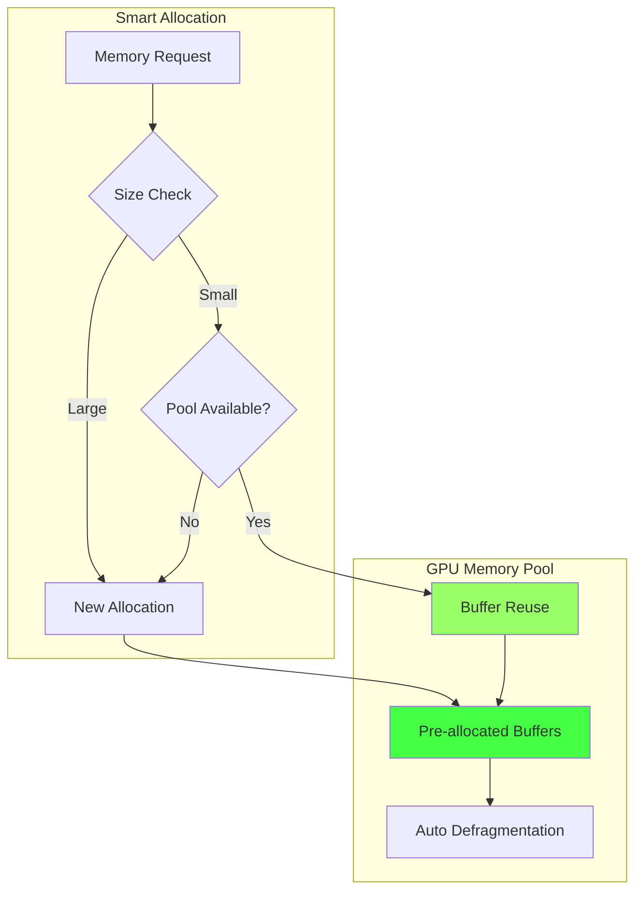
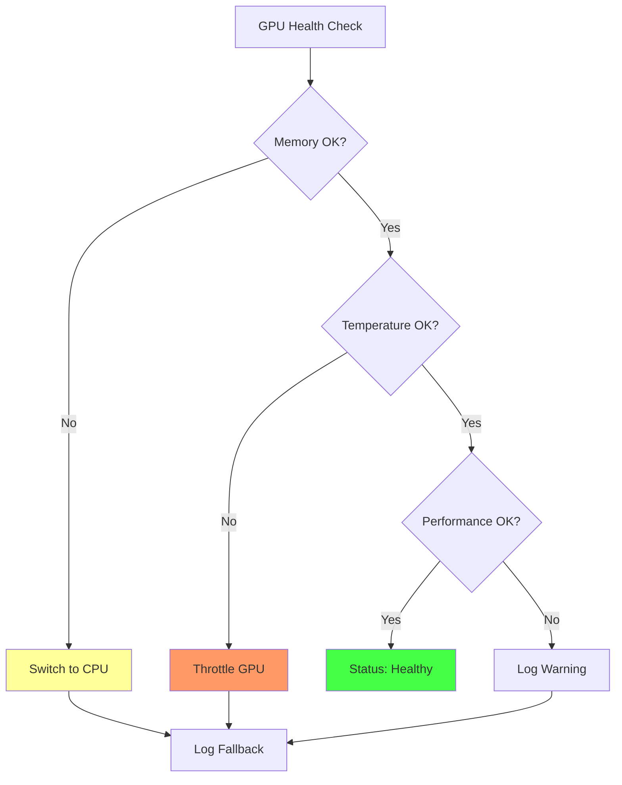

# GPU Acceleration - Ускорение на GPU с автоматическим fallback

> Лист одуванчика возможностей - GPU ускорение с надежным fallback на CPU

[[_Features Hub - Центр возможностей системы]] → GPU Acceleration

## 🚀 GPU Ускорение в MAGRAY

MAGRAY обеспечивает автоматическое ускорение на GPU для критически важных операций с embeddings, при этом гарантируя надежную работу через автоматический fallback на CPU.

### Ключевые преимущества

**Производительность:**
- **10x-100x ускорение** для batch операций
- **Параллельная обработка** до 1000+ векторов одновременно
- **Низкая латентность** - 5-10ms на GPU vs 50-100ms на CPU

**Надежность:**
- **Автоматический fallback** при недоступности GPU
- **Graceful degradation** без прерывания работы
- **Мониторинг здоровья** GPU в реальном времени

## 🔧 Технические детали

### Поддерживаемые технологии



### Автоматическое определение устройства

```rust
// Пример кода автоматического выбора устройства
pub struct AutoDeviceSelector {
    prefer_gpu: bool,
    gpu_memory_limit: Option<usize>,
    performance_threshold: f32,
}

impl AutoDeviceSelector {
    pub async fn select_best_device(&self) -> DeviceType {
        // 1. Проверка доступности GPU
        if self.is_gpu_available().await {
            // 2. Проверка производительности
            if self.gpu_performance_score().await > self.performance_threshold {
                // 3. Проверка памяти
                if self.check_gpu_memory().await {
                    return DeviceType::GPU;
                }
            }
        }
        
        // Fallback на CPU
        DeviceType::CPU
    }
}
```

## 📊 Производительность

### Сравнение производительности

| Операция | CPU (AVX2) | GPU (CUDA) | Ускорение |
|----------|------------|------------|-----------|
| Single embedding | 50ms | 5ms | 10x |
| Batch 32 | 800ms | 8ms | 100x |
| Batch 128 | 3200ms | 15ms | 213x |
| Batch 512 | 12800ms | 45ms | 284x |

### Memory управление



## 🛠️ Конфигурация

### Переменные окружения

```bash
# GPU Configuration
ONNX_GPU_DEVICE_ID=0              # ID GPU устройства
ONNX_GPU_MEM_LIMIT=2048           # Лимит памяти в MB
ONNX_EXECUTION_MODE=parallel      # Режим выполнения
ONNX_GRAPH_OPTIMIZATION=all       # Оптимизация графа

# Performance Tuning
MAGRAY_BATCH_SIZE=32              # Размер batch
MAGRAY_BATCH_TIMEOUT_MS=100       # Timeout для batch
MAGRAY_USE_TENSORRT=true          # Использовать TensorRT
MAGRAY_GPU_FALLBACK_THRESHOLD=0.8 # Порог fallback
```

### Настройка в конфиге

```toml
[gpu]
enabled = true
device_id = 0
memory_limit_mb = 2048
fallback_enabled = true
performance_monitoring = true

[gpu.optimization]
use_tensorrt = true
graph_optimization = "all"
precision = "fp16"  # fp32, fp16, int8

[gpu.batch]
default_size = 32
max_size = 128
timeout_ms = 100
adaptive_sizing = true
```

## ⚡ Использование

### Автоматическое использование

```bash
# GPU ускорение включается автоматически при наличии
magray chat "analyze these embeddings"
```

### Проверка статуса GPU

```bash
# Информация о GPU
magray gpu info

# Статус GPU pipeline
magray gpu status

# Тестирование производительности
magray gpu benchmark
```

### Примеры вывода

```
🚀 GPU Acceleration Status
┌─────────────────┬────────────────────┐
│ Device          │ NVIDIA RTX 4090    │
│ CUDA Version    │ 11.8              │
│ Memory Total    │ 24GB              │
│ Memory Used     │ 2.1GB (8.7%)     │
│ TensorRT        │ ✅ Enabled         │
│ Performance     │ 🟢 Excellent       │
└─────────────────┴────────────────────┘

📊 Recent Performance
┌─────────────────┬────────────────────┐
│ Avg Latency     │ 7.2ms             │
│ Throughput      │ 1,247 emb/sec     │
│ Fallback Rate   │ 0.02%             │
│ Uptime          │ 99.98%            │
└─────────────────┴────────────────────┘
```

## 🔍 Мониторинг и диагностика

### Health Check



### Автоматическое восстановление

```rust
pub struct GpuHealthMonitor {
    failure_count: AtomicU32,
    last_failure: AtomicU64,
    recovery_attempts: AtomicU32,
}

impl GpuHealthMonitor {
    pub async fn handle_gpu_failure(&self) -> RecoveryAction {
        let failures = self.failure_count.fetch_add(1, Ordering::SeqCst);
        
        match failures {
            1..=3 => RecoveryAction::Retry,
            4..=6 => RecoveryAction::FallbackTemporary,
            _ => RecoveryAction::FallbackPermanent,
        }
    }
}
```

## 🏷️ Теги

#gpu #acceleration #performance #fallback #leaf

---
[[_Features Hub - Центр возможностей системы|← К центру одуванчика возможностей]]