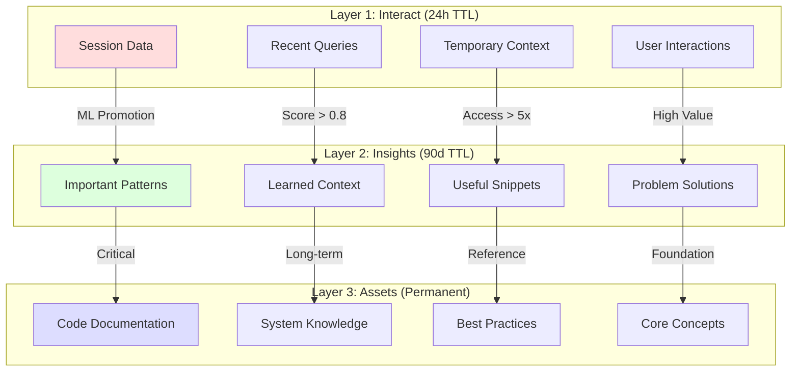
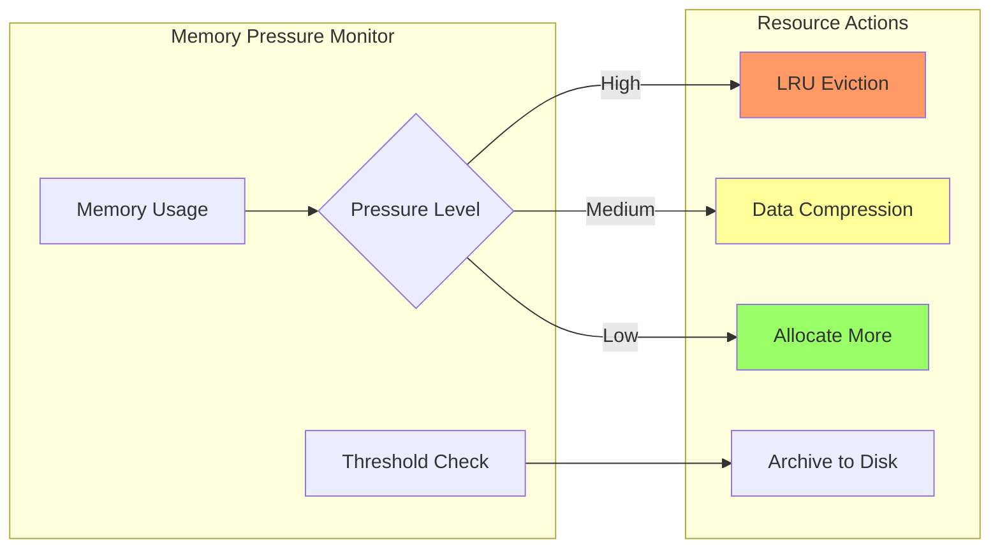
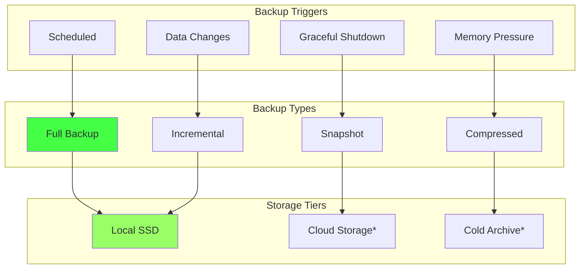
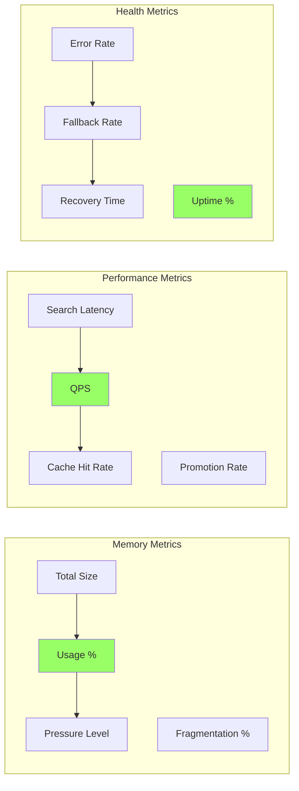

# Memory Management - Интеллектуальное управление трёхслойной памятью

> Лист одуванчика возможностей - интеллектуальное управление трёхслойной архитектурой памяти

[[_Features Hub - Центр возможностей системы]] → Memory Management

## 🧠 Трёхслойная архитектура памяти

MAGRAY использует революционную трёхслойную систему памяти с автоматическим продвижением записей между слоями на основе их важности и частоты использования.

### Слои памяти



## 🎯 Интеллектуальное продвижение

### ML-Based Promotion Engine

```rust
pub struct PromotionEngine {
    ml_scorer: MLScorer,
    time_analyzer: TimeAnalyzer,
    usage_tracker: UsageTracker,
}

impl PromotionEngine {
    pub async fn evaluate_record(&self, record: &MemoryRecord) -> PromotionScore {
        let features = self.extract_features(record).await;
        
        PromotionScore {
            relevance: self.ml_scorer.score_relevance(&features),
            recency: self.time_analyzer.score_recency(record.created_at),
            frequency: self.usage_tracker.score_frequency(record.id),
            importance: self.calculate_importance(&features),
        }
    }
}
```

### Критерии продвижения

| Критерий | Interact → Insights | Insights → Assets |
|----------|-------------------|------------------|
| **ML Score** | > 0.7 | > 0.9 |
| **Access Count** | > 3 раза | > 10 раз |
| **Time Span** | > 12 часов | > 30 дней |
| **User Rating** | > 4.0 | > 4.5 |
| **Context Relevance** | > 0.8 | > 0.95 |

## 📊 Динамическое масштабирование

### Адаптивное управление ресурсами



### LRU Cache с интеллектуальным eviction

```rust
pub struct IntelligentLRU {
    cache: LruCache<String, MemoryRecord>,
    importance_tracker: ImportanceTracker,
    eviction_policy: EvictionPolicy,
}

impl IntelligentLRU {
    pub fn evict_candidates(&mut self, needed_space: usize) -> Vec<String> {
        self.cache
            .iter()
            .map(|(key, record)| {
                let importance = self.importance_tracker.get_importance(key);
                let recency = self.calculate_recency(record);
                let size = record.size();
                
                EvictionCandidate {
                    key: key.clone(),
                    score: importance * recency / size as f64,
                    size,
                }
            })
            .sorted_by(|a, b| a.score.partial_cmp(&b.score).unwrap())
            .take_while(|c| c.size <= needed_space)
            .map(|c| c.key)
            .collect()
    }
}
```

## 🔄 Автоматическое резервное копирование

### Incremental Backup Strategy



### Восстановление данных

```rust
pub struct BackupManager {
    local_storage: LocalStorage,
    compression: CompressionEngine,
    integrity_checker: IntegrityChecker,
}

impl BackupManager {
    pub async fn restore_from_backup(&self, timestamp: DateTime<Utc>) -> Result<()> {
        // 1. Найти ближайший полный backup
        let full_backup = self.find_full_backup_before(timestamp).await?;
        
        // 2. Применить инкрементальные изменения
        let incremental_backups = self.find_incremental_backups_after(
            full_backup.timestamp, 
            timestamp
        ).await?;
        
        // 3. Восстановить данные
        let mut restored_data = self.restore_full_backup(full_backup).await?;
        
        for backup in incremental_backups {
            restored_data = self.apply_incremental(restored_data, backup).await?;
        }
        
        // 4. Проверить целостность
        self.integrity_checker.verify(&restored_data).await?;
        
        Ok(())
    }
}
```

## 🎛️ Конфигурация памяти

### Настройки уровней

```toml
[memory.layers.interact]
ttl_hours = 24
max_size_mb = 512
eviction_policy = "lru_with_importance"
promotion_threshold = 0.7

[memory.layers.insights]
ttl_days = 90
max_size_mb = 2048
eviction_policy = "importance_based"
promotion_threshold = 0.9

[memory.layers.assets]
ttl_days = 0  # permanent
max_size_mb = 8192
eviction_policy = "manual"
```

### Производительность

```toml
[memory.performance]
# HNSW параметры
hnsw_m = 16
hnsw_ef_construction = 200
hnsw_ef_search = 100

# Кэширование
embedding_cache_size = 10000
query_cache_ttl_minutes = 30

# Batch операции
batch_size = 32
batch_timeout_ms = 100
```

## 📈 Мониторинг и метрики

### Key Performance Indicators



### Алерты и уведомления

```rust
pub struct MemoryHealthMonitor {
    thresholds: HealthThresholds,
    notification_service: NotificationService,
}

impl MemoryHealthMonitor {
    pub async fn check_health(&self) -> HealthStatus {
        let metrics = self.collect_metrics().await;
        
        let alerts = vec![
            self.check_memory_pressure(&metrics),
            self.check_search_latency(&metrics),
            self.check_error_rate(&metrics),
            self.check_fragmentation(&metrics),
        ]
        .into_iter()
        .filter_map(|alert| alert)
        .collect();
        
        if !alerts.is_empty() {
            self.notification_service.send_alerts(alerts).await;
        }
        
        HealthStatus::from_metrics(&metrics)
    }
}
```

## 🚀 Оптимизации

### Векторные операции

- **SIMD ускорение** для similarity вычислений
- **Batch processing** для embedding генерации  
- **Memory mapping** для больших индексов
- **Compression** для долгосрочного хранения

### Индексирование

- **HNSW** для O(log n) поиск
- **Time-based indices** для быстрого TTL cleanup
- **Composite indices** для сложных запросов
- **Bloom filters** для negative lookups

## 🏷️ Теги

#memory #layers #management #intelligent #caching #leaf

---
[[_Features Hub - Центр возможностей системы|← К центру одуванчика возможностей]]