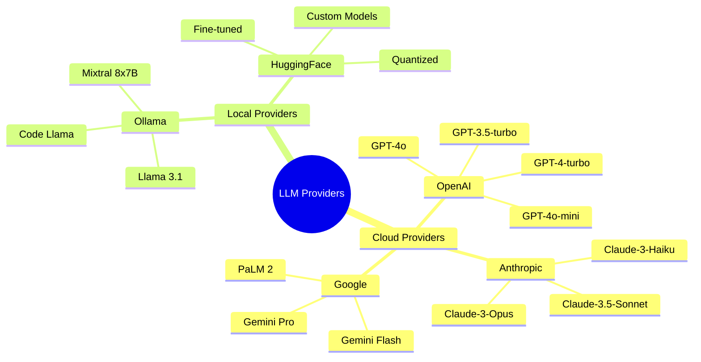
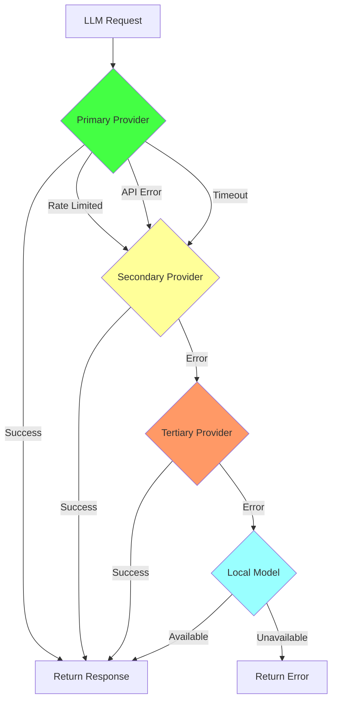
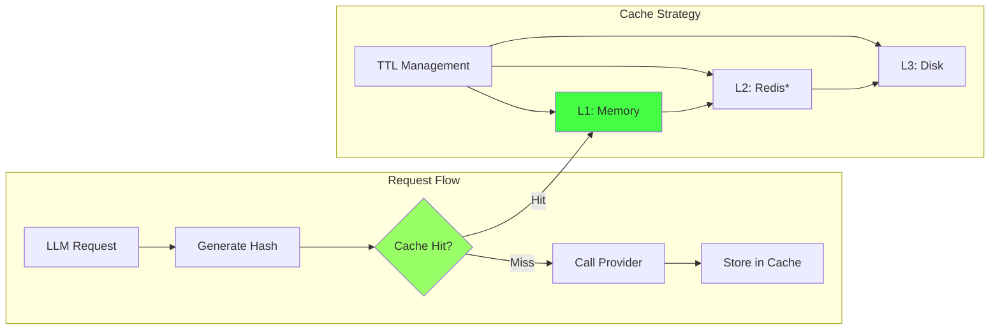
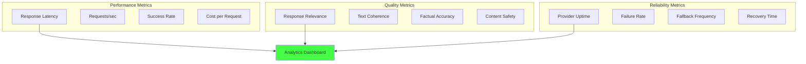

# Multi-Provider LLM - Поддержка OpenAI Anthropic Local моделей

> **Статус: 80% готово** - мультипровайдерная поддержка LLM с умной маршрутизацией

[[_Features Hub - Центр возможностей системы]] → Multi-Provider LLM

## 🎭 Поддержка множественных LLM провайдеров

MAGRAY поддерживает все основные LLM провайдеры с автоматической маршрутизацией запросов на основе типа задачи, стоимости и производительности.

### Поддерживаемые провайдеры



## 🧠 Интеллектуальная маршрутизация

### Автоматический выбор провайдера

```rust
pub struct ProviderRouter {
    providers: HashMap<ProviderId, Box<dyn LLMProvider>>,
    routing_strategy: RoutingStrategy,
    cost_optimizer: CostOptimizer,
    performance_tracker: PerformanceTracker,
}

impl ProviderRouter {
    pub async fn route_request(&self, request: &LLMRequest) -> Result<ProviderId> {
        let candidates = self.get_available_providers().await;
        
        let scores = candidates
            .iter()
            .map(|provider_id| {
                let capability_score = self.score_capability(provider_id, request);
                let cost_score = self.cost_optimizer.score_cost(provider_id, request);
                let performance_score = self.performance_tracker.score_performance(provider_id);
                let availability_score = self.score_availability(provider_id);
                
                RoutingScore {
                    provider_id: *provider_id,
                    total_score: capability_score * 0.4 
                                + cost_score * 0.3 
                                + performance_score * 0.2 
                                + availability_score * 0.1,
                }
            })
            .collect::<Vec<_>>();
        
        scores
            .into_iter()
            .max_by(|a, b| a.total_score.partial_cmp(&b.total_score).unwrap())
            .map(|score| score.provider_id)
            .ok_or_else(|| Error::NoAvailableProvider)
    }
}
```

### Стратегии маршрутизации

| Тип запроса | Предпочтительный провайдер | Причина |
|-------------|---------------------------|---------|
| **Простые вопросы** | GPT-4o-mini | Быстро + дешево |
| **Анализ кода** | Claude-3.5-Sonnet | Лучшее понимание кода |
| **Творческие задачи** | GPT-4o | Высокое качество |
| **Большой контекст** | Claude-3-Opus | 200K context window |
| **Локальная обработка** | Ollama | Приватность + офлайн |

## 🔄 Fallback и отказоустойчивость

### Каскадный Fallback



### Retry логика с экспоненциальным backoff

```rust
pub struct RetryManager {
    max_retries: u32,
    base_delay: Duration,
    max_delay: Duration,
    jitter: bool,
}

impl RetryManager {
    pub async fn execute_with_retry<F, T, E>(&self, mut operation: F) -> Result<T, E>
    where
        F: FnMut() -> Pin<Box<dyn Future<Output = Result<T, E>>>>,
        E: RetryableError,
    {
        let mut attempt = 0;
        
        loop {
            let result = operation().await;
            
            match result {
                Ok(value) => return Ok(value),
                Err(error) if !error.is_retryable() => return Err(error),
                Err(error) if attempt >= self.max_retries => return Err(error),
                Err(_) => {
                    attempt += 1;
                    let delay = self.calculate_delay(attempt);
                    tokio::time::sleep(delay).await;
                }
            }
        }
    }
    
    fn calculate_delay(&self, attempt: u32) -> Duration {
        let delay = self.base_delay.mul_f64(2.0_f64.powi(attempt as i32));
        let delay = delay.min(self.max_delay);
        
        if self.jitter {
            let jitter_factor = 0.1 * rand::random::<f64>();
            delay.mul_f64(1.0 + jitter_factor)
        } else {
            delay
        }
    }
}
```

## ⚡ Оптимизация производительности

### Параллельные запросы

```rust
pub async fn parallel_llm_requests(
    requests: Vec<LLMRequest>,
    router: &ProviderRouter,
) -> Vec<Result<LLMResponse>> {
    let tasks = requests
        .into_iter()
        .map(|request| {
            let router = router.clone();
            tokio::spawn(async move {
                let provider_id = router.route_request(&request).await?;
                let provider = router.get_provider(provider_id).await?;
                provider.generate(&request).await
            })
        })
        .collect::<Vec<_>>();
    
    futures::future::join_all(tasks)
        .await
        .into_iter()
        .map(|result| result.unwrap_or_else(|e| Err(e.into())))
        .collect()
}
```

### Кэширование ответов



## 🛠️ Конфигурация провайдеров

### Настройки OpenAI

```toml
[llm.openai]
api_key = "${OPENAI_API_KEY}"
organization = "${OPENAI_ORG_ID}"  # optional
base_url = "https://api.openai.com/v1"

# Модели
[llm.openai.models]
default = "gpt-4o-mini"
creative = "gpt-4o"
code = "gpt-4o"
cheap = "gpt-3.5-turbo"

# Параметры по умолчанию
[llm.openai.defaults]
max_tokens = 500
temperature = 0.7
top_p = 1.0
frequency_penalty = 0.0
presence_penalty = 0.0
```

### Настройки Anthropic

```toml
[llm.anthropic]
api_key = "${ANTHROPIC_API_KEY}"
base_url = "https://api.anthropic.com"

[llm.anthropic.models]
default = "claude-3-5-sonnet-20241022"
smart = "claude-3-opus-20240229"
fast = "claude-3-haiku-20240307"

[llm.anthropic.defaults]
max_tokens = 1000
temperature = 0.5
top_p = 0.9
```

### Настройки Local/Ollama

```toml
[llm.ollama]
base_url = "http://localhost:11434"
timeout_seconds = 120

[llm.ollama.models]
default = "llama3.1:8b"
code = "codellama:13b"
large = "mixtral:8x7b"

[llm.ollama.defaults]
temperature = 0.3
top_p = 0.9
repeat_penalty = 1.1
```

## 📊 Мониторинг и аналитика

### Метрики производительности



### Cost Tracking

```rust
pub struct CostTracker {
    provider_rates: HashMap<ProviderId, TokenRates>,
    usage_history: VecDeque<UsageRecord>,
    monthly_budget: Option<f64>,
}

impl CostTracker {
    pub fn calculate_request_cost(&self, provider: ProviderId, request: &LLMRequest, response: &LLMResponse) -> f64 {
        let rates = &self.provider_rates[&provider];
        
        let input_cost = request.token_count() as f64 * rates.input_price_per_token;
        let output_cost = response.token_count() as f64 * rates.output_price_per_token;
        
        input_cost + output_cost
    }
    
    pub fn get_monthly_spend(&self) -> f64 {
        let now = Utc::now();
        let month_start = now.with_day(1).unwrap().with_time(NaiveTime::MIN).unwrap();
        
        self.usage_history
            .iter()
            .filter(|record| record.timestamp >= month_start)
            .map(|record| record.cost)
            .sum()
    }
}
```

## 🔒 Безопасность и приватность

### Content Filtering

```rust
pub struct ContentFilter {
    safety_classifier: SafetyClassifier,
    pii_detector: PIIDetector,
    toxicity_filter: ToxicityFilter,
}

impl ContentFilter {
    pub async fn filter_request(&self, request: &mut LLMRequest) -> Result<()> {
        // Проверка на PII
        if self.pii_detector.contains_pii(&request.content) {
            request.content = self.pii_detector.redact_pii(&request.content);
        }
        
        // Проверка безопасности контента
        let safety_score = self.safety_classifier.score(&request.content).await?;
        if safety_score < 0.7 {
            return Err(Error::UnsafeContent);
        }
        
        Ok(())
    }
}
```

## 🏷️ Теги

#llm #providers #routing #fallback #multi-model #leaf

---
[[_Features Hub - Центр возможностей системы|← К центру одуванчика возможностей]]