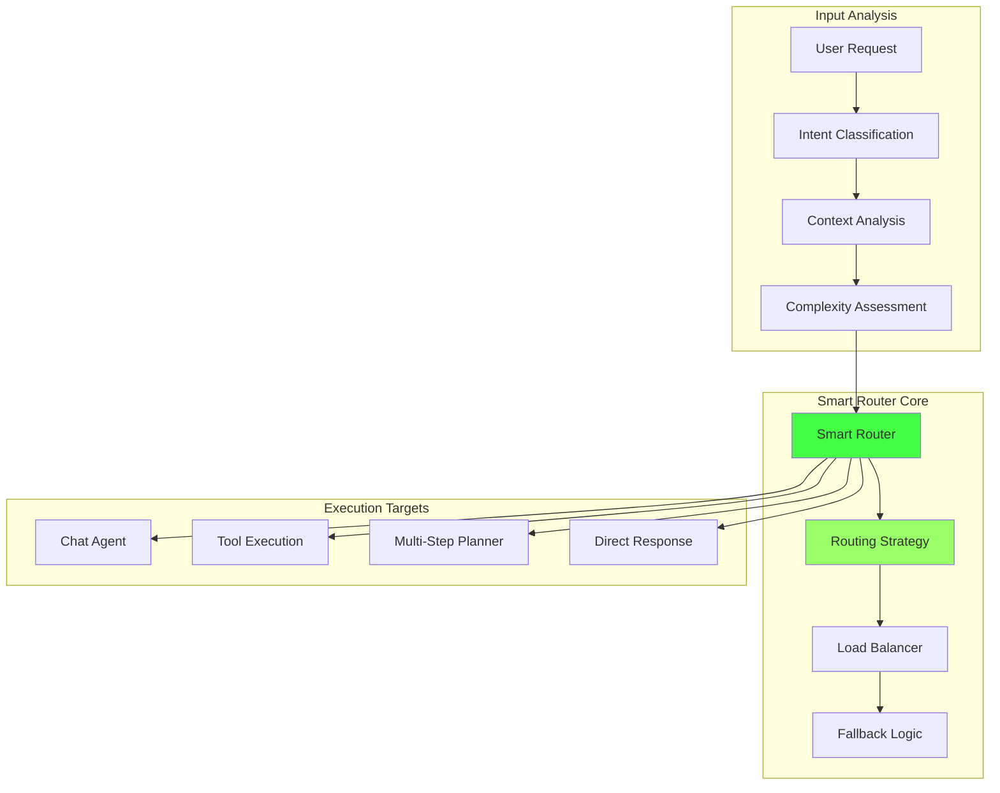
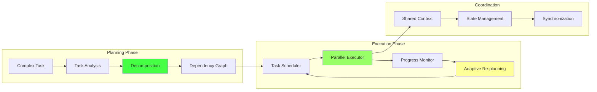
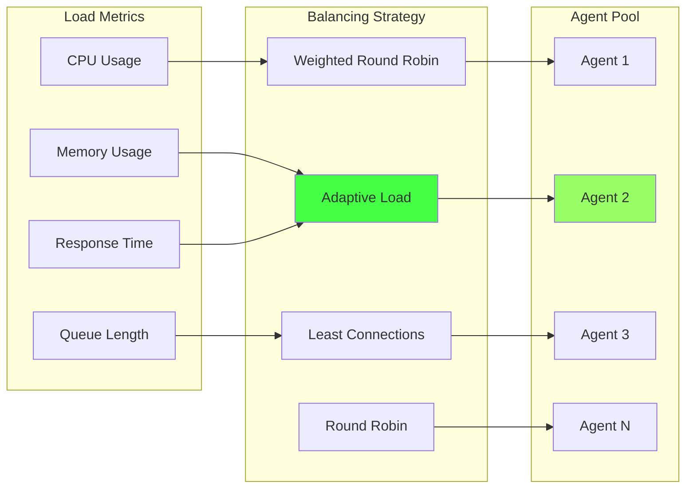
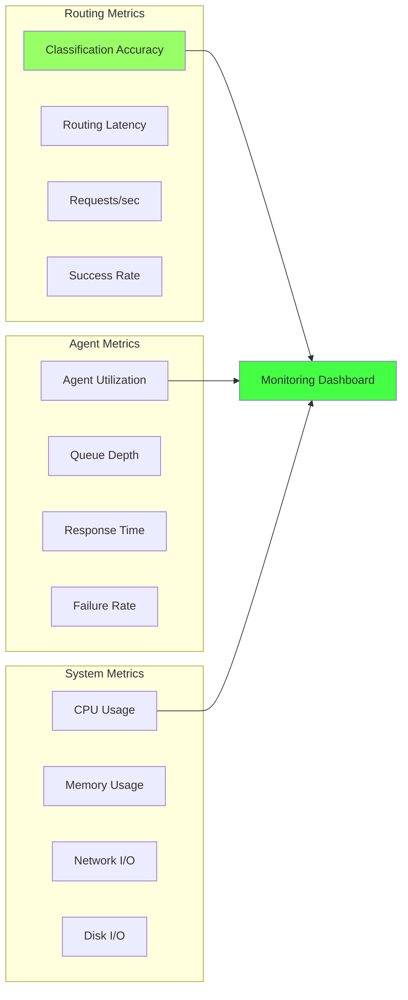

# Smart Routing - Интеллектуальная маршрутизация задач

> Лист одуванчика возможностей - интеллектуальная система маршрутизации и оркестрации задач

[[_Features Hub - Центр возможностей системы]] → Smart Routing

## 🧠 Интеллектуальная маршрутизация

MAGRAY использует продвинутую систему маршрутизации, которая автоматически анализирует входящие запросы и направляет их к наиболее подходящим агентам и инструментам.

### Архитектура роутера



## 🎯 Классификация намерений

### ML-Based Intent Detection

```rust
pub struct IntentClassifier {
    model: ONNXModel,
    embeddings: EmbeddingService,
    intent_patterns: HashMap<IntentType, Vec<Pattern>>,
}

impl IntentClassifier {
    pub async fn classify_intent(&self, request: &str) -> Result<IntentClassification> {
        // 1. Извлечение features
        let features = self.extract_features(request).await?;
        
        // 2. ML классификация
        let ml_scores = self.model.predict(&features).await?;
        
        // 3. Pattern matching
        let pattern_scores = self.match_patterns(request).await?;
        
        // 4. Комбинированный score
        let combined_scores = self.combine_scores(ml_scores, pattern_scores);
        
        // 5. Выбор лучшего намерения
        let intent = combined_scores
            .into_iter()
            .max_by(|a, b| a.confidence.partial_cmp(&b.confidence).unwrap())
            .ok_or(Error::NoIntentFound)?;
        
        Ok(IntentClassification {
            intent_type: intent.intent_type,
            confidence: intent.confidence,
            features: features,
            reasoning: intent.reasoning,
        })
    }
}
```

### Типы намерений

| Intent Type | Description | Target Agent | Example |
|-------------|-------------|--------------|---------|
| **Simple Question** | Простой вопрос | Chat Agent | "Что такое Rust?" |
| **Code Analysis** | Анализ кода | Tools + Chat | "Объясни эту функцию" |
| **File Operation** | Операции с файлами | Tool Execution | "Создай файл config.json" |
| **Complex Task** | Сложная задача | Multi-Step Planner | "Реализуй аутентификацию" |
| **Search Query** | Поиск информации | Vector Search | "Найди примеры async/await" |

## 🔄 Многоэтапное планирование

### Task Decomposition Engine



### Планировщик задач

```rust
pub struct TaskPlanner {
    decomposer: TaskDecomposer,
    scheduler: TaskScheduler,
    executor: ParallelExecutor,
    monitor: ProgressMonitor,
}

impl TaskPlanner {
    pub async fn plan_and_execute(&self, task: ComplexTask) -> Result<ExecutionResult> {
        // 1. Декомпозиция задачи
        let subtasks = self.decomposer.decompose(task).await?;
        
        // 2. Построение графа зависимостей
        let dependency_graph = self.build_dependency_graph(&subtasks).await?;
        
        // 3. Планирование выполнения
        let execution_plan = self.scheduler.create_plan(&dependency_graph).await?;
        
        // 4. Параллельное выполнение
        let mut results = Vec::new();
        let mut context = SharedContext::new();
        
        for stage in execution_plan.stages {
            let stage_results = self.executor
                .execute_stage(stage, &mut context)
                .await?;
            
            // Мониторинг прогресса
            self.monitor.update_progress(&stage_results).await;
            
            // Адаптивное переplanирование при необходимости
            if self.should_replan(&stage_results) {
                return self.replan_and_continue(
                    &remaining_stages, 
                    &context, 
                    results
                ).await;
            }
            
            results.extend(stage_results);
        }
        
        Ok(ExecutionResult::success(results))
    }
}
```

## 🔀 Контекстная маршрутизация

### Context-Aware Routing

```rust
pub struct ContextRouter {
    context_analyzer: ContextAnalyzer,
    routing_rules: RoutingRules,
    agent_pool: AgentPool,
}

impl ContextRouter {
    pub async fn route_with_context(
        &self, 
        request: &Request, 
        context: &ConversationContext
    ) -> Result<RoutingDecision> {
        
        // Анализ текущего контекста
        let context_features = self.context_analyzer.analyze(context).await?;
        
        // Определение наилучшего агента
        let agent_scores = self.agent_pool
            .agents()
            .iter()
            .map(|agent| {
                let capability_score = agent.score_capability(request);
                let context_fit_score = agent.score_context_fit(&context_features);
                let load_score = agent.current_load_score();
                
                AgentScore {
                    agent_id: agent.id(),
                    total_score: capability_score * 0.5 
                               + context_fit_score * 0.3 
                               + load_score * 0.2,
                }
            })
            .collect::<Vec<_>>();
        
        let best_agent = agent_scores
            .into_iter()
            .max_by(|a, b| a.total_score.partial_cmp(&b.total_score).unwrap())
            .ok_or(Error::NoSuitableAgent)?;
        
        Ok(RoutingDecision {
            target_agent: best_agent.agent_id,
            routing_strategy: self.determine_strategy(request, &context_features),
            context_to_pass: self.prepare_context(context, &context_features),
        })
    }
}
```

## 📊 Load Balancing и распределение нагрузки

### Динамическое распределение



### Load Balancer реализация

```rust
pub struct LoadBalancer {
    agents: Vec<AgentInfo>,
    strategy: LoadBalancingStrategy,
    metrics_collector: MetricsCollector,
}

impl LoadBalancer {
    pub async fn select_agent(&self, request: &Request) -> Result<AgentId> {
        let current_metrics = self.metrics_collector.collect_all().await?;
        
        match self.strategy {
            LoadBalancingStrategy::RoundRobin => {
                self.round_robin_selection()
            }
            
            LoadBalancingStrategy::WeightedRoundRobin => {
                self.weighted_round_robin(&current_metrics)
            }
            
            LoadBalancingStrategy::LeastConnections => {
                self.least_connections_selection(&current_metrics)
            }
            
            LoadBalancingStrategy::AdaptiveLoad => {
                let load_scores = current_metrics
                    .iter()
                    .map(|(agent_id, metrics)| {
                        let cpu_score = 1.0 - metrics.cpu_usage;
                        let memory_score = 1.0 - metrics.memory_usage;
                        let queue_score = 1.0 / (1.0 + metrics.queue_length as f64);
                        let latency_score = 1.0 / (1.0 + metrics.avg_latency);
                        
                        LoadScore {
                            agent_id: *agent_id,
                            score: cpu_score * 0.3 
                                 + memory_score * 0.2 
                                 + queue_score * 0.3 
                                 + latency_score * 0.2,
                        }
                    })
                    .collect::<Vec<_>>();
                
                load_scores
                    .into_iter()
                    .max_by(|a, b| a.score.partial_cmp(&b.score).unwrap())
                    .map(|score| score.agent_id)
                    .ok_or(Error::NoAvailableAgent)
            }
        }
    }
}
```

## 🛡️ Отказоустойчивость и fallback

### Circuit Breaker Pattern

```rust
pub struct CircuitBreaker {
    state: Arc<Mutex<CircuitState>>,
    failure_threshold: u32,
    timeout: Duration,
    half_open_max_calls: u32,
}

impl CircuitBreaker {
    pub async fn call<F, T, E>(&self, operation: F) -> Result<T, E>
    where
        F: Future<Output = Result<T, E>>,
        E: std::error::Error,
    {
        let state = self.state.lock().await;
        
        match &*state {
            CircuitState::Closed => {
                drop(state);
                match operation.await {
                    Ok(result) => {
                        self.on_success().await;
                        Ok(result)
                    }
                    Err(error) => {
                        self.on_failure().await;
                        Err(error)
                    }
                }
            }
            
            CircuitState::Open { opened_at } => {
                if opened_at.elapsed() > self.timeout {
                    self.transition_to_half_open().await;
                    self.call(operation).await
                } else {
                    Err(CircuitBreakerError::CircuitOpen.into())
                }
            }
            
            CircuitState::HalfOpen { calls_made } => {
                if *calls_made >= self.half_open_max_calls {
                    Err(CircuitBreakerError::TooManyCalls.into())
                } else {
                    drop(state);
                    match operation.await {
                        Ok(result) => {
                            self.on_half_open_success().await;
                            Ok(result)
                        }
                        Err(error) => {
                            self.on_half_open_failure().await;
                            Err(error)
                        }
                    }
                }
            }
        }
    }
}
```

## ⚙️ Конфигурация маршрутизации

### Настройки роутера

```toml
[router]
default_strategy = "adaptive"
max_concurrent_tasks = 10
task_timeout_seconds = 300
enable_circuit_breaker = true

[router.intent_classification]
ml_model_path = "models/intent_classifier.onnx"
confidence_threshold = 0.7
fallback_to_patterns = true

[router.load_balancing]
strategy = "adaptive_load"
health_check_interval = 30
failure_threshold = 5
recovery_timeout = 60

[router.planning]
max_decomposition_depth = 5
parallel_execution_limit = 3
context_sharing_enabled = true
adaptive_replanning = true
```

### Routing Rules DSL

```yaml
routing_rules:
  - name: "file_operations"
    conditions:
      - intent_type: "file_operation"
      - confidence: "> 0.8"
    actions:
      - route_to: "tool_execution_agent"
      - timeout: 30
      - retry_count: 2
  
  - name: "complex_coding_tasks"
    conditions:
      - intent_type: "complex_task"
      - keywords: ["implement", "create", "build"]
      - estimated_complexity: "> 0.7"
    actions:
      - route_to: "multi_step_planner"
      - enable_parallel_execution: true
      - context_preservation: true
  
  - name: "simple_questions"
    conditions:
      - intent_type: "simple_question"
      - context_required: false
    actions:
      - route_to: "chat_agent"
      - use_cache: true
      - timeout: 10
```

## 📈 Мониторинг маршрутизации

### Ключевые метрики



### Analytics и оптимизация

```rust
pub struct RoutingAnalytics {
    metrics_store: MetricsStore,
    optimizer: RoutingOptimizer,
}

impl RoutingAnalytics {
    pub async fn analyze_routing_performance(&self) -> RoutingAnalysis {
        let recent_metrics = self.metrics_store
            .get_recent_metrics(Duration::from_hours(24))
            .await;
        
        RoutingAnalysis {
            classification_accuracy: self.calculate_accuracy(&recent_metrics),
            average_routing_latency: self.calculate_avg_latency(&recent_metrics),
            agent_utilization: self.calculate_utilization(&recent_metrics),
            bottlenecks: self.identify_bottlenecks(&recent_metrics),
            optimization_suggestions: self.optimizer.suggest_optimizations(&recent_metrics),
        }
    }
}
```

## 🏷️ Теги

#routing #orchestration #planning #load-balancing #intelligence #leaf

---
[[_Features Hub - Центр возможностей системы|← К центру одуванчика возможностей]]