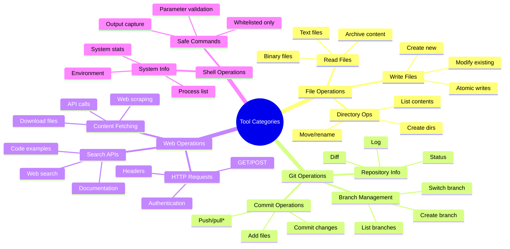
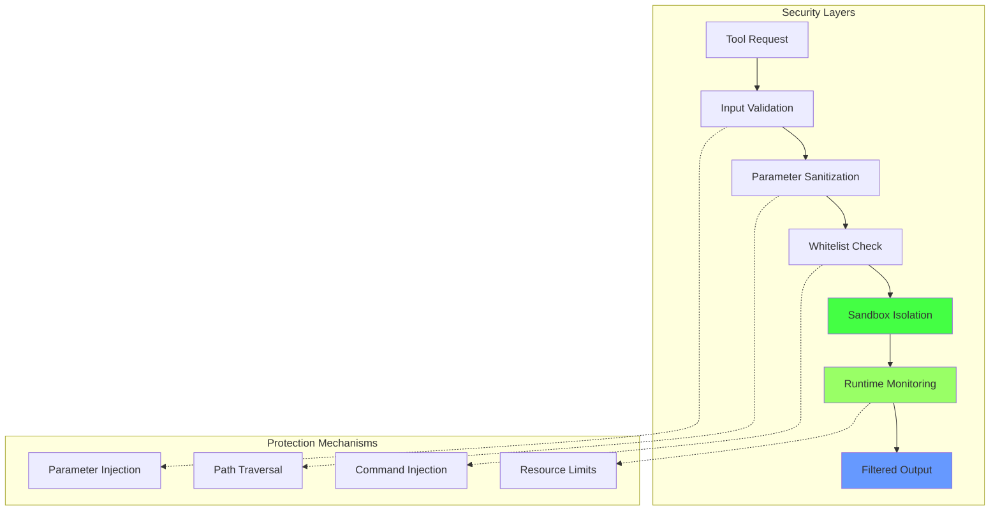
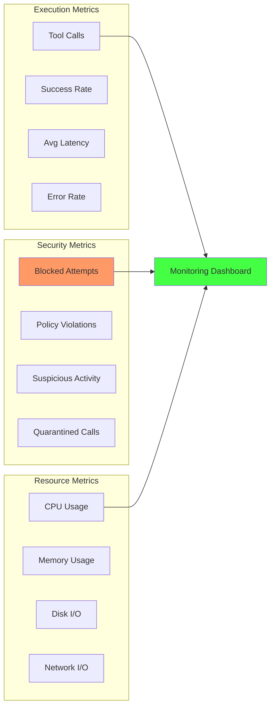

# Tool Execution - Безопасное выполнение инструментов

> **Статус: 90% готово** - безопасное выполнение различных инструментов с sandbox изоляцией

[[_Features Hub - Центр возможностей системы]] → Tool Execution

## 🛠️ Безопасное выполнение инструментов

MAGRAY предоставляет безопасную среду для выполнения различных инструментов с многоуровневой системой защиты и sandbox изоляцией.

### Поддерживаемые категории инструментов



## 🔒 Система безопасности

### Многоуровневая защита



### Sandbox изоляция

```rust
pub struct ToolSandbox {
    allowed_paths: HashSet<PathBuf>,
    blocked_commands: HashSet<String>,
    resource_limits: ResourceLimits,
    timeout: Duration,
}

impl ToolSandbox {
    pub async fn execute_tool(&self, tool: &Tool, params: &ToolParams) -> Result<ToolOutput> {
        // 1. Валидация входных параметров
        self.validate_parameters(tool, params)?;
        
        // 2. Проверка разрешений
        self.check_permissions(tool, params)?;
        
        // 3. Создание изолированной среды
        let sandbox_env = self.create_sandbox_environment().await?;
        
        // 4. Выполнение с ограничениями
        let result = tokio::time::timeout(
            self.timeout,
            self.execute_in_sandbox(tool, params, sandbox_env)
        ).await??;
        
        // 5. Фильтрация вывода
        self.filter_output(result)
    }
    
    fn validate_parameters(&self, tool: &Tool, params: &ToolParams) -> Result<()> {
        for (key, value) in &params.0 {
            let param_def = tool.get_parameter_definition(key)
                .ok_or_else(|| Error::UnknownParameter(key.clone()))?;
            
            // Проверка типа
            if !param_def.validate_type(value) {
                return Err(Error::InvalidParameterType {
                    param: key.clone(),
                    expected: param_def.param_type.clone(),
                    actual: value.type_name().to_string(),
                });
            }
            
            // Проверка на injection
            if self.contains_injection_attempt(value) {
                return Err(Error::PotentialInjection(key.clone()));
            }
        }
        
        Ok(())
    }
}
```

## 🧰 Встроенные инструменты

### File Operations

```rust
#[derive(Debug, Clone)]
pub struct FileReadTool;

impl Tool for FileReadTool {
    fn name(&self) -> &'static str { "file_read" }
    
    fn description(&self) -> &'static str {
        "Safely read file contents with path validation"
    }
    
    fn parameters(&self) -> Vec<ToolParameter> {
        vec![
            ToolParameter::required("path", ParameterType::Path),
            ToolParameter::optional("encoding", ParameterType::String),
            ToolParameter::optional("max_size", ParameterType::Integer),
        ]
    }
    
    async fn execute(&self, params: ToolParams, sandbox: &ToolSandbox) -> Result<ToolOutput> {
        let path = params.get_path("path")?;
        let encoding = params.get_string("encoding").unwrap_or("utf-8");
        let max_size = params.get_integer("max_size").unwrap_or(1024 * 1024); // 1MB default
        
        // Проверка пути
        sandbox.validate_path_access(&path, AccessType::Read)?;
        
        // Проверка размера файла
        let metadata = tokio::fs::metadata(&path).await?;
        if metadata.len() > max_size as u64 {
            return Err(Error::FileTooLarge { 
                size: metadata.len(), 
                max_size: max_size as u64 
            });
        }
        
        // Чтение с проверкой содержимого
        let content = tokio::fs::read_to_string(&path).await?;
        let filtered_content = sandbox.filter_sensitive_content(&content)?;
        
        Ok(ToolOutput::text(filtered_content))
    }
}
```

### Git Operations

```rust
#[derive(Debug, Clone)]
pub struct GitStatusTool;

impl Tool for GitStatusTool {
    fn name(&self) -> &'static str { "git_status" }
    
    async fn execute(&self, params: ToolParams, sandbox: &ToolSandbox) -> Result<ToolOutput> {
        let repo_path = params.get_path("path").unwrap_or_else(|| Path::new("."));
        
        // Проверка что это git репозиторий
        sandbox.validate_git_repository(&repo_path)?;
        
        // Выполнение git status с timeout
        let output = tokio::process::Command::new("git")
            .args(&["status", "--porcelain"])
            .current_dir(&repo_path)
            .output()
            .await?;
        
        if !output.status.success() {
            return Err(Error::GitCommandFailed {
                command: "status".to_string(),
                stderr: String::from_utf8_lossy(&output.stderr).to_string(),
            });
        }
        
        let status_text = String::from_utf8_lossy(&output.stdout);
        let parsed_status = self.parse_git_status(&status_text)?;
        
        Ok(ToolOutput::structured(json!({
            "status": "success",
            "modified_files": parsed_status.modified,
            "untracked_files": parsed_status.untracked,
            "staged_files": parsed_status.staged,
        })))
    }
}
```

## 🌐 Web Operations

### HTTP Client с ограничениями

```rust
pub struct WebTool {
    client: reqwest::Client,
    allowed_domains: HashSet<String>,
    blocked_domains: HashSet<String>,
    max_response_size: usize,
}

impl WebTool {
    pub async fn fetch_url(&self, url: &str, options: &FetchOptions) -> Result<ToolOutput> {
        // Валидация URL
        let parsed_url = Url::parse(url)?;
        self.validate_domain(&parsed_url)?;
        
        // Проверка протокола
        if parsed_url.scheme() != "https" && parsed_url.scheme() != "http" {
            return Err(Error::UnsupportedProtocol(parsed_url.scheme().to_string()));
        }
        
        // Выполнение запроса с ограничениями
        let response = self.client
            .get(url)
            .timeout(Duration::from_secs(30))
            .headers(self.build_safe_headers(&options.headers)?)
            .send()
            .await?;
        
        // Проверка размера ответа
        if let Some(content_length) = response.content_length() {
            if content_length > self.max_response_size as u64 {
                return Err(Error::ResponseTooLarge {
                    size: content_length,
                    max_size: self.max_response_size as u64,
                });
            }
        }
        
        let content = response.text().await?;
        let filtered_content = self.filter_sensitive_content(&content)?;
        
        Ok(ToolOutput::text(filtered_content))
    }
    
    fn validate_domain(&self, url: &Url) -> Result<()> {
        let domain = url.host_str().ok_or(Error::InvalidUrl)?;
        
        // Проверка блоклиста
        if self.blocked_domains.contains(domain) {
            return Err(Error::BlockedDomain(domain.to_string()));
        }
        
        // Проверка whitelist (если настроен)
        if !self.allowed_domains.is_empty() && !self.allowed_domains.contains(domain) {
            return Err(Error::DomainNotAllowed(domain.to_string()));
        }
        
        // Блокировка внутренних сетей
        if self.is_internal_network(domain)? {
            return Err(Error::InternalNetworkBlocked);
        }
        
        Ok(())
    }
}
```

## ⚙️ Конфигурация безопасности

### Основные настройки

```toml
[tools.security]
sandbox_enabled = true
max_execution_time = "30s"
max_memory_mb = 512
max_file_size_mb = 10
temp_dir_cleanup = true

# Разрешенные пути
[tools.security.paths]
allowed_read = [
    "${WORKSPACE}",
    "${HOME}/.config/magray",
    "/tmp/magray-*"
]
allowed_write = [
    "${WORKSPACE}",
    "/tmp/magray-*"
]
blocked_patterns = [
    "/etc/*",
    "/sys/*",
    "/proc/*",
    "*.key",
    "*.pem"
]

# Команды
[tools.security.commands]
whitelist = [
    "git",
    "grep",
    "find",
    "wc",
    "head",
    "tail"
]
blacklist = [
    "rm",
    "sudo",
    "su",
    "chmod",
    "chown"
]

# Сеть
[tools.security.network]
allowed_domains = [
    "api.github.com",
    "*.stackoverflow.com",
    "docs.rs"
]
blocked_domains = [
    "*.local",
    "localhost",
    "127.0.0.1"
]
max_response_size_mb = 5
```

## 📊 Мониторинг выполнения

### Метрики инструментов



### Аудит и логирование

```rust
pub struct ToolAuditLogger {
    log_file: PathBuf,
    security_alerts: AlertManager,
}

impl ToolAuditLogger {
    pub async fn log_tool_execution(&self, event: ToolExecutionEvent) {
        let log_entry = json!({
            "timestamp": Utc::now().to_rfc3339(),
            "tool_name": event.tool_name,
            "parameters": self.sanitize_params(&event.parameters),
            "result": event.result.status(),
            "execution_time_ms": event.duration.as_millis(),
            "security_violations": event.security_violations,
            "resource_usage": event.resource_usage,
        });
        
        // Запись в лог
        self.write_log_entry(&log_entry).await;
        
        // Отправка алертов при нарушениях
        if !event.security_violations.is_empty() {
            self.security_alerts.send_alert(SecurityAlert {
                level: AlertLevel::Warning,
                message: format!("Security violation in tool {}: {:?}", 
                    event.tool_name, event.security_violations),
                context: log_entry,
            }).await;
        }
    }
}
```

## 🏷️ Теги

#tools #security #sandbox #execution #safe #leaf

---
[[_Features Hub - Центр возможностей системы|← К центру одуванчика возможностей]]