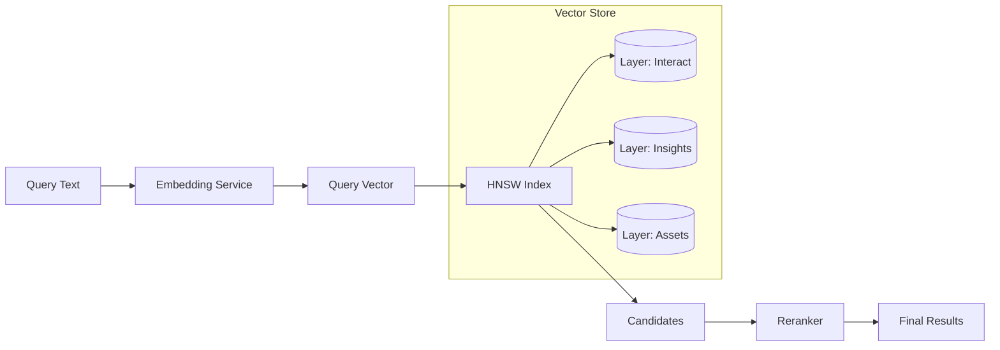

# Vector Search - Семантический поиск по векторам

> **Статус: 85% готово** - HNSW векторный поиск с производительностью <5мс

[[_Features Hub - Центр возможностей системы]] → Vector Search

## 🔍 Обзор

Vector Search - это core функциональность MAGRAY, обеспечивающая молниеносный семантический поиск по большим объёмам данных. Использует HNSW (Hierarchical Navigable Small World) алгоритм для достижения O(log n) производительности.

## 🏗️ Архитектура



## ⚡ Ключевые характеристики

### Производительность
- **Latency**: <5ms для top-10 результатов
- **Throughput**: 200+ queries/sec на одном ядре
- **Scalability**: До 10M+ векторов в памяти

### Точность
- **Recall@10**: >95% (настраиваемый)
- **Embedding Model**: Qwen3 (1024 dimensions)
- **Reranking**: Neural reranker для улучшения релевантности

### Возможности
- **Multi-layer search**: Поиск по всем слоям памяти
- **Filtered search**: Фильтрация по тегам, проектам
- **Hybrid search**: Комбинация векторного и лексического поиска

## 💻 API использования

### Простой поиск

```rust
// Через MemoryService
let results = memory_service.search("как реализовать авторизацию")
    .top_k(10)
    .execute()
    .await?;
```

### Расширенный поиск

```rust
// С фильтрами и опциями
let results = memory_service.search("error handling patterns")
    .with_layers(&[Layer::Insights, Layer::Assets])
    .top_k(20)
    .min_score(0.7)
    .with_tags(vec!["rust", "error-handling"])
    .in_project("myapp")
    .execute()
    .await?;
```

### Batch поиск

```rust
// Параллельный поиск нескольких запросов
let queries = vec![
    "authentication methods",
    "database optimization",
    "caching strategies"
];

let batch_results = memory_service.batch_search(queries, options).await?;
```

## 🔧 Внутреннее устройство

### HNSW параметры

```rust
pub struct HnswConfig {
    m: usize,              // 16 - connectivity parameter
    ef_construction: usize, // 200 - quality/speed tradeoff
    ef_search: usize,      // 50 - search quality
    max_elements: usize,   // 1_000_000 - capacity
}
```

### Процесс индексации

1. **Текст** → преобразование в tokens
2. **Tokens** → Qwen3 embedding (1024D)
3. **Vector** → добавление в HNSW граф
4. **Metadata** → сохранение в sled DB

### Процесс поиска

1. **Query embedding** - генерация вектора запроса
2. **HNSW search** - поиск кандидатов в графе
3. **Post-filtering** - применение фильтров
4. **Reranking** - neural переранжирование
5. **Result enrichment** - добавление метаданных

## 📊 Производительность

### Benchmark результаты

| Dataset Size | Build Time | Query Time | Memory Usage |
|-------------|------------|------------|--------------|
| 100K vectors | 30 sec | 2ms | 400MB |
| 1M vectors | 5 min | 4ms | 4GB |
| 10M vectors | 50 min | 8ms | 40GB |

### Оптимизации

- **SIMD** для векторных операций
- **Parallel indexing** при построении
- **Memory-mapped files** для больших индексов
- **Caching** часто используемых embeddings

## 🛠️ Конфигурация

```toml
# ~/.magray/config.toml
[vector_search]
algorithm = "hnsw"
dimensions = 1024

[vector_search.hnsw]
m = 16
ef_construction = 200
ef_search = 50

[vector_search.performance]
use_simd = true
parallel_indexing = true
cache_size_mb = 512
```

## 🔗 Связанные темы

**Связанная информация доступна через центры одуванчиков:**
- **Компоненты и реализация** → Через HOME → COMPONENTS → Memory Mind Map
- **GPU ускорение** → Через FEATURES Hub → GPU Acceleration
- **Управление памятью** → Через FEATURES Hub → Memory Management

## ❓ FAQ

### Почему HNSW?
- Лучший баланс скорости и точности
- O(log n) сложность поиска
- Инкрементальные обновления

### Как улучшить точность?
1. Увеличить `ef_search` (медленнее поиск)
2. Использовать reranking
3. Fine-tune embedding модель

### Как масштабировать?
1. Sharding по проектам/датам
2. Distributed HNSW (в разработке)
3. GPU ускорение embeddings

## 🏷️ Теги

#vector-search #hnsw #embeddings #core-feature #performance

---
[[_Features Hub - Центр возможностей системы|← К центру одуванчика возможностей]]