# 🌼 Чистая структура одуванчиков MAGRAY CLI

> Окончательная структура документации в виде ментальной карты

## 📐 Принцип одуванчиков

```mermaid
graph TD
    subgraph "🏠 HOME Одуванчик"
        HOME[Home.md]
        H1[Quick Start]
        H2[Knowledge Graph]
        
        HOME --> H1
        HOME --> H2
        H1 --> HOME
        H2 --> HOME
    end
    
    subgraph "🏗️ ARCHITECTURE Одуванчик"
        ARCH[_Architecture Hub]
        A1[System Overview]
        A2[Core Concepts]
        A3[Memory Layers]
        A4[Data Flow]
        
        ARCH --> A1
        ARCH --> A2
        ARCH --> A3
        ARCH --> A4
        A1 --> ARCH
        A2 --> ARCH
        A3 --> ARCH
        A4 --> ARCH
    end
    
    subgraph "🔧 COMPONENTS Одуванчик"
        COMP[_Components Hub]
        C1[CLI Mind Map]
        C2[Memory Mind Map]
        C3[AI Mind Map]
        C4[LLM Mind Map]
        C5[Router Mind Map]
        C6[Tools Mind Map]
        C7[Todo Mind Map]
        C8[Common Mind Map]
        
        COMP --> C1
        COMP --> C2
        COMP --> C3
        COMP --> C4
        COMP --> C5
        COMP --> C6
        COMP --> C7
        COMP --> C8
        C1 --> COMP
        C2 --> COMP
        C3 --> COMP
        C4 --> COMP
        C5 --> COMP
        C6 --> COMP
        C7 --> COMP
        C8 --> COMP
    end
    
    subgraph "⚡ FEATURES Одуванчик"
        FEAT[_Features Hub]
        F1[Vector Search]
        F2[GPU Acceleration]
        F3[Memory Management]
        F4[Multi-Provider LLM]
        F5[Tool Execution]
        F6[Smart Routing]
        
        FEAT --> F1
        FEAT --> F2
        FEAT --> F3
        FEAT --> F4
        FEAT --> F5
        FEAT --> F6
        F1 --> FEAT
        F2 --> FEAT
        F3 --> FEAT
        F4 --> FEAT
        F5 --> FEAT
        F6 --> FEAT
    end
    
    %% Межодуванчиковые связи только через HOME
    HOME -.-> ARCH
    HOME -.-> COMP
    HOME -.-> FEAT
    
    style HOME fill:#4f4
    style ARCH fill:#9f6
    style COMP fill:#69f
    style FEAT fill:#f96
```



## 🎯 Правила структуры

### ✅ Разрешено:
- **Hub → Лист** - Hub может ссылаться на свои листья
- **Лист → Hub** - Лист может ссылаться только на свой Hub
- **HOME → Hub** - Главный центр ссылается на другие центры

### ❌ Запрещено:
- **Лист → Лист** - Никаких прямых связей между листьями
- **Hub → Hub** - Никаких прямых связей между центрами (только через HOME)
- **Cross-references** - Никаких перекрестных ссылок

## 📊 Статистика чистой структуры

### Одуванчики (4):
1. **HOME** - 2 листа
2. **ARCHITECTURE** - 4 листа  
3. **COMPONENTS** - 8 листьев
4. **FEATURES** - 6 листьев

**Итого: 20 листьев + 4 центра = 24 файла**

### Типы связей:
- **Радиальные связи**: 20 (Hub → Лист)
- **Обратные связи**: 20 (Лист → Hub)
- **Навигационные связи**: 3 (HOME → Hub)

**Всего связей: 43**
**Перекрестных связей: 0**

## 🗂️ Файловая структура

```
docs/obsidian-v2/
├── 00_Home/
│   ├── Home.md                    # 🏠 Главный центр
│   ├── Quick Start...md           # Лист: быстрый старт  
│   └── Knowledge Graph...md       # Лист: граф связей
│
├── 01_Architecture/
│   ├── _Architecture Hub...md     # 🏗️ Центр архитектуры
│   ├── System Overview...md       # Лист: обзор системы
│   ├── Core Concepts...md         # Лист: концепции
│   ├── Memory Layers...md         # Лист: слои памяти
│   └── Data Flow...md             # Лист: потоки данных
│
├── 02_Components/
│   ├── _Components Hub...md       # 🔧 Центр компонентов
│   ├── CLI Mind Map...md          # Лист: CLI crate
│   ├── Memory Mind Map...md       # Лист: Memory crate
│   ├── AI Mind Map...md           # Лист: AI crate
│   ├── LLM Mind Map...md          # Лист: LLM crate
│   ├── Router Mind Map...md       # Лист: Router crate
│   ├── Tools Mind Map...md        # Лист: Tools crate
│   ├── Todo Mind Map...md         # Лист: Todo crate
│   └── Common Mind Map...md       # Лист: Common crate
│
├── 03_Features/
│   ├── _Features Hub...md         # ⚡ Центр возможностей
│   ├── Vector Search...md         # Лист: векторный поиск
│   ├── GPU Acceleration...md      # Лист: GPU ускорение
│   ├── Memory Management...md     # Лист: управление памятью
│   ├── Multi-Provider LLM...md    # Лист: мульти-LLM
│   ├── Tool Execution...md        # Лист: выполнение инструментов
│   └── Smart Routing...md         # Лист: умная маршрутизация
│
└── 99_Meta/
    ├── FINAL_STRUCTURE_OVERVIEW.md
    └── Templates/
        ├── Hub Template.md
        ├── Component Template.md  
        └── Feature Template.md
```

## 🧭 Навигация

### Входная точка:
```
Obsidian → Home.md
```

### Навигация внутри одуванчика:
```
Hub → Лист → Hub (обратно)
```

### Переход между одуванчиками:
```
Лист → Hub → Home → Другой Hub → Лист
```

## 🎨 Визуализация в Obsidian

В Obsidian Graph View эта структура будет выглядеть как:
- **4 отдельных звезды** (одуванчика)
- **Центральный узел HOME** соединен с центрами
- **Никаких спагетти** и запутанных связей
- **Четкая иерархия** от общего к частному

## 🏷️ Теги для поиска

### По типу узла:
- `#hub` - Центральные узлы
- `#leaf` - Листья одуванчиков  
- `#home` - Главный центр

### По домену:
- `#architecture` - Архитектурные концепции
- `#components` - Технические компоненты
- `#features` - Пользовательские возможности

---

**Структура одуванчиков готова для использования в Obsidian как ментальная карта проекта!**