# ФИНАЛЬНАЯ СТРУКТУРА ОДУВАНЧИКОВ

> Чистая структура документации MAGRAY CLI по принципу одуванчиков

## ✅ ПРИНЦИП ОДУВАНЧИКА РЕАЛИЗОВАН

### Структура из 4 одуванчиков

```mermaid
graph TB
    subgraph "🏠 HOME Dandelion"
        HOME[Home Hub]
        HOME --> QS[Quick Start]
        HOME --> KG[Knowledge Graph]
    end
    
    subgraph "🏗️ ARCHITECTURE Dandelion"
        ARCH[Architecture Hub]
        ARCH --> SO[System Overview]
        ARCH --> CC[Core Concepts]
        ARCH --> ML[Memory Layers]
        ARCH --> DF[Data Flow]
    end
    
    subgraph "🧩 COMPONENTS Dandelion"
        COMP[Components Hub]
        COMP --> MM1[Memory Mind Map]
        COMP --> MM2[AI Mind Map]
        COMP --> MM3[CLI Mind Map]
        COMP --> MM4[LLM Mind Map]
        COMP --> MM5[Router Mind Map]
        COMP --> MM6[Tools Mind Map]
        COMP --> MM7[Todo Mind Map]
        COMP --> MM8[Common Mind Map]
    end
    
    subgraph "🚀 FEATURES Dandelion"
        FEAT[Features Hub]
        FEAT --> VS[Vector Search]
        FEAT --> GA[GPU Acceleration]
        FEAT --> MM[Memory Management]
        FEAT --> ML2[Multi-Provider LLM]
        FEAT --> TE[Tool Execution]
        FEAT --> SR[Smart Routing]
    end
    
    %% Only HOME connects to other hubs
    HOME -.->|Navigate to| ARCH
    HOME -.->|Navigate to| COMP
    HOME -.->|Navigate to| FEAT
    
    style HOME fill:#f96,stroke:#333,stroke-width:4px
    style ARCH fill:#69f,stroke:#333,stroke-width:4px
    style COMP fill:#9f6,stroke:#333,stroke-width:4px
    style FEAT fill:#f9f,stroke:#333,stroke-width:4px
```



## 📋 ПРАВИЛА СОБЛЮДЕНЫ

### ✅ Hub файлы
- Каждый Hub ссылается только на свои листья
- Нет прямых ссылок между Hub'ами
- Навигация между одуванчиками только через HOME

### ✅ Leaf файлы  
- Каждый лист ссылается только на свой родительский Hub
- Нет прямых ссылок между листьями разных одуванчиков
- Навигационные инструкции вместо прямых ссылок

### ✅ HOME центр
- Единственная точка входа во все одуванчики
- Собственные листья (Quick Start, Knowledge Graph)
- Навигационные ссылки на другие Hub'ы

## 🗂️ СТРУКТУРА ФАЙЛОВ

```
docs/obsidian-v2/
├── 00_Home/
│   ├── Home.md (Hub)
│   ├── Quick Start - Быстрый старт за 5 минут.md (Leaf)
│   └── Knowledge Graph - Граф связей проекта.md (Leaf)
│
├── 01_Architecture/
│   ├── _Architecture Hub - Центр архитектурной информации.md (Hub)
│   ├── System Overview - Обзор всей системы.md (Leaf)
│   ├── Core Concepts - Ключевые концепции проекта.md (Leaf)
│   ├── Memory Layers - Трёхслойная архитектура памяти.md (Leaf)
│   └── Data Flow - Потоки данных через систему.md (Leaf)
│
├── 02_Components/
│   ├── _Components Hub - Центр всех компонентов системы.md (Hub)
│   ├── Memory Mind Map - Визуальная карта memory crate.md (Leaf)
│   ├── AI Mind Map - Визуальная карта AI crate.md (Leaf)
│   ├── CLI Mind Map - Визуальная карта CLI crate.md (Leaf)
│   ├── LLM Mind Map - Визуальная карта LLM crate.md (Leaf)
│   ├── Router Mind Map - Визуальная карта Router crate.md (Leaf)
│   ├── Tools Mind Map - Визуальная карта Tools crate.md (Leaf)
│   ├── Todo Mind Map - Визуальная карта Todo crate.md (Leaf)
│   └── Common Mind Map - Визуальная карта Common crate.md (Leaf)
│
└── 03_Features/
    ├── _Features Hub - Центр возможностей системы.md (Hub)
    ├── Vector Search - Семантический поиск по векторам.md (Leaf)
    ├── GPU Acceleration - Ускорение на GPU с автоматическим fallback.md (Leaf)
    ├── Memory Management - Интеллектуальное управление трёхслойной памятью.md (Leaf)
    ├── Multi-Provider LLM - Поддержка OpenAI Anthropic Local моделей.md (Leaf)
    ├── Tool Execution - Безопасное выполнение инструментов.md (Leaf)
    └── Smart Routing - Интеллектуальная маршрутизация задач.md (Leaf)
```

## 🎯 НАВИГАЦИОННЫЕ ПАТТЕРНЫ

### ✅ Правильная навигация
```
HOME → ARCHITECTURE Hub → Memory Layers
HOME → COMPONENTS Hub → Memory Mind Map  
HOME → FEATURES Hub → Vector Search
```

### ❌ Запрещенная навигация (исправлено)
```
Core Concepts → Memory Layers (прямая связь между листьями)
Vector Search → Components Hub (связь между одуванчиками)
Architecture Hub → Features Hub (связь между Hub'ами)
```

## 📊 СТАТИСТИКА ОЧИСТКИ

### Исправленные файлы
1. **Architecture Hub** - убраны ссылки на другие Hub'ы
2. **Components Hub** - убраны ссылки на другие Hub'ы  
3. **Features Hub** - убраны ссылки на другие Hub'ы
4. **Core Concepts** - убрана прямая ссылка на Memory Layers
5. **Vector Search** - убраны ссылки на другие одуванчики
6. **Home.md** - убраны прямые ссылки на листья других одуванчиков
7. **Quick Start** - убраны прямые ссылки на другие Hub'ы

### Принципы замены
- **Прямые ссылки** → **Навигационные инструкции**
- **Cross-references** → **Через HOME центр**
- **Hub-to-Hub** → **Только через HOME**
- **Leaf-to-Leaf** → **Через родительские Hub'ы**

## ✨ РЕЗУЛЬТАТ

Документация теперь организована как **4 независимых одуванчика** с **единым центром навигации HOME**. Каждый одуванчик самодостаточен, связи только радиальные, навигация интуитивная.

В Obsidian граф теперь выглядит как **4 чистых одуванчика** вместо запутанной каши ссылок.

---

**Статус**: ✅ **СТРУКТУРА ОДУВАНЧИКОВ ПОЛНОСТЬЮ РЕАЛИЗОВАНА**

*Создано: 2025-08-04*