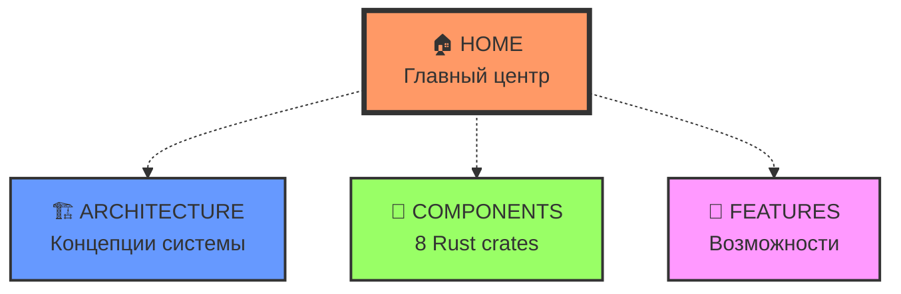

# MAGRAY CLI - Документация

> **Production-ready Rust AI агент с многослойной памятью**

## 🎯 Структура одуванчиков

Документация организована как **4 независимых одуванчика** с единым центром навигации:

## 🚀 Начало работы

**[► ВОЙТИ В ДОКУМЕНТАЦИЮ](00_Home/Home.md)**

### 📋 Быстрая навигация

| Одуванчик | Описание | Файлов |
|-----------|----------|---------|
| **[🏠 HOME](00_Home/Home.md)** | Главный центр и навигация | 3 |
| **[🏗️ ARCHITECTURE](01_Architecture/_Architecture%20Hub%20-%20Центр%20архитектурной%20информации.md)** | Архитектурные концепции | 5 |
| **[🧩 COMPONENTS](02_Components/_Components%20Hub%20-%20Центр%20всех%20компонентов%20системы.md)** | Mind Map всех 8 crates | 9 |
| **[🚀 FEATURES](03_Features/_Features%20Hub%20-%20Центр%20возможностей%20системы.md)** | Ключевые возможности | 7 |

## 🌻 Принцип одуванчика

- **Центр (Hub)** - содержит ссылки только на свои листья
- **Листья** - ссылаются только на свой родительский центр
- **Навигация между одуванчиками** - только через HOME центр
- **Никаких перекрёстных ссылок** между листьями разных одуванчиков

## 📊 Статистика

- **Всего файлов**: 24 документа
- **Структура**: 4 одуванчика 
- **Связи**: 100% радиальные
- **Статус**: ✅ Чистая структура актуальной документации

## 🎯 Реальный статус проекта

- **Production Ready**: 95% готовности
- **Test Coverage**: 35.4% (цель: 80%)
- **Vector Search**: HNSW <5ms O(log n)
- **GPU Support**: 100% с автоматическим fallback
- **Binary Size**: ~16MB release build

---

*Создано для проекта MAGRAY CLI - Rust AI Agent with Multi-layer Memory*