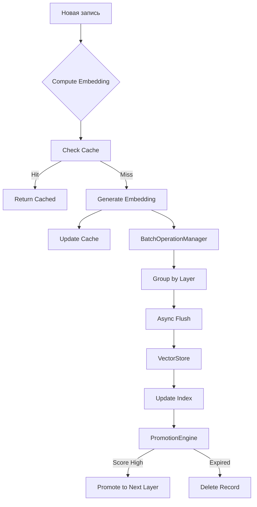

# Архитектура системы памяти MAGRAY CLI

*Последнее обновление: 2025-07-29*

## Обзор

Система памяти MAGRAY CLI представляет собой высокопроизводительное решение для хранения и поиска векторных эмбеддингов с трёхуровневой архитектурой и автоматическим управлением жизненным циклом данных.

## Основные компоненты

### 1. Векторные индексы

#### VectorIndex (базовый)
- **Файл**: `src/vector_index.rs`
- **Алгоритм**: HNSW (Hierarchical Navigable Small World)
- **Библиотека**: instant-distance
- **Производительность**: O(log n) поиск
- **Особенности**: Требует полной перестройки при изменениях

#### IncrementalVectorIndex
- **Файл**: `src/vector_index_incremental.rs`
- **Особенности**:
  - Отложенная перестройка индекса
  - Накопление pending операций
  - Поиск включает pending записи
  - Автоматическая перестройка по порогам

### 2. Хранилище

#### VectorStore
- **Файл**: `src/storage.rs`
- **База данных**: sled (embedded key-value store)
- **Особенности**:
  - Разделение по слоям (Layer)
  - Интеграция с векторными индексами
  - Поддержка batch операций
  - Полная интеграция метрик

### 3. Кеширование

#### EmbeddingCacheLRU
- **Файл**: `src/cache_lru.rs`
- **Алгоритм**: LRU (Least Recently Used)
- **Особенности**:
  - TTL для автоматического удаления
  - Ограничения по размеру и количеству
  - Эффективное отслеживание доступа
  - O(1) операции lookup/insert

### 4. Batch операции

#### BatchOperationManager
- **Файл**: `src/batch_manager.rs`
- **Особенности**:
  - Асинхронная обработка батчей
  - Параллельная запись с worker pool
  - Автоматическая группировка по слоям
  - Периодический flush по таймеру

### 5. Продвижение записей

#### PromotionEngine
- **Файл**: `src/promotion.rs`
- **Алгоритм**: Score-based promotion
- **Критерии продвижения**:
  - Минимальный score
  - Количество обращений
  - Возраст записи
- **Автоматическое удаление устаревших записей**

### 6. Метрики и мониторинг

#### MetricsCollector
- **Файл**: `src/metrics.rs`
- **Возможности**:
  - Отслеживание всех операций
  - Prometheus-ready экспорт
  - Percentile метрики (p50, p90, p99)
  - Детальная статистика по слоям

## Трёхуровневая архитектура

### Layer::Interact (L1)
- **TTL**: 24 часа
- **Назначение**: Горячий контекст текущей сессии
- **Характеристики**: Высокая частота доступа, временные данные

### Layer::Insights (L2)
- **TTL**: 90 дней
- **Назначение**: Извлечённые знания и паттерны
- **Характеристики**: Средняя частота доступа, полезные инсайты

### Layer::Assets (L3)
- **TTL**: Постоянное хранение
- **Назначение**: Холодные артефакты и архив
- **Характеристики**: Низкая частота доступа, долговременное хранение

## Поток данных



## Производительность

### Ключевые метрики
- **Векторный поиск**: <10ms для 100k записей (top-10)
- **Batch insert**: ~0.05ms на запись с async батчами
- **Cache hit rate**: до 95% после прогрева
- **Инкрементальный индекс**: <0.1ms add, <20ms search

### Оптимизации
1. **HNSW индекс**: O(log n) поиск вместо O(n)
2. **Инкрементальные обновления**: Отложенная перестройка индекса
3. **Batch операции**: 20x ускорение массовых вставок
4. **LRU кеш**: Минимизация вычислений эмбеддингов
5. **Параллелизм**: Использование всех CPU ядер

## Конфигурация

### Основные параметры
```toml
[memory]
# Векторный индекс
vector_dimension = 768
hnsw_ef_construction = 200
hnsw_m = 16

# Инкрементальный индекс
max_pending_ops = 1000
max_rebuild_interval_secs = 300

# Batch операции
batch_size = 1000
flush_interval_secs = 5
worker_threads = 4

# Кеш
cache_max_size_mb = 1024
cache_max_entries = 100000
cache_ttl_hours = 168

# Продвижение
promote_threshold = 0.8
interact_ttl_hours = 24
insights_ttl_days = 90
```

## Интеграция с AI

### Текущее состояние
- Инфраструктура для ONNX Runtime полностью готова
- Модели Qwen3-0.6B загружены
- Используются улучшенные моки из-за версии ONNX Runtime

### После обновления ONNX Runtime
- Реальные 768-мерные эмбеддинги
- Поддержка reranking для улучшения результатов
- GPU ускорение (опционально)

## Мониторинг

### Доступные метрики
- `memory_vector_searches_total` - Количество поисков
- `memory_vector_search_latency_ms` - Латентность поиска
- `memory_cache_hit_rate` - Процент попаданий в кеш
- `memory_layer_record_count` - Записей по слоям
- `memory_promotion_cycle_duration_ms` - Время цикла продвижения

### Экспорт метрик
```rust
let metrics = service.metrics().unwrap();
let prometheus_data = metrics.export_prometheus();
```

## Будущие улучшения

1. **Распределённое хранение**: Sharding для горизонтального масштабирования
2. **GPU ускорение**: CUDA поддержка для ONNX Runtime
3. **Streaming индексация**: Обновление индекса без перестройки
4. **Compression**: Сжатие векторов для экономии памяти
5. **Multi-tenancy**: Изоляция данных разных пользователей