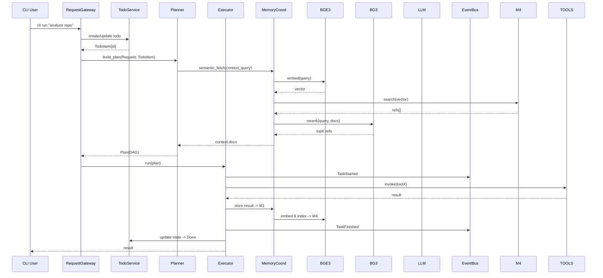
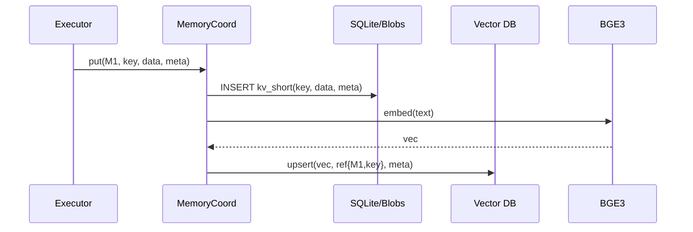

# CLI Agent Architecture (Markdown Spec)

**Author:** generated by AI per Magray’s request  
**Status:** Draft → Ready for implementation  
**Last Update:** 2025‑07‑28

---

## TL;DR

- **Всё локально.** Данные проекта хранятся не в самом проекте, а в *DocStore CLI* (`~/.ourcli/projects/<id>/…`).  
- **Память — 5 слоёв:** `Ephemeral → Short → Medium → Long → Semantic`. Семантический слой (M4, BGE3+BG3) — *фронт-дверь* ко всем остальным: любой поиск начинается через него.  
- **Пайплайн:** `CLI → Gateway → Todo/TaskBoard → Planner(DAG) → Executor ↔ EventBus` + сервисы: ToolService, MemoryCoord/SemanticRouter, PromptBuilder, Vectorizer(BGE3), Reranker(BG3), LLM, Policy, Scheduler.  
- **TodoService** управляет пользовательскими задачами, синхронизирован с планировщиком и исполнителем.  
- **ToolService**: реестр/индекс тулов, выбор по семантике и сигнатурам.  
- **Observability:** единый EventBus/Tracing → локальные логи/метрики.

---

## 1. Общая диаграмма

```mermaid
flowchart LR
    %% ===== Entry =====
    CLI[[CLI]] --> GW[Request Gateway]

    %% ===== Core =====
    subgraph CORE[Core]
        GW --> TODO[TodoService / TaskBoard]
        TODO --> PL[Graph Planner (DAG)]
        PL --> EXE[Executor]
        EXE --> EVT[(EventBus / Tracing)]
        EXE --> POL[Policy / Guardrails]
    end

    %% ===== Shared Services =====
    subgraph SRV[Shared Services]
        MEMC[Memory Coordinator + Semantic Router]
        TOOLS[ToolService (Registry+Selector+Descriptor)]
        PROMPT[PromptBuilder]
        VEC[VectorizerSvc (BGE3)]
        RER[RerankSvc (BG3)]
        LLM[LLM Clients (local-first)]
        CFG[Config / Feature Flags]
        SCH[Scheduler / Background Jobs]
    end

    %% ===== 5-Layer Memory =====
    subgraph MEM["Memory Layers (5)"]
        M0[Ephemeral / Scratch (RAM)]
        M1[ShortTerm (SQLite KV)]
        M2[MediumTerm (SQL Tables)]
        M3[LongTerm (Blobs/Archives)]
        M4[Semantic Index (Vectors)]
    end

    %% ===== CLI DocStore (per-project, persistent, local) =====
    subgraph DOCS["CLI DocStore (per project)"]
        CFGF[(config.toml)]
        SQL[(sqlite.db : M1/M2, tools, meta)]
        TASKS[(tasks.db : todo)]
        BLOBS[(blobs/ : M3)]
        VDB[(vectors.idx / qdrant_dir : M4)]
        CACHE[(embed_cache.db)]
        LOGS[(events.log / metrics.json)]
    end

    EXE --> MEMC
    EXE --> PROMPT
    EXE --> TOOLS
    CFG --> GW
    CFG --> PL
    CFG --> EXE
    CFG --> SRV
    SCH --> MEMC
    SCH --> TOOLS
    SCH --> VEC
    SCH --> TODO
    SCH --> CACHE

    %% Memory wiring
    MEMC --> M0
    MEMC --> M1
    MEMC --> M2
    MEMC --> M3
    MEMC --> M4

    %% Storage bindings
    M1 --> SQL
    M2 --> SQL
    M3 --> BLOBS
    M4 --> VDB
    TOOLS --> SQL
    TODO --> TASKS
    VEC --> VDB
    VEC --> CACHE
    EVT -.-> LOGS

    %% Prompt / NLU
    PROMPT --> VEC
    PROMPT --> RER
    PROMPT --> LLM
    RER --> EXE
    M4 --> MEMC
```

---

## 2. Роли компонентов

### Core
- **Request Gateway (GW)** — парсинг CLI/скриптов, валидация, нормализация → `Request`.
- **TodoService / TaskBoard (TODO)** — CRUD задач, приоритезация, staleness, связь с DAG.
- **Graph Planner (PL)** — строит DAG из целей/задач, опираясь на ToolService и SemanticRouter.
- **Executor (EXE)** — исполняет DAG (топосорт, retry, timeout), публикует события.
- **EventBus / Tracing (EVT)** — единая шина логов и метрик.
- **Policy / Guardrails (POL)** — лимиты на токены, время, сеть, доступ к тулзам.

### Shared Services
- **Memory Coordinator + Semantic Router (MEMC)** — маршрутизация между слоями памяти, промоушен, семантический поиск через M4.
- **ToolService (TOOLS)** — реестр тулов, их дескрипторы, семантический индекс, выбор подходящих.
- **PromptBuilder (PROMPT)** — сборка промптов: retrieval → rerank → шаблоны.
- **VectorizerSvc (VEC)** — BGE3 эмбеддинги. Батчинг, кэширование.
- **RerankSvc (RER)** — BG3 cross-encoder rerank top-K.
- **LLM Clients (LLM)** — локальные/удалённые модели (по умолчанию локальные).
- **Config / Feature Flags (CFG)** — централизованные настройки.
- **Scheduler / Background Jobs (SCH)** — фоновые задачи: реиндексация, чистка, review задач.

### Memory (5 слоёв)
| Слой | Где | Назначение | Индексация в M4 | TTL / Политики |
|------|-----|------------|------------------|----------------|
| **M0 Ephemeral** | RAM | Временные данные шага/сессии | Обычно нет | До конца запуска |
| **M1 ShortTerm** | `sqlite.db` KV | Недавние факты/ответы | Да (полный текст) | Часы/дни, автоочистка |
| **M2 MediumTerm** | `sqlite.db` tables | Структурированные знания проекта | Да (текстовые поля) | Недели/месяцы |
| **M3 LongTerm** | `blobs/` + ссылки в SQL | Артефакты, логи, большие файлы | Да (summary/чанки) | Почти без лимита |
| **M4 Semantic** | `vectors/` (HNSW/Qdrant) | Векторный индекс ссылок на M0–M3 | — | Чистится по orphan refs |

***Важно:*** Все записи M1–M3 автоматически индексируются в M4. Поиск всегда стартует с M4 и возвращает ссылки (MemRef) в другие слои.

---

## 3. Потоки (Sequence)

### 3.1 Запрос пользователя



### 3.2 Запись в память



---

## 4. DocStore CLI (Persistency)

**Не в папке проекта.** CLI сам резолвит `project_id` (например, hash пути).  
Пример путей (Linux):
```
~/.ourcli/projects/<project_id>/
  config.toml
  sqlite.db
  tasks.db
  vectors/
  blobs/
  embed_cache.db
  events.log
  metrics.json
```

---

## 5. Интерфейсы (Rust-псевдокод)

```rust
// Request
pub struct Request { id: Uuid, goal: String, params: Value, project_id: ProjectId }

// Todo
pub enum TaskState { Planned, Ready, InProgress, Blocked, Done, Archived }
pub struct TodoItem { /* поля как выше */ }

// Memory
pub enum MemLayer { Ephemeral, Short, Medium, Long, Semantic }
pub struct MemRef { layer: MemLayer, key: String }

#[async_trait]
pub trait MemoryStore { /* put/get/delete */ }

#[async_trait]
pub trait SemanticRouter {
    async fn ingest(&self, text: &str, ref_: &MemRef, meta: &Value) -> Result<()>;
    async fn search(&self, query: &str, top_k: usize) -> Result<Vec<MemRef>>;
}

// NLU
pub struct EmbedRequest { texts: Vec<String>, purpose: Purpose }
pub enum Purpose { Index, Query, ToolSpec }
pub struct EmbedResponse { vectors: Vec<Vec<f32>>, model: String }

#[async_trait]
pub trait Vectorizer { async fn embed(&self, req: EmbedRequest) -> Result<EmbedResponse>; }

pub struct RerankRequest { query: String, docs: Vec<String>, top_k: usize }
pub struct RerankHit { idx: usize, score: f32 }
#[async_trait]
pub trait Reranker { async fn rerank(&self, req: RerankRequest) -> Result<Vec<RerankHit>>; }

// Tools
#[async_trait]
pub trait Tool {
    fn spec(&self) -> ToolSpec;
    async fn invoke(&self, input: Value, ctx: &ExecCtx) -> Result<Value>;
}

// Events
pub enum Event {
    TaskStarted{ node_id: Uuid },
    TaskFinished{ node_id: Uuid, ok: bool },
    TodoUpdated{ todo_id: Uuid, state: TaskState },
    MemoryIngested{ ref_: MemRef },
    // ...
}
```

---

## 6. EventBus / Observability

**Основные топики:**
- `task.lifecycle` — started/finished/failed
- `todo.state` — created/updated/stale
- `memory.ingest` — запись/индексация
- `nlu.latency` — BGE3/BG3 тайминги, cache-hit
- `policy.violation` — превышения лимитов
- `scheduler.job` — старт/стоп задач

**Вывод:**
- `events.log` — человеко-читаемо + JSON.
- `metrics.json` — агрегированные счётчики (prometheus-like schema опционально).

---

## 7. Scheduler / Background Jobs

- `reindex_changed_rows()` — индексация изменившихся записей M1–M3.  
- `vacuum_vectors()` — удаление сиротских векторов из M4.  
- `review_stale_tasks()` — оценка staleness, авто-snooze/архив.  
- `compact_blobs()` — упаковка/удаление старых больших файлов.  
- `rotate_logs()` — архивирование логов.

---

## 8. Конфигурация (`config.toml` пример)

```toml
[paths]
sqlite = "sqlite.db"
tasks = "tasks.db"
vectors = "vectors/"
blobs = "blobs/"
embed_cache = "embed_cache.db"
logs_dir = "logs/"

[nlu]
embed_model = "bge3"
rerank_model = "bg3"
top_k_semantic = 128
top_k_rerank = 32

[policy]
max_tokens = 8192
max_bg3_docs = 64
allow_net = false

[scheduler]
reindex_interval = "1h"
stale_review_interval = "24h"
```

---

## 9. Roadmap (MVP → Production)

1. **Bootstrap CLI & DocStore** (`cli init` creates dirs/db).  
2. **RequestGateway + Todo CRUD**.  
3. **MemoryStore M1/M2 (SQLite), M3 (blobs), M4 stub**.  
4. **VectorizerSvc (BGE3) + cache + HNSW index**.  
5. **SemanticRouter.search/ingest + RerankSvc (BG3)**.  
6. **Planner (статические правила) + Executor**.  
7. **EventBus/tracing + logs/metrics**.  
8. **ToolService + базовые тулзы (file/http/git)**.  
9. **Memory promotion policies + Scheduler jobs**.  
10. **Policy/Guardrails**.  
11. **Refactor/optimize, more tools, LLM adapters**.

---

## 10. Дополнительно

- **Безопасность:** sandbox для пользовательских тулов (WASI/wasmtime).  
- **Reproducibility:** запись входов/выходов шагов (для повторного запуска).  
- **Feature Flags:** быстрый флип моделей/индексов/политик через CFG.  
- **TUI (опционально):** канбан-доска задач в терминале (`ratatui`).

---

**Confidence:** 0.94  
(Архитектура согласована с вашими требованиями: локальность, 5-слойная память, BGE3/BG3, Todo, DocStore вне проекта.)

