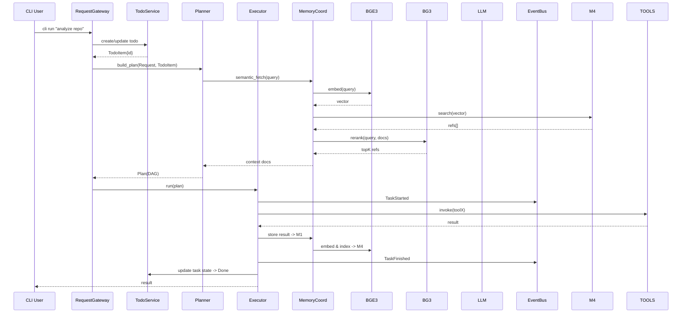
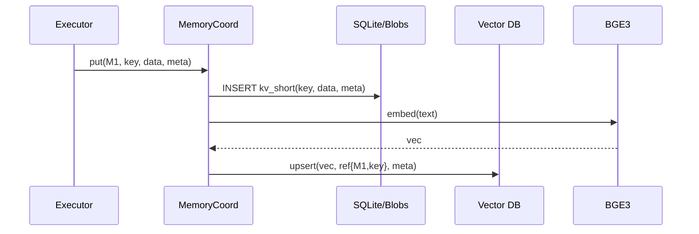

# Sequence диаграммы

## Выполнение команды

```mermaid
sequenceDiagram
    participant U as CLI User
    participant GW as RequestGateway
    participant TODO as TodoService
    participant PL as Planner
    participant EXE as Executor
    participant MEMC as MemoryCoord
    participant VEC as BGE3
    participant RER as BG3
    participant LLM as LLM
    participant EVT as EventBus

    U->>GW: cli run "analyze repo"
    GW->>TODO: create/update todo
    TODO-->>GW: TodoItem{id}
    GW->>PL: build_plan(Request, TodoItem)
    PL->>MEMC: semantic_fetch(query)
    MEMC->>VEC: embed(query)
    VEC-->>MEMC: vector
    MEMC->>M4: search(vector)
    M4-->>MEMC: refs[]
    MEMC->>RER: rerank(query, docs)
    RER-->>MEMC: topK refs
    MEMC-->>PL: context docs
    PL-->>GW: Plan(DAG)
    GW->>EXE: run(plan)
    EXE->>EVT: TaskStarted
    EXE->>TOOLS: invoke(toolX)
    TOOLS-->>EXE: result
    EXE->>MEMC: store result -> M1
    MEMC->>VEC: embed & index -> M4
    EXE->>EVT: TaskFinished
    EXE->>TODO: update task state -> Done
    EXE-->>U: result
```

## Запись в память

```mermaid
sequenceDiagram
    participant EXE as Executor
    participant MEMC as MemoryCoord
    participant DB as SQLite/Blobs
    participant VDB as Vector DB
    participant VEC as BGE3

    EXE->>MEMC: put(M1, key, data, meta)
    MEMC->>DB: INSERT kv_short(key, data, meta)
    MEMC->>VEC: embed(text)
    VEC-->>MEMC: vec
    MEMC->>VDB: upsert(vec, ref{M1,key}, meta)
```
