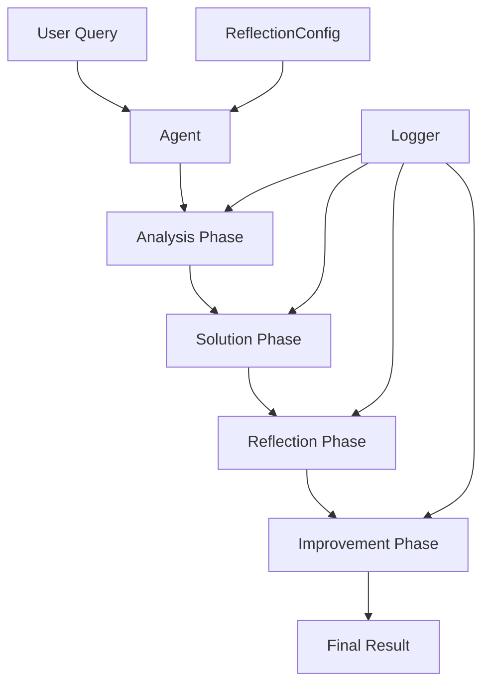
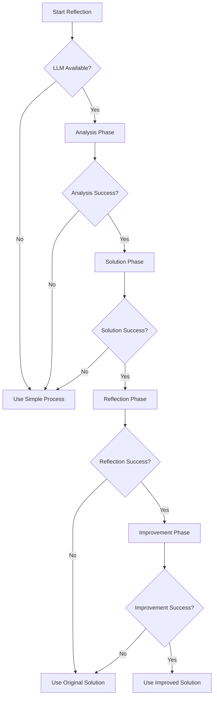

# Design Document

## Overview

Данный дизайн описывает архитектуру системы самоанализа для AI агентов в MAGRAY CLI. Система добавляет структурированный процесс принятия решений с этапами анализа, создания решения, самопроверки и улучшения. Каждый агент будет следовать паттерну "Think → Create → Doubt → Improve".

## Architecture

### High-Level Architecture



### Core Components

1. **ReflectionTrait** - базовый трейт для всех агентов с самоанализом
2. **ReflectionConfig** - конфигурация процесса самоанализа
3. **ReflectionLogger** - логирование процесса мышления
4. **ReflectionResult** - структура результата с метаданными процесса

## Components and Interfaces

### ReflectionTrait

```rust
#[async_trait]
pub trait ReflectionCapable<T> {
    type Input;
    type Output;
    
    // Основной метод с самоанализом
    async fn process_with_reflection(&self, input: Self::Input) -> Result<Self::Output>;
    
    // Этапы процесса
    async fn analyze_task(&self, input: &Self::Input) -> Result<TaskAnalysis>;
    async fn create_solution(&self, analysis: &TaskAnalysis) -> Result<T>;
    async fn reflect_on_solution(&self, solution: &T) -> Result<ReflectionResult<T>>;
    async fn improve_solution(&self, reflection: ReflectionResult<T>) -> Result<T>;
    
    // Fallback метод
    async fn simple_process(&self, input: Self::Input) -> Result<Self::Output>;
}
```

### ReflectionConfig

```rust
#[derive(Debug, Clone)]
pub struct ReflectionConfig {
    pub enabled: bool,
    pub max_reflection_iterations: u32,
    pub max_reflection_time: Duration,
    pub enable_logging: bool,
    pub fallback_on_error: bool,
}
```

### ReflectionResult

```rust
#[derive(Debug, Clone)]
pub struct ReflectionResult<T> {
    pub original_solution: T,
    pub concerns: Vec<String>,
    pub improvements: Vec<String>,
    pub confidence_before: f32,
    pub confidence_after: f32,
    pub should_improve: bool,
}
```

### TaskAnalysis

```rust
#[derive(Debug, Clone)]
pub struct TaskAnalysis {
    pub task_type: String,
    pub complexity: TaskComplexity,
    pub key_elements: Vec<String>,
    pub potential_challenges: Vec<String>,
    pub context: HashMap<String, String>,
}
```

## Data Models

### Enhanced Agent Structures

#### ToolSelectorAgent with Reflection

```rust
pub struct ToolSelectorAgent {
    llm: LlmClient,
    config: ReflectionConfig,
    logger: ReflectionLogger,
}

impl ReflectionCapable<ToolSelection> for ToolSelectorAgent {
    type Input = (String, Vec<String>); // (query, available_tools)
    type Output = ToolSelection;
    
    async fn analyze_task(&self, input: &Self::Input) -> Result<TaskAnalysis> {
        // Анализ запроса пользователя
        let (query, tools) = input;
        // LLM анализирует: тип задачи, ключевые слова, контекст
    }
    
    async fn create_solution(&self, analysis: &TaskAnalysis) -> Result<ToolSelection> {
        // Создание первоначального выбора инструмента
    }
    
    async fn reflect_on_solution(&self, solution: &ToolSelection) -> Result<ReflectionResult<ToolSelection>> {
        // Самопроверка: "А точно ли это лучший выбор?"
        // Рассмотрение альтернатив
    }
    
    async fn improve_solution(&self, reflection: ReflectionResult<ToolSelection>) -> Result<ToolSelection> {
        // Улучшение выбора если найдены проблемы
    }
}
```

#### ParameterExtractorAgent with Reflection

```rust
impl ReflectionCapable<ParameterExtraction> for ParameterExtractorAgent {
    async fn analyze_task(&self, input: &Self::Input) -> Result<TaskAnalysis> {
        // Анализ структуры запроса и требований к параметрам
    }
    
    async fn reflect_on_solution(&self, solution: &ParameterExtraction) -> Result<ReflectionResult<ParameterExtraction>> {
        // Проверка каждого параметра:
        // - Соответствует ли типу?
        // - Корректен ли формат?
        // - Нет ли пропущенных параметров?
    }
}
```

### Reflection Prompts

#### Analysis Phase Prompt Template

```rust
const ANALYSIS_PROMPT: &str = r#"
Ты - эксперт аналитик. Твоя задача - тщательно проанализировать задачу перед её решением.

ЗАДАЧА: {task_description}
КОНТЕКСТ: {context}

ЭТАП 1: АНАЛИЗ ЗАДАЧИ
Проанализируй задачу по следующим аспектам:
1. Тип задачи и её сложность
2. Ключевые элементы и требования
3. Потенциальные сложности и подводные камни
4. Контекст и дополнительная информация

Ответь в формате JSON:
{
    "task_type": "описание типа задачи",
    "complexity": "low|medium|high",
    "key_elements": ["элемент1", "элемент2"],
    "potential_challenges": ["вызов1", "вызов2"],
    "context": {"ключ": "значение"}
}
"#;
```

#### Reflection Phase Prompt Template

```rust
const REFLECTION_PROMPT: &str = r#"
Ты - критический мыслитель. Твоя задача - усомниться в созданном решении и найти способы его улучшения.

ИСХОДНАЯ ЗАДАЧА: {original_task}
СОЗДАННОЕ РЕШЕНИЕ: {solution}

ЭТАП 3: КРИТИЧЕСКИЙ АНАЛИЗ РЕШЕНИЯ
Усомнись в решении и ответь на вопросы:
1. Действительно ли это лучшее решение?
2. Какие альтернативы не были рассмотрены?
3. Какие проблемы могут возникнуть?
4. Что можно улучшить?
5. Насколько ты уверен в решении (0-1)?

Ответь в формате JSON:
{
    "concerns": ["проблема1", "проблема2"],
    "alternatives": ["альтернатива1", "альтернатива2"],
    "improvements": ["улучшение1", "улучшение2"],
    "confidence_assessment": 0.8,
    "should_improve": true/false
}
"#;
```

## Error Handling

### Fallback Strategy

1. **Timeout Handling**: Если самоанализ превышает лимит времени, используется простое решение
2. **LLM Error Handling**: При ошибках LLM система переключается на fallback метод
3. **JSON Parsing Errors**: Улучшенный парсинг с исправлением ошибок
4. **Infinite Loop Prevention**: Ограничение количества итераций улучшения

### Error Recovery Flow



## Testing Strategy

### Unit Tests

1. **ReflectionTrait Tests**: Тестирование каждого этапа процесса
2. **Config Tests**: Проверка различных конфигураций
3. **Error Handling Tests**: Тестирование fallback механизмов
4. **Performance Tests**: Измерение времени выполнения с самоанализом

### Integration Tests

1. **End-to-End Reflection**: Полный цикл самоанализа для каждого агента
2. **Cross-Agent Tests**: Взаимодействие агентов с самоанализом
3. **Configuration Tests**: Различные настройки в реальных сценариях

### Mock LLM for Testing

```rust
pub struct MockLlmClient {
    responses: HashMap<String, String>,
    should_fail: bool,
    delay: Option<Duration>,
}

impl MockLlmClient {
    pub fn with_analysis_response(analysis: TaskAnalysis) -> Self { ... }
    pub fn with_reflection_response(reflection: ReflectionResult) -> Self { ... }
    pub fn with_failure() -> Self { ... }
}
```

## Performance Considerations

### Optimization Strategies

1. **Parallel Processing**: Некоторые этапы можно выполнять параллельно
2. **Caching**: Кэширование результатов анализа для похожих запросов
3. **Smart Skipping**: Пропуск самоанализа для простых задач
4. **Timeout Management**: Адаптивные таймауты в зависимости от сложности

### Performance Metrics

- Время выполнения с самоанализом vs без
- Качество решений (субъективная оценка)
- Частота улучшений решений
- Количество fallback случаев

## Configuration Management

### Environment Variables

```bash
# Reflection settings
REFLECTION_ENABLED=true
REFLECTION_MAX_ITERATIONS=3
REFLECTION_MAX_TIME_MS=30000
REFLECTION_LOGGING=true
REFLECTION_FALLBACK_ON_ERROR=true

# Per-agent settings
TOOL_SELECTOR_REFLECTION=true
PARAMETER_EXTRACTOR_REFLECTION=true
INTENT_ANALYZER_REFLECTION=true
ACTION_PLANNER_REFLECTION=true
```

### Runtime Configuration

```rust
pub struct ReflectionSettings {
    pub global: ReflectionConfig,
    pub tool_selector: Option<ReflectionConfig>,
    pub parameter_extractor: Option<ReflectionConfig>,
    pub intent_analyzer: Option<ReflectionConfig>,
    pub action_planner: Option<ReflectionConfig>,
}
```

## Migration Strategy

### Phase 1: Core Infrastructure
- Implement ReflectionTrait and base structures
- Add configuration system
- Create logging infrastructure

### Phase 2: Agent Integration
- Integrate ToolSelectorAgent with reflection
- Add ParameterExtractorAgent reflection
- Implement IntentAnalyzerAgent self-analysis

### Phase 3: Advanced Features
- Add ActionPlannerAgent reflection
- Implement performance optimizations
- Add comprehensive testing

### Phase 4: Production Readiness
- Performance tuning
- Error handling improvements
- Documentation and examples