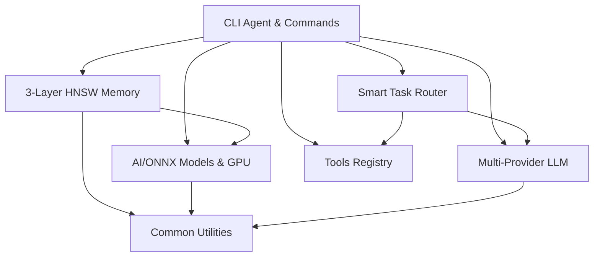

# Ультракомпактный архитектурный демон MAGRAY CLI

**Цель**: Заменить огромные CTL аннотации одной краткой, но точной Mermaid диаграммой архитектуры.

## 📋 Файлы

- `architecture_daemon.py` - основной демон на Python
- `requirements_architecture.txt` - зависимости Python
- `run_architecture_daemon.bat` - удобный запуск через batch
- `run_architecture_daemon.ps1` - PowerShell скрипт (может иметь проблемы с кодировкой)

## 🚀 Использование

### Единократное обновление
```bash
# Через Python напрямую
py scripts\architecture_daemon.py --project-root .

# Через batch скрипт (рекомендуется)
scripts\run_architecture_daemon.bat
```

### Watch режим (автообновления)
```bash
# Через Python напрямую
py scripts\architecture_daemon.py --project-root . --watch

# Через batch скрипт
scripts\run_architecture_daemon.bat --watch
```

## ✨ Что делает демон

1. **Сканирует структуру** - анализирует все `Cargo.toml` в `crates/`
2. **Извлекает зависимости** - определяет связи между crates
3. **Генерирует Mermaid** - создает компактную диаграмму архитектуры
4. **Обновляет CLAUDE.md** - заменяет/создает секцию `AUTO-GENERATED ARCHITECTURE`

## 📊 Результат

Генерируется краткая диаграмма вместо сотен строк CTL аннотаций:



## 🎯 Характеристики

- **Максимальная краткость**: 15-20 нод вместо сотен строк
- **Только критичные зависимости**: без детализации внутренних компонентов
- **Группировка по функциональности**: primary/secondary/utility классы
- **Автоматическая синхронизация**: watch режим для Cargo.toml изменений
- **Статистика проекта**: количество crates, зависимости, особенности

## 🔧 Зависимости

```
toml>=0.10.2      # Парсинг Cargo.toml файлов
watchdog>=3.0.0   # Мониторинг изменений файлов
```

## 📈 Преимущества над CTL аннотациями

| Критерий | CTL аннотации | Architecture Daemon |
|----------|---------------|-------------------|
| **Размер** | ~800 строк JSON | ~30 строк Mermaid |
| **Читаемость** | Сложно читать | Наглядная диаграмма |
| **Поддержка** | Ручное обновление | Автоматическое |
| **Актуальность** | Устаревает | Всегда актуально |
| **Навигация** | Текст | Визуальная схема |

## 🎮 Интеграция

Демон интегрируется с:
- **CLAUDE.md** - автоматическое обновление секции
- **Cargo.toml** - мониторинг изменений зависимостей
- **Watch режим** - автообновления при изменениях
- **PowerShell/Batch** - удобные скрипты запуска

## 🔄 Watch режим

В watch режиме демон:
1. Мониторит все `Cargo.toml` файлы в `crates/`
2. Реагирует на изменения с debounce (5 секунд)
3. Автоматически обновляет диаграмму
4. Работает до прерывания (Ctrl+C)

## 🎯 Результат в CLAUDE.md

Демон создает/обновляет секцию:

```markdown
# AUTO-GENERATED ARCHITECTURE

*Last updated: 2025-08-06 04:18:20 UTC*

## Компактная архитектура MAGRAY CLI
[Mermaid диаграмма]

## Статистика проекта
- **Всего crates**: 8
- **Активные зависимости**: 12
- **Основные компоненты**: CLI, Memory (3-Layer HNSW), AI/ONNX, LLM Multi-Provider
...
```

## 🚨 Замечания

- **Кодировка**: Используйте batch скрипт во избежание проблем с кодировкой
- **Python 3.8+**: Требуется современная версия Python
- **Зависимости**: Автоматически устанавливаются при первом запуске
- **Права доступа**: Демон изменяет CLAUDE.md файл